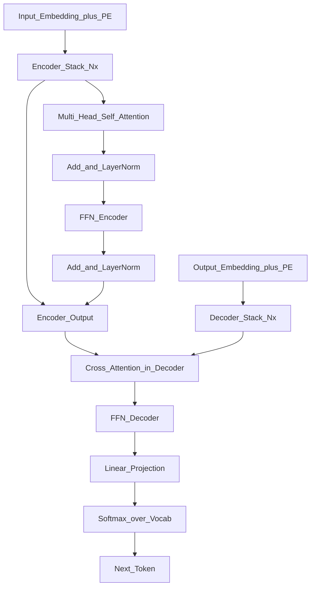

# 📄 Paper: Attention Is All You Need

> [!abstract] TL;DR — one sentence on what this paper introduced
> Vaswani et al. (2017) introduced the Transformer architecture, replacing recurrent and convolutional layers entirely with multi-head self-attention, enabling fully parallel sequence modelling with dramatically better performance on machine translation.

## Key Contribution — what was new, what it replaced

**What existed before**: Sequence-to-sequence models relied on RNNs (LSTMs, GRUs) or CNNs for encoding and decoding language. RNNs process tokens sequentially, making them slow to train (can't parallelise) and poor at long-range dependencies (gradient must flow through many time steps). Attention mechanisms had been added to RNNs (Bahdanau 2015) as a supplement.

**What this paper replaced**: RNN-based encoder-decoder architectures for sequence transduction (translation, summarisation, etc.).

**What was new**:
1. A model built entirely from attention — no recurrence or convolution at all
2. Multi-head attention: run attention $h$ times in parallel with different learned projections
3. Scaled dot-product attention: divide by $\sqrt{d_k}$ to prevent gradient vanishing in softmax
4. Positional encodings: inject position information via sinusoidal functions (no recurrence needed)
5. The encoder-decoder Transformer architecture became the template for BERT (encoder-only) and GPT (decoder-only)

## Core Idea (in plain English)

Every token in a sentence can directly "talk to" every other token simultaneously, instead of passing information one step at a time. When encoding the word "bank" in "I went to the river bank", the model can attend to "river" (far away) just as easily as the adjacent words. This direct token-to-token communication is self-attention.

"Multi-head" means we run this process eight (or sixteen) times in parallel, each with different learned projections, so different heads can specialise: one might track syntax, another semantics, another co-reference.

Positional encoding adds a unique "timestamp" to each token (since attention treats all positions equally), preserving word order information.

## The Math

**Scaled Dot-Product Attention:**
$$\text{Attention}(Q, K, V) = \text{softmax}\!\left(\frac{QK^\top}{\sqrt{d_k}}\right) V$$

- $Q \in \mathbb{R}^{T_q \times d_k}$ (queries), $K \in \mathbb{R}^{T_k \times d_k}$ (keys), $V \in \mathbb{R}^{T_k \times d_v}$ (values)
- Divided by $\sqrt{d_k}$ to prevent softmax saturation (gradient vanishing) for large $d_k$
- Output: weighted average of values, where weights are query-key alignment scores

**Multi-Head Attention:**
$$\text{MultiHead}(Q, K, V) = \text{Concat}(\text{head}_1, \ldots, \text{head}_h) W^O$$
$$\text{head}_i = \text{Attention}(Q W_i^Q,\; K W_i^K,\; V W_i^V)$$

where $W_i^Q \in \mathbb{R}^{d_\text{model} \times d_k}$, $W_i^K \in \mathbb{R}^{d_\text{model} \times d_k}$, $W_i^V \in \mathbb{R}^{d_\text{model} \times d_v}$, $W^O \in \mathbb{R}^{hd_v \times d_\text{model}}$.

Original paper: $d_\text{model} = 512$, $h = 8$, $d_k = d_v = 64$.

**Positional Encoding:**
$$PE_{(\text{pos}, 2i)} = \sin\!\left(\frac{\text{pos}}{10000^{2i/d_\text{model}}}\right)$$
$$PE_{(\text{pos}, 2i+1)} = \cos\!\left(\frac{\text{pos}}{10000^{2i/d_\text{model}}}\right)$$

Added to input embeddings; allows the model to attend to relative positions.

**Position-wise Feed-Forward:**
$$\text{FFN}(x) = \max(0,\, xW_1 + b_1) W_2 + b_2$$

Applied identically to each position (two linear layers with ReLU).

## Architecture / Algorithm



**Encoder**: stack of $N=6$ identical layers, each with:
1. Multi-head self-attention (all positions attend to all positions)
2. Position-wise feed-forward network
Both sub-layers use residual connection + layer normalisation: $\text{LayerNorm}(x + \text{Sublayer}(x))$

**Decoder**: stack of $N=6$ identical layers, each with:
1. Masked multi-head self-attention (each position only attends to earlier positions — causal masking)
2. Cross-attention over encoder output
3. Position-wise FFN

## Code Demo

```python
import torch
import torch.nn as nn
import torch.nn.functional as F
import math

class ScaledDotProductAttention(nn.Module):
    def forward(self, Q, K, V, mask=None):
        d_k = Q.size(-1)
        scores = torch.matmul(Q, K.transpose(-2, -1)) / math.sqrt(d_k)
        if mask is not None:
            scores = scores.masked_fill(mask == 0, float("-inf"))
        attn_weights = F.softmax(scores, dim=-1)
        return torch.matmul(attn_weights, V), attn_weights

class MultiHeadAttention(nn.Module):
    def __init__(self, d_model: int = 512, n_heads: int = 8):
        super().__init__()
        assert d_model % n_heads == 0
        self.d_k = d_model // n_heads
        self.n_heads = n_heads
        self.W_q = nn.Linear(d_model, d_model)
        self.W_k = nn.Linear(d_model, d_model)
        self.W_v = nn.Linear(d_model, d_model)
        self.W_o = nn.Linear(d_model, d_model)
        self.attn = ScaledDotProductAttention()

    def split_heads(self, x: torch.Tensor) -> torch.Tensor:
        # (B, T, d_model) → (B, h, T, d_k)
        B, T, _ = x.size()
        return x.view(B, T, self.n_heads, self.d_k).transpose(1, 2)

    def forward(self, Q, K, V, mask=None):
        Q, K, V = self.split_heads(self.W_q(Q)), self.split_heads(self.W_k(K)), self.split_heads(self.W_v(V))
        out, _ = self.attn(Q, K, V, mask)
        # (B, h, T, d_k) → (B, T, d_model)
        B, _, T, _ = out.size()
        out = out.transpose(1, 2).contiguous().view(B, T, -1)
        return self.W_o(out)

class PositionalEncoding(nn.Module):
    def __init__(self, d_model: int, max_len: int = 5000, dropout: float = 0.1):
        super().__init__()
        self.dropout = nn.Dropout(dropout)
        pe = torch.zeros(max_len, d_model)
        pos = torch.arange(0, max_len).unsqueeze(1).float()
        div = torch.exp(torch.arange(0, d_model, 2).float() * (-math.log(10000.0) / d_model))
        pe[:, 0::2] = torch.sin(pos * div)
        pe[:, 1::2] = torch.cos(pos * div)
        self.register_buffer("pe", pe.unsqueeze(0))  # (1, max_len, d_model)

    def forward(self, x: torch.Tensor) -> torch.Tensor:
        return self.dropout(x + self.pe[:, :x.size(1)])

class TransformerEncoderLayer(nn.Module):
    def __init__(self, d_model: int = 512, n_heads: int = 8, d_ff: int = 2048, dropout: float = 0.1):
        super().__init__()
        self.self_attn = MultiHeadAttention(d_model, n_heads)
        self.ffn = nn.Sequential(nn.Linear(d_model, d_ff), nn.ReLU(), nn.Linear(d_ff, d_model))
        self.norm1 = nn.LayerNorm(d_model)
        self.norm2 = nn.LayerNorm(d_model)
        self.dropout = nn.Dropout(dropout)

    def forward(self, x: torch.Tensor, mask=None) -> torch.Tensor:
        x = self.norm1(x + self.dropout(self.self_attn(x, x, x, mask)))
        x = self.norm2(x + self.dropout(self.ffn(x)))
        return x

# Quick test
d_model, seq_len, batch = 512, 20, 4
x = torch.randn(batch, seq_len, d_model)
pe = PositionalEncoding(d_model)
layer = TransformerEncoderLayer(d_model)
out = layer(pe(x))
print(f"Encoder output shape: {out.shape}")  # (4, 20, 512)
```

## Impact — what it enabled, follow-on work, citation count

- **Citation count**: 100,000+ (one of the most cited ML papers of all time)
- **Direct successors**: BERT (2018), GPT-2 (2019), T5 (2019), GPT-3 (2020), LLaMA (2023)
- **Vision**: ViT (Vision Transformer, 2020) applied Transformers to images by treating image patches as tokens
- **Speech**: Whisper, wav2vec 2.0 use transformer encoders
- **Protein folding**: AlphaFold 2 uses attention over amino acid sequences
- **Multimodal**: CLIP, Flamingo, GPT-4V use cross-modal attention
- **Enabled parallelism**: Transformers can be trained on TPUs/GPUs at massive scale because attention is highly parallelisable
- **Scaling laws**: the Transformer's properties allowed Kaplan et al. to derive scaling laws for language models

## Limitations — what it doesn't solve, known issues

1. **Quadratic attention complexity**: standard attention is $O(N^2)$ in sequence length — makes long contexts expensive. Addressed by FlashAttention, linear attention, and Mamba (state-space models).
2. **No inherent position sense**: positional encodings are somewhat arbitrary; RoPE (Rotary Position Encoding) and ALiBi later improved position representation.
3. **High memory footprint**: storing all attention matrices for backpropagation is memory-intensive. FlashAttention addressed this.
4. **Encoder-decoder for all tasks**: the original design was encoder-decoder for MT; BERT showed encoder-only is better for understanding tasks; GPT showed decoder-only is better for generation. The original architecture is now mostly used for MT and summarisation.
5. **No explicit hierarchy**: Transformers process all tokens at the same level with no built-in notion of phrase structure or hierarchy.

## Related Concepts

- [[_MOC_Key_Papers|↑ Section MOC]]

- [[Transformer_Architecture]] — detailed architecture notes
- [[Attention_Mechanism]] — the mathematical mechanism in depth
- [[Positional_Encoding]] — sinusoidal and learned positional encodings

## Review Questions

1. **Why is attention scaled by $1/\sqrt{d_k}$? What happens to the softmax and its gradients without this scaling when $d_k$ is large?**
2. **The decoder uses masked self-attention. Why is masking necessary in the decoder but not the encoder?**
3. **The original Transformer used sinusoidal positional encodings. Name two improved positional encoding schemes introduced after this paper, explain what problem each solves, and which modern LLMs use each approach.**

## Citation

Vaswani, A., Shazeer, N., Parmar, N., Uszkoreit, J., Jones, L., Gomez, A. N., Kaiser, Ł., & Polosukhin, I. (2017). **Attention Is All You Need**. *Advances in Neural Information Processing Systems (NeurIPS)*, 30.
[https://arxiv.org/abs/1706.03762](https://arxiv.org/abs/1706.03762)

#paper #transformer #attention #nlp #architecture #2017
