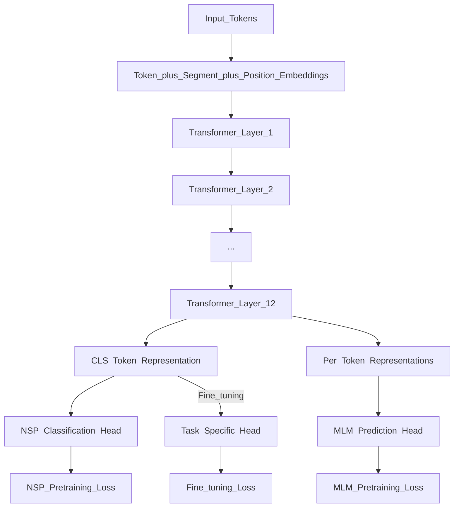

# 📄 Paper: BERT — Pre-training of Deep Bidirectional Transformers for Language Understanding

> [!abstract] TL;DR — one sentence on what this paper introduced
> Devlin et al. (2018) introduced BERT, showing that a Transformer pretrained bidirectionally via masked language modelling (MLM) and next sentence prediction (NSP) could set new state-of-the-art on 11 NLP tasks through fine-tuning alone — no task-specific architecture needed.

## Key Contribution — what was new, what it replaced

**What existed before**:
- GPT-1 (Radford et al. 2018): unidirectional (left-to-right) Transformer pretraining — good for generation, limited for understanding
- ELMo (Peters et al. 2018): bidirectional LSTM, but shallow (only surface-level bidirectionality)
- Task-specific architectures for each NLP task (separate models for NER, QA, classification)

**What this paper replaced**: Task-specific NLP models. BERT unified language understanding with a single pretrain-then-finetune framework.

**What was new**:
1. **Deep bidirectionality**: BERT attends to both left AND right context at every layer (GPT was left-to-right only; ELMo was shallowly bidirectional)
2. **Masked Language Modelling (MLM)**: randomly mask 15% of input tokens and predict them — forces the model to use both left and right context
3. **Next Sentence Prediction (NSP)**: binary classification of whether sentence B follows sentence A — captures cross-sentence relationships
4. **Fine-tuning for any task**: add a simple classification head on top of [CLS] token representation and fine-tune end-to-end

## Core Idea (in plain English)

Standard language models predict the next word from left to right (like GPT). But understanding requires knowing the full context — when you read "I went to the bank to [deposit/fish]", the word "bank" means something different depending on what comes AFTER it.

BERT's trick: instead of predicting the next word, **mask out random words and predict the missing ones**. This forces the model to learn from both directions. The training signal comes from fill-in-the-blank, not next-word prediction.

This is the key insight: **masked prediction** enables bidirectional context without the information leakage problem (you can't "see" the answer you're predicting in future positions, because that answer IS the masked current position).

## The Math

**MLM Pre-training Objective:**

For a sequence $x = (x_1, \ldots, x_T)$, mask a subset $\mathcal{M}$ of positions (15% of tokens):

$$\mathcal{L}_\text{MLM} = -\sum_{i \in \mathcal{M}} \log P(x_i \mid x_{\setminus \mathcal{M}}; \theta)$$

The 15% masking strategy:
- 80% of masked tokens replaced with [MASK]
- 10% replaced with a random token
- 10% kept as original
(This prevents the model from learning to ignore non-[MASK] tokens at inference)

**NSP Pre-training Objective:**

For sentence pairs $(A, B)$: 50% of pairs are consecutive (IsNext), 50% are random (NotNext).
$$\mathcal{L}_\text{NSP} = -\log P(\text{IsNext} \mid \text{[CLS]} \text{ representation}; \theta)$$

**Total pre-training loss:**
$$\mathcal{L} = \mathcal{L}_\text{MLM} + \mathcal{L}_\text{NSP}$$

**Fine-tuning**: Add a task-specific output layer (e.g., linear classifier) on top of BERT's representations and minimise task loss with the full model parameters updated.

For sequence classification (e.g., sentiment):
$$P(c \mid x) = \text{softmax}(W_c \cdot h_\text{[CLS]})$$

## Architecture / Algorithm



**BERT-base**: 12 layers, 12 heads, $d_\text{model} = 768$, 110M parameters
**BERT-large**: 24 layers, 16 heads, $d_\text{model} = 1024$, 340M parameters

**Input format**: [CLS] + Sentence A tokens + [SEP] + Sentence B tokens + [SEP]
- [CLS]: aggregate representation used for classification
- [SEP]: separator between sentences
- Segment embeddings: distinguish sentence A from B

## Code Demo

```python
# pip install transformers datasets torch

from transformers import (
    BertTokenizer, BertForSequenceClassification,
    BertForTokenClassification, BertForQuestionAnswering,
    TrainingArguments, Trainer
)
from datasets import load_dataset
import torch

# ===== 1. Fine-tune BERT for text classification (SST-2 sentiment) =====
tokenizer = BertTokenizer.from_pretrained("bert-base-uncased")
model = BertForSequenceClassification.from_pretrained("bert-base-uncased", num_labels=2)

dataset = load_dataset("sst2")

def tokenize(examples):
    return tokenizer(examples["sentence"], truncation=True, padding="max_length", max_length=128)

tokenized = dataset.map(tokenize, batched=True)
tokenized = tokenized.rename_column("label", "labels")
tokenized.set_format("torch", columns=["input_ids", "attention_mask", "labels"])

training_args = TrainingArguments(
    output_dir="./bert-sst2",
    num_train_epochs=3,
    per_device_train_batch_size=32,
    per_device_eval_batch_size=64,
    evaluation_strategy="epoch",
    learning_rate=2e-5,
    weight_decay=0.01,
    load_best_model_at_end=True,
)

trainer = Trainer(
    model=model,
    args=training_args,
    train_dataset=tokenized["train"],
    eval_dataset=tokenized["validation"],
)
trainer.train()

# ===== 2. Inference — extract embeddings =====
from transformers import BertModel
import numpy as np

bert = BertModel.from_pretrained("bert-base-uncased")
bert.eval()

sentences = ["The cat sat on the mat.", "Quantum mechanics is bizarre."]
inputs = tokenizer(sentences, return_tensors="pt", padding=True, truncation=True, max_length=128)

with torch.no_grad():
    outputs = bert(**inputs)

# [CLS] token representation (sentence embedding)
cls_embeddings = outputs.last_hidden_state[:, 0, :]   # (2, 768)
# Mean pooling over all tokens
mean_embeddings = outputs.last_hidden_state.mean(dim=1)  # (2, 768)

print(f"[CLS] embedding shape: {cls_embeddings.shape}")
print(f"Cosine similarity: {torch.nn.functional.cosine_similarity(cls_embeddings[0:1], cls_embeddings[1:2]).item():.4f}")

# ===== 3. Masked Language Modelling (see what BERT predicts) =====
from transformers import pipeline

fill_mask = pipeline("fill-mask", model="bert-base-uncased")
result = fill_mask("The capital of France is [MASK].")
for r in result[:3]:
    print(f"  {r['token_str']:12s}: {r['score']:.3f}")
```

## Impact — what it enabled, follow-on work, citation count

- **Citation count**: 70,000+ (most cited NLP paper as of 2024)
- **BERT variants**: RoBERTa (2019, drops NSP, more data), DistilBERT (2019, 40% smaller via distillation), ALBERT (2020, parameter-efficient), DeBERTa (2021, disentangled attention), Chinese BERT, BioBERT, Legal-BERT
- **Set SOTA on 11 tasks at release** (GLUE, SQuAD, etc.) by fine-tuning — no task-specific architecture needed
- **Changed NLP practice**: "pretrain on large corpus, fine-tune on task" became the default NLP paradigm
- **Foundation for understanding models**: BERT-class models remain dominant for text classification, NER, QA, and retrieval (bi-encoder similarity)
- **Probing revealed structure**: Clark et al. showed BERT learns syntax, morphology, and co-reference without explicit supervision

## Limitations — what it doesn't solve, known issues

1. **NSP found to be unhelpful**: RoBERTa showed removing NSP and training longer on MLM alone improves performance — NSP was too easy and didn't help.
2. **[MASK] token mismatch**: [MASK] only appears during pretraining, not fine-tuning — creates a discrepancy that SpanBERT and ELECTRA later addressed.
3. **Fixed-length context**: BERT-base uses max 512 tokens — very short for document-level tasks. Longformer, BigBird, etc. addressed this.
4. **Not a generative model**: BERT cannot generate text (it predicts masked tokens, not autoregressive next tokens) — GPT-style models are needed for generation.
5. **Slow pretraining**: MLM predicts only 15% of tokens per batch — inefficient use of compute. ELECTRA's replaced token detection (is this token real or fake?) trains faster.

## Related Concepts

- [[_MOC_Key_Papers|↑ Section MOC]]

- [[BERT]] — BERT as an architecture (detailed notes on all variants)
- [[Transformer_Architecture]] — the multi-head attention mechanism BERT uses
- [[GPT_Family]] — the generative counterpart to BERT; decoder-only pretrained models

## Review Questions

1. **Why does BERT use a 80/10/10 masking strategy (MASK/random/original) instead of always replacing with [MASK]? What problem does this design choice solve?**
2. **BERT is "deeply bidirectional" while ELMo is described as "shallowly bidirectional." What does this distinction mean architecturally, and why does depth of bidirectionality matter?**
3. **RoBERTa found that removing NSP from BERT's pretraining improved downstream performance. Why might NSP have been unhelpful or harmful despite seeming like a useful pretraining objective?**

## Citation

Devlin, J., Chang, M.-W., Lee, K., & Toutanova, K. (2019). **BERT: Pre-training of Deep Bidirectional Transformers for Language Understanding**. *Proceedings of NAACL-HLT 2019*.
[https://arxiv.org/abs/1810.04805](https://arxiv.org/abs/1810.04805)

#paper #bert #nlp #pretraining #masked-language-model #2018
