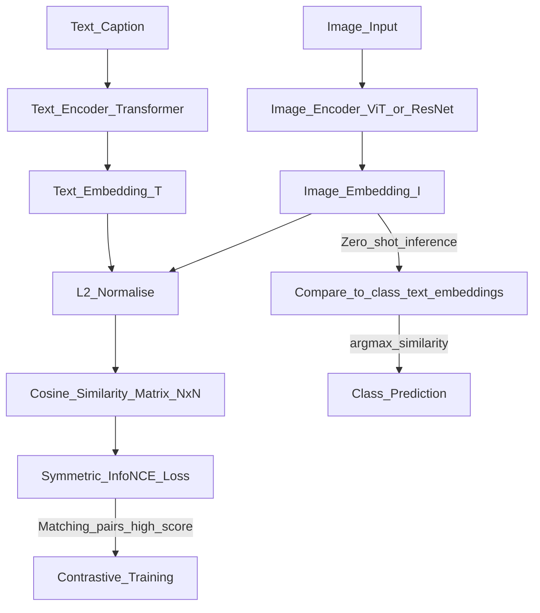

# 📄 Paper: Learning Transferable Visual Models From Natural Language Supervision (CLIP)

> [!abstract] TL;DR — one sentence on what this paper introduced
> Radford et al. (OpenAI, 2021) showed that training a vision encoder and text encoder jointly on 400M internet image-text pairs with a contrastive objective produces visual representations that transfer to 30+ vision tasks via zero-shot classification — matching supervised ResNet-50 without any task-specific training.

## Key Contribution — what was new, what it replaced

**What existed before**:
- Supervised pretraining on ImageNet labels → fine-tuning: limited by labelled dataset size
- Self-supervised visual pretraining (SimCLR, MoCo): strong features but still need task labels for transfer
- Early multimodal models (VilBERT, ViLT): complex architectures, moderate zero-shot ability

**What was replaced**: The requirement for labelled training data to build visual classifiers. CLIP enables zero-shot classification using natural language descriptions.

**What was new**:
1. **Scale**: 400M image-text pairs (WIT — WebImageText, scraped from internet) — 10× larger than any prior vision dataset
2. **Contrastive pretraining**: align image embeddings and text embeddings in a shared semantic space using InfoNCE loss
3. **Zero-shot transfer**: classify images by computing cosine similarity between image embedding and text embeddings of class names ("a photo of a cat")
4. **Natural language as supervision signal**: labels are free-form text, not fixed class indices
5. **Dual-encoder architecture**: separate image encoder (ViT or ResNet) and text encoder (Transformer) — fast inference via pre-computed embeddings

## Core Idea (in plain English)

Show the model 400 million images, each with a natural language caption scraped from the internet ("a golden retriever playing fetch"). Train two networks:
1. An image encoder that compresses the image into a vector
2. A text encoder that compresses the caption into a vector

Train them so matching pairs (image + its caption) produce similar vectors, and non-matching pairs produce dissimilar vectors. This is contrastive learning.

After training, CLIP can classify any image into any category — just compute cosine similarity between the image vector and text vectors for each class name ("a photo of a cat", "a photo of a dog", etc.). No task-specific fine-tuning needed.

The "language supervision" trick: text descriptions contain far richer information than a single class label. "A tabby cat sitting on a red sofa" teaches the model about cats, sofas, and colours simultaneously.

## The Math

**Contrastive pretraining objective (InfoNCE / symmetric cross-entropy):**

For a batch of $N$ image-text pairs:
1. Compute image embeddings $\{I_i\}$ and text embeddings $\{T_i\}$ (L2-normalised)
2. Compute cosine similarity matrix $S \in \mathbb{R}^{N \times N}$ where $S_{ij} = I_i \cdot T_j \cdot e^\tau$ ($\tau$ = learnable temperature)

The loss pushes $S_{ii}$ (matching pairs) high and $S_{ij}$, $i \neq j$ (non-matching pairs) low:

$$\mathcal{L}_\text{image} = -\frac{1}{N} \sum_i \log \frac{e^{S_{ii}}}{\sum_j e^{S_{ij}}}$$

$$\mathcal{L}_\text{text} = -\frac{1}{N} \sum_i \log \frac{e^{S_{ii}}}{\sum_j e^{S_{ji}}}$$

$$\mathcal{L}_\text{CLIP} = \frac{\mathcal{L}_\text{image} + \mathcal{L}_\text{text}}{2}$$

This is equivalent to cross-entropy on an $N \times N$ "image-text matching" matrix with identity ground truth.

**Zero-shot classification:**

Given $K$ classes with names $\{c_1, \ldots, c_K\}$:
1. Encode each class as a text prompt: "a photo of a {$c_k$}"
2. Compute text embeddings $\{T_k\}$ (L2-normalised)
3. Compute image embedding $I$ (L2-normalised)
4. Assign label $\hat{y} = \arg\max_k I \cdot T_k$

**Linear probe (few-shot evaluation)**: freeze CLIP image encoder, train a linear classifier on top with labelled examples.

## Architecture / Algorithm



**CLIP variants trained in the paper**:
- Image encoder: ResNet-50, ResNet-101, ViT-B/32, ViT-B/16, ViT-L/14 (strongest)
- Text encoder: 63M parameter Transformer (12 layers, 512-dim, 8 heads)
- Training: 400M image-text pairs (WIT), 32 epochs, batch size 32,768

## Code Demo

```python
# pip install transformers torch pillow requests

from transformers import CLIPProcessor, CLIPModel, CLIPTokenizer, CLIPImageProcessor
from PIL import Image
import torch
import torch.nn.functional as F
import requests

# ===== 1. Zero-shot image classification =====
model = CLIPModel.from_pretrained("openai/clip-vit-base-patch32")
processor = CLIPProcessor.from_pretrained("openai/clip-vit-base-patch32")
model.eval()

# Load an image
url = "https://upload.wikimedia.org/wikipedia/commons/thumb/4/43/Cute_dog.jpg/320px-Cute_dog.jpg"
image = Image.open(requests.get(url, stream=True).raw)

# Zero-shot classification
class_names = ["a photo of a cat", "a photo of a dog",
               "a photo of a car", "a photo of a bird"]

inputs = processor(
    text=class_names,
    images=image,
    return_tensors="pt",
    padding=True
)

with torch.no_grad():
    outputs = model(**inputs)

# Logits: similarity between image and each text
logits_per_image = outputs.logits_per_image   # (1, num_classes)
probs = F.softmax(logits_per_image, dim=-1)

for label, prob in zip(class_names, probs[0]):
    print(f"  {label}: {prob.item():.3f}")

# ===== 2. Image and text embeddings =====
from transformers import CLIPVisionModel, CLIPTextModel

vision_model = CLIPVisionModel.from_pretrained("openai/clip-vit-base-patch32")
text_model   = CLIPTextModel.from_pretrained("openai/clip-vit-base-patch32")
tokenizer    = CLIPTokenizer.from_pretrained("openai/clip-vit-base-patch32")
img_processor = CLIPImageProcessor.from_pretrained("openai/clip-vit-base-patch32")

# Image embedding
img_inputs = img_processor(images=image, return_tensors="pt")
with torch.no_grad():
    img_features = vision_model(**img_inputs).pooler_output   # (1, 512)
    img_features = F.normalize(img_features, dim=-1)

# Text embedding
texts = ["golden retriever", "labrador retriever", "german shepherd", "persian cat"]
tok   = tokenizer(texts, return_tensors="pt", padding=True, truncation=True)
with torch.no_grad():
    txt_features = text_model(**tok).pooler_output           # (4, 512)
    txt_features = F.normalize(txt_features, dim=-1)

# Cosine similarity matrix
similarity = (img_features @ txt_features.T) * 100  # scale by temperature
print("\nImage-to-text cosine similarities:")
for text, sim in zip(texts, similarity[0]):
    print(f"  '{text}': {sim.item():.2f}")

# ===== 3. Compute InfoNCE loss (training objective) =====
def clip_loss(image_features: torch.Tensor, text_features: torch.Tensor,
              temperature: float = 0.07) -> torch.Tensor:
    """Symmetric InfoNCE loss for CLIP training."""
    # L2 normalise
    image_features = F.normalize(image_features, dim=-1)
    text_features  = F.normalize(text_features, dim=-1)

    # Cosine similarity scaled by temperature
    logits = (image_features @ text_features.T) / temperature  # (N, N)

    # Ground truth: diagonal (each image matches its own text)
    N = logits.size(0)
    labels = torch.arange(N, device=logits.device)

    loss_i = F.cross_entropy(logits, labels)       # image→text
    loss_t = F.cross_entropy(logits.T, labels)     # text→image
    return (loss_i + loss_t) / 2

# Test with random batch
N, D = 32, 512
img_emb = F.normalize(torch.randn(N, D), dim=-1)
txt_emb = F.normalize(torch.randn(N, D), dim=-1)
loss = clip_loss(img_emb, txt_emb)
print(f"\nInfoNCE loss (random batch): {loss.item():.3f}")  # ~log(32) ≈ 3.47

# ===== 4. Image-text retrieval =====
def image_text_retrieval(query_image, candidate_texts: list[str], top_k: int = 3):
    """Find top-k most relevant texts for a query image."""
    inputs = processor(text=candidate_texts, images=query_image,
                       return_tensors="pt", padding=True)
    with torch.no_grad():
        outputs = model(**inputs)
    probs = F.softmax(outputs.logits_per_image[0], dim=0)
    ranked = sorted(zip(candidate_texts, probs.tolist()), key=lambda x: -x[1])
    return ranked[:top_k]
```

## Impact — what it enabled, follow-on work, citation count

- **Citation count**: 20,000+
- **Stable Diffusion**: uses CLIP ViT-L/14 as the text encoder — CLIP text embeddings condition the diffusion model. Virtually every text-to-image model uses CLIP.
- **DALL-E 2**: directly built on CLIP — generates images by inverting CLIP image embeddings
- **OpenCLIP**: open-source replication and improvements trained on LAION-400M/5B — free for commercial use
- **SigLIP (Google)**: improved training objective using sigmoid instead of softmax — better for large batches, used in Gemini's vision encoder
- **ALIGN (Google)**: concurrent work trained on 1.8B noisy image-text pairs — similar results
- **Zero-shot COCO retrieval**: CLIP achieved 58.4% R@1 zero-shot (supervised models at 74.1% at the time) — remarkable gap closed
- **Segment Anything (SAM)**: SAM used CLIP-style training for open-vocabulary segmentation
- **LLaVA, GPT-4V, Claude vision**: all use a CLIP or SigLIP image encoder to inject visual features into language models

## Limitations — what it doesn't solve, known issues

1. **Abstract reasoning fails**: CLIP understands semantic content but performs poorly on tasks requiring counting, spatial reasoning, or compositionality ("a dog to the LEFT of a cat" vs "a cat to the LEFT of a dog")
2. **OCR / fine-grained text**: struggles to read text in images — specialised models (Florence, PaddleOCR) do better
3. **Distribution shift from caption noise**: WIT captions are noisy internet text — CLIP has weird failure modes on uncommon concepts
4. **Zero-shot gap for fine-grained classification**: zero-shot struggles on fine-grained tasks (200 bird species, specific car models) where category names don't uniquely identify visual features
5. **Bias in training data**: WIT reflects internet biases — CLIP stereotypes certain identities and concepts

## Related Concepts

- [[_MOC_Key_Papers|↑ Section MOC]]

- [[CLIP]] — concept note with CLIP variants and embedding model ecosystem
- [[Stable_Diffusion]] — uses CLIP as text encoder
- [[Vision_Transformer_ViT]] — image encoder architecture used by CLIP

## Review Questions

1. **CLIP uses a symmetric InfoNCE loss with a batch of N pairs and an N×N similarity matrix. Why does a larger batch size improve CLIP training, and what is the maximum theoretical batch size that makes sense?**
2. **CLIP achieves strong zero-shot performance on standard image classification but struggles with fine-grained tasks (e.g., classifying 200 bird species). What property of CLIP's training objective causes this limitation?**
3. **Stable Diffusion's text encoder is a frozen CLIP model. What does it mean for CLIP to be used as a conditioning signal in diffusion, and what are the implications of the text encoder being frozen vs fine-tuned?**

## Citation

Radford, A., Kim, J. W., Hallacy, C., Ramesh, A., Goh, G., Agarwal, S., ... & Sutskever, I. (2021). **Learning Transferable Visual Models From Natural Language Supervision**. *International Conference on Machine Learning (ICML) 2021*.
[https://arxiv.org/abs/2103.00020](https://arxiv.org/abs/2103.00020)

#paper #clip #multimodal #contrastive-learning #zero-shot #vision #2021
