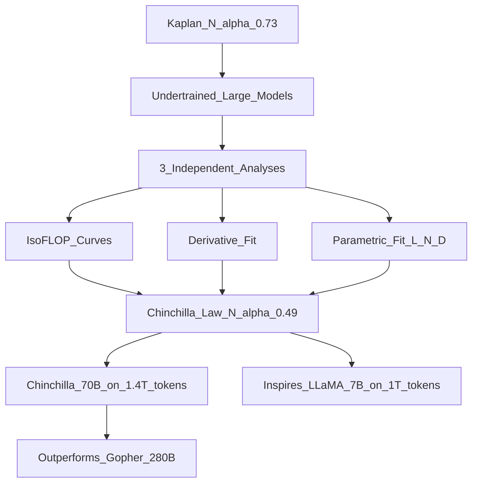

# 📄 Paper: Training Compute-Optimal Large Language Models (Chinchilla)

> [!abstract] TL;DR — one sentence on what this paper introduced
> Hoffmann et al. (DeepMind, 2022) showed that Kaplan et al.'s scaling laws underestimated the importance of data, and that the compute-optimal strategy is to scale model size and training tokens equally — a 70B model trained on 1.4T tokens (Chinchilla) outperforms the 280B Gopher on most tasks.

## Key Contribution — what was new, what it replaced

**What existed before**: Kaplan et al. (2020) scaling laws recommended spending ~73% of compute on model size, only 27% on data. This led to GPT-3 (175B, 300B tokens) and Gopher (280B, 300B tokens) — large models undertrained on relatively little data.

**What this paper replaced**: The Kaplan (2020) scaling law recommendation for model vs data allocation.

**What was new**:
1. **Revised scaling exponents**: both model size and training tokens should scale roughly equally with compute ($N \propto C^{0.49}$, $D \propto C^{0.51}$) — not the 73/27 split from Kaplan
2. **Chinchilla model**: 70B parameters trained on 1.4T tokens — 4× smaller model than Gopher, trained on 4× more data — same compute budget, better results
3. **Most existing LLMs were undertrained**: GPT-3, Gopher, Megatron-Turing were all too big for their data budgets; they should have been smaller with more training tokens
4. **Methodological improvement**: three independent analysis methods (IsoFLOP profiles, derivative fit, parametric fit) that all converged on the same revised laws

## Core Idea (in plain English)

Kaplan said: "With a fixed compute budget, make the model as big as possible."
Chinchilla says: "Wait — you're not feeding the model enough data. A smaller model trained on more tokens beats a bigger model trained on fewer."

Analogy: you're hiring employees (parameters) vs giving them training time (tokens). Kaplan said hire more people and give them less training. Chinchilla said: keep the headcount manageable and train each person better.

For GPT-3 (175B params, 300B tokens): Chinchilla says GPT-3 was under-trained. It should have had more data. At the same compute budget, a ~67B model trained on ~1.5T tokens would perform better.

This insight directly changed how the industry trains models — LLaMA-1 was explicitly designed using Chinchilla scaling laws.

## The Math

**Chinchilla's parametric loss function:**
$$L(N, D) = E + \frac{A}{N^\alpha} + \frac{B}{D^\beta}$$

where:
- $E \approx 1.69$ — irreducible entropy (best possible loss)
- $A \approx 406.4$, $\alpha \approx 0.34$ — model size contribution
- $B \approx 410.7$, $\beta \approx 0.28$ — data size contribution

**Compute budget**: $C \approx 6ND$ FLOPs

**Compute-optimal condition** (from Lagrangian optimisation):
$$\frac{dL}{dN} = 0, \quad \frac{dL}{dD} = 0, \quad \text{subject to } 6ND = C$$

This gives:
$$N^* \propto C^{0.49}, \quad D^* \propto C^{0.51}$$

Compare to Kaplan: $N^* \propto C^{0.73}$, $D^* \propto C^{0.27}$.

**Chinchilla rule of thumb**: train approximately **20 tokens per parameter**:
$$D^* \approx 20 \times N^*$$

So:
- 7B model → 140B tokens minimum
- 70B model → 1.4T tokens minimum
- 175B model → 3.5T tokens minimum (GPT-3 trained on 300B — severely undertrained by this standard)

## Architecture / Algorithm



**Three independent methods** (all gave same answer):
1. **IsoFLOP profiles**: fix compute $C$, vary $(N, D)$ with $C = 6ND$ constant, measure optimal $N$ at each $C$
2. **Derivative method**: approximate the smooth loss $L(N, D)$ and solve for optimal ratio $N/D$
3. **Parametric fit**: fit full parametric function $L(N, D) = E + A/N^\alpha + B/D^\beta$ to all experiments

**Chinchilla vs prior models** (all trained on same compute budget as Gopher):

| Model | Params | Tokens | Hendrycks MATH | MMLU |
|---|---|---|---|---|
| Gopher | 280B | 300B tokens | — | 60.0% |
| Chinchilla | 70B | 1.4T tokens | — | 67.5% |

## Code Demo

```python
import numpy as np
import matplotlib.pyplot as plt
from scipy.optimize import fsolve

# ===== Chinchilla scaling law implementation =====

# Chinchilla constants (Hoffmann et al. Table 3)
E = 1.69       # irreducible loss
A = 406.4
ALPHA = 0.34   # model size exponent
B = 410.7
BETA = 0.28    # data size exponent
FLOPS_PER_PARAM_TOKEN = 6.0  # approximate FLOPs for transformer

def chinchilla_loss(N: float, D: float) -> float:
    """Predicted cross-entropy loss given N parameters and D training tokens."""
    return E + A / (N ** ALPHA) + B / (D ** BETA)

def chinchilla_optimal(C: float) -> tuple[float, float]:
    """Compute-optimal (N*, D*) for compute budget C FLOPs."""
    # Solve: dL/dN = dL/dD = 0 subject to 6ND = C
    # Analytically: N* = (alpha*A/beta*B)^(1/(alpha+beta)) * (C/6)^(beta/(alpha+beta))
    ratio = (ALPHA * A) / (BETA * B)
    N_star = ratio ** (1 / (ALPHA + BETA)) * (C / FLOPS_PER_PARAM_TOKEN) ** (BETA / (ALPHA + BETA))
    D_star = C / (FLOPS_PER_PARAM_TOKEN * N_star)
    return N_star, D_star

def kaplan_optimal(C: float) -> tuple[float, float]:
    """Kaplan et al. (2020) compute-optimal allocation."""
    N_star = (C / FLOPS_PER_PARAM_TOKEN) ** 0.73
    D_star = C / (FLOPS_PER_PARAM_TOKEN * N_star)
    return N_star, D_star

# ===== Compare Kaplan vs Chinchilla recommendations =====
models = {
    "GPT-3 (175B, 300B tokens)":      6 * 175e9 * 300e9,
    "Gopher (280B, 300B tokens)":     6 * 280e9 * 300e9,
    "LLaMA-1 (7B, 1T tokens)":        6 * 7e9   * 1e12,
    "LLaMA-2 (70B, 2T tokens)":       6 * 70e9  * 2e12,
}

print(f"{'Model Compute Budget':<35} {'Kaplan N*(B)':<18} {'Kaplan D*(B)':<18} {'Chinchilla N*(B)':<20} {'Chinchilla D*(B)'}")
for name, C in models.items():
    kN, kD = kaplan_optimal(C)
    cN, cD = chinchilla_optimal(C)
    print(f"{name:<35} {kN/1e9:>12.1f}    {kD/1e9:>12.1f}    {cN/1e9:>16.1f}    {cD/1e9:>12.1f}")

# ===== Chinchilla "20 tokens per parameter" rule =====
print("\n=== Chinchilla minimum training tokens ===")
for N_B in [1, 3, 7, 13, 33, 65, 70, 175]:
    N = N_B * 1e9
    D_min = 20 * N
    print(f"  {N_B:>4}B parameters → {D_min/1e9:.0f}B tokens minimum")

# ===== IsoFLOP curve visualisation =====
compute_budget = 6e22  # ~GPT-3 compute

N_range = np.logspace(8, 12, 200)
D_range = compute_budget / (FLOPS_PER_PARAM_TOKEN * N_range)

# Remove invalid (D < 1B tokens)
valid = D_range > 1e9
N_valid, D_valid = N_range[valid], D_range[valid]

losses = [chinchilla_loss(n, d) for n, d in zip(N_valid, D_valid)]
optimal_idx = np.argmin(losses)
N_opt, D_opt = chinchilla_optimal(compute_budget)

fig, (ax1, ax2) = plt.subplots(1, 2, figsize=(14, 5))

ax1.semilogx(N_valid / 1e9, losses)
ax1.axvline(N_opt / 1e9, color="r", linestyle="--", label=f"Optimal N = {N_opt/1e9:.1f}B")
ax1.set_xlabel("Model Parameters (B)")
ax1.set_ylabel("Predicted Loss")
ax1.set_title(f"IsoFLOP curve (C = {compute_budget:.0e} FLOPs)")
ax1.legend()
ax1.grid(True, alpha=0.3)

compute_range = np.logspace(20, 25, 50)
chin_N = [chinchilla_optimal(C)[0] / 1e9 for C in compute_range]
kapl_N = [kaplan_optimal(C)[0] / 1e9 for C in compute_range]

ax2.loglog(compute_range, chin_N, "b-", label="Chinchilla N*", linewidth=2)
ax2.loglog(compute_range, kapl_N, "r--", label="Kaplan N*", linewidth=2)
ax2.set_xlabel("Compute Budget C (FLOPs)")
ax2.set_ylabel("Optimal Model Size N* (B params)")
ax2.set_title("Kaplan vs Chinchilla optimal model size")
ax2.legend()
ax2.grid(True, alpha=0.3)

plt.tight_layout()
plt.savefig("chinchilla_scaling.png", dpi=150)
```

## Impact — what it enabled, follow-on work, citation count

- **Citation count**: 3,000+
- **LLaMA (2023)**: Meta explicitly used Chinchilla laws — LLaMA-1 7B trained on 1T tokens, 13B on 1T tokens, 65B on 1.4T tokens. All of these outperform GPT-3 on many benchmarks.
- **GPT-4 design**: OpenAI hasn't disclosed details, but GPT-4 is believed to follow compute-optimal principles
- **Gemini Ultra**: trained with data efficiency in mind
- **Changed industry consensus**: "train smaller models on more data" — now standard wisdom
- **Phi series (Microsoft)**: takes this further — tiny models (1B–3B) trained on extremely high-quality data, achieving performance comparable to much larger models
- **Data quality research**: revealed that data quantity alone matters — sparked research into data quality, filtering, and deduplication

## Limitations — what it doesn't solve, known issues

1. **"20 tokens per parameter" is a minimum, not maximum**: LLaMA-2 7B was trained on 2T tokens (285 tokens/param) and kept improving — there's no sharp dropoff at Chinchilla-optimal
2. **Inference budget matters**: Chinchilla is compute-optimal for training. For deployment, you may want a smaller model trained longer (cheaper inference) — LLaMA's actual motivation
3. **Data quality vs quantity**: Chinchilla laws assume fixed-quality data. With high-quality data filtering (Phi, FineWeb-Edu), you can break the scaling law — same compute, better model
4. **Task-specific scaling**: the laws predict average cross-entropy loss; specific emergent capabilities can appear super-linear with scale
5. **Multimodal and other modalities**: Chinchilla laws derived for text; don't directly apply to vision, code, or multimodal training

## Related Concepts

- [[_MOC_Key_Papers|↑ Section MOC]]

- [[Scaling_Laws]] — the concept note on scaling laws and their implications
- [[Scaling_Laws_Paper]] — Kaplan et al. (2020), the predecessor this paper revised
- [[Pretraining]] — how pretraining pipelines are designed with these laws in mind

## Review Questions

1. **Chinchilla found that GPT-3 was undertrained. Using the "20 tokens per parameter" rule, how many training tokens should GPT-3 have consumed for compute-optimal training? What does this tell you about where the LLM field stood in 2020?**
2. **LLaMA-1 was trained far beyond Chinchilla-optimal (7B × 20 = 140B tokens, but LLaMA used 1T tokens). Why is training beyond Chinchilla-optimal sometimes desirable from a practical standpoint?**
3. **The Phi series of models (e.g., Phi-3-mini) achieves surprisingly strong performance with 3.8B parameters by using high-quality training data. How does this challenge the assumptions underlying Chinchilla scaling laws?**

## Citation

Hoffmann, J., Borgeaud, S., Mensch, A., Buchatskaya, E., Cai, T., Rutherford, E., ... & Sifre, L. (2022). **Training Compute-Optimal Large Language Models**. *Advances in Neural Information Processing Systems (NeurIPS)*, 35.
[https://arxiv.org/abs/2203.15556](https://arxiv.org/abs/2203.15556)

#paper #chinchilla #scaling-laws #llm #pretraining #compute-optimal #2022
