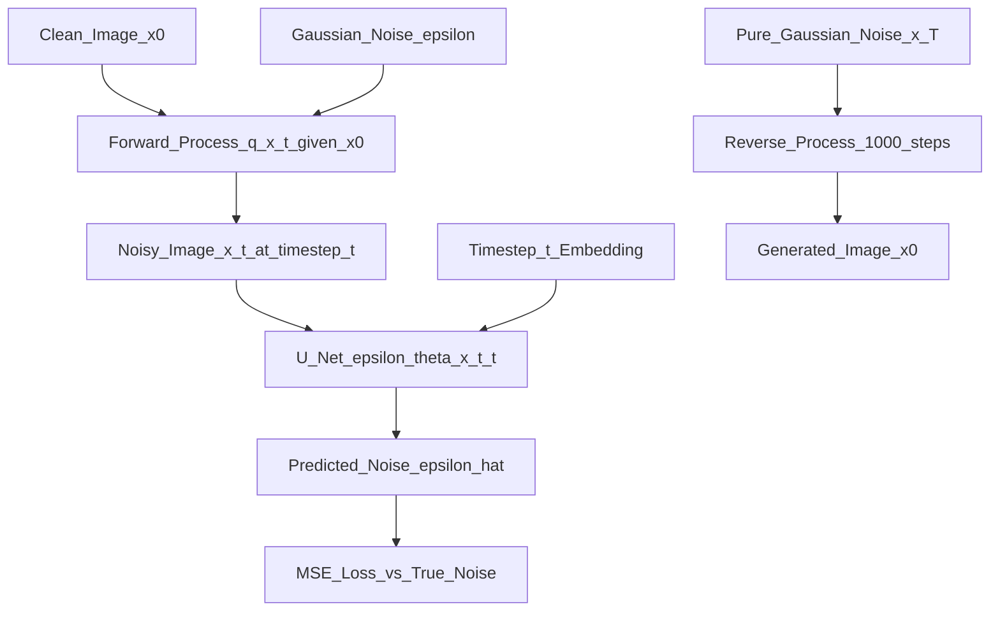

# 📄 Paper: Denoising Diffusion Probabilistic Models (DDPM)

> [!abstract] TL;DR — one sentence on what this paper introduced
> Ho et al. (2020) showed that denoising diffusion probabilistic models — trained to predict the noise added at each step of a fixed Markov chain — achieve image generation quality competitive with GANs, with a simpler training objective and more stable training.

## Key Contribution — what was new, what it replaced

**What existed before**:
- GANs (2014): high quality but training instability, mode collapse, no likelihood
- VAEs: stable training but blurry outputs
- Earlier diffusion models (Sohl-Dickstein 2015): first formulation but impractical
- Score matching / EBMs: theoretically interesting but slow sampling

**What was replaced**: GANs as the dominant paradigm for high-quality image generation.

**What was new**:
1. **ε-prediction**: instead of predicting the data ($x_0$) directly or the score, predict the noise $\epsilon$ added at each step — simpler and empirically better
2. **Simplified ELBO**: showed the full variational lower bound simplifies to a denoising MSE when you fix the variance schedule and use ε-prediction
3. **Fixed forward process**: the noising schedule is deterministic (not learned) — simplifies training
4. **High-quality samples**: achieved FID = 3.17 on CIFAR-10, competitive with GANs, without any GAN-specific tricks

## Core Idea (in plain English)

Imagine taking a clear photo and gradually adding more and more noise until it becomes pure static. Run this process for $T = 1000$ steps. This is the **forward process** — mathematically simple and deterministic.

Now train a neural network to reverse it: given a slightly noisy image, predict what it would look like with slightly less noise. But training the network to predict the denoised image directly is hard (blurry). Instead, predict the noise that was added. Predicting noise is easier and more stable.

At sampling time: start with pure noise, and repeatedly apply the denoising network to "un-noise" it step by step, for 1000 steps. The result is a realistic image.

The key insight of this paper: **predict the noise, not the image**. This simple change over prior diffusion work was the breakthrough.

## The Math

**Forward process** (fixed Markov chain, adds Gaussian noise):
$$q(x_t \mid x_{t-1}) = \mathcal{N}\!\left(x_t;\, \sqrt{1-\beta_t}\, x_{t-1},\, \beta_t I\right)$$

**Closed-form marginal** (key trick — sample $x_t$ directly from $x_0$ in one step):
$$q(x_t \mid x_0) = \mathcal{N}\!\left(x_t;\, \sqrt{\bar{\alpha}_t}\, x_0,\, (1-\bar{\alpha}_t) I\right)$$

where:
- $\alpha_t = 1 - \beta_t$, $\bar{\alpha}_t = \prod_{s=1}^t \alpha_s$
- Reparameterisation: $x_t = \sqrt{\bar{\alpha}_t}\, x_0 + \sqrt{1-\bar{\alpha}_t}\, \epsilon$, $\epsilon \sim \mathcal{N}(0, I)$

**Training objective** (ε-prediction, simplified from ELBO):
$$\mathcal{L} = \mathbb{E}_{t,\, x_0,\, \epsilon}\!\left[\left\|\epsilon - \epsilon_\theta(x_t, t)\right\|^2\right]$$

where $\epsilon_\theta$ is a U-Net that takes the noisy image $x_t$ and timestep $t$, and predicts the noise.

**Reverse process** (learned, Gaussian):
$$p_\theta(x_{t-1} \mid x_t) = \mathcal{N}\!\left(x_{t-1};\, \mu_\theta(x_t, t),\, \sigma_t^2 I\right)$$

The mean $\mu_\theta$ is derived from the ε-prediction:
$$\mu_\theta(x_t, t) = \frac{1}{\sqrt{\alpha_t}}\!\left(x_t - \frac{\beta_t}{\sqrt{1-\bar{\alpha}_t}} \epsilon_\theta(x_t, t)\right)$$

**Noise schedule** (linear in original DDPM, cosine in improved DDPM):
$$\beta_t \in [10^{-4}, 0.02], \quad t \in \{1, \ldots, 1000\}$$

## Architecture / Algorithm



**U-Net architecture** (denoising network $\epsilon_\theta$):
- Encoder: downsampling with ResNet blocks + self-attention
- Decoder: upsampling with skip connections from encoder
- Timestep conditioning: sinusoidal embedding, added to residual blocks
- $T = 1000$ diffusion steps (original paper)
- Input/output: both are images of the same resolution

**Sampling algorithm (DDPM)**:
1. Sample $x_T \sim \mathcal{N}(0, I)$
2. For $t = T, T-1, \ldots, 1$:
   a. Predict noise: $\hat{\epsilon} = \epsilon_\theta(x_t, t)$
   b. Compute $x_0$ estimate: $\hat{x}_0 = (x_t - \sqrt{1-\bar{\alpha}_t}\hat{\epsilon}) / \sqrt{\bar{\alpha}_t}$
   c. Sample: $x_{t-1} \sim p_\theta(x_{t-1} \mid x_t)$
3. Return $x_0$

## Code Demo

```python
# pip install diffusers transformers torch accelerate

# ===== 1. Use pretrained DDPM via HuggingFace Diffusers =====
from diffusers import DDPMPipeline, DDIMPipeline
import torch

# Load a pretrained unconditional DDPM (CIFAR-10 scale)
pipeline = DDPMPipeline.from_pretrained("google/ddpm-cifar10-32")
pipeline = pipeline.to("cuda")

# Generate images (DDPM — 1000 steps, slow)
images = pipeline(batch_size=16, num_inference_steps=1000).images

# Save
for i, img in enumerate(images[:4]):
    img.save(f"ddpm_sample_{i}.png")

# ===== 2. Implement minimal DDPM from scratch =====
import torch
import torch.nn as nn
import numpy as np

class NoiseSchedule:
    def __init__(self, T: int = 1000, beta_start: float = 1e-4, beta_end: float = 0.02):
        self.T = T
        self.betas     = torch.linspace(beta_start, beta_end, T)
        self.alphas    = 1.0 - self.betas
        self.alpha_bar = torch.cumprod(self.alphas, dim=0)  # ᾱ_t

    def q_sample(self, x0: torch.Tensor, t: torch.Tensor, noise: torch.Tensor) -> torch.Tensor:
        """Forward process: given x0 and t, sample x_t in one step."""
        sqrt_alpha_bar     = self.alpha_bar[t].sqrt().view(-1, 1, 1, 1)
        sqrt_one_minus_abar = (1 - self.alpha_bar[t]).sqrt().view(-1, 1, 1, 1)
        return sqrt_alpha_bar * x0 + sqrt_one_minus_abar * noise

    def compute_loss(self, model: nn.Module, x0: torch.Tensor) -> torch.Tensor:
        """Compute DDPM training loss (ε-prediction MSE)."""
        B = x0.size(0)
        t = torch.randint(0, self.T, (B,), device=x0.device)
        noise = torch.randn_like(x0)
        x_t = self.q_sample(x0, t, noise)
        pred_noise = model(x_t, t)
        return nn.functional.mse_loss(pred_noise, noise)

    @torch.no_grad()
    def p_sample(self, model: nn.Module, x_t: torch.Tensor, t_val: int) -> torch.Tensor:
        """One step of reverse process (DDPM sampler)."""
        t = torch.full((x_t.size(0),), t_val, device=x_t.device, dtype=torch.long)
        beta_t   = self.betas[t_val]
        alpha_t  = self.alphas[t_val]
        abar_t   = self.alpha_bar[t_val]

        pred_noise = model(x_t, t)
        # Compute mean
        coeff = beta_t / (1 - abar_t).sqrt()
        mean  = (x_t - coeff * pred_noise) / alpha_t.sqrt()
        # Add noise (for t > 0)
        noise = torch.randn_like(x_t) if t_val > 0 else torch.zeros_like(x_t)
        return mean + beta_t.sqrt() * noise

    @torch.no_grad()
    def sample(self, model: nn.Module, shape: tuple, device) -> torch.Tensor:
        """Full reverse process: generate images from noise."""
        x = torch.randn(*shape, device=device)
        for t in reversed(range(self.T)):
            x = self.p_sample(model, x, t)
        return x.clamp(-1, 1)

# ===== 3. Minimal U-Net (toy) =====
class TinyUNet(nn.Module):
    """Simplified U-Net for small images (32x32)."""
    def __init__(self, channels: int = 3, dim: int = 64):
        super().__init__()
        self.time_emb = nn.Sequential(nn.Linear(1, dim), nn.ReLU(), nn.Linear(dim, dim))
        self.enc1  = nn.Conv2d(channels, dim, 3, padding=1)
        self.enc2  = nn.Conv2d(dim, dim*2, 3, stride=2, padding=1)
        self.mid   = nn.Conv2d(dim*2, dim*2, 3, padding=1)
        self.dec1  = nn.ConvTranspose2d(dim*2, dim, 4, stride=2, padding=1)
        self.out   = nn.Conv2d(dim*2, channels, 3, padding=1)

    def forward(self, x: torch.Tensor, t: torch.Tensor) -> torch.Tensor:
        temb = self.time_emb(t.float().unsqueeze(-1) / 1000)
        e1 = torch.relu(self.enc1(x))
        e2 = torch.relu(self.enc2(e1))
        m  = torch.relu(self.mid(e2))
        d1 = torch.relu(self.dec1(m))
        return self.out(torch.cat([d1, e1], dim=1))

# Training sketch
schedule = NoiseSchedule(T=1000)
unet = TinyUNet().cuda()
opt = torch.optim.Adam(unet.parameters(), lr=2e-4)

# Fake batch (replace with real data)
x0 = torch.randn(8, 3, 32, 32).cuda()
loss = schedule.compute_loss(unet, x0)
loss.backward(); opt.step()
print(f"Training loss: {loss.item():.4f}")
```

## Impact — what it enabled, follow-on work, citation count

- **Citation count**: 8,000+
- **Launched the diffusion era**: DDPM showed diffusion models could match GAN quality — subsequent papers rapidly improved speed and quality
- **DDIM (Song et al. 2021)**: deterministic sampling, 10–50× fewer sampling steps (50 instead of 1000)
- **Stable Diffusion / LDM (2022)**: latent diffusion — run diffusion in a compressed VAE latent space instead of pixel space, enabling 8× faster training and inference
- **DALL-E 2 (2022)**: CLIP + diffusion — text-to-image at OpenAI
- **Imagen (2022)**: cascaded diffusion models at Google
- **DiT (2023)**: replaced U-Net with a Transformer architecture for diffusion — scalable
- **Superseded GANs**: by 2022, text-to-image generation was dominated by diffusion models; GAN papers became rare at top conferences
- **Video generation**: Sora, VideoPoet use video diffusion transformer

## Limitations — what it doesn't solve, known issues

1. **Slow sampling**: 1000 reverse steps = 1000 neural network forward passes — slow for inference. Addressed by DDIM (50 steps), consistency models (1–4 steps), progressive distillation.
2. **Pixel space is expensive**: operating directly on high-resolution pixels requires massive memory and compute. Latent diffusion (Stable Diffusion) solved this.
3. **No text conditioning**: original DDPM is unconditional. Text-to-image requires additional conditioning mechanisms (cross-attention, classifier-free guidance).
4. **U-Net architecture limits**: U-Net has limited scalability and no global context. DiT replaced it with Transformers.
5. **Diversity vs quality trade-off**: guidance scale (classifier-free guidance) increases sample quality but reduces diversity.

## Related Concepts

- [[_MOC_Key_Papers|↑ Section MOC]]

- [[Diffusion_Models]] — full concept note on diffusion models: DDPM, DDIM, LDM, CFG
- [[Stable_Diffusion]] — latent diffusion model built on DDPM principles
- [[GAN]] — the architecture DDPM replaced for image generation

## Review Questions

1. **DDPM predicts noise (ε) rather than the data (x0) directly. What practical advantage does ε-prediction offer over x0-prediction, and why does the simplified training objective work?**
2. **The forward process uses a closed-form marginal q(x_t | x_0) = N(√ᾱ_t x_0, (1-ᾱ_t) I). What mathematical property of Gaussian distributions makes this one-step sampling possible, and why is it critical for efficient training?**
3. **DDIM (Denoising Diffusion Implicit Models) achieves similar quality to DDPM with 50 steps instead of 1000. What does this suggest about the information captured in intermediate diffusion steps?**

## Citation

Ho, J., Jain, A., & Abbeel, P. (2020). **Denoising Diffusion Probabilistic Models**. *Advances in Neural Information Processing Systems (NeurIPS)*, 33.
[https://arxiv.org/abs/2006.11239](https://arxiv.org/abs/2006.11239)

#paper #ddpm #diffusion-models #generative #image-generation #2020
