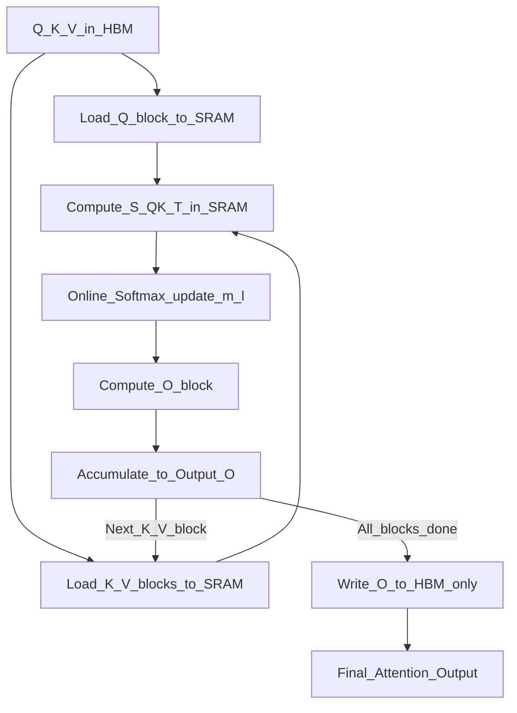

# 📄 Paper: FlashAttention — Fast and Memory-Efficient Exact Attention with IO-Awareness

> [!abstract] TL;DR — one sentence on what this paper introduced
> Dao et al. (2022) introduced FlashAttention, an IO-aware exact attention algorithm that avoids materialising the full attention matrix by tiling computations to fit in GPU SRAM — achieving 2–4× faster training and O(N) memory vs standard O(N²) with numerically identical outputs.

## Key Contribution — what was new, what it replaced

**What existed before**:
- Standard attention: compute and store the full $N \times N$ attention matrix in GPU HBM (high-bandwidth memory) — $O(N^2)$ memory, slow due to HBM bandwidth bottleneck
- Approximate attention: Linformer, Performer, Longformer — sub-quadratic but lose exact accuracy
- Memory-efficient attention (Rabe & Staats 2021): reduces memory but not faster

**What was replaced**: Standard PyTorch attention implementation (which materialises the full attention matrix).

**What was new**:
1. **IO-awareness**: frames attention as a memory bandwidth problem, not a compute problem — the bottleneck is HBM reads/writes, not FLOPs
2. **Tiling**: splits Q, K, V into blocks and processes them in SRAM (fast, small), computing the attention output in a single fused kernel — never writes the full attention matrix to HBM
3. **Online softmax**: computes softmax incrementally as blocks are processed, without needing the full row at once
4. **Exact output**: identical to standard attention — not an approximation
5. **Recomputation in backward pass**: doesn't store attention weights for backward; recomputes them from Q, K, V — trades compute for memory

## Core Idea (in plain English)

Modern GPUs have two levels of memory:
- **HBM (High Bandwidth Memory)**: large (40–80GB), but slow to access (bandwidth ~900 GB/s)
- **SRAM (on-chip memory)**: tiny (~20MB on A100), but extremely fast (~19 TB/s)

Standard attention writes and reads the entire $N \times N$ attention matrix to/from HBM. For $N = 4096$, that's 16M floats = 64MB per head, per layer, per forward pass. The GPU is spending most of its time waiting for data to transfer, not computing.

FlashAttention's insight: **process attention in tiles small enough to fit in SRAM**. Compute the full attention output block by block, never writing intermediate attention weights to HBM. More recomputation during backward, but dramatically fewer HBM accesses → faster and uses less memory.

It's like the difference between working with a document by printing every page to disk (slow HBM writes) vs keeping your working set on your desk (fast SRAM).

## The Math

**Standard attention IO complexity**:
- Forward pass: write $N \times N$ attention matrix $S = QK^T / \sqrt{d}$ to HBM → $O(N^2)$ memory reads/writes
- Backward pass: load $O(N^2)$ stored attention weights from HBM

**FlashAttention IO complexity** (with block size $B_c, B_r$):
$$\text{HBM accesses} = O\!\left(\frac{N^2 d^2}{M}\right)$$
where $M$ is SRAM size, $d$ is head dimension. For $M \gg d^2$, this is $O(N \cdot d)$ — much less than $O(N^2)$.

**Online softmax trick**: softmax must normalise over the full row, but FlashAttention processes blocks. Use the log-sum-exp trick to accumulate the running maximum $m$ and normalisation constant $\ell$:

For block $j$ with scores $S_j = Q_i K_j^T / \sqrt{d}$:
$$m_j^{(\text{new})} = \max(m_j^{(\text{old})},\; \text{rowmax}(S_j))$$
$$\ell_j^{(\text{new})} = e^{m_j^{(\text{old})} - m_j^{(\text{new})}} \ell_j^{(\text{old})} + \text{rowsum}\!\left(e^{S_j - m_j^{(\text{new})}}\right)$$
$$O_j^{(\text{new})} = \frac{e^{m_j^{(\text{old})} - m_j^{(\text{new})}} O_j^{(\text{old})} + e^{S_j - m_j^{(\text{new})}} V_j}{\ell_j^{(\text{new})}}$$

At the end, $O = O_T$ is the correct softmax-weighted sum.

**Memory comparison**:

| Method | Memory | Speed | Exact? |
|---|---|---|---|
| Standard attention | $O(N^2)$ | Baseline | Yes |
| FlashAttention | $O(N \cdot d)$ | 2–4× faster | Yes |
| FlashAttention-2 | $O(N \cdot d)$ | 5–9× faster | Yes |
| Sparse attention | $O(N \cdot s)$ | Faster | No (approximate) |

## Architecture / Algorithm



**Key operations never written to HBM**:
- Attention weight matrix $P = \text{softmax}(QK^T/\sqrt{d})$ — $O(N^2)$ elements
- Score matrix $S = QK^T/\sqrt{d}$ — $O(N^2)$ elements

**Only written to HBM**: output $O$ ($O(Nd)$) and the softmax statistics $(m, \ell)$ ($O(N)$) needed for the backward pass.

## Code Demo

```python
# FlashAttention is already integrated into modern frameworks
# pip install flash-attn (for the custom CUDA kernel)
# Or use HuggingFace transformers with attn_implementation="flash_attention_2"

import torch
from transformers import AutoModelForCausalLM, AutoTokenizer

# ===== 1. Enable FlashAttention-2 in HuggingFace =====
model = AutoModelForCausalLM.from_pretrained(
    "meta-llama/Llama-3.2-1B",
    torch_dtype=torch.float16,
    attn_implementation="flash_attention_2",   # key flag
    device_map="auto",
)
tokenizer = AutoTokenizer.from_pretrained("meta-llama/Llama-3.2-1B")

inputs = tokenizer("FlashAttention enables long context: ", return_tensors="pt").to("cuda")
outputs = model.generate(**inputs, max_new_tokens=50)
print(tokenizer.decode(outputs[0]))

# ===== 2. Direct flash_attn usage =====
# pip install flash-attn --no-build-isolation
try:
    from flash_attn import flash_attn_qkvpacked_func, flash_attn_func

    batch, seq_len, n_heads, head_dim = 2, 4096, 32, 128

    q = torch.randn(batch, seq_len, n_heads, head_dim, dtype=torch.float16, device="cuda")
    k = torch.randn(batch, seq_len, n_heads, head_dim, dtype=torch.float16, device="cuda")
    v = torch.randn(batch, seq_len, n_heads, head_dim, dtype=torch.float16, device="cuda")

    # FlashAttention-2 (causal masking = True for decoder)
    output = flash_attn_func(q, k, v, dropout_p=0.0, causal=True)
    print(f"FlashAttention output shape: {output.shape}")  # (2, 4096, 32, 128)

    # Verify numerically equivalent to standard attention
    import torch.nn.functional as F
    q_std = q.transpose(1, 2)  # (B, h, T, d)
    k_std = k.transpose(1, 2)
    v_std = v.transpose(1, 2)
    mask = torch.triu(torch.ones(seq_len, seq_len, device="cuda"), diagonal=1).bool()
    scores = torch.matmul(q_std, k_std.transpose(-2, -1)) / (head_dim ** 0.5)
    scores.masked_fill_(mask.unsqueeze(0).unsqueeze(0), float("-inf"))
    std_output = torch.matmul(F.softmax(scores, dim=-1), v_std).transpose(1, 2)

    max_diff = (output.float() - std_output.float()).abs().max().item()
    print(f"Max difference from standard attention: {max_diff:.6f}")  # Should be < 1e-3

except ImportError:
    print("flash_attn not installed — requires CUDA GPU")

# ===== 3. Measure memory savings =====
def measure_attention_memory(seq_len: int, n_heads: int = 8, head_dim: int = 64,
                              batch: int = 2, use_flash: bool = False) -> float:
    """Estimate peak GPU memory for attention computation."""
    if torch.cuda.is_available():
        torch.cuda.empty_cache()
        torch.cuda.reset_peak_memory_stats()
        device = "cuda"
        q = torch.randn(batch, n_heads, seq_len, head_dim, dtype=torch.float16, device=device)
        k = torch.randn(batch, n_heads, seq_len, head_dim, dtype=torch.float16, device=device)
        v = torch.randn(batch, n_heads, seq_len, head_dim, dtype=torch.float16, device=device)

        if use_flash:
            from flash_attn import flash_attn_func
            q_ = q.transpose(1, 2)
            k_ = k.transpose(1, 2)
            v_ = v.transpose(1, 2)
            out = flash_attn_func(q_, k_, v_, causal=True)
        else:
            import torch.nn.functional as F
            out = F.scaled_dot_product_attention(q, k, v, is_causal=True)

        peak_mb = torch.cuda.max_memory_allocated() / 1e6
        return peak_mb
    return 0.0

# Standard attention scales quadratically; FlashAttention scales linearly
for seq in [512, 1024, 2048, 4096]:
    std_mem = 2 * seq**2 * 8 / 1e6  # Theoretical: 2*N^2*2bytes (fp16)
    flash_mem = 2 * seq * 128 * 8 / 1e6  # Theoretical: 2*N*d*2bytes
    print(f"seq={seq:5}: std ~{std_mem:.1f}MB/head, flash ~{flash_mem:.1f}MB/head")
```

## Impact — what it enabled, follow-on work, citation count

- **Citation count**: 3,000+
- **Long-context LLMs**: FlashAttention is the enabling technology for 8K, 32K, 128K, 1M token contexts — without it, the memory cost is prohibitive
- **FlashAttention-2 (2023)**: improved parallelism, fewer non-matmul FLOPs — 5–9× speedup over standard attention
- **FlashAttention-3 (2024)**: async pipelining for H100 GPUs — further speedup
- **Standard in all major frameworks**: integrated into PyTorch (`F.scaled_dot_product_attention`), HuggingFace Transformers, vLLM, TensorRT-LLM
- **Training at scale**: GPT-4, LLaMA 2/3, Gemini, Claude 3 all trained with FlashAttention
- **Speculative decoding**: combined with PagedAttention (vLLM), enabled fast inference serving
- **Research acceleration**: faster attention means researchers can iterate faster on long-context experiments

## Limitations — what it doesn't solve, known issues

1. **Custom CUDA code**: FlashAttention requires a custom CUDA kernel — not available on CPUs or MPS (Apple Silicon) without fallbacks
2. **Head dimension constraints**: original FlashAttention required head_dim ≤ 128; FA-2 expanded this but still has constraints
3. **Still O(N²) compute**: FlashAttention is IO-optimal but still does $O(N^2)$ floating point operations — fundamental quadratic attention complexity remains
4. **Hardware specificity**: optimised for A100/H100; performance gains smaller on V100 or older hardware
5. **Variable-length sequences**: handling variable-length batches efficiently requires additional logic (FA-2 added packed variable-length support)

## Related Concepts

- [[_MOC_Key_Papers|↑ Section MOC]]

- [[Flash_Attention]] — concept note on FlashAttention and its role in long-context LLMs
- [[Attention_Mechanism]] — the algorithm FlashAttention implements more efficiently
- [[KV_Cache]] — key-value cache used in inference, works alongside FlashAttention

## Review Questions

1. **Standard attention is memory-bandwidth bound, not compute-bound. Explain what this means: what operation is the bottleneck, and why does tiling (FlashAttention's approach) solve it?**
2. **FlashAttention recomputes attention weights during the backward pass instead of storing them. Why is this trade-off (more compute, less memory) beneficial for training long sequences?**
3. **FlashAttention produces numerically identical outputs to standard attention. What mathematical technique (the online softmax trick) makes it possible to compute softmax incrementally across tiles without materialising the full attention matrix?**

## Citation

Dao, T., Fu, D. Y., Ermon, S., Rudra, A., & Ré, C. (2022). **FlashAttention: Fast and Memory-Efficient Exact Attention with IO-Awareness**. *Advances in Neural Information Processing Systems (NeurIPS)*, 35.
[https://arxiv.org/abs/2205.14135](https://arxiv.org/abs/2205.14135)

Dao, T. (2023). **FlashAttention-2: Faster Attention with Better Parallelism and Work Partitioning**. *ICLR 2024*.
[https://arxiv.org/abs/2307.08691](https://arxiv.org/abs/2307.08691)

#paper #flash-attention #attention #efficiency #transformers #2022
