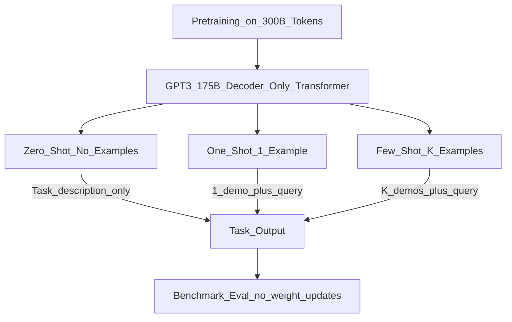

# 📄 Paper: Language Models are Few-Shot Learners (GPT-3)

> [!abstract] TL;DR — one sentence on what this paper introduced
> Brown et al. (2020) demonstrated that a 175B parameter language model (GPT-3) exhibits emergent few-shot learning — given just a few examples in the context window, it can perform new tasks without any gradient updates or fine-tuning.

## Key Contribution — what was new, what it replaced

**What existed before**:
- GPT-2 (2019, 1.5B params): impressive generation but required fine-tuning for specific tasks
- BERT-style models: excellent at NLP tasks but required task-specific fine-tuning with labelled data
- Few-shot learning in traditional ML: meta-learning approaches (MAML) that still required training

**What was replaced**: The assumption that task-specific labelled data and fine-tuning are required to adapt a pretrained model to a new task.

**What was new**:
1. **In-context learning (ICL)**: show a few input-output examples in the prompt; the model generalises to new examples without weight updates
2. **Scale enables emergence**: few-shot performance improved dramatically with model size (1.3B → 13B → 175B)
3. **Zero/one/few-shot evaluation framework**: evaluated tasks with 0, 1, or K examples in context — established the ICL evaluation paradigm
4. **Meta-learning from pretraining**: the model appears to develop the ability to learn from examples during pretraining on diverse text, not from any specialised meta-learning algorithm

## Core Idea (in plain English)

Imagine giving a test to two people. Person A has read a textbook on everything. Person B has read the same textbook AND done practice problems specific to the test topic. Person B usually does better — that's fine-tuning.

GPT-3's surprise: Person A (no fine-tuning) can do nearly as well if you just show them **a few example problems** at the start of the test. This is in-context learning — the examples don't change the model's weights, they just prime the model about the format and task.

Why does this work at scale? Because the model has seen so much diverse text during pretraining that it has implicitly learned patterns like: "here's an example of X followed by Y, then another X-like thing, so the answer must be Y-like."

## The Math

**Language Model Objective (standard, same as GPT-1/2):**
$$\mathcal{L} = -\sum_{t} \log P(x_t \mid x_{<t};\, \theta)$$

Maximise likelihood of next token given all previous tokens. No new training objective for few-shot — the emergent ability comes from scale.

**Few-shot prompting format:**

$$\text{Input} = [\underbrace{x_1^{(1)}, y_1^{(1)}, \ldots, x_K^{(1)}, y_K^{(1)}}_{\text{K in-context examples}}, x_\text{query}]$$

The model autoregressively generates $y_\text{query}$. No gradient updates — only forward passes.

**Scaling curve** (from the Kaplan et al. (2020) scaling laws that underpinned GPT-3):
$$\mathcal{L}(N) \approx \left(\frac{N_c}{N}\right)^{\alpha_N}, \quad \alpha_N \approx 0.076$$

where $N$ is number of parameters and $N_c$ is a constant. Loss decreases as a power law of model size.

## Architecture / Algorithm



**Architecture**: decoder-only Transformer (same as GPT-1/2) scaled up:
- 175B parameters (96 layers, 96 heads, $d_\text{model} = 12288$)
- 300B training tokens (Common Crawl, WebText, Books, Wikipedia)
- Context window: 2048 tokens
- Mixed-precision training (fp16) on V100 clusters

**No architectural novelty** — GPT-3 is GPT-2 architecture at 100× scale. The contribution is demonstrating what scale enables.

## Code Demo

```python
# GPT-3 style few-shot prompting
import openai

client = openai.OpenAI()

# ===== 1. Few-shot classification =====
FEW_SHOT_SENTIMENT_PROMPT = """\
Classify the sentiment of the following review as Positive or Negative.

Review: "The movie was absolutely fantastic, I loved every minute!"
Sentiment: Positive

Review: "Terrible service, would never come back."
Sentiment: Negative

Review: "The special effects were great but the plot was disappointing."
Sentiment: Negative

Review: "Best purchase I've made all year, highly recommend!"
Sentiment:"""

response = client.chat.completions.create(
    model="gpt-3.5-turbo",
    messages=[{"role": "user", "content": FEW_SHOT_SENTIMENT_PROMPT}],
    max_tokens=5,
    temperature=0,
)
print(f"Predicted sentiment: {response.choices[0].message.content.strip()}")

# ===== 2. Few-shot translation =====
FEW_SHOT_TRANSLATION = """\
Translate English to French.

English: Hello, how are you?
French: Bonjour, comment allez-vous?

English: The weather is beautiful today.
French: Le temps est magnifique aujourd'hui.

English: I would like to order a coffee.
French:"""

r = client.chat.completions.create(
    model="gpt-3.5-turbo",
    messages=[{"role": "user", "content": FEW_SHOT_TRANSLATION}],
    max_tokens=30,
    temperature=0,
)
print(f"Translation: {r.choices[0].message.content.strip()}")

# ===== 3. Chain-of-thought few-shot (Wei et al., builds on GPT-3 ICL) =====
COT_PROMPT = """\
Q: Roger has 5 tennis balls. He buys 2 more cans of tennis balls. Each can has 3 balls.
   How many tennis balls does he have now?
A: Roger started with 5 balls. 2 cans × 3 balls = 6 balls. 5 + 6 = 11. The answer is 11.

Q: A juggler can juggle 16 balls. Half of the balls are golf balls, and half of the golf balls are blue.
   How many blue golf balls are there?
A: Half of 16 = 8 golf balls. Half of 8 = 4 blue golf balls. The answer is 4.

Q: There are 15 trees in the grove. Grove workers will plant trees in the grove today.
   After they are done, there will be 21 trees. How many trees did the workers plant today?
A:"""

cot = client.chat.completions.create(
    model="gpt-3.5-turbo",
    messages=[{"role": "user", "content": COT_PROMPT}],
    max_tokens=60,
    temperature=0,
)
print(f"CoT answer: {cot.choices[0].message.content.strip()}")

# ===== 4. Measure how few-shot performance scales (conceptual) =====
def few_shot_accuracy(model_name, task_examples, test_cases, k_shots):
    """Evaluate few-shot accuracy for different k values."""
    results = {}
    for k in k_shots:
        context = "\n\n".join(f"Input: {e['input']}\nOutput: {e['output']}"
                              for e in task_examples[:k])
        correct = 0
        for test in test_cases:
            prompt = context + f"\n\nInput: {test['input']}\nOutput:"
            r = client.chat.completions.create(
                model=model_name,
                messages=[{"role": "user", "content": prompt}],
                max_tokens=10, temperature=0,
            )
            if test["expected"] in r.choices[0].message.content:
                correct += 1
        results[k] = correct / len(test_cases)
    return results
```

## Impact — what it enabled, follow-on work, citation count

- **Citation count**: 30,000+ (most cited AI paper in 2020)
- **Directly led to ChatGPT**: OpenAI's InstructGPT (2022) = GPT-3 + RLHF → became ChatGPT
- **Demonstrated emergent abilities**: tasks that were near-chance at small scale became suddenly possible at large scale — this "emergence" sparked enormous research and investment
- **Sparked the LLM race**: Google (PaLM, LaMDA), Meta (LLaMA), Anthropic (Claude), Cohere, AI21 all rapidly scaled to 100B+ parameter models
- **Codex (2021)**: GPT-3 fine-tuned on code → GitHub Copilot
- **Established ICL as a research area**: hundreds of papers studying why ICL works, how to improve prompts, chain-of-thought prompting
- **Changed AI product economics**: no task-specific training needed → API-first AI businesses became viable

## Limitations — what it doesn't solve, known issues

1. **Hallucination**: GPT-3 confidently generates plausible but false information — no factual grounding mechanism
2. **Context length**: 2048 tokens is short; can't include many examples or long documents
3. **Inconsistency**: same query with different phrasings gives very different answers — not reliable
4. **No alignment**: GPT-3 follows user intent including harmful requests (no safety training) — InstructGPT/ChatGPT addressed this
5. **ICL is sensitive to example order and format**: shuffling the few-shot examples can change accuracy by 20%+
6. **Not sample efficient**: despite few-shot learning, GPT-3 was trained on vastly more text than a human reads in a lifetime — the "few-shot" label is somewhat misleading

## Related Concepts

- [[_MOC_Key_Papers|↑ Section MOC]]

- [[GPT_Family]] — full GPT lineage from GPT-1 through GPT-4
- [[Scaling_Laws]] — the power-law scaling that predicted GPT-3's capabilities
- [[Transformer_Architecture]] — the decoder-only architecture GPT-3 uses

## Review Questions

1. **In-context learning provides examples in the prompt without updating model weights. Why does this work? Describe two competing hypotheses for the mechanism behind ICL.**
2. **GPT-3's few-shot performance was found to be highly sensitive to the order of examples in the prompt. What does this suggest about how the model processes in-context examples, and how would you mitigate this instability in a production system?**
3. **GPT-3 was described as exhibiting "emergent abilities" that appeared suddenly at scale. What is the counter-argument that emergence is an artefact of how performance is measured rather than a genuine phase transition?**

## Citation

Brown, T., Mann, B., Ryder, N., Subbiah, M., Kaplan, J., Dhariwal, P., ... & Amodei, D. (2020). **Language Models are Few-Shot Learners**. *Advances in Neural Information Processing Systems (NeurIPS)*, 33.
[https://arxiv.org/abs/2005.14165](https://arxiv.org/abs/2005.14165)

#paper #gpt3 #llm #few-shot #in-context-learning #scaling #2020
