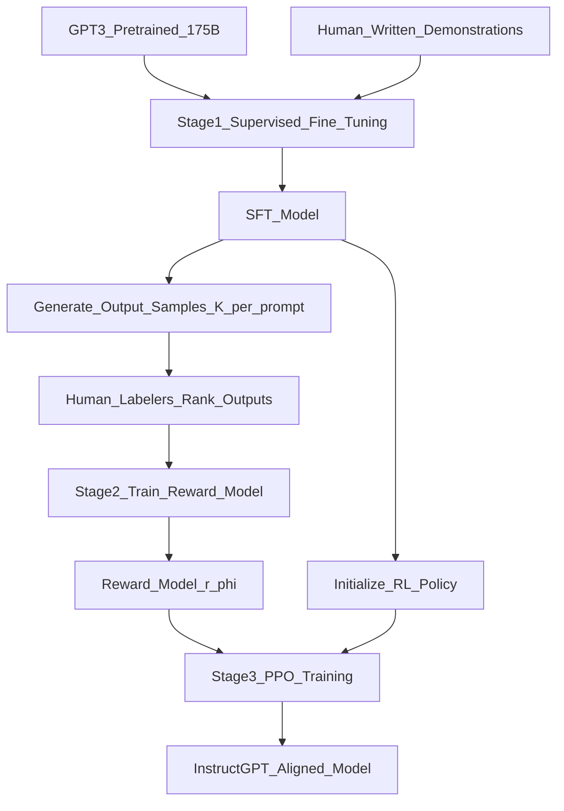

# 📄 Paper: Training Language Models to Follow Instructions with Human Feedback (InstructGPT)

> [!abstract] TL;DR — one sentence on what this paper introduced
> Ouyang et al. (2022) showed that reinforcement learning from human feedback (RLHF) — fine-tuning GPT-3 on human preferences via a reward model and PPO — produces a dramatically more helpful, honest, and harmless model that human raters preferred over the unaligned 175B model even when it had only 1.3B parameters.

## Key Contribution — what was new, what it replaced

**What existed before**:
- GPT-3: capable but often unhelpful, dishonest, or harmful without explicit alignment
- Constitutional AI: Anthropic's approach using model self-critique (parallel work)
- Fine-tuning on instructions: (FLAN, T0) improved instruction following but not alignment to human preferences

**What was replaced**: The assumption that scaling alone would make models aligned and helpful.

**What was new**:
1. **Three-stage RLHF pipeline**: SFT → reward model → PPO reinforcement learning
2. **Human preference labels** (not just annotations): labellers ranked model outputs by quality — training on preferences rather than gold labels
3. **Smaller model beats bigger unaligned one**: InstructGPT 1.3B preferred over GPT-3 175B by human raters
4. **Alignment tax quantification**: RLHF caused some regression on academic benchmarks (NLP benchmarks) — first systematic study of the alignment-capability trade-off
5. **Direct precursor to ChatGPT**: the same pipeline with GPT-3.5 produced ChatGPT

## Core Idea (in plain English)

A language model trained purely on internet text learns to predict what humans write — including toxic, biased, and harmful content. It doesn't learn to be helpful because "helpfulness" is not defined in the pretraining corpus.

InstructGPT's insight: **train the model to produce outputs that humans prefer**, not just to predict text. You can't write down "be helpful, honest, and harmless" as a loss function — but you can ask humans to rank pairs of outputs, learn a reward model from those rankings, and then optimise the language model to maximise the reward.

This is exactly how you'd train a junior employee: give them feedback ("this response was much better than that one") and let them learn from it, rather than writing an explicit rubric.

## The Math

**Stage 1 — Supervised Fine-Tuning (SFT):**

Collect human-written demonstrations of desired behaviour. Fine-tune GPT-3 on these:
$$\mathcal{L}_\text{SFT} = -\sum_t \log P(y_t \mid x, y_{<t};\, \theta)$$

**Stage 2 — Reward Model Training:**

Collect human preference labels: labellers rank $K$ model outputs $\{y_1, \ldots, y_K\}$ for a given prompt $x$.
For each pair $(y_w, y_l)$ where $y_w$ is preferred over $y_l$:
$$\mathcal{L}_\text{RM} = -\mathbb{E}_{(x, y_w, y_l)}\!\left[\log \sigma\!\left(r_\phi(x, y_w) - r_\phi(x, y_l)\right)\right]$$
where $r_\phi$ is the reward model (scalar-valued output).

**Stage 3 — PPO Reinforcement Learning:**

Optimise the SFT model to maximise reward, with a KL penalty to prevent reward hacking:
$$\mathcal{L}_\text{RL}(\theta) = \mathbb{E}_{(x, y) \sim \pi_\theta}\!\left[r_\phi(x, y)\right] - \beta \cdot D_\text{KL}\!\left(\pi_\theta(\cdot \mid x) \,\|\, \pi_\text{SFT}(\cdot \mid x)\right) + \gamma \mathcal{L}_\text{pretrain}(\theta)$$

where:
- $\pi_\theta$ is the current RL policy (language model)
- $\pi_\text{SFT}$ is the SFT model (frozen reference)
- $\beta$ controls the strength of the KL penalty (prevents drifting too far from SFT)
- $\gamma \mathcal{L}_\text{pretrain}$ is a pretraining gradient mix-in to reduce alignment tax

**PPO update rule** (Schulman et al. 2017):
$$\mathcal{L}_\text{PPO}(\theta) = \mathbb{E}\!\left[\min\!\left(\frac{\pi_\theta(a|s)}{\pi_{\theta_\text{old}}(a|s)} A, \text{clip}\!\left(\frac{\pi_\theta(a|s)}{\pi_{\theta_\text{old}}(a|s)}, 1-\epsilon, 1+\epsilon\right) A\right)\right]$$

## Architecture / Algorithm



**Data collection**:
- 40 labellers (contractors) hired to write demonstrations and rank outputs
- ~13K SFT training prompts with human demonstrations
- ~33K preference comparison pairs for reward model
- Labellers were specifically selected to agree with each other (inter-annotator agreement measured)

## Code Demo

```python
# pip install trl transformers torch accelerate peft

from trl import PPOTrainer, PPOConfig, AutoModelForCausalLMWithValueHead
from transformers import AutoTokenizer, AutoModelForSequenceClassification
import torch

# ===== 1. Three-stage RLHF sketch using TRL =====

BASE_MODEL = "meta-llama/Llama-3.2-1B"
tokenizer = AutoTokenizer.from_pretrained(BASE_MODEL)
tokenizer.pad_token = tokenizer.eos_token

# --- Stage 1: SFT (simplified — just load an SFT-trained model) ---
# In practice: use SFTTrainer from trl on instruction-following dataset
# from trl import SFTTrainer

# --- Stage 2: Train reward model ---
# Reward model = sequence classification model trained on preference pairs
# Architecture: language model + linear head outputting scalar reward

def train_reward_model_step(reward_model, preferred, rejected, optimizer):
    """Single step of reward model training from preference pairs."""
    r_preferred = reward_model(**preferred).logits[:, 0]   # scalar reward
    r_rejected  = reward_model(**rejected).logits[:, 0]
    loss = -torch.nn.functional.logsigmoid(r_preferred - r_rejected).mean()
    optimizer.zero_grad()
    loss.backward()
    optimizer.step()
    return loss.item()

# --- Stage 3: PPO with TRL ---
ppo_config = PPOConfig(
    model_name=BASE_MODEL,
    learning_rate=1.41e-5,
    batch_size=16,
    mini_batch_size=4,
    gradient_accumulation_steps=4,
    optimize_device_cache=True,
    log_with="tensorboard",
    kl_penalty="kl",           # KL divergence penalty against reference model
    init_kl_coef=0.2,          # β — KL coefficient
    adap_kl_ctrl=True,         # adaptive KL coefficient
    cliprange=0.2,             # PPO clip range ε
    vf_coef=0.1,
)

# Model with value head (for PPO advantage estimation)
model = AutoModelForCausalLMWithValueHead.from_pretrained(
    BASE_MODEL, torch_dtype=torch.float16
)

ppo_trainer = PPOTrainer(
    model=model,
    config=ppo_config,
    tokenizer=tokenizer,
)

# PPO training loop (simplified)
def ppo_training_step(ppo_trainer, reward_model, batch_prompts):
    # Tokenize prompts
    query_tensors = [tokenizer.encode(p, return_tensors="pt")[0] for p in batch_prompts]

    # Generate responses from current policy
    response_tensors = ppo_trainer.generate(
        query_tensors,
        max_new_tokens=256,
        do_sample=True,
        top_k=50,
        top_p=0.95,
        pad_token_id=tokenizer.eos_token_id,
    )

    # Decode and score with reward model
    responses = [tokenizer.decode(r, skip_special_tokens=True) for r in response_tensors]
    rewards = []
    for q, r in zip(batch_prompts, responses):
        inputs = tokenizer(q + r, return_tensors="pt", truncation=True, max_length=512)
        with torch.no_grad():
            reward = reward_model(**inputs).logits[0, 0].item()
        rewards.append(torch.tensor(reward))

    # PPO step
    stats = ppo_trainer.step(query_tensors, response_tensors, rewards)
    return stats

# ===== 2. DPO as a simpler RLHF alternative =====
from trl import DPOTrainer, DPOConfig

# DPO (Rafailov et al. 2023): no separate reward model, no PPO
# Directly trains on preference pairs with a contrastive loss
dpo_config = DPOConfig(
    output_dir="./dpo-model",
    beta=0.1,                  # equivalent to KL coefficient β
    learning_rate=5e-7,
    num_train_epochs=1,
    per_device_train_batch_size=2,
)

# dataset must have: {"prompt": ..., "chosen": ..., "rejected": ...}
# dpo_trainer = DPOTrainer(model=model_ref, args=dpo_config, train_dataset=dataset, tokenizer=tokenizer)
# dpo_trainer.train()
```

## Impact — what it enabled, follow-on work, citation count

- **Citation count**: 12,000+
- **ChatGPT (2022)**: directly used InstructGPT pipeline (GPT-3.5 + RLHF) — became the fastest-growing consumer product in history
- **Standard alignment technique**: every major aligned LLM (Claude, Gemini, LLaMA-chat, Mistral-instruct) uses RLHF or its derivatives
- **DPO (2023)**: Direct Preference Optimisation — equivalent objective to RLHF but without reward model or RL, just supervised fine-tuning on preference pairs. Now more popular than PPO.
- **RLAIF (Constitutional AI)**: Anthropic's Claude uses AI-generated feedback instead of human labellers
- **Reward hacking research**: models learn to exploit reward model weaknesses — active research area on overoptimisation
- **Alignment field growth**: InstructGPT demonstrated that alignment is tractable and important, galvanising the field

## Limitations — what it doesn't solve, known issues

1. **Reward hacking (overoptimisation)**: optimise the reward model too much and the model learns to game it — produce responses that score high but are subtly unhelpful
2. **Alignment tax**: RLHF causes some regression on standard NLP benchmarks — the model becomes more helpful but may lose some raw capability
3. **Labeller bias**: the reward model inherits the biases and preferences of 40 contractors. Different demographics of labellers could produce different alignments.
4. **Not truthfulness**: InstructGPT is more helpful but not necessarily more truthful — it can still confidently hallucinate. RLHF trains for human preference, not factual accuracy.
5. **PPO instability**: PPO is notoriously difficult to tune and training is unstable — DPO was partially motivated by avoiding this instability.

## Related Concepts

- [[_MOC_Key_Papers|↑ Section MOC]]

- [[RLHF]] — detailed concept note on reinforcement learning from human feedback
- [[DPO]] — direct preference optimisation, the cleaner modern alternative to RLHF PPO
- [[GPT_Family]] — GPT-3 and the InstructGPT lineage leading to ChatGPT

## Review Questions

1. **The KL penalty in the RLHF PPO objective prevents the policy from drifting too far from the SFT model. Why is this necessary? What failure mode does it prevent?**
2. **InstructGPT found that human raters preferred the 1.3B InstructGPT over 175B GPT-3. Does this mean RLHF "adds capability"? How should we interpret this result?**
3. **DPO (2023) achieves similar results to InstructGPT PPO without training a reward model or running RL. What is the key insight that makes this possible, and what trade-offs does DPO make?**

## Citation

Ouyang, L., Wu, J., Jiang, X., Almeida, D., Wainwright, C. L., Mishkin, P., ... & Lowe, R. (2022). **Training Language Models to Follow Instructions with Human Feedback**. *Advances in Neural Information Processing Systems (NeurIPS)*, 35.
[https://arxiv.org/abs/2203.02155](https://arxiv.org/abs/2203.02155)

#paper #rlhf #alignment #instructgpt #chatgpt #ppo #2022
