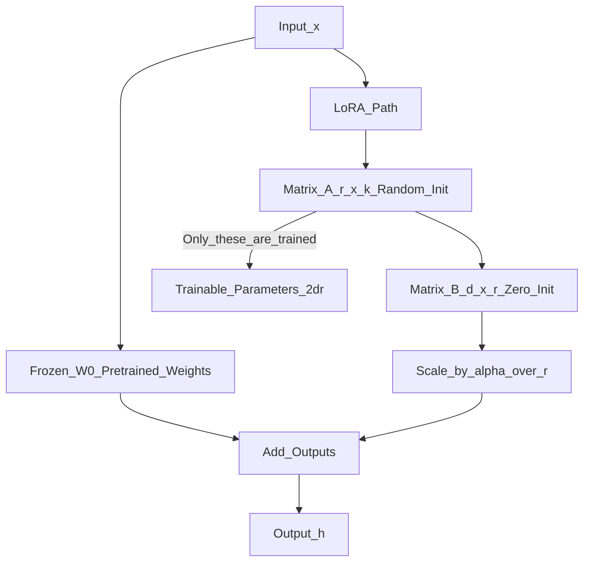

# 📄 Paper: LoRA — Low-Rank Adaptation of Large Language Models

> [!abstract] TL;DR — one sentence on what this paper introduced
> Hu et al. (2021) showed that weight updates during LLM fine-tuning have low intrinsic rank, enabling efficient adaptation by injecting trainable low-rank matrices into frozen weights — reducing trainable parameters by 10,000× while matching or exceeding full fine-tuning quality.

## Key Contribution — what was new, what it replaced

**What existed before**:
- Full fine-tuning: update all weights — infeasible for 7B+ parameter models on consumer hardware
- Adapter layers (Houlsby et al. 2019): add small bottleneck layers between transformer layers — adds inference latency
- Prefix tuning (Li & Liang 2021): prepend trainable vectors to keys and values — unstable to train, reduces effective context length

**What this paper replaced**: The need to store and update a full copy of all model weights for each task.

**What was new**:
1. **Low-rank hypothesis**: weight matrices $\Delta W$ learned during fine-tuning have low intrinsic rank — most information fits in a much smaller matrix
2. **Reparameterisation**: represent $\Delta W = BA$ where $B \in \mathbb{R}^{d \times r}$, $A \in \mathbb{R}^{r \times k}$, $r \ll \min(d, k)$
3. **No inference latency**: $W_0 + BA$ can be merged back into $W_0$ — zero overhead at inference
4. **Task switching**: keep $W_0$ frozen, swap $(B, A)$ matrices per task — store one base model + $N$ lightweight adapters

## Core Idea (in plain English)

When you fine-tune a large model on a new task, you're updating billions of weights. But most of that information is redundant — the update $\Delta W$ doesn't need a full $d \times k$ matrix to capture what changed.

This is like the difference between sending a full HD video file and sending just the differences between frames. Most of the model stays the same; only a small "diff" needs to be stored and trained.

LoRA exploits this: instead of training the full $\Delta W$ (millions of parameters), factor it as two smaller matrices $B$ and $A$ with rank $r$ (say, 8 or 16). The product $BA$ approximates $\Delta W$ with far fewer parameters, yet captures the essential direction of change.

## The Math

**Standard fine-tuning update:**
$$W' = W_0 + \Delta W$$
where $\Delta W \in \mathbb{R}^{d \times k}$ has $d \times k$ trainable parameters.

**LoRA reparameterisation:**
$$W' = W_0 + \Delta W = W_0 + BA$$
where:
- $W_0 \in \mathbb{R}^{d \times k}$ — frozen pretrained weights
- $B \in \mathbb{R}^{d \times r}$ — trainable, initialised to zeros
- $A \in \mathbb{R}^{r \times k}$ — trainable, initialised with random Gaussian
- $r \ll \min(d, k)$ — rank, typically $r \in \{4, 8, 16, 32, 64\}$

**Forward pass:**
$$h = W_0 x + \frac{\alpha}{r} BAx$$

where $\alpha$ is a scaling hyperparameter (typically $\alpha = r$ to start). The $\alpha/r$ scaling allows changing $r$ without retuning $\alpha$.

**Parameter savings** (for GPT-3 175B applied to attention matrices):
- Full fine-tuning: $2 \times d_\text{model}^2 = 2 \times 12288^2 \approx 300M$ per layer × 96 layers = 28.8B
- LoRA with $r=4$: $2 \times r \times d_\text{model} = 2 \times 4 \times 12288 = 98K$ per layer × 96 = 9.4M
- **Reduction: 3,000× fewer trainable parameters**

**Intrinsic rank justification**: the paper proves that over-parameterised models have low intrinsic dimensionality (Li et al. 2018) — the effective rank of $\Delta W$ is much smaller than $\min(d, k)$ in practice.

## Architecture / Algorithm



**Which weight matrices to apply LoRA to**: original paper applied to $W_q$ and $W_v$ in attention. Later work (and QLoRA) applies to all attention matrices ($W_q, W_k, W_v, W_o$) and sometimes FFN layers.

**Merging at inference**: $W_\text{merged} = W_0 + BA$ — simply add the low-rank product to frozen weights, no overhead.

## Code Demo

```python
# pip install peft transformers torch accelerate bitsandbytes

from transformers import AutoModelForCausalLM, AutoTokenizer, TrainingArguments
from peft import LoraConfig, get_peft_model, TaskType, PeftModel
from trl import SFTTrainer
from datasets import load_dataset
import torch

MODEL_NAME = "meta-llama/Llama-3.2-1B"  # or any HuggingFace model

# ===== 1. Apply LoRA to a language model =====
tokenizer = AutoTokenizer.from_pretrained(MODEL_NAME)
tokenizer.pad_token = tokenizer.eos_token

model = AutoModelForCausalLM.from_pretrained(
    MODEL_NAME, torch_dtype=torch.float16, device_map="auto"
)

lora_config = LoraConfig(
    task_type=TaskType.CAUSAL_LM,
    r=16,                          # rank — typically 4, 8, 16, 32, 64
    lora_alpha=32,                 # scaling factor α (usually 2×r)
    lora_dropout=0.1,
    target_modules=["q_proj", "k_proj", "v_proj", "o_proj"],  # which layers
    bias="none",                   # don't train biases
)

peft_model = get_peft_model(model, lora_config)
peft_model.print_trainable_parameters()
# Example output: trainable params: 3,407,872 || all params: 1,238,273,024 || trainable%: 0.275

# ===== 2. Fine-tune with LoRA using SFTTrainer =====
dataset = load_dataset("HuggingFaceH4/ultrachat_200k", split="train_sft[:1000]")

def format_instruction(example):
    return {"text": f"### Instruction:\n{example['prompt']}\n\n### Response:\n{example['completion']}"}

training_args = TrainingArguments(
    output_dir="./lora-finetuned",
    num_train_epochs=1,
    per_device_train_batch_size=4,
    gradient_accumulation_steps=4,
    learning_rate=2e-4,
    fp16=True,
    logging_steps=50,
    save_strategy="epoch",
)

trainer = SFTTrainer(
    model=peft_model,
    args=training_args,
    train_dataset=dataset,
    dataset_text_field="text",
    max_seq_length=512,
)
trainer.train()

# ===== 3. Save and load LoRA adapter =====
peft_model.save_pretrained("./lora-adapter")   # saves only LoRA weights (~10MB)

# Load base model + adapter later
base_model = AutoModelForCausalLM.from_pretrained(MODEL_NAME, torch_dtype=torch.float16)
loaded_model = PeftModel.from_pretrained(base_model, "./lora-adapter")

# ===== 4. Merge LoRA weights into base model (for inference) =====
merged_model = loaded_model.merge_and_unload()
# merged_model is now a standard model with W0 + BA merged — zero inference overhead
merged_model.save_pretrained("./merged-model")

# ===== 5. Inspect LoRA rank structure =====
def inspect_lora_modules(model):
    total_trainable = 0
    for name, module in model.named_modules():
        if hasattr(module, "lora_A"):
            r = module.lora_A.default.weight.shape[0]
            d, k = module.lora_B.default.weight.shape[0], module.lora_A.default.weight.shape[1]
            params = r * (d + k)
            total_trainable += params
            print(f"{name}: rank={r}, shape=({d}, {k}), LoRA params={params:,}")
    print(f"\nTotal LoRA parameters: {total_trainable:,}")

inspect_lora_modules(peft_model)
```

## Impact — what it enabled, follow-on work, citation count

- **Citation count**: 10,000+
- **Democratised LLM fine-tuning**: LoRA made it possible to fine-tune 7B–70B models on a single consumer GPU (24GB VRAM)
- **QLoRA (Dettmers et al. 2023)**: combines 4-bit NF4 quantisation + LoRA — enables fine-tuning 65B on a single A100 40GB, or 7B on a 10GB consumer GPU
- **Standard in PEFT library**: HuggingFace PEFT implements LoRA as the default fine-tuning method
- **Community fine-tuning**: enabled the open-source community to create thousands of specialised model adapters (code, medical, legal, conversational) shared on HuggingFace Hub
- **Multi-task adapters**: swap LoRA adapters at inference time to switch between tasks with no model re-loading
- **Variants**: DoRA (magnitude + direction), AdaLoRA (adaptive rank), rsLoRA (improved scaling), LoftQ (quantisation-aware LoRA initialisation)

## Limitations — what it doesn't solve, known issues

1. **Rank selection**: choosing $r$ is still a hyperparameter. Too small = underfitting; too large → diminishing returns. AdaLoRA adaptively sets rank per layer.
2. **Target module selection**: which weight matrices to apply LoRA to matters — applying to only $W_q, W_v$ (original paper) vs all attention matrices can differ by 2-5 points.
3. **Not always better than full fine-tuning**: on very data-rich fine-tuning tasks (millions of examples), full fine-tuning with sufficient VRAM can outperform LoRA.
4. **Catastrophic forgetting still possible**: LoRA reduces but doesn't eliminate forgetting of base model capabilities.
5. **Scaling rank diminishes returns**: above $r=64$ for most tasks, additional rank doesn't improve performance significantly.

## Related Concepts

- [[_MOC_Key_Papers|↑ Section MOC]]

- [[LoRA]] — concept note covering LoRA, QLoRA, and the full PEFT landscape
- [[QLoRA]] — 4-bit quantisation + LoRA for ultra-efficient fine-tuning
- [[PEFT]] — parameter-efficient fine-tuning methods overview

## Review Questions

1. **LoRA initialises B to all zeros and A with random Gaussian. Why is this specific initialisation important, and what would happen if both were initialised randomly?**
2. **At inference time, LoRA weights can be merged into the base model: W_merged = W0 + BA. What are the conditions under which you would NOT merge the weights, and why might keeping them separate be valuable?**
3. **LoRA applies low-rank updates to specific weight matrices. Why does it make theoretical sense that weight updates have low intrinsic rank? What property of pretrained LLMs supports this hypothesis?**

## Citation

Hu, E. J., Shen, Y., Wallis, P., Allen-Zhu, Z., Li, Y., Wang, S., Wang, L., & Chen, W. (2022). **LoRA: Low-Rank Adaptation of Large Language Models**. *International Conference on Learning Representations (ICLR) 2022*.
[https://arxiv.org/abs/2106.09685](https://arxiv.org/abs/2106.09685)

#paper #lora #peft #fine-tuning #low-rank #2021
