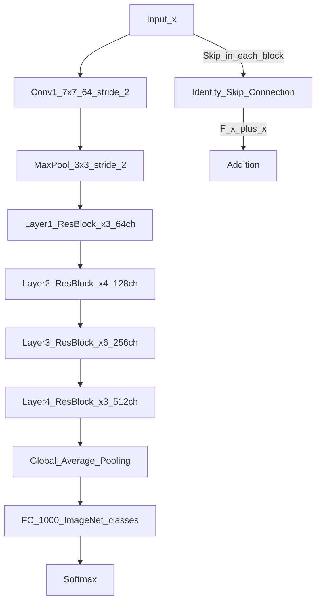

# 📄 Paper: Deep Residual Learning for Image Recognition (ResNet)

> [!abstract] TL;DR — one sentence on what this paper introduced
> He et al. (2015) introduced residual (skip) connections — $H(x) = F(x) + x$ — that solve the vanishing gradient problem, enabling training of 100–1000 layer networks and winning ImageNet 2015 by a wide margin.

## Key Contribution — what was new, what it replaced

**What existed before**:
- AlexNet (2012): 8 layers — started the deep learning era
- VGGNet (2014): 16–19 layers — deeper is better but gradient degradation limited depth
- GoogLeNet (2014): 22 layers via Inception modules — complex, hand-designed
- Observed problem: adding more layers made models WORSE (not just overfitting — training loss degraded too), contradicting the expectation that deeper = better

**What was replaced**: The assumption that extremely deep networks are untrainable due to vanishing/exploding gradients.

**What was new**:
1. **Residual (skip) connections**: $H(x) = F(x) + x$ — add the input directly to the output of a block
2. **Residual reformulation**: instead of learning $H(x)$, learn the residual $F(x) = H(x) - x$ — easier when optimal $F(x) \approx 0$
3. **Identity shortcut**: if $F(x)$ contributes nothing, the identity passes through — the network can always choose not to use extra layers
4. **Training 100+ layers**: ResNet-152 (152 layers) trained stably, outperforming all prior networks
5. **Won ImageNet 2015**: top-5 error of 3.57% (humans ~5.1%), winning with ~2× margin over 2nd place

## Core Idea (in plain English)

Before ResNets, adding more layers to a network would eventually hurt — not just overfitting, but even training error got worse. This is the "degradation problem": very deep networks are hard to optimise.

ResNet's fix: make it easy for the network to "do nothing." By adding the input directly to the output ($H(x) = F(x) + x$), the network only needs to learn the "change" ($F(x)$) rather than the full mapping. If the optimal mapping is close to identity, it's easier to push $F(x) \to 0$ than to push $H(x) \to x$.

Think of it like email edits: instead of rewriting a document from scratch (learning $H(x)$), you write only the changes ("track changes" — $F(x)$). The base document always comes through unchanged via the skip connection.

This skip connection also provides a **gradient highway**: during backpropagation, gradients can flow directly through the $+x$ path without being multiplied through layers, preventing vanishing gradients.

## The Math

**Standard layer** (no skip connection):
$$H(x) = \mathcal{F}(x)$$
Gradients: $\frac{\partial \mathcal{L}}{\partial x} = \frac{\partial \mathcal{L}}{\partial H} \cdot \frac{\partial H}{\partial x}$

For very deep networks: $\frac{\partial H_1}{\partial x} = \prod_{i=1}^L W_i$ — product of many weight matrices → vanishes to zero if $|W_i| < 1$.

**Residual block**:
$$H(x) = F(x, \{W_i\}) + x$$

Gradients: $\frac{\partial H}{\partial x} = \frac{\partial F}{\partial x} + 1$

The $+1$ (identity) term ensures gradients never vanish completely — the identity path always carries a gradient of 1, regardless of depth.

**Residual block formulation** (basic, used in ResNet-18/34):
$$H(x) = \text{ReLU}(\text{BN}(W_2 \cdot \text{ReLU}(\text{BN}(W_1 x))) + x)$$
Two $3 \times 3$ conv layers with batch normalisation.

**Bottleneck block** (used in ResNet-50/101/152, more efficient):
$$H(x) = \text{ReLU}(\text{BN}(W_3 \cdot \text{ReLU}(\text{BN}(W_2 \cdot \text{ReLU}(\text{BN}(W_1 x)))) + W_s x))$$
$1 \times 1$ conv (reduce channels) → $3 \times 3$ conv → $1 \times 1$ conv (restore channels), with $1 \times 1$ projection shortcut $W_s$ when dimensions change.

**Identity vs projection shortcut**:
- When dimensions match: $H(x) = F(x) + x$ (identity shortcut)
- When dimensions change (stride 2 or channel increase): $H(x) = F(x) + W_s x$ where $W_s$ is a $1 \times 1$ conv to match dimensions

## Architecture / Algorithm



**ResNet variants**:
| Model | Layers | Params | ImageNet Top-1 |
|---|---|---|---|
| ResNet-18 | 18 | 11M | 69.8% |
| ResNet-34 | 34 | 21M | 73.3% |
| ResNet-50 | 50 | 25M | 76.1% |
| ResNet-101 | 101 | 44M | 77.4% |
| ResNet-152 | 152 | 60M | 78.3% |

## Code Demo

```python
import torch
import torch.nn as nn
import torchvision.models as models

# ===== 1. Implement a basic ResNet block from scratch =====
class BasicBlock(nn.Module):
    """Basic residual block (for ResNet-18 and ResNet-34)."""
    expansion = 1

    def __init__(self, in_channels: int, out_channels: int, stride: int = 1):
        super().__init__()
        self.conv1 = nn.Conv2d(in_channels, out_channels, 3, stride=stride, padding=1, bias=False)
        self.bn1   = nn.BatchNorm2d(out_channels)
        self.conv2 = nn.Conv2d(out_channels, out_channels, 3, stride=1, padding=1, bias=False)
        self.bn2   = nn.BatchNorm2d(out_channels)
        self.relu  = nn.ReLU(inplace=True)

        # Projection shortcut: needed when dimensions change
        self.shortcut = nn.Identity()
        if stride != 1 or in_channels != out_channels:
            self.shortcut = nn.Sequential(
                nn.Conv2d(in_channels, out_channels, 1, stride=stride, bias=False),
                nn.BatchNorm2d(out_channels),
            )

    def forward(self, x: torch.Tensor) -> torch.Tensor:
        out = self.relu(self.bn1(self.conv1(x)))   # F(x): conv → bn → relu
        out = self.bn2(self.conv2(out))             # conv → bn (no relu yet)
        out = out + self.shortcut(x)               # F(x) + x (skip connection)
        return self.relu(out)                       # relu after addition

class BottleneckBlock(nn.Module):
    """Bottleneck block (for ResNet-50, 101, 152) — 3 layers, 4× more efficient."""
    expansion = 4

    def __init__(self, in_channels: int, out_channels: int, stride: int = 1):
        super().__init__()
        self.conv1 = nn.Conv2d(in_channels, out_channels, 1, bias=False)       # 1x1
        self.bn1   = nn.BatchNorm2d(out_channels)
        self.conv2 = nn.Conv2d(out_channels, out_channels, 3, stride=stride, padding=1, bias=False)  # 3x3
        self.bn2   = nn.BatchNorm2d(out_channels)
        self.conv3 = nn.Conv2d(out_channels, out_channels * 4, 1, bias=False)  # 1x1 expand
        self.bn3   = nn.BatchNorm2d(out_channels * 4)
        self.relu  = nn.ReLU(inplace=True)

        self.shortcut = nn.Identity()
        if stride != 1 or in_channels != out_channels * 4:
            self.shortcut = nn.Sequential(
                nn.Conv2d(in_channels, out_channels * 4, 1, stride=stride, bias=False),
                nn.BatchNorm2d(out_channels * 4),
            )

    def forward(self, x: torch.Tensor) -> torch.Tensor:
        out = self.relu(self.bn1(self.conv1(x)))   # 1x1 reduce
        out = self.relu(self.bn2(self.conv2(out))) # 3x3 conv
        out = self.bn3(self.conv3(out))            # 1x1 expand (no relu yet)
        out = out + self.shortcut(x)              # F(x) + x
        return self.relu(out)

# ===== 2. Gradient flow visualisation: skip vs no-skip =====
def check_gradient_flow(model: nn.Module, x: torch.Tensor) -> dict:
    """Measure gradient magnitudes through the network."""
    x.requires_grad_(True)
    output = model(x).mean()
    output.backward()

    grad_norms = {}
    for name, param in model.named_parameters():
        if param.grad is not None:
            grad_norms[name] = param.grad.norm().item()
    return grad_norms

# ===== 3. Use pretrained ResNet =====
resnet50 = models.resnet50(weights=models.ResNet50_Weights.DEFAULT)
resnet50.eval()

# Transfer learning: replace final FC layer
import torch.nn.functional as F

num_classes = 10
resnet50_custom = models.resnet50(weights=models.ResNet50_Weights.DEFAULT)
resnet50_custom.fc = nn.Linear(2048, num_classes)  # 2048 = ResNet-50 output features

# Freeze all but FC layer (linear probe)
for param in resnet50_custom.parameters():
    param.requires_grad = False
for param in resnet50_custom.fc.parameters():
    param.requires_grad = True

print(f"Trainable parameters: {sum(p.numel() for p in resnet50_custom.parameters() if p.requires_grad):,}")

# Feature extraction
def extract_features(model: nn.Module, images: torch.Tensor) -> torch.Tensor:
    """Extract 2048-d ResNet-50 features without FC layer."""
    model.eval()
    with torch.no_grad():
        x = model.conv1(images)
        x = model.bn1(x); x = model.relu(x); x = model.maxpool(x)
        x = model.layer1(x); x = model.layer2(x)
        x = model.layer3(x); x = model.layer4(x)
        x = model.avgpool(x)
        return torch.flatten(x, 1)   # (B, 2048)

fake_image = torch.randn(4, 3, 224, 224)
features   = extract_features(resnet50, fake_image)
print(f"ResNet-50 features shape: {features.shape}")  # (4, 2048)

# ===== 4. Quick sanity check on a residual block =====
block = BasicBlock(64, 64)
x     = torch.randn(2, 64, 56, 56)
out   = block(x)
print(f"BasicBlock output: {out.shape}")  # (2, 64, 56, 56)

block_down = BasicBlock(64, 128, stride=2)
out_down   = block_down(x)
print(f"BasicBlock (stride 2): {out_down.shape}")  # (2, 128, 28, 28)
```

## Impact — what it enabled, follow-on work, citation count

- **Citation count**: 100,000+ (most cited computer science paper ever as of 2024)
- **Won ILSVRC 2015**: top-5 error 3.57% — first superhuman performance on ImageNet
- **Residuals everywhere**: skip connections are now standard in virtually every deep architecture — transformers use them (post-attention residual, post-FFN residual), U-Nets for segmentation/diffusion, DenseNet (dense connections), etc.
- **ResNet-50 as the "standard baseline"**: still used as the default backbone for detection (Faster R-CNN), segmentation (Mask R-CNN), and many vision tasks
- **Pre-activation ResNet**: He et al. (2016) improved ordering to BN → ReLU → Conv → BN → ReLU → Conv — better gradient flow
- **ResNeXt**: grouped convolutions + skip connections — more efficient
- **Wide ResNet**: wider rather than deeper — fewer layers, better accuracy
- **Vision Transformer (ViT) still uses skip connections**: attention + skip, FFN + skip at every layer
- **Stable Diffusion U-Net**: residual blocks throughout

## Limitations — what it doesn't solve, known issues

1. **Computational cost scales with depth**: ResNet-152 is 2.5× slower than ResNet-50 for modest gain — diminishing returns on depth
2. **Not optimal for small datasets**: residual networks can overfit on small datasets without regularisation; VGG-style architectures sometimes work better with limited data
3. **Batch normalisation dependency**: ResNets rely heavily on batch normalisation which causes issues with small batch sizes (replaced by Group Norm or Layer Norm in detection/video models)
4. **Still uses global average pooling before classification**: loses spatial information — ViTs and hybrid approaches address this
5. **Convolutional inductive biases**: ResNets have translation equivariance baked in (from convolutions) but lack global context that transformers provide — ViT outperforms on very large datasets

## Related Concepts

- [[_MOC_Key_Papers|↑ Section MOC]]

- [[Famous_CNN_Architectures]] — AlexNet, VGG, Inception, ResNet, EfficientNet lineage
- [[Backpropagation]] — the vanishing gradient problem that residual connections solve
- [[CNN_Fundamentals]] — convolutional layers that ResNet blocks are built from

## Review Questions

1. **ResNet's key insight is that it's easier to learn $F(x) = H(x) - x$ than $H(x)$ directly. Under what conditions is this hypothesis valid, and can you construct a case where the residual formulation would NOT help?**
2. **The skip connection provides a "gradient highway" during backpropagation. Write the backpropagation equation for a residual block and show how the $+1$ term prevents gradient vanishing, even in a 100-layer network.**
3. **ResNet won ImageNet 2015 with a 152-layer network. Modern Vision Transformers (ViT-Large) achieve higher accuracy with 24 layers. What architectural advantage of transformers makes fewer-but-wider layers more competitive than deep-but-narrow ResNets?**

## Citation

He, K., Zhang, X., Ren, S., & Sun, J. (2016). **Deep Residual Learning for Image Recognition**. *IEEE Conference on Computer Vision and Pattern Recognition (CVPR) 2016*. (Winner: ImageNet 2015.)
[https://arxiv.org/abs/1512.03385](https://arxiv.org/abs/1512.03385)

#paper #resnet #cnn #computer-vision #residual-connections #skip-connections #2015
