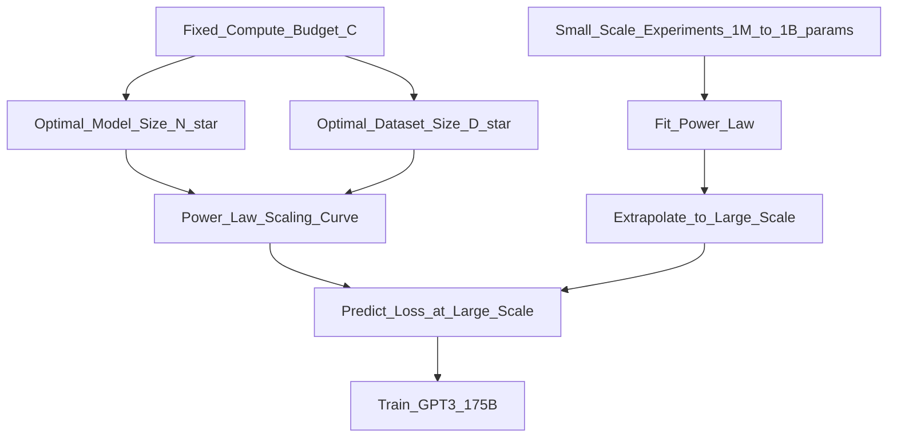

# 📄 Paper: Scaling Laws for Neural Language Models

> [!abstract] TL;DR — one sentence on what this paper introduced
> Kaplan et al. (2020) quantified how language model cross-entropy loss decreases as a smooth power law with model parameters (N), dataset size (D), and compute (C), and derived the optimal allocation: given a fixed compute budget, scale model size and data together but prioritise model size.

## Key Contribution — what was new, what it replaced

**What existed before**: Training decisions (how many parameters? how much data? how long to train?) were made largely by intuition or grid search. No principled framework existed.

**What was replaced**: Ad-hoc decisions about model scale.

**What was new**:
1. **Power-law scaling**: loss as a function of N, D, or C follows precise power laws — not logarithmic, not linear
2. **Compute-optimal frontier**: for any compute budget $C$, there is an optimal $(N^*, D^*)$ pair
3. **Early empirical finding**: given fixed $C$, it's more efficient to train a large model on fewer tokens than a small model on more tokens (later revised by Chinchilla)
4. **Performance predictability**: you can predict the test loss of a large model by extrapolating small-model scaling curves — no need to train the full model to know if it's worth it

## Core Idea (in plain English)

How much better does your language model get if you double the training compute? Kaplan et al. ran hundreds of experiments at different scales and found:

**If you have 10× more compute:**
- Using it to make the model 10× bigger → big improvement
- Using it to train 10× longer (same model) → smaller improvement

So the recipe is: **always make the model bigger first**. This was the insight that justified training GPT-3 with 175B parameters.

Think of it like this: a bigger book (more parameters) retains more knowledge than a smaller book read multiple times. The optimal strategy is to make the book as big as possible, then read it as much as the compute budget allows.

(Note: Chinchilla later revised this — the optimal is more balanced than Kaplan suggested.)

## The Math

**Loss as a power law of model parameters N (with sufficient data):**
$$L(N) = \left(\frac{N_c}{N}\right)^{\alpha_N}, \quad \alpha_N \approx 0.076, \quad N_c \approx 8.8 \times 10^{13}$$

**Loss as a power law of dataset size D (with sufficiently large model):**
$$L(D) = \left(\frac{D_c}{D}\right)^{\alpha_D}, \quad \alpha_D \approx 0.095, \quad D_c \approx 5.4 \times 10^{13}$$

**Loss as a power law of compute C:**
$$L(C) \approx \left(\frac{C_c}{C}\right)^{\alpha_C}, \quad \alpha_C \approx 0.050$$

where $C$ is measured in FLOPs and $C \approx 6ND$ (6 FLOPs per parameter per token for training).

**Compute-optimal N and D for budget C:**
$$N^* \propto C^{0.73}, \quad D^* \propto C^{0.27}$$

This implies: **spend ~73% of compute budget on model size, only 27% on data** — the controversial finding later challenged by Chinchilla.

**Combined loss formula (both N and D finite):**
$$L(N, D) \approx \left[\left(\frac{N_c}{N}\right)^{\frac{\alpha_N}{\alpha_D}} + \frac{D_c}{D}\right]^{\alpha_D}$$

## Architecture / Algorithm



**Experimental setup**:
- Trained 75+ language models ranging from 10^3 to 10^9 parameters
- Varied: model size, dataset size, training tokens, batch size, architecture (depth vs width)
- Found: architecture details (depth vs width) matter much less than total parameter count
- Used: transformer decoder on WebText2 (~22B tokens)

**Key additional findings**:
- **Batch size**: optimal batch size scales as $B \propto L^{-1/\alpha_B}$ — train with small batches early, large batches late
- **Shape**: within the same parameter count, depth vs width matters less than N (within a reasonable range)
- **Irreducible loss**: there is an asymptote — even infinite compute has a floor from irreducible entropy in the data

## Code Demo

```python
import numpy as np
import matplotlib.pyplot as plt

# ===== Power law scaling calculator =====

# Kaplan et al. constants (approximate)
ALPHA_N = 0.076
N_C     = 8.8e13   # parameters

ALPHA_D = 0.095
D_C     = 5.4e13   # tokens

def loss_from_params(N: float) -> float:
    """Predicted cross-entropy loss from model size (assuming infinite data)."""
    return (N_C / N) ** ALPHA_N

def loss_from_data(D: float) -> float:
    """Predicted cross-entropy loss from dataset size (assuming infinite model)."""
    return (D_C / D) ** ALPHA_D

# ===== Compute-optimal frontier =====
def optimal_N_D(C: float, flops_per_param_per_token: float = 6.0):
    """
    Given compute budget C (FLOPs), return optimal N and D.
    Kaplan: N* proportional to C^0.73, D* proportional to C^0.27
    """
    N_star = (C / flops_per_param_per_token) ** 0.73
    D_star = C / (flops_per_param_per_token * N_star)
    return N_star, D_star

# Compare different scales
compute_budgets = {
    "1B params, 10B tokens":  6 * 1e9  * 10e9,
    "13B params, 40B tokens": 6 * 13e9 * 40e9,
    "175B params, 300B tokens": 6 * 175e9 * 300e9,  # GPT-3
}

print("Compute-optimal allocations (Kaplan et al.):")
print(f"{'Scenario':<35} {'N* (B params)':<20} {'D* (B tokens)'}")
for name, C in compute_budgets.items():
    N_star, D_star = optimal_N_D(C)
    print(f"{name:<35} {N_star/1e9:>15.1f}    {D_star/1e9:>12.1f}")

# ===== Scaling curve visualisation =====
fig, axes = plt.subplots(1, 2, figsize=(12, 5))

# Loss vs model size
N_values = np.logspace(6, 11, 100)
losses_N = [loss_from_params(N) for N in N_values]
axes[0].loglog(N_values, losses_N, 'b-', linewidth=2)
axes[0].set_xlabel("Model Parameters (N)")
axes[0].set_ylabel("Cross-Entropy Loss")
axes[0].set_title(f"Loss ∝ N^(-{ALPHA_N})")
axes[0].grid(True, alpha=0.3)

# Loss vs dataset size
D_values = np.logspace(8, 13, 100)
losses_D = [loss_from_data(D) for D in D_values]
axes[1].loglog(D_values, losses_D, 'r-', linewidth=2)
axes[1].set_xlabel("Training Tokens (D)")
axes[1].set_ylabel("Cross-Entropy Loss")
axes[1].set_title(f"Loss ∝ D^(-{ALPHA_D})")
axes[1].grid(True, alpha=0.3)

plt.tight_layout()
plt.savefig("scaling_laws.png", dpi=150)

# ===== Chinchilla correction (Hoffmann et al. 2022) =====
# Chinchilla found: N* ∝ C^0.49, D* ∝ C^0.51 (balanced)
def chinchilla_optimal_N_D(C: float, flops_per_param_per_token: float = 6.0):
    N_star = (C / flops_per_param_per_token) ** 0.49
    D_star = C / (flops_per_param_per_token * N_star)
    return N_star, D_star

print("\nChinchilla-optimal allocations (Hoffmann et al.):")
for name, C in compute_budgets.items():
    N_star, D_star = chinchilla_optimal_N_D(C)
    print(f"{name:<35} {N_star/1e9:>15.1f}    {D_star/1e9:>12.1f}")
```

## Impact — what it enabled, follow-on work, citation count

- **Citation count**: 4,000+
- **GPT-3 design**: the paper's compute-optimal formula directly justified training GPT-3 at 175B rather than training a smaller model longer
- **Established "scaling hypothesis"**: convinced OpenAI, Google, and others that simply scaling transformers would yield continued improvements — drove the LLM investment wave
- **Chinchilla paper (2022)**: DeepMind re-ran scaling experiments with more care and found Kaplan underestimated data — optimal is more balanced (see [[Chinchilla_Paper]])
- **LLaMA design**: Meta used Chinchilla's corrected scaling laws to train LLaMA-1 (7B on 1T tokens instead of 175B on 300B tokens)
- **Scaling hypotheses research area**: sparked hundreds of papers on scaling for reasoning, code, multimodal models

## Limitations — what it doesn't solve, known issues

1. **Overtrained models more useful at inference**: compute-optimal training minimises loss, but for deployment, inference cost matters — training a smaller model on more data (like LLaMA) may be better for users despite not being "compute-optimal"
2. **Chinchilla correction**: Kaplan overestimated the parameter exponent relative to data. True optimal is more equal scaling (see [[Chinchilla_Paper]])
3. **Task-specific scaling**: scaling laws for cross-entropy loss don't directly predict performance on specific tasks (especially emergent ones — tasks can be near-chance and then suddenly jump)
4. **Architecture generalisation**: laws derived for transformer decoders — may not apply to other architectures (MoE models, state-space models have different scaling properties)
5. **Quality of data**: these laws assume data quality is fixed. Chinchilla and subsequent work showed data quality matters as much as quantity

## Related Concepts

- [[_MOC_Key_Papers|↑ Section MOC]]

- [[Scaling_Laws]] — concept note on scaling laws and their implications
- [[Pretraining]] — how LLMs are pretrained, what compute is needed
- [[LLM_Architecture_Deep_Dive]] — architectural details of decoder-only transformers

## Review Questions

1. **The scaling law $L(N) \propto N^{-0.076}$ has a very small exponent. What does this small exponent mean practically about how much you need to scale to get meaningful improvements in loss?**
2. **Kaplan et al. recommended prioritising model size over data (N* ∝ C^0.73). Chinchilla revised this to a more balanced allocation. What methodological difference in the experiments led to the different conclusions?**
3. **Scaling laws measure cross-entropy loss. Why might a model with lower loss not necessarily perform better on a specific benchmark task? Give an example where the two could diverge.**

## Citation

Kaplan, J., McCandlish, S., Henighan, T., Brown, T. B., Chess, B., Child, R., ... & Amodei, D. (2020). **Scaling Laws for Neural Language Models**. *arXiv preprint arXiv:2001.08361*.
[https://arxiv.org/abs/2001.08361](https://arxiv.org/abs/2001.08361)

#paper #scaling-laws #llm #pretraining #compute-optimal #2020
