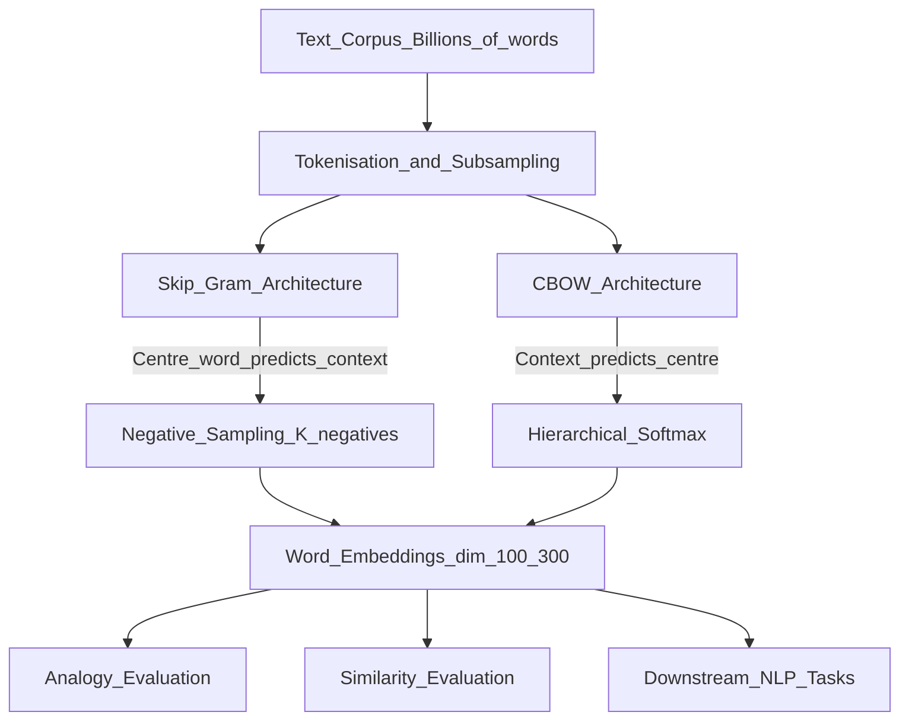

# 📄 Paper: Efficient Estimation of Word Representations in Vector Space (Word2Vec)

> [!abstract] TL;DR — one sentence on what this paper introduced
> Mikolov et al. (2013) introduced Word2Vec — two neural architectures (Skip-gram and CBOW) that efficiently learn dense word embeddings capturing semantic and syntactic relationships, enabling the famous "king − man + woman = queen" analogy arithmetic.

## Key Contribution — what was new, what it replaced

**What existed before**:
- One-hot encodings: no semantic information, dimension = vocabulary size (millions)
- LSA / SVD on co-occurrence matrices: slow, did not capture complex relationships well
- Neural language models (Bengio 2003): learned embeddings but too slow for large corpora
- N-gram language models: could not capture semantic similarity

**What was replaced**: Sparse, high-dimensional word representations with no notion of semantic similarity.

**What was new**:
1. **Computationally efficient**: training on billions of words in hours on a single machine (vs days/weeks for prior neural LMs)
2. **Negative sampling**: approximation for the softmax denominator — made Skip-gram practical at scale
3. **Hierarchical softmax**: tree-based approximation for even faster training
4. **Semantic analogies**: embeddings capture syntactic and semantic analogies via vector arithmetic
5. **Skip-gram and CBOW**: two architectures for different trade-offs

## Core Idea (in plain English)

"You shall know a word by the company it keeps." — J.R. Firth (1957)

The idea: a word's meaning can be inferred from its context. "Dog" appears near "bark", "fetch", "leash" — similar words appear in similar contexts.

**Skip-gram**: given a word ("dog"), predict its surrounding words ("bark", "fetch"). The model is forced to learn a compact representation that predicts context well.

**CBOW (Continuous Bag of Words)**: given surrounding words, predict the centre word — reverse direction.

The neural network is essentially a lookup table: the first layer's weights ARE the word embeddings. After training, discard the network and just use those weights.

Why does "king − man + woman = queen" work? Because the vectors encode gender as a direction, royalty as another direction — arithmetic on directions corresponds to semantic operations.

## The Math

**Skip-gram objective** (predict context words from centre word):

For a centre word $w_t$ and context window of size $c$:
$$\mathcal{L}_\text{SG} = -\frac{1}{T}\sum_{t=1}^T \sum_{\substack{-c \leq j \leq c \\ j \neq 0}} \log P(w_{t+j} \mid w_t)$$

**Softmax prediction** (too slow — vocabulary size $V$ up to millions):
$$P(w_O \mid w_I) = \frac{\exp(v_{w_O}^{\prime\top} v_{w_I})}{\sum_{w=1}^V \exp(v_w^{\prime\top} v_{w_I})}$$

**Negative sampling** (fast approximation — replace softmax):
$$\log \sigma(v_{w_O}^{\prime\top} v_{w_I}) + \sum_{k=1}^K \mathbb{E}_{w_k \sim P_n(w)}\!\left[\log \sigma(-v_{w_k}^{\prime\top} v_{w_I})\right]$$

where:
- $\sigma(x) = 1/(1+e^{-x})$ is sigmoid
- $K$ negative samples drawn from noise distribution $P_n(w) \propto f(w)^{3/4}$ (unigram raised to 3/4 power, flattening the frequency distribution)

**Analogy arithmetic** (vector offset method):
$$\vec{\text{king}} - \vec{\text{man}} + \vec{\text{woman}} \approx \vec{\text{queen}}$$
Formally: $\arg\max_{w} \cos(\vec{w},\; \vec{v_b} - \vec{v_a} + \vec{v_c})$

**CBOW objective** (predict centre from context):
$$\mathcal{L}_\text{CBOW} = -\frac{1}{T}\sum_t \log P\!\left(w_t \mid w_{t-c}, \ldots, w_{t-1}, w_{t+1}, \ldots, w_{t+c}\right)$$

## Architecture / Algorithm



**Architecture details**:
- Input: one-hot vector (centre word) → lookup → embedding $v_{w_I} \in \mathbb{R}^d$
- Output: predict probability over vocabulary (or negative samples)
- Two embedding matrices: $V$ (input embeddings) and $V'$ (output/context embeddings)
- Final word vectors: $V$ (or average of $V$ and $V'$)

**Subsampling of frequent words**:
$$P(\text{discard } w) = 1 - \sqrt{\frac{t}{f(w)}}$$
where $f(w)$ is word frequency and $t$ is threshold (typically $10^{-5}$). Removes function words like "the", "a" that carry little semantic information.

## Code Demo

```python
# pip install gensim numpy matplotlib scikit-learn

import gensim
from gensim.models import Word2Vec
import numpy as np
from sklearn.manifold import TSNE
import matplotlib.pyplot as plt

# ===== 1. Train Word2Vec on a custom corpus =====
# Simple corpus (replace with your text data)
sentences = [
    ["the", "king", "ruled", "the", "land"],
    ["the", "queen", "lived", "in", "the", "castle"],
    ["man", "worked", "in", "the", "field"],
    ["woman", "worked", "in", "the", "castle"],
    ["dog", "barked", "at", "the", "cat"],
    ["cat", "sat", "on", "the", "mat"],
    ["paris", "is", "the", "capital", "of", "france"],
    ["berlin", "is", "the", "capital", "of", "germany"],
    ["london", "is", "the", "capital", "of", "england"],
]

# Skip-gram (sg=1) with negative sampling
model = Word2Vec(
    sentences=sentences,
    vector_size=100,    # embedding dimension
    window=5,           # context window size
    min_count=1,        # minimum word frequency
    sg=1,               # 1=Skip-gram, 0=CBOW
    negative=5,         # number of negative samples
    epochs=100,
    seed=42,
)

# ===== 2. Use pretrained vectors (recommended) =====
import gensim.downloader as api

# Load pretrained word2vec (Google News, 300d, 3M words)
# word_vectors = api.load("word2vec-google-news-300")

# Or load pretrained GloVe
# word_vectors = api.load("glove-wiki-gigaword-100")

# For this demo, use the small trained model
wv = model.wv

# ===== 3. Semantic similarity =====
print("=== Semantic Similarity ===")
if "king" in wv and "queen" in wv:
    print(f"king ↔ queen: {wv.similarity('king', 'queen'):.3f}")
    print(f"dog ↔ cat:    {wv.similarity('dog', 'cat'):.3f}")
    print(f"king ↔ dog:   {wv.similarity('king', 'dog'):.3f}")

# Most similar words
if "king" in wv:
    print("\nMost similar to 'king':", wv.most_similar("king", topn=5))

# ===== 4. Analogy evaluation (king - man + woman = ?) =====
print("\n=== Analogy Arithmetic ===")
# Use a model pretrained on large data for meaningful analogies
# With small corpus above, results will be noisy
try:
    # king - man + woman ≈ queen
    analogy = wv.most_similar(
        positive=["king", "woman"],
        negative=["man"],
        topn=3,
    )
    print("king - man + woman =", analogy)
except KeyError as e:
    print(f"Word not in vocab: {e}")

# ===== 5. Full analogy evaluation on word analogies dataset =====
def evaluate_analogies(wv, analogy_file: str) -> dict:
    """Evaluate on Google analogy dataset (capitals, currencies, family, etc.)."""
    correct, total = 0, 0
    current_category = ""
    results = {}

    with open(analogy_file, "r") as f:
        for line in f:
            line = line.strip()
            if line.startswith(":"):
                current_category = line[2:]
                results[current_category] = {"correct": 0, "total": 0}
                continue
            a, b, c, d = line.lower().split()
            if any(w not in wv for w in [a, b, c, d]):
                continue
            prediction = wv.most_similar(positive=[b, c], negative=[a], topn=1)[0][0]
            results[current_category]["total"] += 1
            if prediction == d:
                results[current_category]["correct"] += 1
                correct += 1
            total += 1

    overall = correct / total if total > 0 else 0
    return {"overall": overall, "by_category": results}

# ===== 6. Visualise embeddings with t-SNE =====
def plot_word_embeddings(wv, words: list[str], title: str = "Word2Vec Embeddings"):
    vectors = np.array([wv[w] for w in words if w in wv])
    valid_words = [w for w in words if w in wv]

    tsne = TSNE(n_components=2, perplexity=min(5, len(valid_words)-1), random_state=42)
    embeddings_2d = tsne.fit_transform(vectors)

    fig, ax = plt.subplots(figsize=(10, 8))
    ax.scatter(embeddings_2d[:, 0], embeddings_2d[:, 1], alpha=0.0)
    for i, word in enumerate(valid_words):
        ax.annotate(word, embeddings_2d[i], fontsize=12)
    ax.set_title(title)
    plt.tight_layout()
    plt.savefig("word2vec_tsne.png", dpi=150)

words_to_plot = ["king", "queen", "man", "woman", "paris", "france",
                 "berlin", "germany", "dog", "cat", "puppy", "kitten"]
plot_word_embeddings(wv, words_to_plot)
```

## Impact — what it enabled, follow-on work, citation count

- **Citation count**: 30,000+ (one of the most cited papers in ML history)
- **First widely adopted word embeddings**: prior to Word2Vec, most NLP used bag-of-words or TF-IDF
- **GloVe (Pennington et al. 2014)**: global co-occurrence statistics + vector offset model — similar performance via a different objective
- **FastText (Facebook 2016)**: word2vec extended to subword units — handles morphology, out-of-vocabulary words
- **ELMo (2018)**: contextualised word embeddings using bidirectional LSTMs — same word has different vectors in different contexts
- **BERT (2019)**: contextualised embeddings via transformer; replaced Word2Vec for most downstream NLP
- **Sentence-Transformers**: sentence-level embeddings (all-MiniLM, BGE) evolved from Word2Vec ideas
- **The king−man+woman analogy** became the iconic demo showing neural networks learn semantic structure, galvanising the field

## Limitations — what it doesn't solve, known issues

1. **Polysemy**: "bank" (financial vs riverbank) has a single embedding — no context-dependence. ELMo and BERT solved this.
2. **Out-of-vocabulary words**: Word2Vec has no representation for words not in training vocabulary. FastText (subword) and BPE (BERT) address this.
3. **Fixed context window**: only captures local co-occurrence patterns. Long-range syntactic dependencies require larger models.
4. **Requires large corpus**: small corpora produce poor embeddings. Pretrained vectors (Google News, Wikipedia) are typically used.
5. **Static representations**: the same word always has the same vector regardless of sentence context — a fundamental limitation that contextualised models (BERT, GPT) overcome.

## Related Concepts

- [[_MOC_Key_Papers|↑ Section MOC]]

- [[Word2Vec]] — concept note with Word2Vec, GloVe, FastText, and the embedding landscape
- [[Word_Embeddings]] — overview of embedding methods and use cases
- [[BERT]] — contextualised successor that replaced static embeddings

## Review Questions

1. **Skip-gram predicts context from centre word; CBOW predicts centre from context. Which works better for rare words and why?**
2. **Negative sampling replaces the full softmax with a binary classification problem. Why is the noise distribution $P_n(w) \propto f(w)^{3/4}$ (frequency raised to 3/4) a better choice than the uniform distribution or the unigram distribution $f(w)$?**
3. **Word2Vec's "king − man + woman ≈ queen" is often cited as evidence of semantic understanding. Critique this claim: what would a sceptic say about what is actually being captured, and what experiment would test this?**

## Citation

Mikolov, T., Chen, K., Corrado, G., & Dean, J. (2013). **Efficient Estimation of Word Representations in Vector Space**. *Workshop at ICLR 2013*.
[https://arxiv.org/abs/1301.3781](https://arxiv.org/abs/1301.3781)

Mikolov, T., Sutskever, I., Chen, K., Corrado, G. S., & Dean, J. (2013). **Distributed Representations of Words and Phrases and their Compositionality**. *NeurIPS 2013* (Negative Sampling paper).
[https://arxiv.org/abs/1310.4546](https://arxiv.org/abs/1310.4546)

#paper #word2vec #word-embeddings #nlp #skip-gram #cbow #2013
