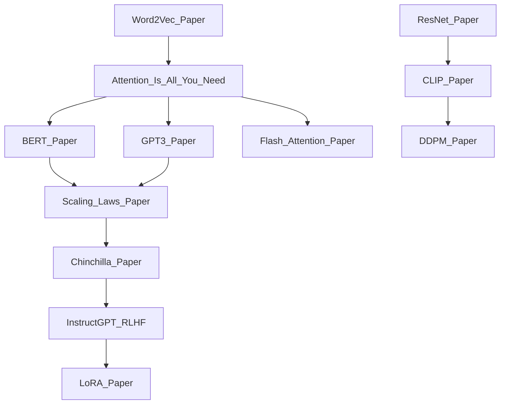

# 🗺️ Key Papers — Map of Content

> [!info] How to use this map
> Start with Fundamentals, follow the arrows, and use the Learning Path below as your guide.

---

## Concept Map

---

## Learning Path
1. [[Word2Vec_Paper]] — The origin of learned word representations; establishes the foundation for all neural NLP
2. [[ResNet_Paper]] — Residual connections that made very deep networks trainable; foundational for modern vision architectures
3. [[Attention_Is_All_You_Need]] — The transformer architecture that displaced RNNs and became the backbone of modern AI
4. [[BERT_Paper]] — Bidirectional pre-training that set the template for fine-tuning large language models
5. [[GPT3_Paper]] — Demonstrates emergent few-shot capabilities at scale; opens the era of prompt engineering
6. [[Scaling_Laws_Paper]] — Quantifies how loss scales predictably with compute, data, and parameters
7. [[Chinchilla_Paper]] — Revises scaling laws to show most large models are undertrained; redefines optimal compute allocation
8. [[InstructGPT_RLHF]] — Introduces RLHF to align language models with human intent; the blueprint for ChatGPT
9. [[LoRA_Paper]] — Low-rank adaptation for parameter-efficient fine-tuning of large models
10. [[CLIP_Paper]] — Contrastive language-image pre-training that bridges vision and language
11. [[DDPM_Paper]] — Denoising diffusion probabilistic models; the theoretical basis for Stable Diffusion and DALL-E 2
12. [[Flash_Attention_Paper]] — IO-aware exact attention that makes long-context transformers practical

---

## All Notes in This Section

### NLP Foundations

| Note | Year | Core Idea | Difficulty |
|------|------|-----------|------------|
| [[Word2Vec_Paper]] | 2013 | Skip-gram and CBOW for dense word embeddings via shallow neural networks | Beginner |
| [[Attention_Is_All_You_Need]] | 2017 | Self-attention mechanism and the full transformer encoder-decoder architecture | Intermediate |
| [[BERT_Paper]] | 2018 | Masked language modelling and next-sentence prediction for bidirectional pre-training | Intermediate |
| [[GPT3_Paper]] | 2020 | Autoregressive scaling to 175B parameters with emergent in-context learning | Intermediate |

### Vision Papers

| Note | Year | Core Idea | Difficulty |
|------|------|-----------|------------|
| [[ResNet_Paper]] | 2015 | Residual skip connections enabling 100+ layer deep networks without vanishing gradients | Intermediate |
| [[CLIP_Paper]] | 2021 | Contrastive learning on 400M image-text pairs for zero-shot visual classification | Intermediate |
| [[DDPM_Paper]] | 2020 | Forward noise diffusion and reverse denoising score matching for high-quality image generation | Advanced |

### LLM Era

| Note | Year | Core Idea | Difficulty |
|------|------|-----------|------------|
| [[Scaling_Laws_Paper]] | 2020 | Power-law relationships between loss, parameters, data, and compute | Intermediate |
| [[Chinchilla_Paper]] | 2022 | Optimal compute-matched training shows most LLMs are undertrained relative to their parameter count | Intermediate |
| [[InstructGPT_RLHF]] | 2022 | Reinforcement learning from human feedback (RLHF) for instruction following and alignment | Advanced |
| [[LoRA_Paper]] | 2021 | Low-rank weight decomposition for parameter-efficient fine-tuning with minimal accuracy loss | Intermediate |

### Efficiency

| Note | Year | Core Idea | Difficulty |
|------|------|-----------|------------|
| [[Flash_Attention_Paper]] | 2022 | Tiling and recomputation to reduce attention memory footprint from O(N²) to O(N) | Advanced |

---

## Key Questions This Section Answers
- How did Word2Vec establish the distributed representation hypothesis for NLP?
- What architectural insight in ResNet allowed networks to scale to hundreds of layers?
- What are queries, keys, and values in self-attention, and why does the transformer work so well?
- How does BERT's bidirectional pre-training differ from GPT's autoregressive approach?
- What emergent capabilities appeared as GPT-3 scaled, and why did few-shot prompting work?
- What do scaling laws predict about the relationship between compute budget and model loss?
- Why did Chinchilla conclude that GPT-3 was undertrained, and what is the Chinchilla-optimal ratio?
- How does RLHF align a language model with human preferences, and what are its failure modes?
- How does LoRA achieve competitive fine-tuning quality using only a fraction of trainable parameters?
- How does CLIP enable zero-shot image classification without task-specific training?
- What is the forward diffusion process in DDPMs, and how does the model learn to reverse it?
- Why is standard attention memory-inefficient, and how does FlashAttention fix it?

---

## Connections to Other Sections
- [[AI-ML/03_NLP/_MOC_NLP]] — Word2Vec, BERT, and GPT-3 are the empirical foundations behind every NLP concept in that section
- [[AI-ML/02_Deep_Learning/_MOC_Deep_Learning]] — ResNet and the transformer paper are the architectural milestones of the deep learning section
- [[AI-ML/04_Computer_Vision/_MOC_Computer_Vision]] — ResNet, CLIP, and DDPM are the key papers that shaped modern computer vision
- [[AI-ML/05_Generative_AI/_MOC_Generative_AI]] — DDPM, CLIP, InstructGPT, and LoRA are directly referenced throughout the Generative AI section
