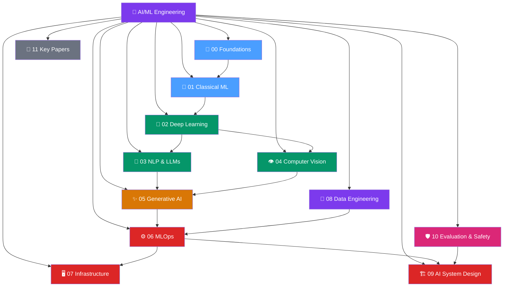

# 🧠 AI/ML Engineer Knowledge Vault

> [!abstract] What this vault contains
> A comprehensive knowledge store for AI/ML engineers covering everything from math foundations to production infrastructure. ~210 notes organized across 12 domains, from Beginner to Advanced.

---

## The Big Picture

*(Blue = Foundations, Green = Core ML/DL/NLP/CV, Orange = Generative AI, Red = Production/MLOps/Infra, Purple = Data/Design, Pink = Evaluation)*

---

## Sections at a Glance

| # | Section | Notes | Focus | Entry Point |
|---|---------|-------|-------|-------------|
| 00 | [[_MOC_Foundations\|📐 Foundations]] | 7 | Math (Linear Algebra, Calculus, Probability, Info Theory) + Python/NumPy | [[Linear_Algebra]] |
| 01 | [[_MOC_Classical_ML\|🌲 Classical ML]] | 27 | Supervised, Unsupervised, Evaluation, Feature Engineering | [[Linear_Regression]] |
| 02 | [[_MOC_Deep_Learning\|🧬 Deep Learning]] | 25 | Neural Networks, Training, CNN/RNN/Transformer, PyTorch | [[Neural_Network_Basics]] |
| 03 | [[_MOC_NLP\|💬 NLP & LLMs]] | 38 | Text, BERT, GPT, LLMs, Fine-Tuning, RAG, Prompt Engineering | [[Language_Model_Basics]] |
| 04 | [[_MOC_Computer_Vision\|👁️ Computer Vision]] | 18 | Classification, Detection, Segmentation, Diffusion, ViT/CLIP | [[Image_Preprocessing]] |
| 05 | [[_MOC_Generative_AI\|✨ Generative AI]] | 18 | Agents, Vector DBs, Inference Optimization | [[AI_Agents_Overview]] |
| 06 | [[_MOC_MLOps\|⚙️ MLOps]] | 24 | Data versioning, Experiment tracking, Serving, Monitoring | [[Experiment_Tracking_Overview]] |
| 07 | [[_MOC_Infrastructure\|🖥️ Infrastructure]] | 19 | GPU, Distributed Training, Quantization, Cloud, Containers | [[GPU_Architecture_Basics]] |
| 08 | [[_MOC_Data_Engineering\|🔧 Data Engineering]] | 10 | ETL, Spark, Kafka, Lakehouses, Data Quality | [[ETL_ELT_for_ML]] |
| 09 | [[_MOC_AI_System_Design\|🏗️ AI System Design]] | 9 | Recommendations, Search, Fraud, LLM Apps, Ranking | [[Interview_Framework]] |
| 10 | [[_MOC_Evaluation_Safety\|🛡️ Evaluation & Safety]] | 11 | Metrics, Benchmarks, SHAP, Bias, Adversarial, Red Teaming | [[NLP_Evaluation_Metrics]] |
| 11 | [[_MOC_Key_Papers\|📄 Key Papers]] | 12 | Foundational papers: Transformers, BERT, GPT-3, LoRA, DDPM | [[Attention_Is_All_You_Need]] |

---

## Learning Paths by Role

### 🎯 ML Engineer (3-6 months)
1. [[_MOC_Foundations]] → [[_MOC_Classical_ML]] → [[_MOC_Deep_Learning]]
2. Pick a domain: [[_MOC_NLP]] or [[_MOC_Computer_Vision]]
3. [[_MOC_MLOps]] → [[_MOC_Infrastructure]] (serving focus)
4. [[_MOC_AI_System_Design]] (interview prep)

### 🔬 ML Researcher (3-6 months)
1. [[_MOC_Foundations]] → [[_MOC_Deep_Learning]] → [[_MOC_NLP]]
2. [[_MOC_Key_Papers]] (all of them)
3. [[_MOC_Evaluation_Safety]] → [[_MOC_Generative_AI]]
4. [[_MOC_Infrastructure]] (training focus: distributed + mixed precision)

### 🚀 MLOps/Platform Engineer (2-4 months)
1. [[_MOC_Foundations]] → [[_MOC_Classical_ML]] (light pass)
2. [[_MOC_MLOps]] (deep dive — all 24 notes)
3. [[_MOC_Infrastructure]] (all 19 notes)
4. [[_MOC_Data_Engineering]] → [[_MOC_AI_System_Design]]

### 🤖 AI Application Engineer (2-3 months)
1. [[_MOC_Deep_Learning]] (light pass) → [[_MOC_NLP]] (LLMs + RAG focus)
2. [[_MOC_Generative_AI]] (Agents + Vector DBs)
3. [[_MOC_AI_System_Design]] (LLM Application Architecture, Semantic Search)
4. [[_MOC_MLOps]] (Serving focus: FastAPI, Ray Serve, monitoring)

---

## Quick Reference: Most Important Notes

**Must-Know Concepts:**
- [[Transformer_Architecture]] — foundation of all modern AI
- [[Attention_Mechanism]] — the core operation
- [[LoRA]] — how 90% of LLMs are fine-tuned today
- [[RAG_Overview]] — how LLM apps are grounded
- [[KV_Cache]] — why LLM inference is fast
- [[Data_Parallelism]] — how big models are trained

**Must-Read Papers:**
- [[Attention_Is_All_You_Need]] — the Transformer
- [[BERT_Paper]] — bidirectional pretraining
- [[LoRA_Paper]] — efficient fine-tuning
- [[Scaling_Laws_Paper]] — how to scale models
- [[InstructGPT_RLHF]] — how ChatGPT works

**Key Production Skills:**
- [[FastAPI_for_ML]] → [[Triton_Inference_Server]] → [[Ray_Serve]]
- [[MLflow]] → [[Model_Registry]] → [[Model_Cards]]
- [[Data_Drift]] → [[Concept_Drift]] → [[AB_Testing_for_ML]]
- [[Docker_for_ML]] → [[Kubernetes_for_ML]]

---

## Vault Stats
- **Total notes:** ~220 (206 concept notes + 12 section MOCs + 1 master MOC)
- **Sections:** 12 domains
- **Difficulty range:** Beginner → Advanced
- **Code demos:** Python, PyTorch, HuggingFace, LangChain, scikit-learn
- **Last updated:** 2026-07-26

---

#MOC #AI-ML #Master #Index
