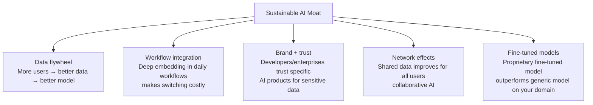
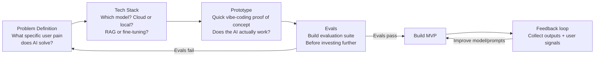

# AI Product Strategy

> [!abstract] TL;DR
> Building AI products requires understanding where AI creates genuine value vs where it's a thin wrapper on an API. AI products succeed when the AI is core to the value proposition (not bolted on), the moat comes from data and feedback loops (not just prompt engineering), and the strategy accounts for AI's unique failure modes (hallucinations, non-determinism, capability improvements over time).

## Where AI Creates Genuine Value

Not every problem benefits from AI. The highest-value AI applications share common patterns:

### High-Value AI Application Patterns

| Pattern | Example | Why AI adds value |
|---|---|---|
| **Unstructured → structured** | Resume parser, contract analyzer | Replaces manual data entry |
| **Natural language interface** | SQL query via chat, form via conversation | Reduces expertise barrier |
| **Content generation** | Marketing copy, code, summaries | Replaces time-consuming human work |
| **Classification at scale** | Ticket routing, content moderation | Replaces rule-based systems that don't scale |
| **Personalization** | Recommendations, adaptive learning | Customization previously too expensive |
| **Synthesis** | Research assistant, meeting summarizer | Aggregates across large information sets |

### When NOT to Use AI

- **When a rule-based system works perfectly.** If you can write `if amount > 1000: flag_for_review`, don't use an LLM.
- **When you can't tolerate errors.** AI makes mistakes. If a false positive costs $10,000, the error rate matters enormously.
- **When you have no data flywheel.** If the AI doesn't get better as more users use it, your moat is zero.
- **When latency is critical.** Current LLM inference: 200ms–2s. If you need < 50ms responses, reconsider.

---

## AI Product Moats

Most AI products built on public APIs have **no technical moat** — anyone can integrate the same model. Sustainable advantage comes from:



### The Data Flywheel

```
Users use product → Generate usage data → Fine-tune model on data
                                              ↓
                    Better model → More users → More data
```

Example: GitHub Copilot's moat is billions of lines of code from GitHub repositories used for training — not just the GPT-4 API it could theoretically use.

---

## AI Product Positioning

### Positioning Matrix

```
            Narrow capability     Wide capability
Horizontal  ┌─────────────────┬──────────────────┐
            │ AI feature       │ AI assistant     │
            │ inside product   │ (ChatGPT-style)  │
Vertical    ├─────────────────┼──────────────────┤
            │ Domain-specific  │ AI-native        │
            │ AI tool          │ vertical SaaS    │
            └─────────────────┴──────────────────┘
```

**Most successful AI startups are vertical AI:** narrow domain, deep integration, domain-specific training data. "AI for legal contracts" beats "AI for everything" because the data and workflows are specific.

---

## AI-Native vs AI-Augmented Products

**AI-native product:** AI is the core value proposition; the product wouldn't exist without AI.
- Example: Cursor (AI-first code editor), Perplexity (AI-first search), Harvey (AI for lawyers)

**AI-augmented product:** existing product enhanced with AI features.
- Example: Notion AI added to Notion, GitHub Copilot added to VS Code, Salesforce Einstein added to Salesforce CRM

**Strategic implications:**
- AI-native: you can design UX around AI capabilities from scratch; no legacy to consider
- AI-augmented: you must fit AI into existing workflows; user expectations anchored on non-AI version

---

## The AI Product Cycle



**Critical step: evals before building MVP.** Many AI products skip evaluation and build full products before discovering the model can't actually do what they need. Spend 20% of your time on evals before investing in product code.

---

## AI Product vs Traditional Software Trade-offs

| Dimension | Traditional Software | AI Product |
|---|---|---|
| Correctness | Deterministic | Probabilistic (same input, different output) |
| Debugging | Stack trace, deterministic reproduction | Prompts, outputs, stochastic failures |
| Testing | Unit tests pass/fail | Evals with thresholds and sampling |
| Performance | Optimize CPU/memory | Optimize model, prompt, inference cost |
| Failure modes | Exceptions, errors | Hallucinations, style drift, capability gaps |
| Versioning | Code versions | Model versions + prompt versions |
| Cost model | Fixed infra cost | Per-token API cost (scales with usage) |

---

## Prototyping AI Products

The fastest way to validate an AI product idea:

```python
# Minimum viable AI prototype (< 50 lines):
from anthropic import Anthropic

client = Anthropic()

def classify_support_ticket(ticket: str) -> dict:
    """Classify a support ticket into category and priority."""
    
    response = client.messages.create(
        model="claude-opus-4-5",
        max_tokens=200,
        messages=[{
            "role": "user",
            "content": f"""Classify this support ticket. Return JSON only.
            
Ticket: {ticket}

Return:
{{
  "category": "billing|technical|account|general",
  "priority": "low|medium|high|critical",
  "sentiment": "positive|neutral|negative|angry",
  "one_line_summary": "..."
}}"""
        }]
    )
    
    import json
    return json.loads(response.content[0].text)

# Test it immediately
result = classify_support_ticket(
    "I've been charged twice this month and can't get anyone to respond!"
)
print(result)
# {'category': 'billing', 'priority': 'high', 'sentiment': 'angry', ...}
```

**Prototype principles:**
- Get a working output in < 1 hour
- Test on 20 real examples before building infrastructure
- Don't optimize the prompt until you have evals

---

## Common Pitfalls

- **Building the product before validating the model.** Spend 2 days testing if the AI actually does what you need on real inputs. Don't build a full product around an AI capability that doesn't work reliably.
- **Ignoring inference cost.** GPT-4 at $0.06/1K output tokens sounds cheap until you multiply by 10M monthly requests. Model cost at scale is a business model problem.
- **No differentiation from a generic chatbot.** "AI assistant that helps with [X]" is not a product. What specific workflow are you replacing, and why does AI do it better than current tools?
- **Prompt engineering as the only moat.** Prompts are copyable. Build product moats on data, workflow integration, or fine-tuning.
- **Treating AI as a feature rather than a product.** Adding "✨ AI" to an existing product rarely succeeds if the AI isn't genuinely improving the core job-to-be-done.

---

## Review Questions

1. What is a "data flywheel" in AI products? Give a concrete example of a company that has built one.
2. Explain the difference between an AI-native and an AI-augmented product, with one example of each.
3. You're evaluating whether to use an LLM to power a financial fraud detection system. What concerns would you raise?
4. Why is "prompt engineering as a moat" insufficient for long-term defensibility?
5. What does the AI Product Cycle suggest you should build BEFORE the MVP, and why?
