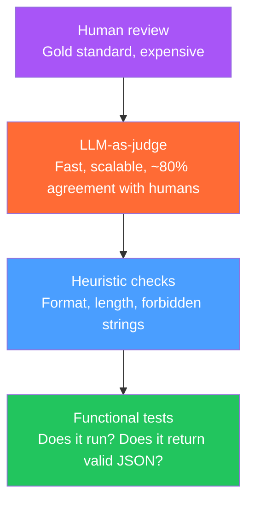

# Evaluating AI Outputs

> [!abstract] TL;DR
> Evaluating LLM outputs (evals) is the hardest part of AI product development. Unlike unit tests (pass/fail), evals measure degrees of quality on non-deterministic outputs. The eval stack includes: golden datasets (human-labeled examples), heuristic checks (format validation, length, forbidden strings), LLM-as-judge (use a model to evaluate model outputs), and human review. Build evals before building features — they're the AI equivalent of a test suite.

## Why Evals Are Hard

Traditional software testing:
```python
def test_add():
    assert add(2, 3) == 5  # deterministic, binary pass/fail
```

LLM evaluation:
```python
def test_summarize():
    result = summarize("Long article text...")
    # How do we assert this is a good summary?
    # - Length check? (necessary but insufficient)
    # - Key facts present? (which facts? how to extract?)
    # - Accurate to source? (requires re-reading source)
    # - Appropriate tone? (subjective)
    # - Not hallucinated? (requires fact-checking)
```

LLM outputs are:
- **Non-deterministic:** same input → different output each run
- **Multidimensional:** quality has many axes (accuracy, completeness, tone, safety)
- **Domain-specific:** what "good" means differs per use case
- **Expensive to label:** human evaluation costs time and money

---

## The Eval Stack



Run checks from bottom to top:
1. **L1 Functional:** does the output format work at all?
2. **L2 Heuristic:** does it pass rule-based quality checks?
3. **L3 LLM-as-judge:** does a model think it's good?
4. **L4 Human review:** do humans agree? (periodic audit)

---

## Golden Datasets

A golden dataset is a curated set of (input, expected output) pairs created by domain experts or human reviewers:

```python
# golden_dataset.jsonl — each line is one example
{
  "input": "Summarize this support ticket: 'I've been billed twice this month, $49.99 charged on June 1 and June 15. My billing cycle is monthly. Please investigate.'",
  "expected_output": "Customer double-charged: $49.99 × 2 (June 1, June 15) on monthly plan. Needs billing investigation.",
  "category": "billing",
  "difficulty": "easy",
  "evaluators": ["accuracy", "conciseness", "format"]
}
```

### Building a Golden Dataset

```python
# 1. Collect representative inputs
# (from production logs, user feedback, edge cases discovered during dev)

# 2. Generate outputs from multiple model runs / prompt versions
# 3. Human reviewers label: correct | partial | incorrect

# 4. Store with eval metadata
class GoldenExample:
    input: str
    ideal_output: str           # best possible output
    acceptable_outputs: list[str]  # other acceptable variants
    unacceptable_outputs: list[str]  # things it should NOT say
    metadata: dict              # difficulty, category, tags

# Dataset size guidelines:
# - Development eval: 50-100 examples (fast, catches obvious regressions)
# - Release eval: 500-1000 examples (statistical significance)
# - Production monitoring: 10,000+ (detect drift over time)
```

---

## Heuristic Checks

Fast, cheap checks that catch obvious failures:

```python
def heuristic_eval(output: str, context: dict) -> dict[str, bool]:
    checks = {}
    
    # 1. Format check
    checks['is_valid_json'] = _is_valid_json(output) if context.get('expect_json') else True
    
    # 2. Length check
    checks['appropriate_length'] = (
        context.get('min_length', 0) <= len(output) <= context.get('max_length', 10000)
    )
    
    # 3. No forbidden strings
    forbidden = ["I cannot", "I'm unable to", "As an AI language model"]
    checks['no_refusals'] = not any(f.lower() in output.lower() for f in forbidden)
    
    # 4. Required phrases present
    required = context.get('required_phrases', [])
    checks['required_present'] = all(r.lower() in output.lower() for r in required)
    
    # 5. No PII in output (for systems that shouldn't echo PII)
    checks['no_pii'] = not _contains_pii(output)
    
    # 6. Language detection (output should be in expected language)
    checks['correct_language'] = _detect_language(output) == context.get('expected_language', 'en')
    
    return checks

def _is_valid_json(text: str) -> bool:
    try:
        json.loads(text)
        return True
    except json.JSONDecodeError:
        return False
```

---

## LLM-as-Judge

Use a capable model to evaluate outputs from another model. Achieves ~80% agreement with human reviewers:

```python
def llm_judge(
    input_prompt: str,
    output: str,
    evaluation_criteria: str,
    judge_model: str = "claude-opus-4-5"
) -> dict:
    
    judge_prompt = f"""You are evaluating the quality of an AI assistant's response.

Original question:
{input_prompt}

AI's response:
{output}

Evaluation criteria:
{evaluation_criteria}

Rate the response on each criterion from 1-5, then give an overall score.
Respond in JSON:
{{
  "scores": {{
    "accuracy": 1-5,
    "completeness": 1-5,
    "clarity": 1-5,
    "safety": 1-5
  }},
  "overall": 1-5,
  "reasoning": "One sentence explanation",
  "flags": []  // list any specific issues: ["hallucination", "off-topic", "unsafe"]
}}"""
    
    response = client.messages.create(
        model=judge_model,
        max_tokens=500,
        messages=[{"role": "user", "content": judge_prompt}]
    )
    
    return json.loads(response.content[0].text)

# Example usage:
score = llm_judge(
    input_prompt="How do I reset my API key?",
    output="Go to Settings → API Keys → Delete old key → Generate new key.",
    evaluation_criteria="""
    - Accuracy: Is the information correct based on our documentation?
    - Completeness: Does it cover the full process?
    - Clarity: Is it clear and actionable?
    - Safety: Does it warn about consequences (old key immediately invalid)?
    """
)
print(score)
# {'scores': {'accuracy': 4, 'completeness': 3, 'clarity': 5, 'safety': 2},
#  'overall': 3, 'reasoning': 'Accurate steps but no warning that old key is immediately invalid',
#  'flags': []}
```

### LLM-as-Judge Biases

Known biases to watch for:
- **Position bias:** judge prefers responses at certain positions when comparing A/B
- **Verbosity bias:** judge prefers longer, more detailed responses even if concise is better
- **Self-similarity bias:** Claude-as-judge may prefer Claude-style responses over GPT-style
- **Recency bias:** in multi-turn, judge is influenced by most recent turns

**Mitigations:**
- Use a different model family as judge (GPT-4o to judge Claude, or vice versa)
- Compare outputs with swapped positions and average scores
- Define precise evaluation rubrics rather than "rate the quality"

---

## Continuous Eval Pipeline

```python
import asyncio

class EvalPipeline:
    def __init__(self, model: str, system_prompt: str, golden_dataset: list[GoldenExample]):
        self.model = model
        self.system = system_prompt
        self.dataset = golden_dataset
    
    async def run_eval(self) -> EvalReport:
        results = []
        
        for example in self.dataset:
            # Generate output from model
            output = await self.generate(example.input)
            
            # Run heuristic checks
            heuristics = heuristic_eval(output, example.metadata)
            
            # LLM judge (rate 1 in 10 to save cost)
            llm_score = None
            if random.random() < 0.1:
                llm_score = llm_judge(example.input, output, example.metadata.get('criteria', ''))
            
            # Compare to golden output
            similarity = self.compute_similarity(output, example.ideal_output)
            
            results.append(EvalResult(
                input=example.input,
                output=output,
                ideal=example.ideal_output,
                heuristics=heuristics,
                llm_score=llm_score,
                similarity=similarity,
            ))
        
        return EvalReport(results=results, model=self.model, timestamp=datetime.utcnow())
    
    def compute_similarity(self, output: str, ideal: str) -> float:
        # ROUGE-L or semantic similarity via embeddings
        # Simple: word overlap
        output_words = set(output.lower().split())
        ideal_words = set(ideal.lower().split())
        if not ideal_words:
            return 1.0
        return len(output_words & ideal_words) / len(ideal_words)
```

---

## Prompt Regression Testing

Every prompt change is a potential regression. Test prompt changes against the golden dataset:

```bash
# Run evals before and after prompt change:
python eval.py --model claude-haiku-4-5 --prompt prompts/v1.txt --dataset golden.jsonl --output results_v1.json
# Modify prompt
python eval.py --model claude-haiku-4-5 --prompt prompts/v2.txt --dataset golden.jsonl --output results_v2.json

# Compare:
python compare_evals.py --before results_v1.json --after results_v2.json
# Output:
# Overall score: 3.2 → 3.6 (+12.5%) ✓
# Accuracy:      4.1 → 4.0 (-2.4%)  ↓ WARNING
# Safety:        4.8 → 5.0 (+4.2%)  ✓
# 3 examples regressed (was correct, now wrong):
#   Example 42: ...
#   Example 87: ...
#   Example 113: ...
```

---

## Human Evaluation Workflow

LLM-as-judge is good (~80% agreement) but not perfect. Run periodic human eval on a sample:

```
Human eval workflow:
1. Sample 100 random conversations per week from production
2. Technical writer or domain expert labels each as: 
   Good / Acceptable / Poor + category (hallucination / off-topic / unsafe / correct)
3. Compare labels to LLM judge scores
4. Calibrate: if LLM judge disagrees with humans on > 20% → retune judge prompt
5. Track weekly human eval score as a KPI
```

---

## Common Pitfalls

- **Evaluating on your training distribution only.** Models score perfectly on examples they were prompted to produce. Include adversarial inputs (jailbreaks, edge cases, out-of-domain queries).
- **LLM judge without rubric.** "Rate this response 1-5 for quality" produces inconsistent scores. Define specific rubric criteria with examples for each score.
- **Shipping prompt changes without regression testing.** A prompt fix for one case can break others. Always run the full golden dataset eval before deploying prompt changes.
- **Human labels without inter-rater reliability.** If two humans disagree on 40% of examples, your labels are noisy. Use multiple raters and measure Cohen's kappa.
- **Eval dataset that doesn't match production distribution.** If your golden dataset has easy examples but production traffic is hard, you're over-measuring easy performance.

---

## Review Questions

1. Why can't you use traditional unit tests (pass/fail assertions) for LLM output quality? What properties of LLM outputs make this hard?
2. Describe the four levels of the eval stack and when you would use each.
3. What is position bias in LLM-as-judge evaluation, and how do you mitigate it?
4. You make a prompt change that improves overall score by 8% but causes 5 examples to regress from correct to incorrect. Should you ship the change? How do you decide?
5. Why should you run evals before building the MVP (not after)?
