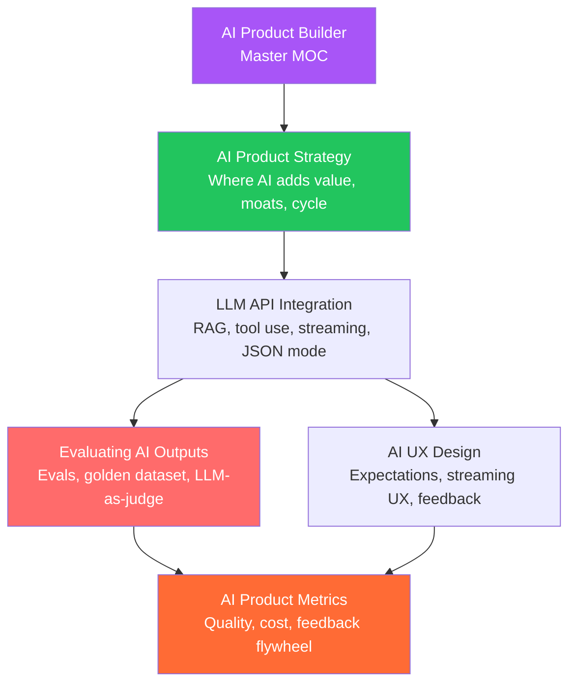

# AI Product Builder — Map of Content

> [!info] About this vault
> 5 notes covering the full lifecycle of building AI-powered products: strategy (where AI creates genuine value, moats, positioning), LLM API integration patterns (RAG, tool use, streaming, structured outputs), AI UX design (setting expectations, streaming UX, error handling, feedback), evaluating AI outputs (golden datasets, LLM-as-judge, regression testing), and AI product metrics (quality metrics, cost per request, feedback flywheel).

---

## Concept Map

---

## Sections at a Glance

| # | Note | Difficulty | Focus |
|---|------|------------|-------|
| 01 | [[AI_Product_Strategy]] | Intermediate | Where AI creates value, moats, positioning |
| 02 | [[LLM_API_Integration]] | Intermediate | RAG, tool use, streaming, cost optimization |
| 03 | [[AI_UX_Design]] | Intermediate | Expectation setting, streaming UX, error recovery |
| 04 | [[Evaluating_AI_Outputs]] | Advanced | Evals, LLM-as-judge, regression testing |
| 05 | [[AI_Product_Metrics]] | Intermediate | Quality KPIs, cost metrics, feedback flywheel |

---

## Learning Paths

### Path A — Building First AI Product

For a developer or PM building their first LLM-powered feature or product:

1. [[AI_Product_Strategy]] — validate the AI use case (will AI actually improve this?)
2. [[LLM_API_Integration]] — build the integration (RAG, tool use, streaming, JSON mode)
3. [[AI_UX_Design]] — design the user experience (streaming, error handling, feedback)
4. [[Evaluating_AI_Outputs]] — build evals BEFORE shipping to production
5. [[AI_Product_Metrics]] — set up monitoring (quality metrics, cost, feedback loop)

### Path B — Improving an Existing AI Product

For teams who have shipped an AI product and want to improve quality and reliability:

1. [[Evaluating_AI_Outputs]] — build a proper eval suite to measure current quality
2. [[AI_Product_Metrics]] — establish baseline metrics and identify the biggest problems
3. [[AI_Product_Strategy]] — revisit positioning and moat (is the AI actually differentiated?)
4. [[AI_UX_Design]] — improve the UX based on user feedback patterns
5. [[LLM_API_Integration]] — optimize cost and latency (model routing, prompt caching)

---

## All Notes

| Note | Core Idea | Key Concepts |
|------|-----------|--------------|
| [[AI_Product_Strategy]] | AI adds value when it automates unstructured → structured work, NL interfaces, or synthesis at scale. Moats come from data flywheels + workflow integration, not prompt engineering. | Data flywheel, AI-native vs augmented, AI product cycle |
| [[LLM_API_Integration]] | Core patterns: RAG (retrieval + generation), tool use (LLM calls your functions), streaming (token-by-token output), structured outputs (JSON mode), multi-turn conversation management | RAG, tool use, streaming, prompt caching, cost per token |
| [[AI_UX_Design]] | AI UX principles: set accurate expectations, show streaming progress, provide recovery paths for errors, confirm consequential actions, collect thumbs up/down feedback. Chat is one of many UI patterns. | Streaming UX, AI confidence signals, feedback buttons, chat vs non-chat |
| [[Evaluating_AI_Outputs]] | Eval stack: functional tests → heuristic checks → LLM-as-judge → human review. Build golden datasets. Run regression evals before shipping prompt changes. | Golden dataset, LLM-as-judge, eval pipeline, position bias |
| [[AI_Product_Metrics]] | Key metrics: thumbs up/down rate, user correction rate, task completion rate, cost per request, P95 latency. The feedback flywheel: bad output → evals → prompt fix → A/B test → deploy. | Feedback flywheel, correction rate, cost/DAU, quality drift |

---

## Key Concepts Quick Reference

| Concept | What it is | Note |
|---|---|---|
| **Data flywheel** | More users → better data → better model → more users | [[AI_Product_Strategy]] |
| **RAG** | Retrieval Augmented Generation: search your data, include in context | [[LLM_API_Integration]] |
| **Tool use** | LLM decides to call your functions; you execute and return results | [[LLM_API_Integration]] |
| **Golden dataset** | Human-labeled (input, ideal output) pairs for regression testing | [[Evaluating_AI_Outputs]] |
| **LLM-as-judge** | Use a model to evaluate model outputs (~80% agreement with humans) | [[Evaluating_AI_Outputs]] |
| **Position bias** | LLM judges prefer responses at certain positions — mitigate by swapping | [[Evaluating_AI_Outputs]] |
| **User correction rate** | % of AI outputs the user edits or regenerates — high = low quality | [[AI_Product_Metrics]] |
| **Feedback flywheel** | User feedback → evals → prompt/model improvement → better product | [[AI_Product_Metrics]] |
| **TTFT** | Time to first token — the UX latency that matters most for streaming | [[AI_UX_Design]], [[AI_Product_Metrics]] |
| **Prompt caching** | Cache repeated system prompts to reduce cost on repeated calls | [[LLM_API_Integration]] |

---

## Cross-Vault Links

- [[AI-ML/_MOC_AI_ML_Master|AI/ML Master MOC]] — foundational ML concepts (embeddings, fine-tuning, evaluation metrics) underpin AI product building
- [[DevRel/_MOC_DevRel_Master|DevRel MOC]] — DevRel for AI products: documenting AI capabilities, managing community expectations about AI
- [[Technical_Writing/_MOC_Technical_Writing_Master|Technical Writing MOC]] — documenting AI products (prompt docs, capability docs, limitation disclosures)
- [[Engineering_Leadership/_MOC_Engineering_Leadership_Master|Engineering Leadership MOC]] — leading AI product teams, managing technical uncertainty, evaluation as "tests"

#MOC #AIProduct #MasterMOC
