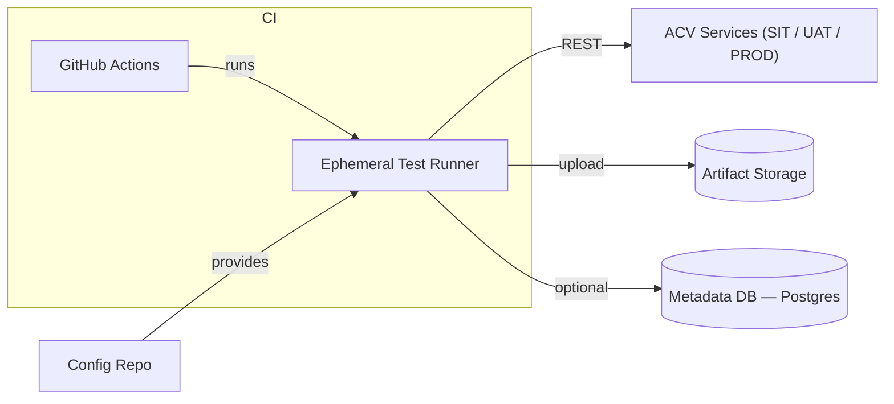
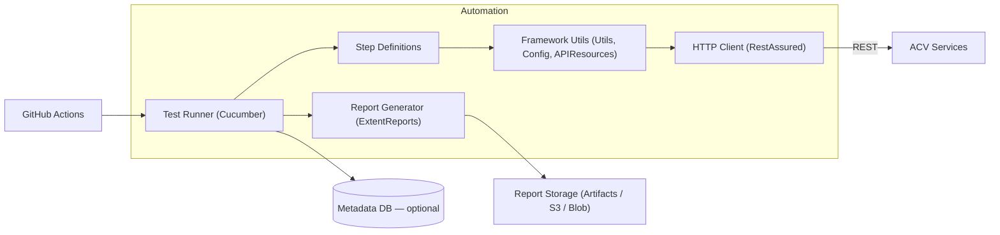

# High-Level Design (HLD)

## Purpose

Purpose

This document describes the high-level design for the `eai-3540813-acv-api-automation` project. It provides an overview of components, technology choices, runtime behavior, and how the automation integrates with ACV services and the CI/CD platform.

Scope
- Tests are Cucumber-based features executed via JUnit/Maven in CI or locally.
- The automation verifies REST APIs exposed by ACV services and generates artifact reports.

Business Context
- Provides automated validation of API contracts and business scenarios for ACV services.
- Stakeholders: QA engineers, backend service owners, release engineers.

## Scope

This HLD covers:
- Architecture and component responsibilities
- Data flows for primary business scenarios (OTP request, document list, PAN fetch)
- Integration points (auth, config, reporting)
- Technology stack and non-functional requirements

## Technology Stack
- Language: Java 11+ (Maven)
- Test Framework: Cucumber + JUnit runner
- HTTP client: RestAssured
- Build: Maven (`pom.xml`)
- CI: GitHub Actions (workflow: `.github/workflows/maven.yml`)
- Reporting: ExtentReports (HTML/PDF) stored as CI artifacts

## Major Components
- Test Runner: `TestRunner` (Cucumber/JUnit bootstrap)
- Feature files: Gherkin scenarios under `src/test/java/com/acv/service/features/`
- Step Definitions: glue code mapping Gherkin steps to Java implementations
- Framework Utilities: `Utils`, `Config`, `APIResources`, `OktaToken`
- Test Data: JSON fixtures under `Resource/TestData/SIT/`
- Reporting: Extent reports and `logging.txt`

## System Context
The automation interacts with three classes of external systems:
- Target ACV Services (SIT/UAT/PROD) via REST
- Configuration & Secrets (CI secret store and `eai-3540813-config-repo`)
- Artifact storage (GitHub Actions artifacts, optional S3/Blob)

## Primary Business Flows (summary)
- Request OTP: feature exercises identity OTP endpoint and validates response fields.
- Document list retrieval: validates document metadata per country configuration.
- Fetch PAN: verifies identity fetch data and schema.

For each flow a corresponding Mermaid sequence diagram is included in `flows.md`.

## Non-functional Requirements
- Reliability: deterministic test outcomes; retries for transient network errors
- Performance: CI job completes within budgeted time; tests partitionable for parallelism
- Security: no secrets in repo; tokens provided via CI secrets
- Observability: request/response logging to `logging.txt` and Extent reports

## Integration Points
- `APIResources` enum -> logical URI mappings (see `src/test/java/com/acv/service/resources/APIResources.java`)
- Token retrieval -> `Utils.token()` / `OktaToken.java`
- CI workflow -> `.github/workflows/maven.yml`

## Key Design Decisions
- Centralize HTTP configuration in `Utils` to ensure consistent logging, timeouts, and headers.
- Keep fixtures in repo for deterministic scenarios; parameterize environment-specific base URLs via `global.properties`.

## Assumptions & Constraints
- Tests run from ephemeral CI runners and expect network access to target environments.
- Sensitive tokens are provided by CI secrets; local runs must configure test credentials manually.

Last Updated: 2026-04-02

## Major Components
- Test Runner: Cucumber + JUnit runner (`TestRunner.java`) — discovers and executes feature files
- Step Definitions: Java classes under `src/test/java/com/acv/service/stepDefintions` map Gherkin steps to implementation
- Framework Utilities: `Utils.java`, `Config.java`, `APIResources.java` — centralize HTTP behaviour, configuration and resource paths
- Test Data: JSON fixtures under `Resource/TestData/SIT/*`
- Reporting: Extent reports produced under `Reports/`, `HtmlReport/`, `PdfReport/`
- CI: GitHub Actions job executes `mvn test` and uploads artifacts

## High-level Architecture (diagram)

## Primary Business Flows (summary)
- Request OTP: `RequestOTP` feature uses `RequestOTPValid.json` to call `RequestOTP` resource
- Get Document List: `DocumentList` feature calls `GetDocumentList` and validates document metadata
- Fetch PAN: `FetchPan` feature calls `FetchPan` resource with `FetchPan.json` payload

## Non-functional Requirements
- Reliability: retry and request logging via `Utils` (Request/Response filters)
- Performance: tests are partitionable; CI executes suites in parallel via Maven or job matrix
- Security: secrets stored in CI (do not commit credentials in `global.properties`)
- Observability: `logging.txt` and Extent reports store request/response traces

## Integration Points
- `global.properties` stores environment names and base URLs (`src/test/java/com/acv/service/resources/global.properties`)
- Token / auth flow: token retrieval implemented in `Utils.token()` and `OktaToken` step
- CI integration: `.github/workflows/maven.yml` runs tests and publishes artifacts
