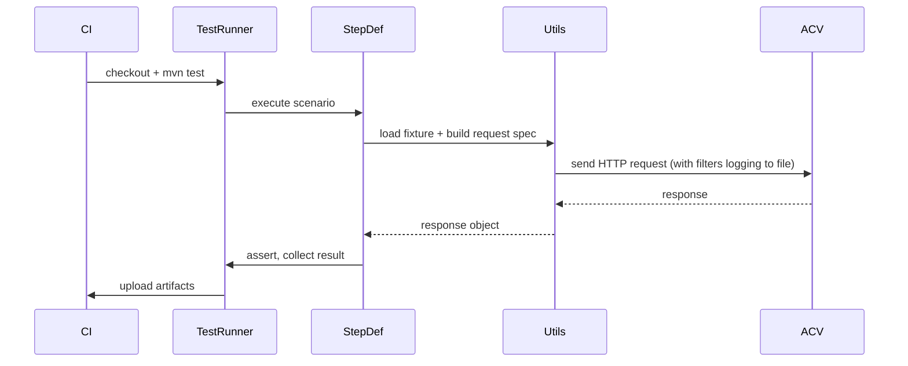
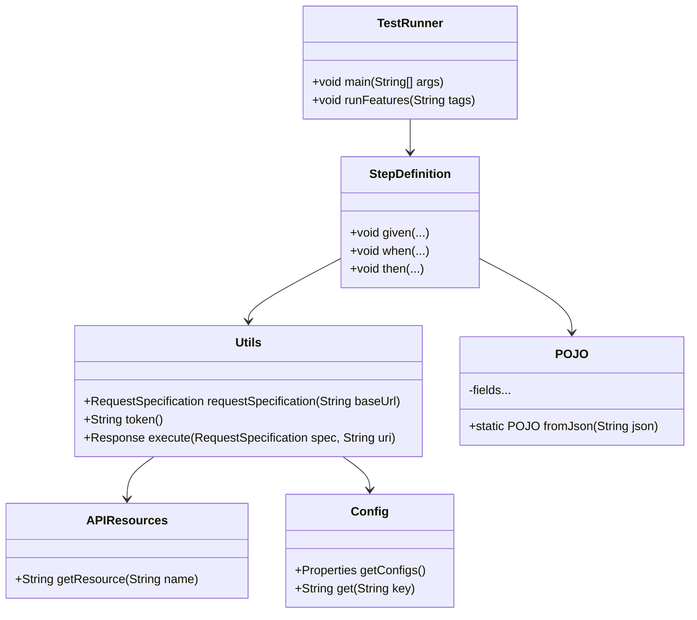

# Low-Level Design (LLD)

## Code Organization (actual repo)

- `src/main/java/com/acv/service/pojo/` — POJOs for request/response payloads
- `src/test/java/com/acv/service/features/` — Cucumber `.feature` files (Gherkin)
- `src/test/java/com/acv/service/stepDefintions/` — Java step definitions (e.g., `RequestOtp.java`, `GetOktaToken.java`)
- `src/test/java/com/acv/service/resources/` — framework utilities (`Utils.java`, `Config.java`, `APIResources.java`, `OktaToken.java`)
- `Resource/TestData/` — JSON fixtures used by tests (SIT payloads)

## Core Classes & Responsibilities

- `TestRunner` (`src/test/java/com/acv/service/cucumber/options/TestRunner.java`): JUnit entrypoint that bootstraps Cucumber and runs feature files.
- `Utils` (`src/test/java/com/acv/service/resources/Utils.java`): Builds `RequestSpecification` with logging filters, reads global properties and provides token helper.
- `Config` (`src/test/java/com/acv/service/resources/Config.java`): Singleton loader for `global.properties` used by tests.
- `APIResources` (`src/test/java/com/acv/service/resources/APIResources.java`): Enum mapping logical resource names to relative URIs used across tests.
- `OktaToken` (`src/test/java/com/acv/service/resources/OktaToken.java`): token retrieval helper (Okta or mocked implementation for SIT).

### Example Class Signatures (extracted)

class: `Utils` (src/test/java/com/acv/service/resources/Utils.java)
- `public static RequestSpecification requestSpecification(String baseUrl)` — returns configured RestAssured spec with logging and timeouts
- `public static String token()` — retrieves or constructs auth token

class: `Config` (src/test/java/com/acv/service/resources/Config.java)
- `public Properties getConfigs()` — loads `global.properties`

## Request/Response Lifecycle (sequence)



## Data Models / POJOs
- `RequestOTP` (pojo) — fields: `transactionUUID: String`, `countryCode: String`, `records: List<Record>`
- `Record` — fields: `code: String`, `recordDetails: Map<String,Object>`

## Design Patterns Used
- Singleton: `Config` for loading properties
- Factory/Builder (informal): `Utils.requestSpecification()` centralizes request building and can be extended to produce variations (retrying spec, authenticated spec)

## Error Handling Strategy
- Centralize logging and assertions in step definitions. For transient HTTP failures, add retry wrapper around RestAssured calls in `Utils`.

## Validation Rules
- JSON payloads deserialized into POJOs; use assertions on required fields and status codes in step definitions.

Last Updated: 2026-04-02

## Expanded Class Diagram



## Configuration Reference (extracted)

- `global.properties` (path: `src/test/java/com/acv/service/resources/global.properties`)
  - `environmentName` (values: `local`, `SIT`, `UAT`, `PROD`) — selects base URL
  - `baseUrl` — environment base URL (overridden by CI env var `BASE_URL`)
  - `request.timeout.ms` — default request timeout

## Retry & Backoff Strategy (recommended)

- Implement a small retry helper in `Utils.execute(...)`:

```text
attempt = 0
while attempt < MAX_RETRIES:
  resp = performHttpCall()
  if resp.status in [200,201,204]: return resp
  if resp.status in [429, 500..599]: sleep(backoff(attempt)); attempt +=1; continue
  else: return resp
```

## Error Handling and Test Outcome

- Network/auth transient errors: apply retry logic, capture request/response into `logging.txt`.
- Auth failures (401): refresh token once via `Utils.token()` and retry the request.
- Assertion failures: immediately mark step failed, attach response snapshot to report and continue/stop based on scenario configuration.

## Unit & Integration Test Mapping

- Unit-testable helpers: `Config`, JSON mappers for POJOs, retry helper
- Integration: Step definitions + `Utils` are exercised by Cucumber feature runs; CI executes integration-level tests via `mvn test`.

Last Updated: 2026-04-02

## Core Classes & Responsibilities

- `TestRunner` (`src/test/java/com/acv/service/cucumber/options/TestRunner.java`): JUnit entrypoint that bootstraps Cucumber and runs feature files.
- `Utils` (`src/test/java/com/acv/service/resources/Utils.java`): Builds `RequestSpecification` with logging filters, reads global properties and provides token helper.
- `Config` (`src/test/java/com/acv/service/resources/Config.java`): Singleton loader for `global.properties` used by tests.
- `APIResources` (`src/test/java/com/acv/service/resources/APIResources.java`): Enum mapping logical resource names to relative URIs used across tests.
- Step definition classes: perform the HTTP call using RestAssured, transform responses into POJOs, and assert expectations.

## Example: How a step executes (simplified)

1. Feature file triggers a step (e.g., `When user requests OTP`)
2. Step definition loads JSON fixture (from `Resource/TestData/SIT/...`)
3. `Utils.requestSpecification(baseUrl)` returns a cached `RequestSpecification` with logging filters to `logging.txt`
4. RestAssured call uses URI from `APIResources` and attaches token from `Utils.token()` if required
5. Response is deserialized into POJO (`RequestOTP`, `Record`, etc.) and assertions executed

## Config and environment handling

- `global.properties` (path: `src/test/java/com/acv/service/resources/global.properties`) holds keys such as `environmentName` and `baseUrl` for SIT/UAT/PROD. `Config.getConfigs().getPropertyValue("environmentName")` reads values.

## Data model snippets (POJOs)

`RequestOTP` (simplified) — matches `Resource/TestData/SIT/RequestOTP/RequestOTPValid.json`:

```java
public class RequestOTP {
  private String transactionUUID;
  private String countryCode;
  private List<Record> records;
  // getters/setters
}
```

## Logging and artifacts

- Request/Response are logged to `logging.txt` using RestAssured filters (see `Utils.requestSpecification`)
- Extent reports are produced and stored in `Reports/`, `HtmlReport/` and `PdfReport/`

## Sequence: Typical Test Execution (detailed)


## Error handling & retry strategy (implementation notes)

- Retries for transient HTTP failures should be implemented at the request layer (e.g., use a helper that retries on 429/5xx with exponential backoff). Current repo centralizes requests in `Utils` and can be extended to add retry logic.
- Fail-fast configuration: a Maven profile or an environment variable can switch CI between `smoke` and `full` runs.
