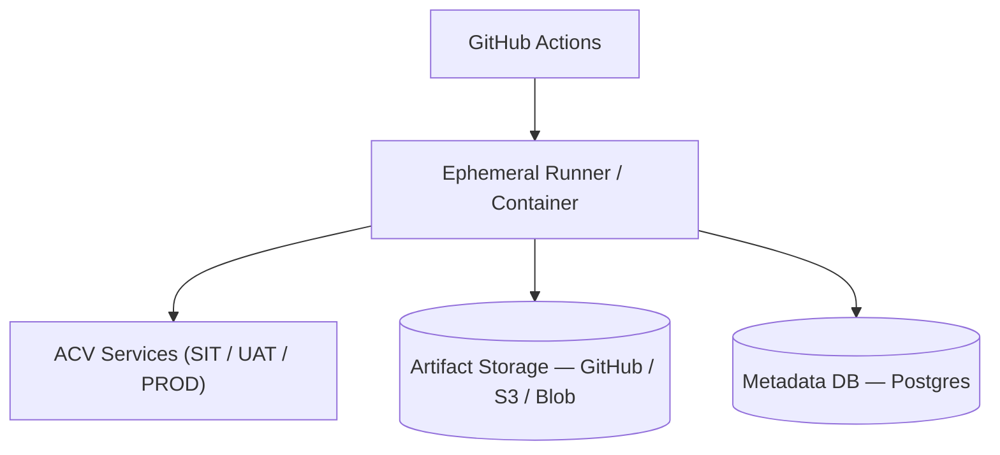

# Architecture and Deployment

## Component Responsibilities (expanded)

- Test Runner: Cucumber/JUnit-based runner executed in CI or local dev. Responsible for test orchestration and artifact collection.
- Framework Lib: `Utils`/`Config`/`APIResources` provide shared functionality for HTTP requests, token retrieval, and configuration.
- Report Store: CI artifacts (GitHub Actions) or long-term object store (S3/Blob) for HTML/PDF and raw logs.
- Metadata DB: optional Postgres/MySQL for aggregating trends and historical test results.

## Deployment Topology

## Infrastructure (where to find IaC)

- Terraform and cloud configuration are stored in `eai-3540813-infra/` in this workspace (files: `main.tf`, `backend.tf`, `provider.tf`, `modules/`). Use these modules to provision supporting infrastructure such as object storage and DB if required.

## CI Pipeline (practical)

1. Checkout code
2. Build with Maven
3. Run test suites (`mvn test`) — can be split into smoke and full runs
4. Collect artifacts (`Reports/`, `logging.txt`) and upload to artifact storage
5. Optionally, call a post-processing job to store metadata in DB

## Operational considerations
- Use isolated test accounts and environments (SIT/UAT) for running automation to avoid data corruption.
- Implement rate limiting in tests or configure throttling so that tests do not overwhelm ACV services.
