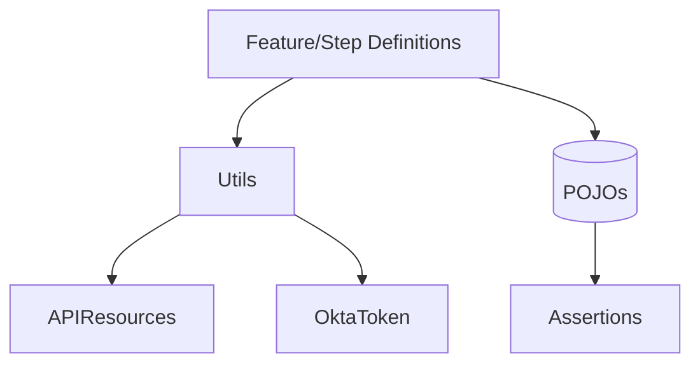

# Code Mapping & References

This document maps documentation sections to concrete code and configuration locations in the repository so engineers can quickly find implementations.

## Where to look (paths relative to workspace root)

- Test Runner / Cucumber options: `eai-3540813-acv-api-automation/src/test/java/com/acv/service/cucumber/options/TestRunner.java`
- Step definitions: `eai-3540813-acv-api-automation/src/test/java/com/acv/service/stepDefintions/` (e.g., `RequestOtp.java`)
- Framework utils: `eai-3540813-acv-api-automation/src/test/java/com/acv/service/resources/` (`Utils.java`, `Config.java`, `APIResources.java`, `OktaToken.java`)
- POJOs: `eai-3540813-acv-api-automation/src/main/java/com/acv/service/pojo/`
- Test data: `eai-3540813-acv-api-automation/Resource/TestData/SIT/`
- CI pipeline: `eai-3540813-acv-api-automation/.github/workflows/maven.yml`

## Direct mappings (doc → code)

- HLD `Auth & Config` → `src/test/java/com/acv/service/resources/Config.java` and `Utils.token()` in `Utils.java`
- LLD `Request/Response handling` → `Utils.requestSpecification(String url)` and RestAssured usage in step definitions
- `APIResources` enum → `src/test/java/com/acv/service/resources/APIResources.java` (centralized resource URIs)
- Feature files → `src/test/java/com/acv/service/features/*.feature`

## Dependency Graph (high level)

## How to locate code quickly

- Use IDE symbol search for class names such as `RequestOtp`, `GetOktaToken`, `TestRunner`.
- Open sample fixtures in `Resource/TestData/SIT/` to see real payloads exercised by tests.
