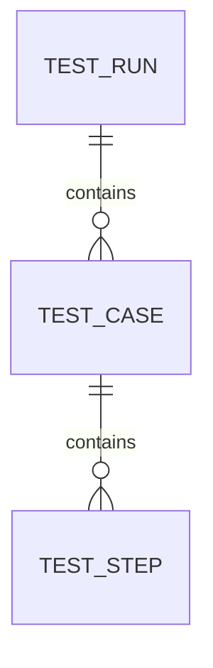

# Database Schema

This repository can store test run metadata and attachments for trend analysis. Below is a recommended relational schema and example DDL for a PostgreSQL-compatible DB that can be used to persist run metadata.



## Example DDL (Postgres)

```sql
CREATE TABLE test_run (
  id UUID PRIMARY KEY,
  start_time TIMESTAMP WITH TIME ZONE,
  end_time TIMESTAMP WITH TIME ZONE,
  environment TEXT,
  status TEXT,
  total_cases INT,
  passed_cases INT,
  failed_cases INT,
  artifacts_location TEXT
);

CREATE TABLE test_case (
  id UUID PRIMARY KEY,
  run_id UUID REFERENCES test_run(id) ON DELETE CASCADE,
  name TEXT,
  status TEXT,
  duration_ms BIGINT
);

CREATE TABLE test_step (
  id UUID PRIMARY KEY,
  case_id UUID REFERENCES test_case(id) ON DELETE CASCADE,
  name TEXT,
  request TEXT,
  response TEXT,
  status TEXT,
  attachment_ref TEXT
);

CREATE INDEX ix_test_run_start_time ON test_run(start_time);
CREATE INDEX ix_test_case_run_id ON test_case(run_id);
```

## Suggested usage
- Insert summary row into `test_run` at the beginning and update `end_time`/`status` at completion.
- Persist per-case results into `test_case` and store step-level request/response into `test_step` when detailed troubleshooting is required.

## Retention & Archival
- Store full attachments and raw logs for a short retention (e.g., 30 days) and keep aggregated metrics indefinitely (or archive to cold storage).
