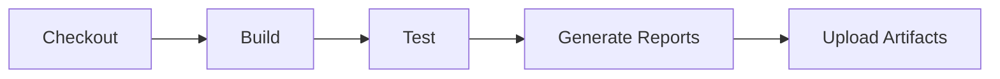
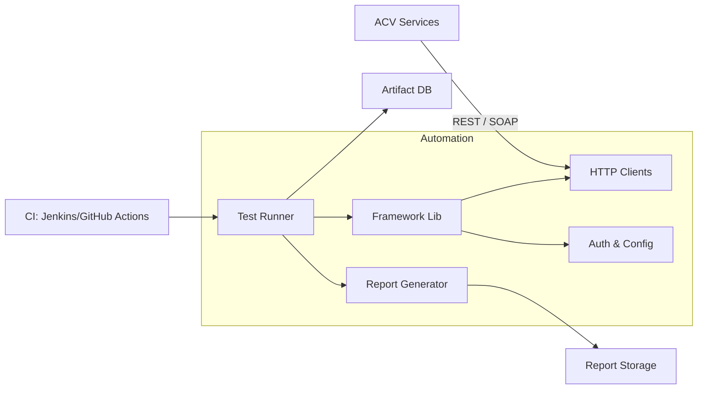
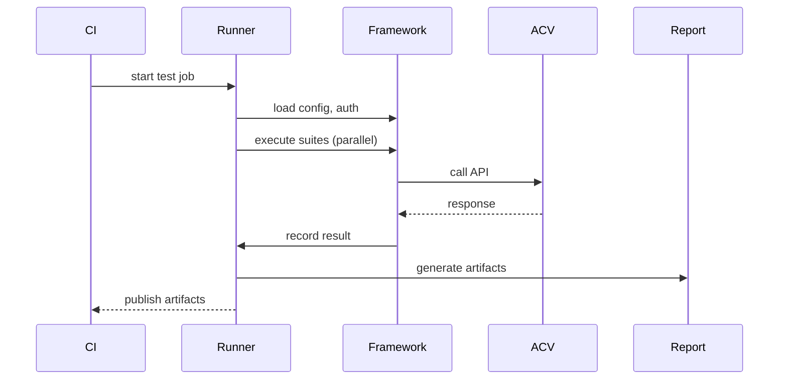
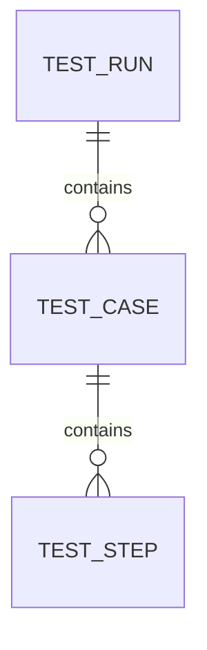

# Diagrams and Rendering

This file indexes the principal Mermaid diagrams used across the `acv-api-automation` documentation and provides rendering guidance.

Primary diagrams (source files under `diagrams-src/`):

- `ci_flowchart.mmd` — CI pipeline flow
- `system_context.mmd` — System context and dependencies
- `test_sequence.mmd` — Typical test execution sequence

Example: CI flow (embedded for quick reference)

Rendering notes
- Install the Mermaid CLI: `npm i -D @mermaid-js/mermaid-cli`
- Render: `npx @mermaid-js/mermaid-cli -i <src>.mmd -o <out>.svg`

Keep diagrams focused and split large diagrams into sub-diagrams when nodes exceed ~15.

Last Updated: 2026-04-02
# Consolidated Mermaid Diagrams

Below are the primary diagrams used across the HLD/LLD/architecture documents. Paste into a Mermaid-enabled viewer if they do not render inline.

## System Overview

## Test Execution Sequence

## ER Diagram (Database)

