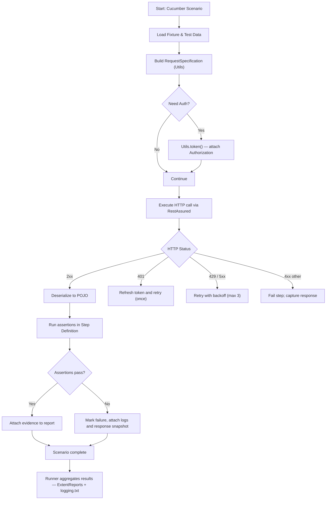
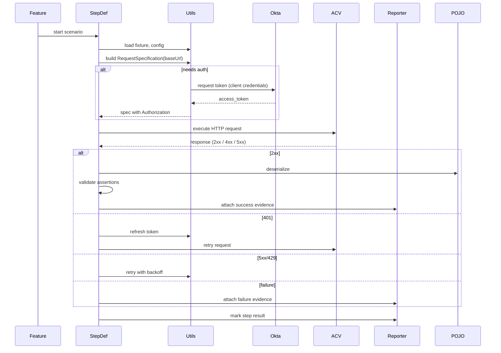

# Application Logic Flow

Purpose: Describe the orchestration of a single automated scenario from feature execution through HTTP call, response processing, assertions, and reporting.

## Overview Flow

## Sequence Diagram (detailed)

## Decision Points & Error Paths

- Auth failure: attempt token refresh once; if still 401, fail the scenario and attach token exchange logs.
- Rate limiting / server errors: retry with exponential backoff (recommend 3 attempts, e.g., 1s, 2s, 4s).
- Assertion failures: capture response body, request payload, and full headers to `logging.txt` and include in ExtentReports.

## Observability & Artifacts

- `logging.txt`: raw request/response traces (full HTTP exchange)
- ExtentReports HTML/PDF: human-readable result summary and attached evidence
- CI artifacts: zipped `Reports/` and `logging.txt` for post-failure triage

## Implementation Notes

- Keep `Utils.requestSpecification()` idempotent and thread-safe (avoid static mutable state).
- Parameterize retry counts and timeouts via `global.properties` and/or CI environment variables.
- Provide a test-mode for `OktaToken` to return a stubbed token when running against isolated test environments.

Last Updated: 2026-04-02
