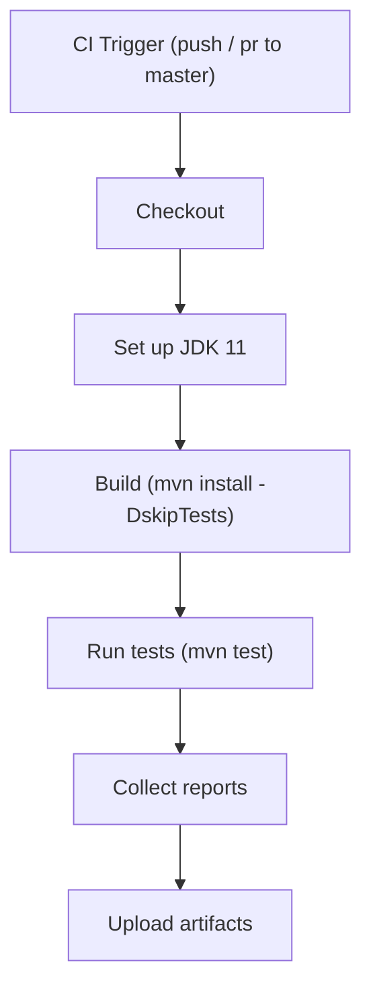
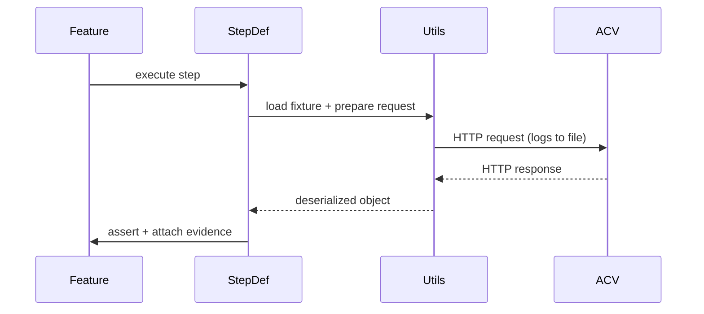

# Flows and Sequences (detailed)

## Test Execution Flow (CI)

The main CI flow is implemented in `.github/workflows/maven.yml`. A canonical flow:

Failure handling:
- Steps should `exit 1` on critical failures so CI marks the job failed.
- Upload raw `logging.txt` and partial reports on failure to aid triage.

## API Call Sequence (single test case)

## CI partitioning & parallelism
- Use job matrices to run across environment permutations (if required).
- For faster runs, split feature files into groups and run in parallel jobs. Use unique artifact directories per job.

## Notifications and post-processing
- On failure, create a short summary file (`failure-summary.txt`) and upload as an artifact.
- Optionally, a CI job can call a webhook to open a ticket or notify Slack with the artifact link.
