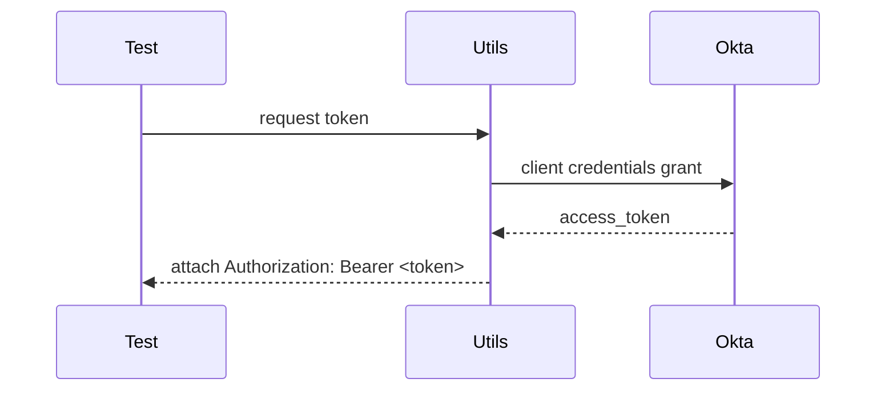

# Services and API Endpoints

This document lists the ACV endpoints exercised by the automation, where they are defined in code, sample payloads used in tests, and test strategies for each.

## Endpoints (as implemented)
- `RequestOTP` — logical name `RequestOTP` → URI `/acv/validations/v1/identity/request-otp` (see `APIResources.RequestOTP`)
- `GetCountryList` → `/acv/validations/config/v1/countries`
- `GetDocumentList` → `/acv/validations/config/v1/country/{country}/documents`
- `FetchPan` → `/fetchData`
- `GetOkta` → `/oktaToken/acv` (token retrieval)

These mappings are defined in `src/test/java/com/acv/service/resources/APIResources.java`.

## Sample Payloads

Request OTP (valid example, `Resource/TestData/SIT/RequestOTP/RequestOTPValid.json`):

```json
{
	"transactionUUID": "1235432341312",
	"countryCode": "IN",
	"records": [
		{
			"code": "AADHAAR-OTP",
			"recordDetails": {"recordId": "299929473625"}
		}
	]
}
```

Fetch PAN (example, `Resource/TestData/SIT/FetchPan/FetchPan.json`):

```json
{
	"transactionUUID": "6e159dca-bc7c-4325-ad58-c557a7d6c4c9",
	"countryCd": "IN",
	"dataType": "companyIdentity",
	"requestBody": {
		"panNumber": "{{pan}}",
		"getStatusInfo": true
	}
}
```

## Authentication

Token retrieval is performed by a utility/step (`OktaToken.java` and `Utils.token()`), and step definitions add auth headers when required. For SIT, the token logic is stubbed to return a placeholder; implementers must wire real Okta flows and store client secrets in CI.

### Auth Sequence (typical)



## Test strategies per endpoint
- Contract tests: validate response schema and mandatory fields using POJO deserialization
- Functional tests: positive/negative flows using fixtures under `Resource/TestData/SIT`
- Load/smoke tests: run small sets of critical scenarios under CI to verify runtime stability

## Error cases to include
- Invalid country codes, missing fields, malformed JSON (see `RequestOTPInValidCountry.json` and other invalid fixtures)
- Unauthorized and token expiry behavior
- Endpoint-specific errors (e.g., document not found)
