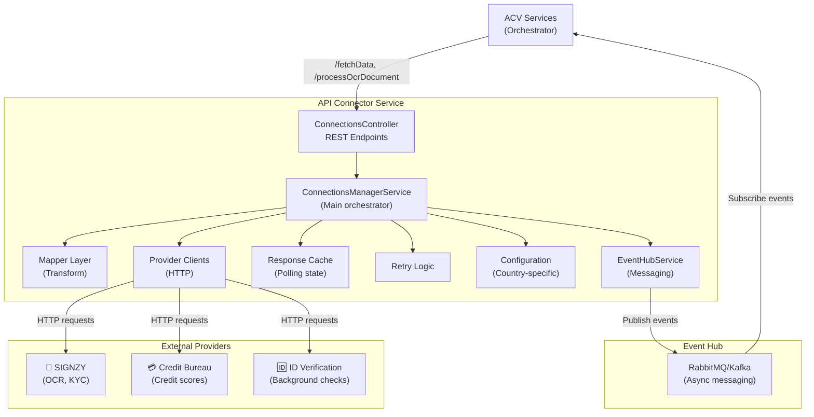
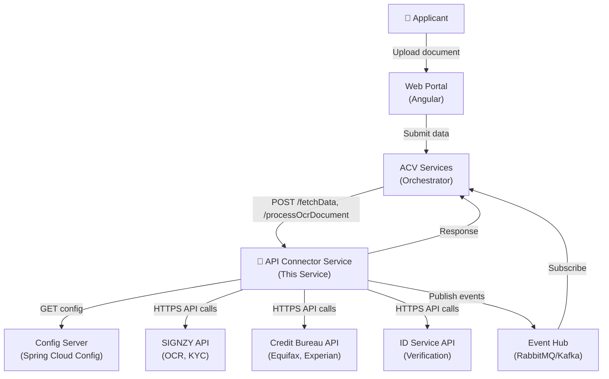
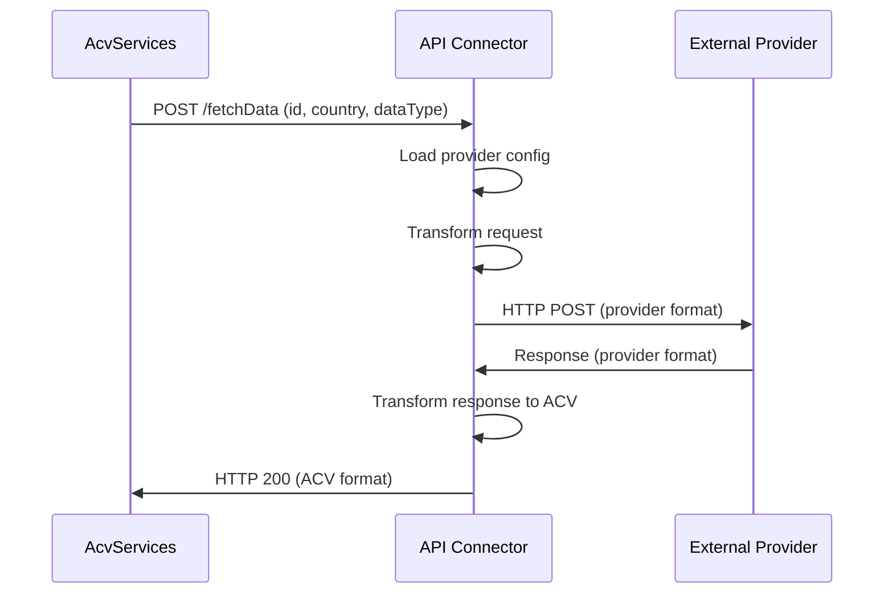
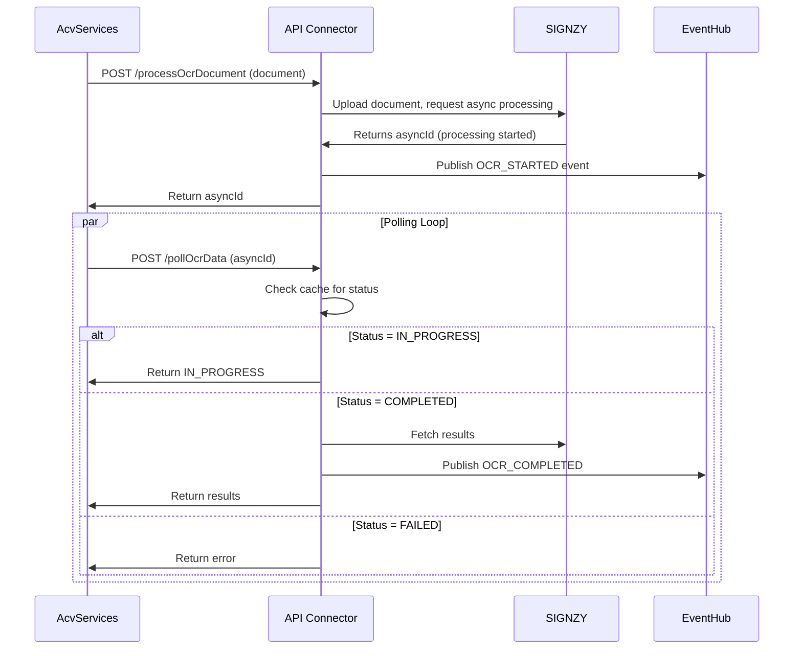
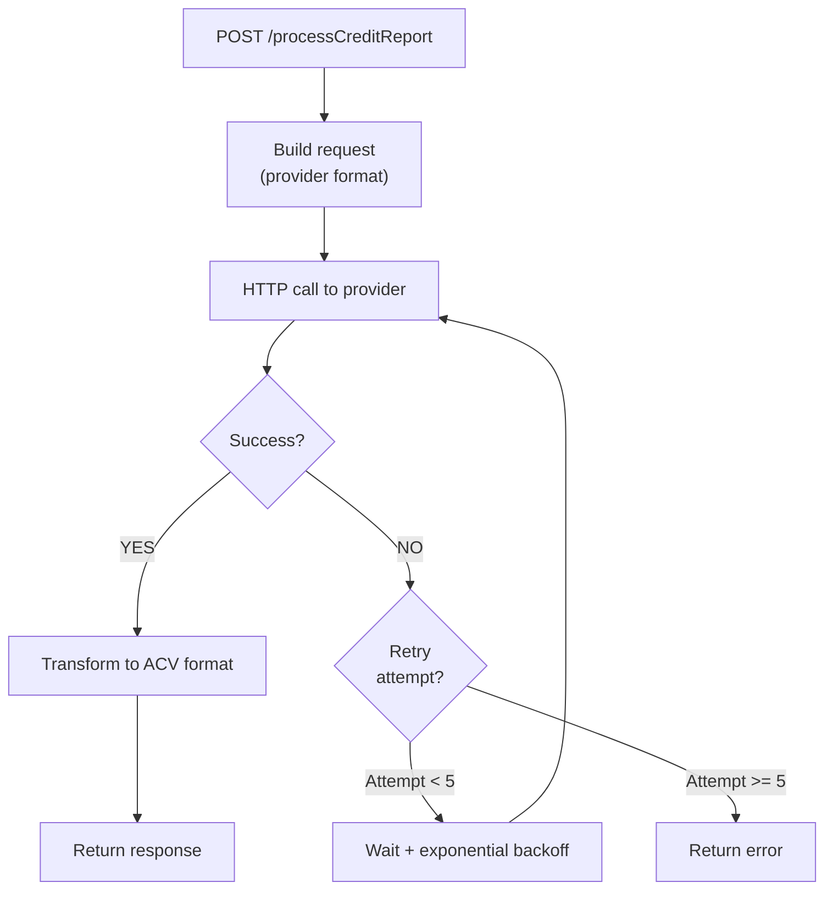

# ACV API Connector Service - High-Level Design

**Purpose:** Describe the overall architecture, major components, external integrations, and business flows for the ACV API Connector Service.

**Scope:** Microservice scope — the connector service as a standalone integration gateway, its role in the ACV platform ecosystem, provider integrations, and data transformation pipelines.

---

## 1. Purpose & Scope

### Business Purpose

The ACV API Connector Service is the **external API integration layer** for the Account Creation Validations platform. It abstracts the complexity of multiple third-party provider APIs (SIGNZY for OCR/KYC, credit bureaus, verification services) and provides a unified interface for internal ACV services to fetch, process, and analyze applicant data.

**Key Responsibility:**
- Act as a gateway between ACV platform and external data providers
- Translate provider-specific request/response formats to/from ACV standards
- Handle retries, polling, and error recovery for async operations
- Support multi-country configurations and document type mappings
- Publish events to Event Hub for downstream processing

### Scope Boundaries

**In Scope:**
- HTTP/REST communication with external provider APIs
- Request/response transformation and mapping
- Async polling for long-running operations
- Country/region-specific configurations
- Event publishing to Event Hub
- Retry logic and timeout handling
- Provider credential/authentication management

**Out of Scope:**
- Storing applicant data (API Services responsibility)
- Real-time transaction processing (handled by ACV Services)
- Final compliance decision-making (ACV Services responsibility)
- User authentication/authorization (API Gateway responsibility)
- Provider onboarding and contract management (Operations responsibility)

---

## 2. Business Context

### Stakeholders & Use Cases

| Stakeholder | Use Case | Interaction |
|-------------|----------|------------|
| **ACV Services** | Fetch applicant data from providers | Calls /fetchData, /processOcrDocument, etc. |
| **Compliance Officer** | Ensure document/data authenticity | Data flows through Connector Service |
| **Operations** | Configure provider endpoints/credentials | Updates via Config Server |
| **Data Provider** (SIGNZY, Credit Bureaus) | Receive requests, return data | Accepts HTTP API calls from Connector |
| **Applicant/Customer** | Data flows through verification | Indirect — data captured at partner APIs |
| **Security Team** | Ensure PII encryption in transit | mTLS enforced by API Gateway |

### Use Case Flows

**Use Case 1: Identity Verification via OCR**

```
1. Applicant uploads ID document via ACV Portal
2. ACV Services receives document
3. ACV Services calls Connector POST /processOcrDocument
4. Connector forwards to SIGNZY OCR API
5. SIGNZY returns asyncId (async operation started)
6. Connector publishes OCR_PROCESSING_STARTED event
7. ACV Services polls Connector GET /pollOcrData
8. Connector polls SIGNZY for results
9. SIGNZY returns extracted ID data
10. Connector publishes OCR_COMPLETED event
11. ACV Services receives OCR results
12. Results flow to Validation Engine for matching
```

**Use Case 2: Credit Report Fetching**

```
1. Applicant submits account application
2. ACV Services calls Connector POST /processCreditReport
3. Connector authenticates with credit bureau API
4. Credit bureau returns credit score + report summary
5. Connector transforms to ACV format
6. Response returned to ACV Services
7. ACV Services evaluates credit threshold
```

**Use Case 3: Polling for Async Results**

```
1. POST /processOcrDocument returns quickId
2. Provider processes asynchronously
3. ACV Services periodically calls POST /pollOcrData
4. Connector checks provider status cache
5. If complete, return results
6. If pending, return IN_PROGRESS
7. If failed, return error with root cause
```

---

## 3. Technology Stack

| Layer | Technology | Version | Rationale |
|-------|-----------|---------|-----------|
| **Runtime** | Java | 21 LTS | Type safety, garbage collection, mature ecosystem |
| **Runtime Container** | Spring Boot | 3.3.1 | Auto-configuration, microservice deployment |
| **REST API** | Spring Web | 3.3.1 | RESTful endpoints, JSON serialization |
| **HTTP Client** | RestTemplate + Spring Cloud | 3.3.1 | Async HTTP calls to external APIs |
| **Configuration** | Spring Cloud Config | 2024.x | Externalized config, environment-specific settings |
| **Security** | Spring Security + Okta | 3.0.6 | OAuth2/JWT token validation |
| **Async Messaging** | Spring Cloud Stream | Custom | EventHub integration (RabbitMQ/Kafka) |
| **Data Processing** | Jackson, Apache Tika | Latest | JSON parsing, file type detection |
| **Observability** | Micrometer + Prometheus | Latest | Metrics, distributed tracing |
| **Testing** | JUnit 5 + Mockito | Spring Boot 3.3.1 | Unit and integration testing |

---

## 4. Major Components

### System Architecture Diagram



### Component Responsibilities

#### 1. **ConnectionsController** (`controller/`)

- **Role:** HTTP REST API entry point
- **Responsibility:** Accept requests, deserialize JSON, delegate to service layer
- **Endpoints:**
  - `POST /fetchData` — Query generic data
  - `POST /processOcrDocument` — Async document processing
  - `POST /fetchOcrData` — Retrieve OCR results
  - `POST /pollOcrData` — Poll for async OCR
  - `POST /processCreditReport` — Fetch credit data
  - `GET /fetchProductIds/{desc}/{provider}` — Query provider products
  - `POST /analyzeDocumentLayout` — AI document analysis
  - And more (see [services.md](services.md))
- **Dependencies:** ConnectionsManagerService, EventHubService
- **File:** `ConnectionsController.java`

#### 2. **ConnectionsManagerService/Impl** (`service/`)

- **Role:** Main orchestrator and business logic
- **Responsibility:**
  - Route requests to appropriate providers
  - Transform incoming/outgoing data
  - Manage retry logic and timeouts
  - Cache polling states
  - Coordinate with external providers
  - Publish events
- **Key Methods:**
  - `fetchData(ConnectionRequest)` — Generic data fetch
  - `processOcrDocument(ConnectionRequest)` — Start OCR processing
  - `fetchOCRData(ConnectionRequest)` — Get OCR results
  - `pollOcrData(PollingRequest)` — Poll async results
  - `processCreditReport(ConnectionRequest)` — Fetch credit data
  - And more (12+ methods)
- **Files:**
  - `ConnectionsManagerService.java` (interface)
  - `ConnectionsManagerServiceImpl.java` (implementation, ~500+ lines)

#### 3. **Mapper Layer** (`mapper/config/`)

Transforms provider-specific formats to/from ACV standards:

| Mapper | Purpose |
|--------|---------|
| `ProviderAPIEndpointDetailsMapper` | Maps provider endpoints and credentials |
| `DynamicResponseVariablesMapper` | Extracts/transforms response fields |
| `CountryDocumentMappingConfiguration` | Country-specific document type mappings |
| `ACVStubConfiguration` | Standard ACV response format wrapping |
| `ThrowExceptionTransformer` | Error transformation and mapping |

**Example transformation:**
```
SIGNZY Response
├─ documentStatus: "SUCCESS"
├─ extractedData: { firstName: "John", ... }
└─ confidence: 0.95

          ↓ (Mapper transforms)

ACV Format Response
├─ data: { firstName: "John", ... }
├─ status: "SUCCESS"
├─ confidence: 0.95
└─ timestamp: "2026-04-02T10:15:00Z"
```

#### 4. **EventHubService/Impl** (`service/`)

- **Role:** Async event publishing and consumption
- **Responsibility:**
  - Publish events: OCR_PROCESSING_STARTED, CREDIT_REPORT_RECEIVED, etc.
  - Subscribe to config change events
  - Async notification to downstream services
- **File:** `EventHubServiceImpl.java`

#### 5. **Configuration Layer** (`config/`, `constants/`)

**Files:**

| File | Purpose |
|------|---------|
| `ConnectionsConfig.java` | Spring @Configuration for beans |
| `CountryDocumentMappingConfiguration.java | Country codes, document types, field mappings |
| `Providers.java` | Provider enum (SIGNZY, etc.) |
| `APIInterfaceConstants.java` | API endpoints, headers, constants |
| `CustomErrorCodes.java` | Error code mappings |
| `RecordCodeMapping.java` | Record type/status codes |

#### 6. **Model/DTO Layer** (`model/`)

**Request/Response objects:**

| Model | Purpose |
|-------|---------|
| `ConnectionRequest` | API request wrapper (transId, countryCode, dataType, requestBody) |
| `PollingRequest` | Async polling request (asyncId, status check) |
| `PollingTransaction` | State tracking for async operations |
| `Records` | Generic record wrapper |
| `RetryableRecordDetails` | Retry state and attempt tracking |
| `AdhocDocumentRequest` | Document generation request |
| `CategoryDTO` | Document category mapping |

#### 7. **Exception Handling** (`exception/`)

Custom exception hierarchy:

```
Throwable
└─ Exception
   ├─ InvalidRequestException (4xx errors: bad input)
   ├─ InternalProcessingException (5xx errors: provider error)
   └─ (handled by GlobalExceptionHandler)
```

---

## 5. System Context Diagram



**Key Relationships:**
- **ACV Services → API Connector** (Synchronous HTTP POST)
- **API Connector → External Providers** (Synchronous HTTP, provider-specific)
- **API Connector → Event Hub** (Asynchronous event publishing)
- **API Connector ← Config Server** (Configuration fetch on startup/refresh)

---

## 6. Primary Business Flows

### Flow 1: Synchronous Data Fetch



**Duration:** < 5 seconds (sync)
**Failure Handling:** Return error immediately, let ACV Services retry if needed

---

### Flow 2: Asynchronous Document Processing



**Duration:** 30-300 seconds (async with polling)
**Polling Interval:** Every 5-10 seconds
**Max Polling Time:** 5 minutes

---

### Flow 3: Credit Report Fetching with Retry



**Retry Policy:** Up to 5 attempts with exponential backoff
**Backoff Formula:** delay = min(300s, 1s * 2^attempt)

---

## 7. Non-Functional Requirements

| Requirement | Target | Rationale |
|-------------|--------|-----------|
| **Latency** | p50 < 2s (sync), async < 5min | Must not block account opening |
| **Throughput** | 500+ req/sec | Handle peak account opening load |
| **Availability** | 99.5% uptime | Compliance requirement |
| **Scalability** | Horizontal (K8s replicas) | Multi-region support |
| **Retry Logic** | 5 attempts max, exponential backoff | Handle provider transient failures |
| **Timeout** | 30-60s per provider call | Prevent hanging requests |
| **Circuit Breaker** | Available (optional Spring Cloud) | Protect from cascading failures |
| **Observability** | Logs, metrics, traces | Debugging and monitoring |
| **Security** | mTLS, OAuth2, encrypted credentials | PCI-DSS compliance |

---

## 8. Integration Points

### Upstream Callers

| System | Protocol | Frequency | Data Volume |
|--------|----------|-----------|------------|
| **ACV Services** | HTTP REST | Per applicant request | 100-1000 calls/min peak |
| **Document Service** | HTTP REST | Per document upload | 50-200 calls/min |
| **Configuration Portal** | HTTP REST | Via proxy | 10-50 calls/min |

### Downstream Dependencies

| System | Type | Purpose |
|--------|------|---------|
| **SIGNZY API** | HTTPS REST | OCR, KYC, document analysis |
| **Credit Bureau APIs** | HTTPS REST | Credit scores, reports |
| **ID Verification APIs** | HTTPS REST | Background checks, identity verification |
| **Config Server** | HTTP REST | Load provider config/credentials |
| **Event Hub** (RabbitMQ/Kafka) | AMQP/KAFKA | Async event publishing |

---

## 9. Provider Details

### SIGNZY Integration

| Property | Value |
|----------|-------|
| **Purpose** | OCR, KYC, document analysis |
| **API Type** | REST + file upload |
| **Authentication** | API key in headers |
| **Operations** | processOcrDocument, fetchOcrData, analyzeDocumentLayout |
| **Async Support** | Yes (polling required) |
| **Response Format** | JSON with metadata |

### Credit Bureau Integration

| Property | Value |
|----------|-------|
| **Purpose** | Credit scores, credit reports, financial data |
| **API Type** | REST + XML |
| **Authentication** | OAuth2 / API key |
| **Operations** | processCreditReport, fetchCreditReportData |
| **Async Support** | Yes (polling required) |
| **Response Format** | XML/JSON hybrid |

---

## 10. Key Design Decisions

| Decision | Rationale | Trade-off |
|----------|-----------|-----------|
| **Unified request format** | Simplify ACV Services clients | Slight overhead in mapping logic |
| **Async polling** | Handle long-running provider operations | Complexity in state management |
| **Config Server for credentials** | Rotate secrets without redeployment | Dependency on config server; requires sync |
| **Event Hub publishing** | Decouple async operations | Additional infrastructure (RabbitMQ/Kafka) |
| **Retry with exponential backoff** | Handle transient provider failures | May delay processing during outages |
| **Provider-specific mappers** | Support multiple providers easily | More mapper classes to maintain |
| **Cache polling state** | Avoid repeated provider calls | Memory usage grows with active polls |

---

## 11. Assumptions & Constraints

### Assumptions

1. **Provider APIs are stable** — Providers maintain documented contracts and backward compatibility
2. **Network latency < 30s** — Provider APIs respond within 30 seconds
3. **Credentials managed securely** — Config Server handles encrypted storage
4. **No buffering of large documents** — Documents < 100MB size
5. **Polling is acceptable** — ACV Services can tolerate 5-300s latency for async operations
6. **Single provider winner pattern** — Only one provider called per request type

### Constraints

1. **No persistent queue** — Polling uses in-memory cache only (lost on restart)
2. **No automatic failover between providers** — Must be configured explicitly
3. **Synchronous timeout 30s max** — Longer operations must be async
4. **Provider request/response limits** — Size restrictions per provider API
5. **No transcoding** — Document format translation not supported

---

## 12. Future Roadmap

| Feature | Timeline | Business Value |
|---------|----------|-----------------|
| **Circuit Breaker Pattern** | Q2 2026 | Prevent cascade failures during provider outages |
| **Multi-Provider Failover** | Q3 2026 | Resilience through backup providers |
| **Caching Layer** (Redis) | Q3 2026 | Reduce provider API calls for common requests |
| **GenAI Document Analysis** | Q2 2026 | Enhanced document understanding beyond OCR |
| **Provider Performance Metrics** | Q2 2026 | Track provider SLAs and reliability |
| **Request/Response Logging** | Q1 2026 | Full audit trail for compliance |
| **Rate Limiting per Provider** | Q2 2026 | Respect provider API quotas |

---

## Cross-References

- [Low-Level Design (LLD.md)](LLD.md) — Code structure and class details
- [Service Contracts (services.md)](services.md) — REST API request/response schemas
- [Code Mapping (code-mapping.md)](code-mapping.md) — Class inventory and dependencies
- [Glossary (glossary.md)](glossary.md) — Terminology definitions

---

**Last Updated:** 2026-04-02  
**Version:** 1.1.8  
**Audience:** Architects, Senior Engineers, Product Managers
