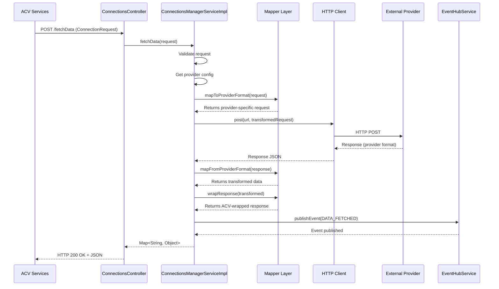

# ACV API Connector Service - Low-Level Design

**Purpose:** Deep-dive into code organization, class responsibilities, method signatures, data models, design patterns, and request-response lifecycle.

**Scope:** Single service scope — internal code structure, Spring components, DTOs, execution flow.

---

## 1. Code Organization

### Package Structure

```
com.fedex.acv.connections/
│
├── controller/
│   ├── ConnectionsController.java                # Main REST API endpoints
│   └── ConfigPortalProxyController.java          # Config portal proxy
│
├── service/
│   ├── ConnectionsManagerService.java            (I) Service interface
│   ├── EventHubService.java                      (I) Event interface
│   └── impl/
│       ├── ConnectionsManagerServiceImpl.java     → Main implementation
│       └── EventHubServiceImpl.java               → Event handling
│
├── mapper/
│   └── config/
│       ├── ProviderAPIEndpointDetailsMapper.java
│       ├── DynamicResponseVariablesMapper.java
│       ├── CountryDocumentMappingConfiguration.java
│       ├── ACVStubConfiguration.java
│       └── ThrowExceptionTransformer.java
│
├── model/
│   ├── ConnectionRequest.java                    # Request payload
│   ├── PollingRequest.java                       # Polling request
│   ├── PollingTransaction.java                   # Polling state
│   ├── Records.java                              # Record wrapper
│   ├── RetryableRecordDetails.java               # Retry tracking
│   ├── AdhocDocumentRequest.java                 # Document generation
│   ├── CategoryDTO.java
│   └── AcvApiInterfaceDTO.java
│
├── config/
│   └── ConnectionsConfig.java                    # Spring @Configuration
│
├── constants/
│   ├── Providers.java                            # Provider enum
│   ├── APIInterfaceConstants.java                # API constants
│   ├── CustomErrorCodes.java                     # Error codes
│   └── RecordCodeMapping.java                    # Record type mappings
│
├── exception/
│   ├── InvalidRequestException.java
│   ├── InternalProcessingException.java
│   ├── GlobalExceptionHandler.java               # @ControllerAdvice
│   └── GlobalCustomErrorResponse.java
│
├── analyzeDocument/
│   └── dto/
│       ├── AnalyzeDocumentLayoutResponse.java
│       └── (more document analysis DTOs)
│
└── AcvApiConnectorServiceApplication.java        # Spring Boot entry
```

**Legend:** `(I)` = Interface, no suffix = Concrete class

---

## 2. Core Classes & Responsibilities

### 2.1 Controller Layer

#### ConnectionsController

```java
@RestController
@Slf4j
@Tag(name = "ACV API Connection Controller")
@Observed(name = "api-connector", lowCardinalityKeyValues = { ... })
public class ConnectionsController {
    
    @Autowired
    ConnectionsManagerService connectionsManagerService;
    
    @Autowired
    EventHubService eventHubService;
    
    // Main Endpoints
    @PostMapping("fetchData")
    public ResponseEntity<Map<String, Object>> fetchData(
        @Valid @RequestBody ConnectionRequest connectionRequest) {
        log.info("fetchData - entry");
        Map<String, Object> response = 
            connectionsManagerService.fetchData(connectionRequest);
        return new ResponseEntity<>(response, HttpStatus.OK);
    }
    
    @PostMapping("processOcrDocument")
    public ResponseEntity<Map<String, Object>> processOcrDocument(
        @Valid @RequestBody ConnectionRequest connectionRequest) {
        log.info("processOcrDocument - entry");
        Map<String, Object> response = 
            connectionsManagerService.processOcrDocument(connectionRequest);
        return new ResponseEntity<>(response, HttpStatus.OK);
    }
    
    @PostMapping("fetchOcrData")
    public ResponseEntity<Map<String, Object>> fetchOcrData(
        @Valid @RequestBody ConnectionRequest connectionRequest) {
        log.info("fetchOcrData - entry");
        Map<String, Object> response = 
            connectionsManagerService.fetchOCRData(connectionRequest);
        return new ResponseEntity<>(response, HttpStatus.OK);
    }
    
    @PostMapping("pollOcrData")
    public void pollOcrData(@RequestBody PollingRequest request) {
        this.connectionsManagerService.pollOcrData(request);
    }
    
    @PostMapping("processCreditReport")
    public ResponseEntity<Map<String, Object>> processCreditReport(
        @Valid @RequestBody ConnectionRequest connectionRequest)
        throws JsonProcessingException {
        log.info("processCreditReport - entry");
        Map<String, Object> response = 
            connectionsManagerService.processCreditReport(connectionRequest);
        return new ResponseEntity<>(response, HttpStatus.OK);
    }
    
    // ... more endpoints
}
```

**Responsibility:**
- HTTP REST endpoints (12+ methods)
- Request validation (@Valid)
- Delegate to service layer
- Serialize responses to JSON
- Error handling via GlobalExceptionHandler

**Key Endpoints:**
- `POST /fetchData` — Generic data fetch
- `POST /processOcrDocument` — Start OCR processing
- `POST /fetchOcrData` — Get OCR results
- `POST /pollOcrData` — Poll async OCR
- `POST /processCreditReport` — Fetch credit data
- `GET /fetchProductIds/{desc}/{provider}` — Query products
- `POST /analyzeDocumentLayout` — AI document analysis
- `POST /structuredOutput` — Extract structured data

---

### 2.2 Service Layer

#### ConnectionsManagerService (Interface)

```java
public interface ConnectionsManagerService {
    Map<String, Object> fetchData(ConnectionRequest connectionRequest);
    Map<String, Object> processOcrDocument(ConnectionRequest connectionRequest);
    Map<String, Object> fetchOCRData(ConnectionRequest connectionRequest);
    void pollOcrData(PollingRequest request);
    AnalyzeDocumentLayoutResponse analyzeDocumnetLayout(
        ConnectionRequest connectionRequest);
    Map<String, Object> structuredOutput(ConnectionRequest connectionRequest);
    Map<String, Object> processOcrDocumentByGenAi(
        ConnectionRequest connectionRequest);
    Map<String, Object> processCreditReport(ConnectionRequest connectionRequest)
        throws JsonProcessingException;
    String fetchCreditReportData(ConnectionRequest connectionRequest)
        throws JsonProcessingException;
    void pollCreditData(PollingRequest request);
    List<Object> fetchDataFromDataService(String endPoint,
        List<Parameter> requestBody);
    Map<String, Object> fetchDataFromSchedulerService(String endPoint);
    String fetchProductIds(String description, String provider);
    byte[] generateDocument(String countryCode, AdhocDocumentRequest requestBody);
}
```

#### ConnectionsManagerServiceImpl (Main Implementation)

```java
@Service
@Slf4j
@Observed(name = "api-connector", lowCardinalityKeyValues = { ... })
public class ConnectionsManagerServiceImpl 
    implements ConnectionsManagerService {
    
    private final MultiHttpClientProvider httpClientProvider;
    private final ServiceProvidersProperties serviceProperties;
    private final ProviderAPIEndpointDetailsMapper endpointMapper;
    private final DynamicResponseVariablesMapper responseMapper;
    private final CountryDocumentMappingConfiguration countryConfig;
    private final ConnectionsConfig connectionsConfig;
    private final Map<String, PollingTransaction> pollingCache;
    
    @Override
    public Map<String, Object> fetchData(ConnectionRequest request) {
        try {
            log.info("fetchData - processing request transId={}",
                request.getTransactionUUID());
            
            // Step 1: Validate request
            if (request.getCountryCode() == null) {
                throw new InvalidRequestException("countryCode required");
            }
            
            // Step 2: Get provider configuration
            ServiceProviderProperties providerProps =
                getProviderConfig(request.getDataType());
            
            // Step 3: Transform request to provider format
            Map<String, Object> providerRequest =
                transformRequestToProvider(request, providerProps);
            
            // Step 4: Call external provider
            AbstractHttpClient httpClient =
                httpClientProvider.getClient(request.getDataType());
            String providerResponse = httpClient.post(
                providerProps.getApiBaseUrl() + "/fetch",
                providerRequest
            );
            
            // Step 5: Transform response to ACV format
            Map<String, Object> acvResponse =
                transformResponseToAcv(providerResponse, request);
            
            // Step 6: Publish event
            publishEvent("DATA_FETCHED", request.getTransactionUUID());
            
            log.info("fetchData - completed successfully");
            return acvResponse;
            
        } catch (HttpClientErrorException e) {
            log.error("fetchData - provider error", e);
            return buildErrorResponse(e);
        } catch (Exception e) {
            log.error("fetchData - internal error", e);
            throw new InternalProcessingException("Failed to fetch data", e);
        }
    }
    
    @Override
    public Map<String, Object> processOcrDocument(
        ConnectionRequest request) {
        try {
            log.info("processOcrDocument - entry");
            
            // Extract document from request
            byte[] documentBytes = extractDocumentBytes(request);
            String documentType = request.getRequestBody()
                .get("documentType").toString();
            
            // Get SIGNZY configuration
            ServiceProviderProperties signzyProps =
                getProviderConfig("OCR");
            
            // Build multipart request
            MultipartBodyBuilder builder = new MultipartBodyBuilder();
            builder.part("document", 
                new ByteArrayResource(documentBytes))
                .filename(documentType);
            builder.part("documentType", documentType);
            
            // Call SIGNZY API (async)
            AbstractHttpClient httpClient =
                httpClientProvider.getClient("OCR");
            String responseJson = httpClient.multipartPost(
                signzyProps.getApiBaseUrl() + "/process",
                builder.build()
            );
            
            // Parse response to get asyncId
            ObjectMapper mapper = new ObjectMapper();
            JsonNode jsonResponse = mapper.readTree(responseJson);
            String asyncId = jsonResponse.get("transactionId").asText();
            
            // Cache polling state
            PollingTransaction transaction =
                PollingTransaction.builder()
                    .asyncId(asyncId)
                    .originalRequest(request)
                    .status("PROCESSING")
                    .startTime(LocalDateTime.now())
                    .maxWaitSeconds(300)
                    .build();
            pollingCache.put(asyncId, transaction);
            
            // Publish event
            publishEvent("OCR_PROCESSING_STARTED", asyncId);
            
            // Return response with asyncId
            return Map.of(
                "data", Map.of("asyncId", asyncId),
                "status", "IN_PROGRESS",
                "transId", request.getTransactionUUID()
            );
            
        } catch (Exception e) {
            log.error("processOcrDocument - error", e);
            throw new InternalProcessingException("OCR processing failed", e);
        }
    }
    
    @Override
    public void pollOcrData(PollingRequest request) {
        try {
            log.info("pollOcrData - checking status for asyncId={}",
                request.getAsyncId());
            
            // Get cached transaction
            PollingTransaction transaction =
                pollingCache.get(request.getAsyncId());
            
            if (transaction == null) {
                log.warn("No transaction found for asyncId={}",
                    request.getAsyncId());
                return;
            }
            
            // Check if max wait time exceeded
            long elapsedSeconds = ChronoUnit.SECONDS.between(
                transaction.getStartTime(), LocalDateTime.now());
            
            if (elapsedSeconds > transaction.getMaxWaitSeconds()) {
                transaction.setStatus("TIMEOUT");
                publishEvent("OCR_TIMEOUT", request.getAsyncId());
                return;
            }
            
            // Call SIGNZY to check status
            ServiceProviderProperties signzyProps =
                getProviderConfig("OCR");
            AbstractHttpClient httpClient =
                httpClientProvider.getClient("OCR");
            
            String statusResponse = httpClient.get(
                signzyProps.getApiBaseUrl() + "/status/" 
                    + request.getAsyncId()
            );
            
            // Parse provider response
            ObjectMapper mapper = new ObjectMapper();
            JsonNode jsonResponse = mapper.readTree(statusResponse);
            String providerStatus = 
                jsonResponse.get("status").asText();
            
            // Map provider status to ACV status
            if (providerStatus.equals("COMPLETED")) {
                transaction.setStatus("COMPLETED");
                transaction.setData(jsonResponse.get("result"));
                publishEvent("OCR_COMPLETED", request.getAsyncId());
            } else if (providerStatus.equals("FAILED")) {
                transaction.setStatus("FAILED");
                String error = jsonResponse.get("error").asText();
                transaction.setError(error);
                publishEvent("OCR_FAILED", request.getAsyncId());
            }
            // else: still PROCESSING
            
        } catch (Exception e) {
            log.error("pollOcrData - error", e);
            throw new InternalProcessingException("Poll failed", e);
        }
    }
    
    @Override
    public Map<String, Object> processCreditReport(
        ConnectionRequest request) throws JsonProcessingException {
        try {
            log.info("processCreditReport - entry");
            
            // Get credit bureau config
            ServiceProviderProperties creditProps =
                getProviderConfig("CREDIT_REPORT");
            
            // Build request with retry logic
            Map<String, Object> response = retryWithBackoff(() -> {
                AbstractHttpClient httpClient =
                    httpClientProvider.getClient("CREDIT_REPORT");
                
                return httpClient.post(
                    creditProps.getApiBaseUrl() + "/get-report",
                    request.getRequestBody()
                );
            }, connectionsConfig.getRetryAttempts());
            
            // Publish event
            publishEvent("CREDIT_REPORT_FETCHED",
                request.getTransactionUUID());
            
            return response;
            
        } catch (Exception e) {
            log.error("processCreditReport - error", e);
            throw new InternalProcessingException("Credit report failed", e);
        }
    }
    
    // Helper Methods
    
    private String transformRequestToProvider(
        ConnectionRequest request,
        ServiceProviderProperties providerProps) {
        // Use ProviderAPIEndpointDetailsMapper
        return endpointMapper.mapToProviderFormat(request, providerProps);
    }
    
    private Map<String, Object> transformResponseToAcv(
        String providerResponse,
        ConnectionRequest request) {
        // Use DynamicResponseVariablesMapper
        Map<String, Object> transformed =
            responseMapper.mapFromProviderFormat(providerResponse);
        
        // Wrap in ACV format
        return ACVStubConfiguration.wrapResponse(transformed);
    }
    
    private ServiceProviderProperties getProviderConfig(
        String dataType) {
        return serviceProperties.getProvider(dataType);
    }
    
    private byte[] extractDocumentBytes(
        ConnectionRequest request) {
        String base64Doc = request.getRequestBody()
            .get("document").toString();
        return Base64.getDecoder().decode(base64Doc);
    }
    
    private <T> T retryWithBackoff(
        Callable<T> operation, int maxAttempts) {
        int attempt = 0;
        long delay = 1000; // Start with 1 second
        
        while (attempt < maxAttempts) {
            try {
                return operation.call();
            } catch (Exception e) {
                attempt++;
                if (attempt >= maxAttempts) {
                    throw new InternalProcessingException(
                        "Max retries exceeded", e);
                }
                try {
                    Thread.sleep(delay);
                    delay = Math.min(300000, delay * 2); // Exponential backoff
                } catch (InterruptedException ie) {
                    Thread.currentThread().interrupt();
                    throw new InternalProcessingException(
                        "Retry interrupted", ie);
                }
            }
        }
        return null;
    }
    
    private void publishEvent(String eventType, String transId) {
        eventHubService.publishEvent(eventType, transId);
    }
}
```

**Responsibility:**
- Core business logic orchestration
- Provider integration and API calls
- Request/response transformation
- Retry logic with exponential backoff
- Polling state management (cache)
- Event publishing
- Error handling and mapping

---

### 2.3 Mapper Layer

#### ProviderAPIEndpointDetailsMapper

```java
@Component
@Slf4j
public class ProviderAPIEndpointDetailsMapper {
    
    @Autowired
    ServiceProvidersProperties serviceProperties;
    
    /**
     * Transform ACV ConnectionRequest to provider-specific format.
     */
    public String mapToProviderFormat(
        ConnectionRequest request,
        ServiceProviderProperties providerProps) {
        
        ObjectMapper mapper = new ObjectMapper();
        
        // Build provider-specific request
        ObjectNode providerRequest = mapper.createObjectNode();
        
        // Add provider-specific headers/fields
        providerRequest.put("apiKey", providerProps.getApiKey());
        providerRequest.put("transactionId",
            request.getTransactionUUID());
        providerRequest.put("countryCode",
            request.getCountryCode());
        
        // Add request body data
        request.getRequestBody().forEach((key, value) -> {
            providerRequest.putPOJO(key, value);
        });
        
        return providerRequest.toString();
    }
}
```

#### DynamicResponseVariablesMapper

```java
@Component
@Slf4j
public class DynamicResponseVariablesMapper {
    
    /**
     * Extract and transform provider response to ACV format.
     */
    public Map<String, Object> mapFromProviderFormat(
        String providerResponse) {
        
        try {
            ObjectMapper mapper = new ObjectMapper();
            JsonNode jsonResponse = mapper.readTree(providerResponse);
            
            // Extract key fields
            Map<String, Object> result = new HashMap<>();
            
            // Provider-specific field mapping
            if (jsonResponse.has("data")) {
                result.put("data", jsonResponse.get("data"));
            }
            if (jsonResponse.has("status")) {
                result.put("providerStatus",
                    jsonResponse.get("status").asText());
            }
            if (jsonResponse.has("confidence")) {
                result.put("confidence",
                    jsonResponse.get("confidence").asDouble());
            }
            
            return result;
            
        } catch (Exception e) {
            log.error("Failed to map provider response", e);
            throw new InternalProcessingException(
                "Response mapping failed", e);
        }
    }
}
```

#### CountryDocumentMappingConfiguration

```java
@Component
@Slf4j
public class CountryDocumentMappingConfiguration {
    
    private static final Map<String, List<String>>
        COUNTRY_DOCUMENT_TYPES = Map.ofEntries(
        
        Map.entry("US", List.of(
            "DRIVERS_LICENSE",
            "PASSPORT",
            "STATE_ID",
            "MILITARY_ID"
        )),
        Map.entry("CA", List.of(
            "DRIVERS_LICENSE",
            "PASSPORT",
            "PROVINCIAL_ID"
        )),
        Map.entry("MX", List.of(
            "DRIVERS_LICENSE",
            "PASSPORT",
            "FEDERAL_ID"
        )),
        Map.entry("UK", List.of(
            "DRIVING_LICENSE",
            "PASSPORT",
            "NATIONAL_ID"
        ))
    );
    
    public List<String> getDocumentTypesForCountry(
        String countryCode) {
        return COUNTRY_DOCUMENT_TYPES.getOrDefault(
            countryCode, Collections.emptyList());
    }
    
    public boolean isValidDocumentType(
        String countryCode, String docType) {
        List<String> allowed =
            getDocumentTypesForCountry(countryCode);
        return allowed.contains(docType);
    }
}
```

#### ACVStubConfiguration

```java
@Component
public class ACVStubConfiguration {
    
    /**
     * Wrap provider response in standard ACV format.
     */
    public static Map<String, Object> wrapResponse(
        Map<String, Object> providerData) {
        
        return Map.of(
            "data", providerData,
            "status", "SUCCESS",
            "timestamp", LocalDateTime.now().toString(),
            "version", "1.1.8"
        );
    }
    
    public static Map<String, Object> wrapErrorResponse(
        String errorCode, String errorMessage) {
        
        return Map.of(
            "data", Map.of(),
            "status", "FAILURE",
            "errorCode", errorCode,
            "message", errorMessage,
            "timestamp", LocalDateTime.now().toString()
        );
    }
}
```

---

### 2.4 Model/DTO Layer

#### ConnectionRequest

```java
@Data
@NoArgsConstructor
@AllArgsConstructor
@ToString
@Builder
public class ConnectionRequest {
    
    @NotEmpty(message = "transactionUUID is required")
    private String transactionUUID;
    
    @NotEmpty(message = "countryCode is required")
    private String countryCode;
    
    @NotEmpty(message = "dataType is required")
    private String dataType;
    
    private String opsType;  // SYNC or ASYNC
    
    private int retryCount;
    
    private String validationType;
    
    private boolean validateFromGenAI;
    
    @NotEmpty(message = "requestBody is required")
    private Map<String, Object> requestBody;
}
```

#### PollingRequest

```java
@Data
@NoArgsConstructor
@AllArgsConstructor
@Builder
public class PollingRequest {
    
    @NotEmpty
    private String asyncId;
    
    private String status;  // PENDING, COMPLETED, FAILED
    
    private int checkCount;
    
    private LocalDateTime requestTime;
}
```

#### PollingTransaction

```java
@Data
@NoArgsConstructor
@AllArgsConstructor
@Builder
public class PollingTransaction {
    
    private String asyncId;
    
    private ConnectionRequest originalRequest;
    
    private String status;  // PROCESSING, COMPLETED, FAILED, TIMEOUT
    
    private LocalDateTime startTime;
    
    private LocalDateTime completionTime;
    
    private int maxWaitSeconds;
    
    private JsonNode data;
    
    private String error;
    
    private int pollCount;
}
```

---

### 2.5 Exception Handling

#### GlobalExceptionHandler

```java
@ControllerAdvice
@Slf4j
public class GlobalExceptionHandler {
    
    @ExceptionHandler(InvalidRequestException.class)
    public ResponseEntity<GlobalCustomErrorResponse> handleInvalidRequest(
        InvalidRequestException e, HttpServletRequest request) {
        
        log.warn("Invalid request: {}", e.getMessage());
        
        GlobalCustomErrorResponse response =
            GlobalCustomErrorResponse.builder()
                .status(HttpStatus.BAD_REQUEST.value())
                .message(e.getMessage())
                .path(request.getRequestURI())
                .timestamp(LocalDateTime.now())
                .errorCode("INVALID_REQUEST")
                .build();
        
        return ResponseEntity
            .status(HttpStatus.BAD_REQUEST)
            .body(response);
    }
    
    @ExceptionHandler(InternalProcessingException.class)
    public ResponseEntity<GlobalCustomErrorResponse> handleInternalError(
        InternalProcessingException e, HttpServletRequest request) {
        
        log.error("Internal processing error", e);
        
        GlobalCustomErrorResponse response =
            GlobalCustomErrorResponse.builder()
                .status(HttpStatus.INTERNAL_SERVER_ERROR.value())
                .message(e.getMessage())
                .path(request.getRequestURI())
                .timestamp(LocalDateTime.now())
                .errorCode("INTERNAL_ERROR")
                .build();
        
        return ResponseEntity
            .status(HttpStatus.INTERNAL_SERVER_ERROR)
            .body(response);
    }
    
    @ExceptionHandler(HttpClientErrorException.class)
    public ResponseEntity<GlobalCustomErrorResponse> handleHttpError(
        HttpClientErrorException e, HttpServletRequest request) {
        
        log.error("Provider API error: {} - {}", e.getStatusCode(),
            e.getMessage());
        
        GlobalCustomErrorResponse response =
            GlobalCustomErrorResponse.builder()
                .status(e.getStatusCode().value())
                .message("Provider API error: " + e.getMessage())
                .path(request.getRequestURI())
                .timestamp(LocalDateTime.now())
                .errorCode("PROVIDER_ERROR")
                .build();
        
        return ResponseEntity
            .status(e.getStatusCode())
            .body(response);
    }
}
```

---

## 3. Request/Response Lifecycle Sequence Diagram



---

## 4. Design Patterns Used

### Pattern 1: Adapter/Bridge Pattern
**Location:** Mapper layer  
**Purpose:** Decouple ACV format from provider-specific formats  
**Implementation:**
```
ACV Request
    ↓ (ProviderAPIEndpointDetailsMapper)
Provider Request
    ↓ (Provider API call)
Provider Response
    ↓ (DynamicResponseVariablesMapper)
ACV Response
```

### Pattern 2: Retry with Exponential Backoff
**Location:** ConnectionsManagerServiceImpl.retryWithBackoff()  
**Purpose:** Handle transient provider failures  
**Implementation:**
```java
delay = min(300s, 1s * 2^attempt)
Attempt 1: 1s delay
Attempt 2: 2s delay
Attempt 3: 4s delay
Attempt 4: 8s delay
Attempt 5: timeout after 15s total
```

### Pattern 3: Cache for Polling State
**Location:** pollingCache in ConnectionsManagerServiceImpl  
**Purpose:** Avoid re-fetching polling status  
**Implementation:**
```
POST /processOcrDocument
    ↓ cache asyncId → PollingTransaction
    
POST /pollOcrData
    ↓ lookup in cache
    ├─ if PROCESSING: query provider
    ├─ if COMPLETED: return results from cache
    └─ if FAILED: return error
```

---

## 5. Configuration & Constants

### APIInterfaceConstants.java

```java
public class APIInterfaceConstants {
    
    public static final String SIGNZY_BASE_URL =
        "https://api.signzy.com/v1";
    public static final String SIGNZY_OCR_ENDPOINT = "/process";
    public static final String SIGNZY_POLL_ENDPOINT = "/status";
    
    public static final int REQUEST_TIMEOUT_SECONDS = 30;
    public static final int POLLING_TIMEOUT_SECONDS = 300;
    public static final int MAX_RETRY_ATTEMPTS = 5;
    
    public static final String CONTENT_TYPE_JSON =
        "application/json";
    public static final String CONTENT_TYPE_MULTIPART =
        "multipart/form-data";
}
```

---

## 6. Testing Strategy

### Unit Tests

```java
@ExtendWith(MockitoExtension.class)
class ConnectionsManagerServiceImplTest {
    
    @Mock
    private MultiHttpClientProvider httpClientProvider;
    
    @Mock
    private ServiceProvidersProperties serviceProperties;
    
    @InjectMocks
    private ConnectionsManagerServiceImpl service;
    
    @Test
    void testFetchDataSuccess() {
        // Arrange
        ConnectionRequest request = ConnectionRequest.builder()
            .transactionUUID("test-123")
            .countryCode("US")
            .dataType("ID_VERIFY")
            .requestBody(Map.of("documentNumber", "AB123456"))
            .build();
        
        // Mock responses
        AbstractHttpClient mockClient = mock(AbstractHttpClient.class);
        when(httpClientProvider.getClient("ID_VERIFY"))
            .thenReturn(mockClient);
        
        when(mockClient.post(anyString(), anyString()))
            .thenReturn("{\"status\": \"VERIFIED\"}");
        
        // Act
        Map<String, Object> result = service.fetchData(request);
        
        // Assert
        assertThat(result).containsKey("data");
        assertThat(result).containsKey("status");
    }
}
```

---

## Cross-References

- [HLD.md](HLD.md) — Architecture and business flows
- [services.md](services.md) — REST API contracts
- [code-mapping.md](code-mapping.md) — Class inventory
- [glossary.md](glossary.md) — Terminology

---

**Last Updated:** 2026-04-02  
**Version:** 1.1.8  
**Audience:** Senior Engineers, Architects, Code Reviewers
