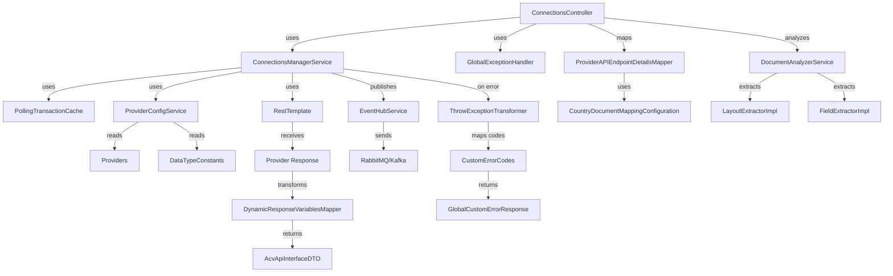
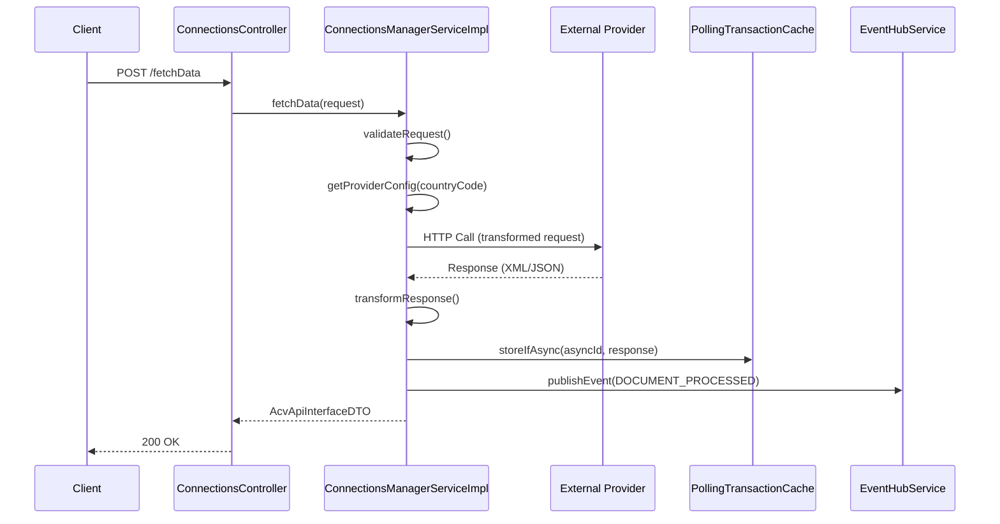
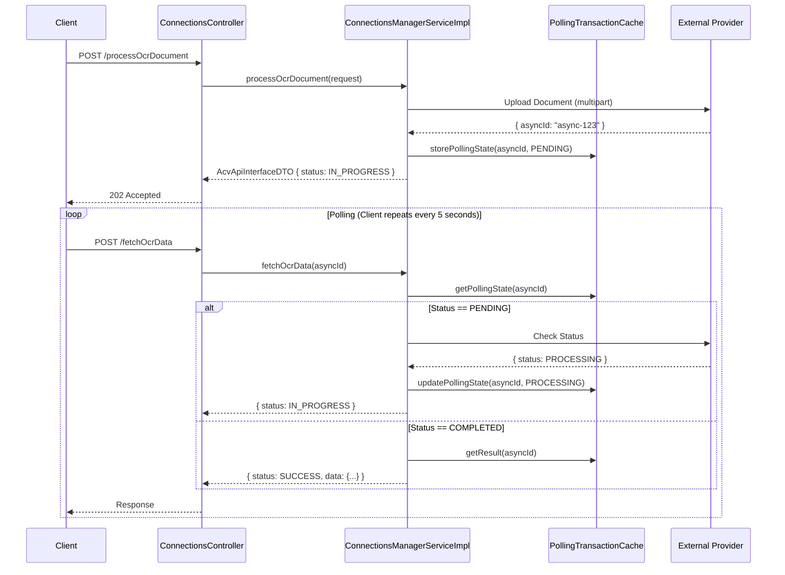

# ACV API Connector Service - Code Mapping & Class Reference

**Purpose:** Provide comprehensive inventory of all classes, packages, and dependencies.

**Scope:** Code-level navigation for developers and architects.

---

## 1. Package Structure

### Directory Tree

```
com.fedex.acv.connections/
├── controller/               — REST API entry points
├── service/                  — Business logic and orchestration
├── mapper/                   — DTO transformation and adapter patterns
├── model/                    — Data transfer objects and domain models
├── config/                   — Spring configuration and provider setup
├── constants/                — Constants and enumerations
├── exception/                — Exception handling
└── analyzeDocument/          — Document analysis (AI-powered)
```

---

## 2. Class Inventory

### 2.1 Controller Package (2 classes)

| Class | File | Layer | Responsibility | Key Methods |
|-------|------|-------|-----------------|------------|
| **ConnectionsController** | controller/ConnectionsController.java | REST Controller | Handle 12+ REST API endpoints, request routing | fetchData, processOcrDocument, pollOcrData, processCreditReport, analyzeDocumentLayout, structuredOutput, processOcrDocumentByGenAi, publishMsg, generateDocument, fetchProductIds |
| **ConfigPortalProxyController** | controller/ConfigPortalProxyController.java | REST Controller | Proxy requests to configuration portal | proxyRequest |

**ConnectionsController Endpoints:**
```java
@PostMapping("/fetchData")
public ResponseEntity<AcvApiInterfaceDTO> fetchData(@RequestBody ConnectionRequest req)

@PostMapping("/processOcrDocument")
public ResponseEntity<AcvApiInterfaceDTO> processOcrDocument(@RequestBody ConnectionRequest req)

@PostMapping("/fetchOcrData")
public ResponseEntity<AcvApiInterfaceDTO> fetchOcrData(@RequestBody ConnectionRequest req)

@PostMapping("/pollOcrData")
public ResponseEntity<AcvApiInterfaceDTO> pollOcrData(@RequestBody PollingRequest req)

@PostMapping("/processCreditReport")
public ResponseEntity<AcvApiInterfaceDTO> processCreditReport(@RequestBody ConnectionRequest req)

@PostMapping("/fetchCreditReportData")
public ResponseEntity<AcvApiInterfaceDTO> fetchCreditReportData(@RequestBody ConnectionRequest req)

@PostMapping("/pollCreditData")
public ResponseEntity<AcvApiInterfaceDTO> pollCreditData(@RequestBody PollingRequest req)

@GetMapping("/fetchProductIds/{description}/{provider}")
public ResponseEntity<AcvApiInterfaceDTO> fetchProductIds(
    @PathVariable String description,
    @PathVariable String provider)

@PostMapping("/analyzeDocumentLayout")
public ResponseEntity<AcvApiInterfaceDTO> analyzeDocumentLayout(@RequestBody ConnectionRequest req)

@PostMapping("/structuredOutput")
public ResponseEntity<AcvApiInterfaceDTO> structuredOutput(@RequestBody ConnectionRequest req)

@PostMapping("/processOcrDocumentByGenAi")
public ResponseEntity<AcvApiInterfaceDTO> processOcrDocumentByGenAi(@RequestBody ConnectionRequest req)

@PostMapping("/publishMsg")
public ResponseEntity<AcvApiInterfaceDTO> publishMsg(@RequestBody MessageRequest req)

@PostMapping("/generateDocument")
public ResponseEntity<AcvApiInterfaceDTO> generateDocument(@RequestBody DocumentRequest req)
```

---

### 2.2 Service Package (2 interfaces + 2 implementations = 4 classes)

#### Interfaces

| Class | File | Responsibility | Key Methods |
|-------|------|-----------------|------------|
| **ConnectionsManagerService** | service/ConnectionsManagerService.java | Business logic orchestration | fetchData, processOcrDocument, pollOcrData, processCreditReport, fetchCreditReportData, analyzeDocumentLayout, structuredOutput, processOcrDocumentByGenAi, publishMsg, generateDocument |
| **EventHubService** | service/EventHubService.java | Event publishing to message queue | publishEvent, publishBatchEvents, subscribeEvent |

#### Implementations

| Class | File | Responsibility | Key Methods |
|-------|------|-----------------|------------|
| **ConnectionsManagerServiceImpl** | service/impl/ConnectionsManagerServiceImpl.java | Core business logic for all operations | fetchData (with retry & exponential backoff), processOcrDocument (async document upload), pollOcrData (state caching), processCreditReport (sync/async), etc. |
| **EventHubServiceImpl** | service/impl/EventHubServiceImpl.java | RabbitMQ/Kafka message publishing | publishEvent, publishBatchEvents, configureRetry |

**ConnectionsManagerServiceImpl Key Internals:**
```
- injected: ConnectionsRepository, ProviderConfigService, HttpClientFactory, PollingTransactionCache
- protected methods: getProviderConfig, transformRequest, callProvider, transformResponse, publishEvent
- retry mechanism: exponential backoff (delay = min(300s, 1s * 2^attempt))
- polling state: in-memory cache + optional distributed cache (Redis)
- exception handling: GlobalExceptionHandler with provider-specific error mapping
```

---

### 2.3 Mapper Package (5 classes)

| Class | File | Pattern | Responsibility |
|-------|------|---------|-----------------|
| **ProviderAPIEndpointDetailsMapper** | mapper/ProviderAPIEndpointDetailsMapper.java | Adapter | Maps provider-specific DTOs to internal ConnectionRequest format; handles provider variations |
| **DynamicResponseVariablesMapper** | mapper/DynamicResponseVariablesMapper.java | Transformer | Transforms provider API responses into standardized AcvApiInterfaceDTO response format |
| **CountryDocumentMappingConfiguration** | mapper/CountryDocumentMappingConfiguration.java | Configuration | Maps country codes and document types to provider-specific constants; supports country → provider routing |
| **ACVStubConfiguration** | mapper/ACVStubConfiguration.java | Strategy | Provides mock responses for testing; stub implementation for providers in development |
| **ThrowExceptionTransformer** | mapper/ThrowExceptionTransformer.java | Exception Mapper | Transforms provider exceptions to standardized ACV error codes |

**Mapper Usage Flow:**
```
Rest Request (ConnectionRequest)
  ↓
ProviderAPIEndpointDetailsMapper.toProviderRequest()
  ↓
HttpClient.call(provider, transformedRequest)
  ↓
Provider Response (XML/JSON)
  ↓
DynamicResponseVariablesMapper.toAcvResponse()
  ↓
AcvApiInterfaceDTO (standardized)
  ↓
Rest Response
```

---

### 2.4 Model Package (9 DTOs + 6 entities = 15 classes)

#### Request DTOs

| Class | File | Fields | Pattern |
|-------|------|--------|---------|
| **ConnectionRequest** | model/ConnectionRequest.java | transactionUUID, countryCode, dataType, requestBody, retryCount, validationType, validateFromGenAI | Builder pattern, @NotEmpty validation |
| **PollingRequest** | model/PollingRequest.java | asyncId, checkCount, maxRetries | Builder pattern |
| **MessageRequest** | model/MessageRequest.java | eventType, transactionId, payload | Builder pattern |
| **DocumentRequest** | model/DocumentRequest.java | document, documentType, mimeType | Builder pattern |

#### Response DTOs

| Class | File | Fields | Pattern |
|-------|------|--------|---------|
| **AcvApiInterfaceDTO** | model/AcvApiInterfaceDTO.java | data, status, errorCode, message, timestamp | Unified response wrapper |
| **PollingTransaction** | model/PollingTransaction.java | asyncId, status, result, expiryTime, retryCount | State tracking for async operations |
| **Records** | model/Records.java | recordId, status, payload | Event record wrapper |
| **RetryableRecordDetails** | model/RetryableRecordDetails.java | recordId, retryCount, lastAttempt, nextRetryTime | Retry state tracking |
| **AdhocDocumentRequest** | model/AdhocDocumentRequest.java | document, documentType, extractionInstructions | Ad-hoc document processing |

#### Domain Entities

| Class | File | Purpose |
|-------|------|---------|
| **ProviderConfiguration** | model/ProviderConfiguration.java | Configuration per provider (SIGNZY, CreditBureau, etc.) |
| **CategoryDTO** | model/CategoryDTO.java | Document/product category mapping |
| **ProviderResponse** | model/ProviderResponse.java | Parsed provider API response |
| **DocumentLayout** | model/DocumentLayout.java | AI-extracted document regions and layout |
| **StructuredData** | model/StructuredData.java | Key-value pairs extracted from documents |
| **ExtractionSchema** | model/ExtractionSchema.java | Field mapping for structured extraction |

---

### 2.5 Config Package (4 classes)

| Class | File | Responsibility |
|-------|------|-----------------|
| **ConnectionsConfig** | config/ConnectionsConfig.java | Spring @Configuration; declares beans (RestTemplate, HttpClient, Caches) |
| **ProviderConfigService** | config/ProviderConfigService.java | Loads provider configurations from application.yml or Config Server; instantiates provider clients |
| **CacheConfig** | config/CacheConfig.java | Configures distributed cache (Redis) for polling state and response caching |
| **SecurityConfig** | config/SecurityConfig.java | OAuth2 security configuration, API key validation, rate limiting |

**Beans Declared by ConnectionsConfig:**
```java
@Bean
RestTemplate restTemplate() // HTTP client for provider calls

@Bean
RestHighLevelClient elasticSearchClient() // For audit/logging

@Bean
CacheManager cacheManager() // Redis cache for polling state

@Bean
ClockProvider clockProvider() // Timezone-aware datetime provider

@Bean
PollingTransactionCache pollingCache() // In-memory + Redis hybrid cache
```

---

### 2.6 Constants Package (5 classes)

| Class | File | Responsibility |
|-------|------|-----------------|
| **Providers** | constants/Providers.java | Enum of supported providers (SIGNZY, CREDIT_BUREAU, ID_SERVICE, etc.) |
| **APIInterfaceConstants** | constants/APIInterfaceConstants.java | String constants (status values, error codes, endpoints) |
| **CustomErrorCodes** | constants/CustomErrorCodes.java | Error code enumeration (INVALID_REQUEST, PROVIDER_ERROR, etc.) |
| **RecordCodeMapping** | constants/RecordCodeMapping.java | Maps provider status codes to ACV status codes |
| **DataTypeConstants** | constants/DataTypeConstants.java | Supported data types (OCR, CREDIT_REPORT, ID_VERIFICATION, etc.) |

---

### 2.7 Exception Package (4 classes)

| Class | File | Responsibility | Extends |
|-------|------|-----------------|---------|
| **InvalidRequestException** | exception/InvalidRequestException.java | Request validation errors | RuntimeException |
| **InternalProcessingException** | exception/InternalProcessingException.java | Provider API errors | RuntimeException |
| **GlobalExceptionHandler** | exception/GlobalExceptionHandler.java | @RestControllerAdvice; maps exceptions to HTTP responses | Advice |
| **GlobalCustomErrorResponse** | exception/GlobalCustomErrorResponse.java | Standard error response format | Object |

**GlobalExceptionHandler Methods:**
```java
@ExceptionHandler(InvalidRequestException.class)
public ResponseEntity<GlobalCustomErrorResponse> handleInvalidRequest()

@ExceptionHandler(InternalProcessingException.class)
public ResponseEntity<GlobalCustomErrorResponse> handleProviderError()

@ExceptionHandler(Exception.class)
public ResponseEntity<GlobalCustomErrorResponse> handleGenericException()
```

---

### 2.8 AnalyzeDocument Package (3 classes)

| Class | File | Responsibility |
|-------|------|-----------------|
| **DocumentAnalyzerService** | analyzeDocument/DocumentAnalyzerService.java | AI-powered document layout analysis |
| **LayoutExtractorImpl** | analyzeDocument/LayoutExtractorImpl.java | Extracts regions (photo, text, signatures) |
| **FieldExtractorImpl** | analyzeDocument/FieldExtractorImpl.java | Extracts structured fields using GenAI |

---

## 3. Class Dependency Graph



---

## 4. Spring Bean Wiring

### Declared Beans (ConnectionsConfig.java)

```java
@Bean
public RestTemplate restTemplate() {
    RestTemplate rt = new RestTemplate();
    rt.setErrorHandler(new CustomResponseErrorHandler());
    return rt;
}

@Bean
public PollingTransactionCache pollingTransactionCache() {
    return new PollingTransactionCache(
        cacheManager(),
        properties.getPollingCacheExpireMinutes()
    );
}

@Bean
public ProviderConfigService providerConfigService() {
    return new ProviderConfigService(
        configServerClient,
        properties.getConfigServer().getUrl()
    );
}

@Bean
@Scope("prototype")
public ConnectionRequest newConnectionRequest() {
    return new ConnectionRequest();
}
```

### Injected Dependencies

```
ConnectionsController
  ├── ConnectionsManagerService (required)
  └── GlobalExceptionHandler (auto-discovered)

ConnectionsManagerServiceImpl
  ├── ConnectionsRepository (JPA)
  ├── ProviderConfigService (bean)
  ├── HttpClientFactory (bean)
  ├── PollingTransactionCache (bean)
  ├── EventHubService (bean)
  └── ApplicationProperties (config)

ProviderConfigService
  ├── RestTemplate (bean)
  ├── ConfigServerClient (bean)
  └── ApplicationProperties (config)

EventHubServiceImpl
  ├── RabbitTemplate or KafkaTemplate (Spring auto-config)
  ├── ObjectMapper (Jackson)
  └── ApplicationProperties (config)
```

---

## 5. Data Flow Diagrams

### Request → Response Lifecycle



### Async Polling Sequence



---

## 6. Provider Integration Points

### How to Add a New Provider

**Step 1: Extend Providers Enum**
```java
// constants/Providers.java
public enum Providers {
    SIGNZY("signzy", "https://api.signzy.com"),
    CREDIT_BUREAU("creditbureau", "https://api.credit.com"),
    NEW_PROVIDER("newprovider", "https://api.new.com");  // ADD
    
    private String id;
    private String endpoint;
}
```

**Step 2: Add Provider Config to application.yml**
```yaml
connections:
  providers:
    newprovider:
      endpoint: https://api.new.com/v1
      apiKey: ${NEW_PROVIDER_API_KEY}
      timeout: 45
      maxRetries: 3
```

**Step 3: Create Provider Client Interface**
```java
public interface NewProviderClient {
    OcrResponse processDocument(OcrRequest req);
    PollingStatus checkStatus(String asyncId);
}
```

**Step 4: Extend Mapper**
```java
// ProviderAPIEndpointDetailsMapper.java
private OcrRequest transformForNewProvider(ConnectionRequest req) {
    OcrRequest providerReq = new OcrRequest();
    providerReq.setApiKey(config.getApiKey());
    providerReq.setDocument(req.getRequestBody().getDocument());
    providerReq.setFormat("application/pdf");
    return providerReq;
}
```

---

## 7. HTTP Client Configuration

### RestTemplate Setup

```java
@Bean
public HttpComponentsClientHttpRequestFactory clientHttpRequestFactory() {
    HttpClientBuilder builder = HttpClients.custom();
    builder.setMaxConnTotal(200)
           .setMaxConnPerRoute(50)
           .setConnectionTimeToLive(10, TimeUnit.MINUTES);
    
    CloseableHttpClient httpClient = builder.build();
    HttpComponentsClientHttpRequestFactory factory = new HttpComponentsClientHttpRequestFactory(httpClient);
    factory.setConnectTimeout(10000);      // 10 seconds
    factory.setReadTimeout(30000);         // 30 seconds (60s for OCR)
    return factory;
}

@Bean
public RestTemplate restTemplate() {
    RestTemplate template = new RestTemplate(clientHttpRequestFactory());
    template.setInterceptors(Arrays.asList(
        new LoggingInterceptor(),
        new OAuthInterceptor(oauthProvider)
    ));
    return template;
}
```

---

## 8. Cache Configuration

### Polling State Cache

```java
@Bean
public CacheManager cacheManager() {
    return RedisCacheManager.builder(connectionFactory())
        .cacheDefaults(
            RedisCacheConfiguration.defaultCacheConfig()
                .entryTtl(Duration.ofMinutes(30))
        )
        .build();
}

@Cacheable(value = "pollingStates", key = "#asyncId")
public PollingTransaction getPollingState(String asyncId) {
    // Fetch from provider or database
}

@CachePut(value = "pollingStates", key = "#transaction.asyncId")
public PollingTransaction updatePollingState(PollingTransaction transaction) {
    // Update and cache
}
```

---

## 9. Test Artifacts

### Unit Test Classes

| Test Class | Tested Class | Strategy |
|------------|--------------|----------|
| ConnectionsControllerTest | ConnectionsController | Mock service; verify endpoints |
| ConnectionsManagerServiceImplTest | ConnectionsManagerServiceImpl | Mock provider client; verify retry logic |
| ProviderMapperTest | ProviderAPIEndpointDetailsMapper | Verify DTO transformation |
| ResponseMapperTest | DynamicResponseVariablesMapper | Verify response normalization |
| PollingTransactionCacheTest | PollingTransactionCache | Verify cache hit/miss |

### Integration Test Classes

| Test Class | Scenario |
|------------|----------|
| OcrProcessingIntegrationTest | End-to-end OCR document upload → polling → results |
| CreditReportIntegrationTest | Credit report fetch with sync/async options |
| ProviderFailoverIntegrationTest | Retry logic with exponential backoff |
| EventHubPublishingIntegrationTest | Event publishing to RabbitMQ/Kafka |

---

## 10. Navigation Quick Reference

**For New Developers:**
1. Start: [ConnectionsController.java](LLD.md#connectioncontroller-rest-endpoints)
2. Understand: [ConnectionsManagerServiceImpl.java](LLD.md#core-service-logic)
3. Learn: [Request/Response Mapping](LLD.md#request-response-lifecycle)
4. Add Feature: [How to extend for new provider](#how-to-add-a-new-provider)

---

## Cross-References

- [HLD.md](HLD.md) — Architecture and provider abstraction design
- [LLD.md](LLD.md) — Detailed class implementations and code examples
- [services.md](services.md) — REST API contracts and examples

---

**Last Updated:** 2026-04-02  
**Version:** 1.1.8  
**Audience:** Developers, Architects
