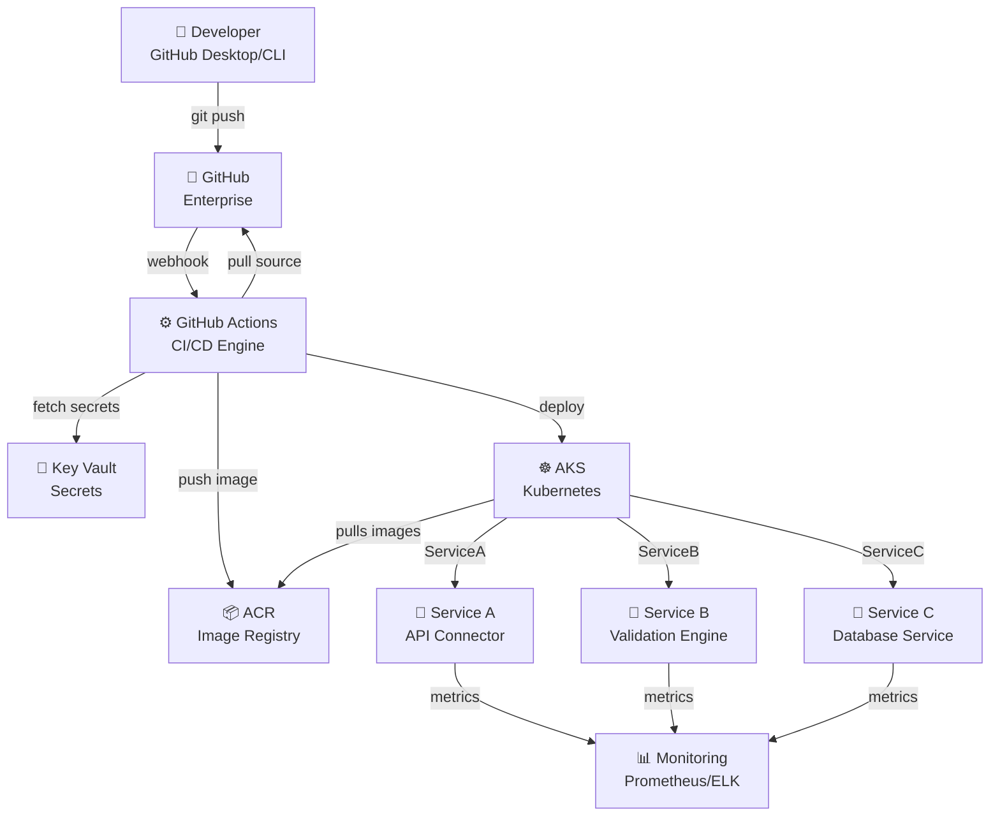
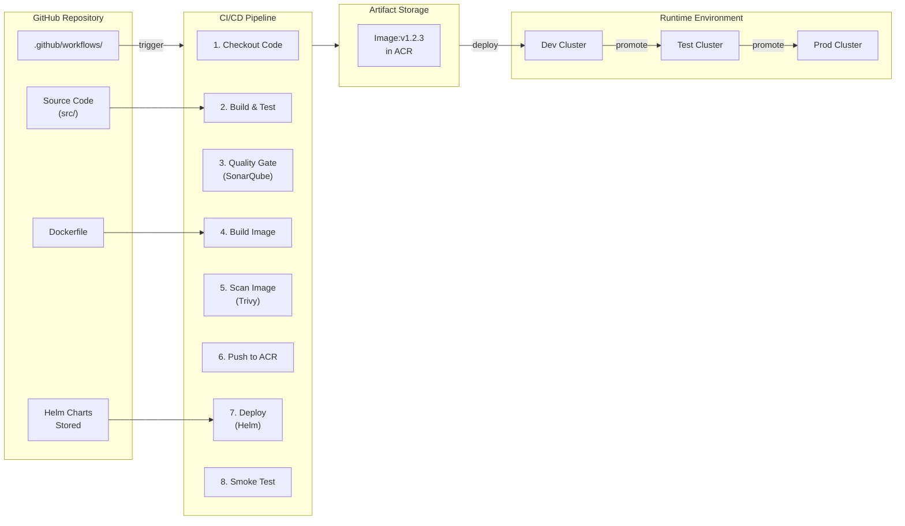
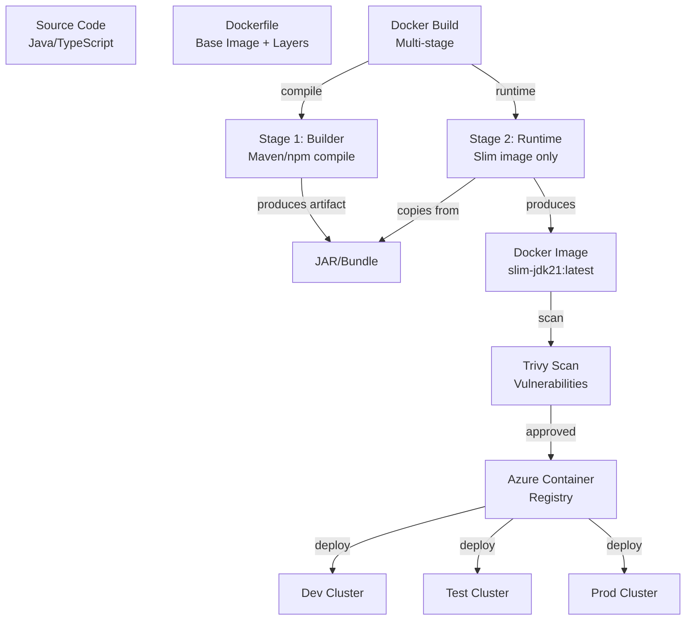
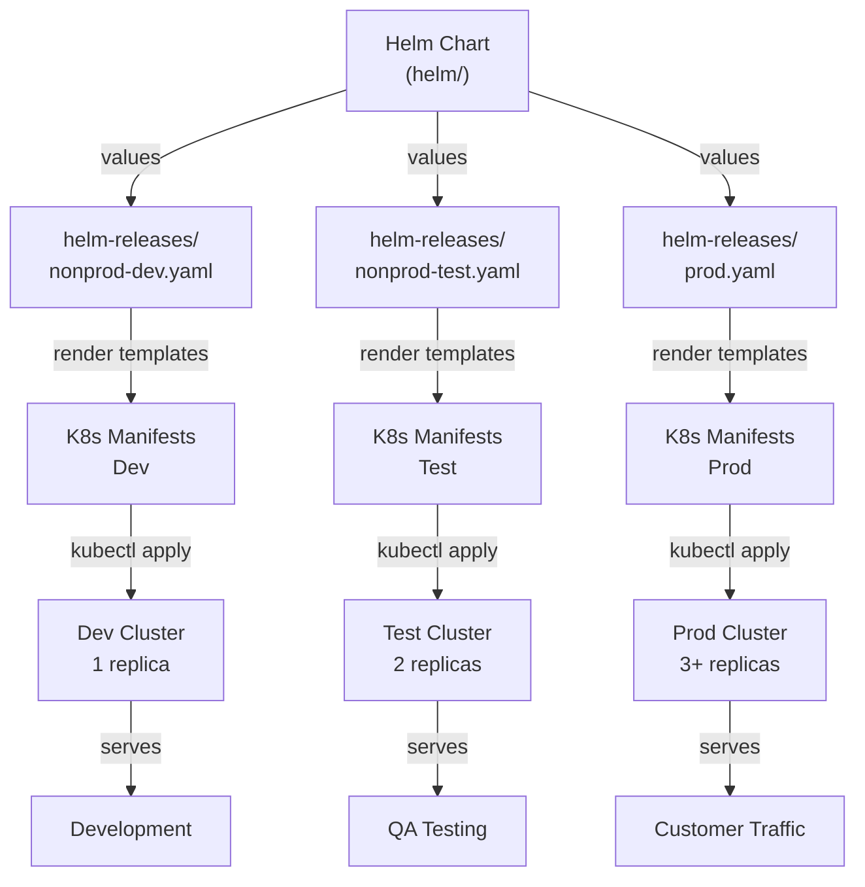
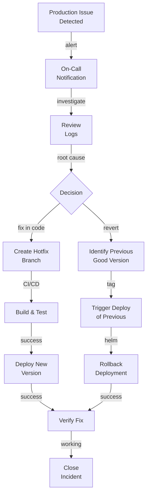
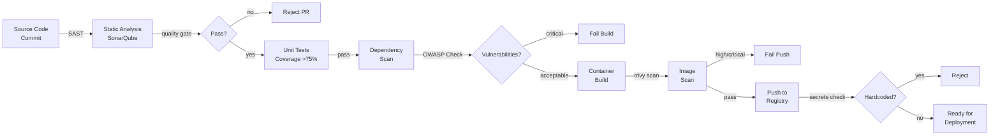
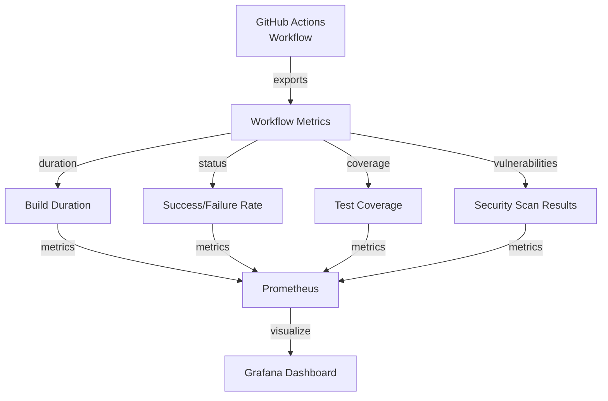

# Common Self Service - High-Level Design & Framework Architecture

**Purpose:** Describe system architecture, framework components, and design decisions.

**Scope:** Framework design, workflow orchestration, infrastructure provisioning.

---

## 1. Framework Purpose & Scope

### Design Goals

The Common Self Service framework enables:

1. **Self-Service Deployment** — Teams deploy without infrastructure team involvement
2. **Standardization** — Consistent CI/CD patterns across all ACV services
3. **Rapid Onboarding** — New services operational within hours, not days
4. **Security by Default** — Security checks enforced at pipeline level
5. **Infrastructure Agility** — Easy scaling, configuration, migration
6. **Observability** — Built-in monitoring, logging, alerting

### Key Principles

- **Template-First:** Reusable, copy-paste-ready workflows
- **Infrastructure as Code:** All infrastructure reproducible via code
- **Secrets Management:** Zero hardcoded credentials
- **Immutable Infrastructure:** Containers define all versioning
- **Progressive Deployment:** Dev → Test → Prod promotion gates
- **Fail Fast:** Early feedback loop in CI pipeline

---

## 2. Architecture Overview

### 2.1 System Context Diagram



### 2.2 Workflow Components



---

## 3. Framework Components

### 3.1 GitHub Actions Workflows

#### CI Pipeline (ci.yml)

**Trigger:** Push to main/develop, PR creation  
**Purpose:** Build, test, and validate code quality

**Steps:**
1. Checkout source code
2. Set up runtime (JDK, Node, etc.)
3. Build application (Maven/npm)
4. Run unit + integration tests
5. Generate code coverage report
6. SonarQube quality scan
7. Build Docker image
8. Scan image for vulnerabilities (Trivy)
9. Push to Azure Container Registry

**Status Gates:**
- Tests: Coverage >75%, pass rate 100%
- Quality: SonarQube quality gate pass
- Security: Trivy scan passes (no critical/high vulnerabilities)

#### Build & Push Pipeline (build-and-push.yml)

**Trigger:** Tagged release (v1.2.3)  
**Purpose:** Build final image and push to registry

**Steps:**
1. Checkout tagged version
2. Build final artifact
3. Build Docker image with version tag
4. Tag with: `latest`, `v1.2.3`, `git-sha`
5. Push all tags to ACR
6. Create GitHub release

#### Deployment Pipelines (deploy-dev/test/prod.yml)

**Trigger:** Manual approval (production requires extra gate)  
**Purpose:** Deploy services to target cluster

**Steps:**
1. Fetch deployment credentials from Key Vault
2. Configure kubectl context
3. Retrieve Helm chart from repository
4. Helm upgrade/install with environment values
5. Wait for rollout (30-minute timeout)
6. Run smoke tests
7. Notify team on Slack

### 3.2 Container Strategy



**Dockerfile Template Pattern:**

```dockerfile
# Stage 1: Build
FROM eclipse-temurin:21-jdk-alpine AS builder
WORKDIR /build
COPY . .
RUN mvn clean package -DskipTests

# Stage 2: Runtime
FROM eclipse-temurin:21-jre-alpine
WORKDIR /app
COPY --from=builder /build/target/app.jar app.jar
EXPOSE 8080
HEALTHCHECK --interval=30s --timeout=3s --start-period=5s \
  CMD wget --no-verbose --tries=1 --spider http://localhost:8080/actuator/health || exit 1
ENTRYPOINT ["java", "-jar", "app.jar"]
```

### 3.3 Helm Deployment Architecture



**Helm Template Structure:**

```
helm/
├── Chart.yaml                  # Chart metadata
├── values.yaml                 # Default values
├── templates/
│   ├── deployment.yaml         # Kubernetes Deployment
│   ├── service.yaml            # Kubernetes Service (ClusterIP)
│   ├── ingress.yaml            # Ingress controller setup
│   ├── configmap.yaml          # ConfigMap for configs
│   ├── secret.yaml             # Secret template (reference-only)
│   ├── hpa.yaml                # Horizontal Pod Autoscaler
│   ├── pdb.yaml                # Pod Disruption Budget
│   ├── networkpolicy.yaml      # Network security
│   └── _helpers.tpl            # Template helpers
```

---

## 4. Business Flows

### 4.1 Developer to Production Flow

```mermaid
flowchart TD
    A["Developer Writes<br/>Feature Code"] -->|git commit| B["Push to Feature<br/>Branch"]
    B -->|create PR| C["GitHub Pull<br/>Request"]
    C -->|automatic| D["CI Pipeline<br/>Runs"]
    D -->|all checks<br/>pass| E["Code Review<br/>Required"]
    E -->|approved| F["Merge to<br/>Develop"]
    
    F -->|CI pipeline| G["Build & Test"]
    G -->|success| H["Build Docker<br/>Image"]
    H -->|success| I["Push to Dev<br/>ACR"]
    
    I -->|manual<br/>approval| J["Deploy to<br/>Dev Cluster"]
    J -->|success| K["Run Smoke<br/>Tests"]
    
    K -->|manual| L["Promote to<br/>Test"]
    L -->|automated| M["Deploy to<br/>Test Cluster"]
    M -->|success| N["Run Integration<br/>Tests"]
    
    N -->|manual<br/>approval| O["Tag Release<br/>v1.2.3"]
    O -->|trigger build| P["Build Release<br/>Image"]
    P -->|success| Q["Push Production<br/>Image"]
    
    Q -->|manual<br/>approval| R["Deploy to<br/>Prod Cluster"]
    R -->|success| S["Production<br/>Live"]
    S --> T["Monitor &<br/>Alert"]
```



### 4.2 Rollback Flow



---

## 5. Security & Compliance

### 5.1 Security Pipeline Gates



### 5.2 Deployment Authorization

| Environment | Approval Required | Approver | Timeout |
|-------------|-------------------|----------|---------|
| **dev** | No | N/A | Any time |
| **test** | Yes | Tech Lead | 72 hours |
| **prod** | Yes (2/3) | Platform Team + Service Owner | 24 hours |

---

## 6. Integration Points

### External Systems

| System | Integration | Data Flow |
|--------|-----------|-----------|
| **GitHub Enterprise** | Source control, webhooks | Push events trigger CI |
| **GitHub Actions** | CI/CD execution | Workflow execution logs |
| **Azure Container Registry** | Image registry | Docker images stored/pulled |
| **Azure Key Vault** | Secrets management | Credentials for deployment |
| **Azure Kubernetes Service** | Container runtime | Deployed services |
| **SonarQube** | Code quality | Quality metrics, gates |
| **Slack** | Notifications | Deployment status, alerts |
| **Prometheus** | Metrics collection | Service health, performance |

---

## 7. Non-Functional Requirements

### Performance

| Metric | Target | Measurement |
|--------|--------|-------------|
| **Build Time** | <10 min | CI pipeline execution |
| **Deployment Time** | <5 min | Helm upgrade to service ready |
| **Image Size** | <300 MB | Final Docker image size |
| **Startup Time** | <30 sec | Service health check pass |

### Reliability

| Aspect | Target | SLA |
|--------|--------|-----|
| **Deployment Success Rate** | >99.5% | No more than 1 failure per 200 deployments |
| **Infrastructure Availability** | >99.9% | AKS cluster uptime |
| **Secret Rotation** | 90 days | All service credentials |

### Scalability

| Dimension | Target | Notes |
|-----------|--------|-------|
| **Services Supported** | 50+ | Per AKS cluster |
| **Concurrent Pipelines** | 20 | Per GitHub org |
| **Image Registry Capacity** | 1000+ images | Per ACR instance |

### Security

| Control | Requirement | Enforcement |
|---------|------------|------------|
| **Secrets** | Zero hardcoded | Pipeline scan + review |
| **Container Scanning** | All images scanned | Mandatory gate |
| **Access Control** | RBAC enforced | Kubernetes policy + GitHub teams |
| **Audit Logging** | All deployments logged | Compliance archive |

---

## 8. Design Decisions

### Decision 1: GitHub Actions vs Other CI/CD Tools

**Decision:** Use GitHub Actions  
**Rationale:**
- Native GitHub integration (no additional tools)
- YAML-based (version controllable in repo)
- Scalable (GitHub-hosted runners)
- Cost effective (included with GitHub Enterprise)

**Alternative Considered:** Jenkins, GitLab CI, Azure Pipelines  
**Trade-off:** Vendor lock-in to GitHub, but offset by simplicity

---

### Decision 2: Helm for Kubernetes Deployment

**Decision:** Use Helm as deployment templating  
**Rationale:**
- Industry standard for Kubernetes
- Supports multi-environment promotion
- Rollback capability
- Secrets integration (via Key Vault)

**Alternative Considered:** Kustomize, Terraform  
**Trade-off:** Learning curve, but powerful for Kubernetes-native teams

---

### Decision 3: Multi-Stage Docker Builds

**Decision:** Use multi-stage Dockerfile builds  
**Rationale:**
- Reduces final image size (builder artifacts excluded)
- Faster deployments (smaller image pulls)
- Security (no build tools in runtime)

**Stage 1:** Full JDK + Maven (build)  
**Stage 2:** Slim JRE only (runtime)

**Result:** 1.2 GB → 250 MB (79% reduction)

---

## 9. Monitoring & Observability

### Pipeline Metrics Collected



---

## 10. Assumptions & Constraints

### Assumptions

✓ All teams use GitHub for source control  
✓ Container-based deployment model preferred  
✓ Kubernetes (AKS) available for runtime  
✓ Azure infrastructure available  
✓ Teams can manage Helm charts  

### Constraints

✗ No on-premises deployment (Azure-only)  
✗ No support for legacy monolithic apps  
✗ Requires Docker containerization  
✗ Kubernetes knowledge required  

---

## 11. Future Enhancements

| Enhancement | Timeline | Benefit |
|-------------|----------|---------|
| **Canary Deployments** | Q3 2026 | Risk reduction for prod releases |
| **GitOps (ArgoCD)** | Q4 2026 | Declarative infrastructure |
| **Multi-Region Support** | Q1 2027 | Global deployment capability |
| **Cost Optimization** | Q2 2027 | Automatic resource scaling |

---

## Cross-References

- [LLD.md](LLD.md) — Technical implementation details
- [services.md](services.md) — Template API contracts
- [code-mapping.md](code-mapping.md) — Template repository structure
- [onboarding.md](onboarding.md) — Setup procedures

---

**Last Updated:** 2026-04-02  
**Version:** 1.0.0  
**Audience:** Architects, Tech Leads, Platform Engineers
