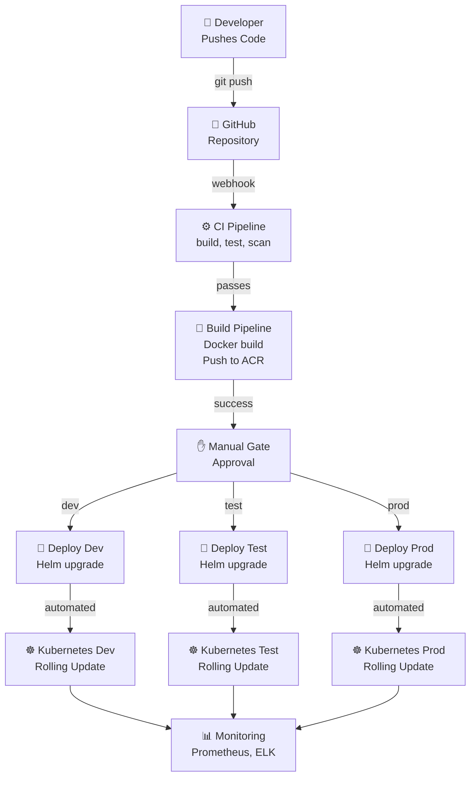

# Common Self Service - CI/CD Framework & Self-Service Enablement

**Status:** Framework Repository  
**Version:** 1.0.0  
**Last Updated:** April 2, 2026

---

## 1. Project Overview

### Purpose

The **Common Self Service** repository is a **CI/CD framework and self-service template** designed to enable ACV platform development teams to seamlessly deploy microservices using GitHub Actions and infrastructure automation.

### Business Context

ACV (Account Creation & Validation) platform consists of multiple microservices deployed across dev, test, and production environments. Common Self Service:
- **Accelerates** microservice onboarding
- **Standardizes** CI/CD pipelines across services
- **Enables** self-service deployment without infrastructure team involvement
- **Provides** reusable templates, workflows, and utilities

### Key Features

✅ GitHub Actions workflow templates for automated CI/CD  
✅ Infrastructure as Code (Terraform/Helm) scaffolding  
✅ Deployment orchestration templates  
✅ Common utilities and scripts for service teams  
✅ Configuration management patterns  
✅ Security and compliance standards enforced at pipeline level  
✅ Monitoring and observability setup templates  

---

## 2. Technology Stack

| Component | Technology | Purpose |
|-----------|-----------|---------|
| **CI/CD Orchestration** | GitHub Actions | Automated pipeline execution |
| **Infrastructure as Code** | Terraform, Helm | Reproducible deployments |
| **Container Runtime** | Docker | Service containerization |
| **Orchestration** | Kubernetes | Container orchestration |
| **Configuration Management** | Spring Cloud Config | Dynamic configuration |
| **Scripting** | Bash, PowerShell | Automation utilities |
| **Build Tools** | Maven, npm | Multi-language support |
| **Artifact Registry** | Azure Container Registry (ACR), GitHub Packages | Image/artifact storage |
| **Secrets Management** | Azure Key Vault, GitHub Secrets | Credential management |
| **Monitoring** | Prometheus, Grafana, Application Insights | Observability |

---

## 3. Quick Start

### 3.1 Create New Microservice from Template

```bash
# 1. Create new GitHub repository using template
# Use GitHub web UI: "Use this template" button
# Or clone existing service and adapt

git clone https://github.com/FedEx/eai-3540813-api-connector-service.git \
  eai-3540813-my-new-service
cd eai-3540813-my-new-service

# 2. Update project identifiers
sed -i 's/api-connector-service/my-new-service/g' pom.xml
sed -i 's/api-connector-service/my-new-service/g' helm-releases/*.yaml

# 3. Set up GitHub secrets for CI/CD
# Navigate to: Settings → Secrets → New repository secret
# Required secrets:
#   - AZURE_CREDENTIALS (for ACR push)
#   - AZURE_DEPLOY_CREDENTIALS (for deployment)
#   - SONAR_TOKEN (for code quality)

# 4. Enable GitHub Actions
# Navigate to: Actions → "Enable GitHub Actions for this repo"

# 5. Verify workflow runs automatically on git push
git add .
git commit -m "Initial setup for my-new-service"
git push origin main
```

### 3.2 Project Structure Template

```
eai-3540813-my-new-service/
├── .github/
│   └── workflows/               # GitHub Actions CI/CD pipelines
│       ├── ci.yml              # Build, test, coverage
│       ├── build-and-push.yml  # Docker build and ACR push
│       └── deploy.yml          # Deploy to Kubernetes
├── src/
│   ├── main/                   # Application source code
│   └── test/                   # Unit and integration tests
├── helm-releases/              # Helm chart values by environment
│   ├── nonprod-dev.yaml
│   ├── nonprod-test.yaml
│   └── prod.yaml
├── helm/                       # Helm chart definition
│   ├── Chart.yaml
│   ├── templates/
│   └── values.yaml
├── terraform/                  # Infrastructure as Code (optional)
│   ├── main.tf
│   └── variables.tf
├── pom.xml                     # Maven build configuration
├── package.json                # Node.js dependencies (if applicable)
├── Dockerfile                  # Container definition
├── docker-compose.yml          # Local development environment
├── README.md                   # Project documentation
└── logging.txt                 # Build logs
```

### 3.3 Enable CI/CD for Service

Add `.github/workflows/ci.yml`:

```yaml
name: CI Pipeline

on:
  push:
    branches: [ main, develop ]
  pull_request:
    branches: [ main, develop ]

jobs:
  build:
    runs-on: ubuntu-latest
    steps:
      - uses: actions/checkout@v3
      
      - name: Set up JDK 21
        uses: actions/setup-java@v3
        with:
          java-version: '21'
          distribution: 'temurin'
      
      - name: Build with Maven
        run: mvn clean install
      
      - name: Run Tests
        run: mvn test
      
      - name: SonarQube Analysis
        env:
          SONAR_TOKEN: ${{ secrets.SONAR_TOKEN }}
        run: |
          mvn sonar:sonar \
            -Dsonar.projectKey=${{ github.repository }} \
            -Dsonar.host.url=https://sonar.company.com \
            -Dsonar.login=${{ secrets.SONAR_TOKEN }}
```

---

## 4. Key Components

### 4.1 GitHub Actions Workflows

| Workflow | Trigger | Purpose |
|----------|---------|---------|
| **ci.yml** | Push/PR to main/develop | Build, test, code quality scan |
| **build-and-push.yml** | Successful CI + tag | Build Docker image, push to ACR |
| **deploy-dev.yml** | Manual + successful build | Deploy to dev environment |
| **deploy-test.yml** | Manual + successful build | Deploy to test environment |
| **deploy-prod.yml** | Manual approval + successful build | Deploy to production |

### 4.2 Helm Chart Templates

Standardized Helm charts for:
- Spring Boot microservices deployment
- Service exposure (Ingress, Service)
- Configuration management (ConfigMap, Secret)
- Monitoring and logging sidecars
- Resource limits and probes (readiness, liveness)
- RBAC and security policies

### 4.3 Terraform Modules (Optional)

Reusable infrastructure components:
- Kubernetes cluster provisioning
- Azure Container Registry setup
- Storage accounts for logs
- Key Vault configuration
- Network policies and security groups

---

## 5. Self-Service Deployment Flow



---

## 6. Onboarding Checklist

For each new microservice:

- [ ] **Create Repository**
  - [ ] Use GitHub template (eai-3540813-common-selfservice)
  - [ ] Enable Actions, branches protection
  
- [ ] **Set Up CI/CD**
  - [ ] Copy `.github/workflows/` from template
  - [ ] Update references to service name
  
- [ ] **Configure Secrets**
  - [ ] AZURE_CREDENTIALS (ACR push)
  - [ ] AZURE_DEPLOY_CREDENTIALS (K8s deployment)
  - [ ] SONAR_TOKEN (code quality gatekeeping)
  
- [ ] **Docker & Helm**
  - [ ] Create `Dockerfile` based on template
  - [ ] Create `helm/` directory with Chart.yaml
  - [ ] Add environment-specific `helm-releases/` files
  
- [ ] **Verify Pipelines**
  - [ ] Push to develop branch
  - [ ] Monitor workflow execution
  - [ ] Validate output artifacts in ACR

---

## 7. Supported Service Types

| Type | Language | Runtime | Build Tool | Example |
|------|----------|---------|-----------|---------|
| **Backend Service** | Java | Spring Boot 3.3.x | Maven | api-connector-service |
| **Configuration Server** | Java | Spring Cloud Config | Maven | config-server |
| **Frontend** | TypeScript | Angular 17+ | npm | configuration-portal-ui |
| **API Automation** | Java | Cucumber/RestAssured | Maven | acv-api-automation |

---

## 8. Available Resources

### Documentation

| Document | Purpose |
|----------|---------|
| [HLD.md](HLD.md) | Framework architecture, design decisions |
| [LLD.md](LLD.md) | Workflow definitions, script details |
| [services.md](services.md) | API endpoints, template APIs |
| [code-mapping.md](code-mapping.md) | Template repository structure |
| [glossary.md](glossary.md) | CI/CD terminology, GitHub Actions concepts |
| [onboarding.md](onboarding.md) | Step-by-step setup guide |

### Template Files

| File | Purpose | Location |
|------|---------|----------|
| **ci.yml** | CI pipeline template | `.github/workflows/` |
| **build-and-push.yml** | Container build template | `.github/workflows/` |
| **deploy.yml** | Deployment template | `.github/workflows/` |
| **Dockerfile** | Container definition template | Root |
| **docker-compose.yml** | Local environment template | Root |
| **Chart.yaml** | Helm chart definition | `helm/` |
| **values.yaml** | Helm default values | `helm/` |
| **pom.xml** | Maven build template | Root (Java) |
| **package.json** | npm dependencies | Root (Node.js) |

---

## 9. Environment Targets

| Environment | Purpose | Kubernetes Cluster | ACR Registry |
|-------------|---------|-------------------|---|
| **dev** | Development, rapid iteration | aks-dev | acr-dev.azurecr.io |
| **test** | QA testing, integration tests | aks-test | acr-test.azurecr.io |
| **prod** | Production, customer traffic | aks-prod | acr-prod.azurecr.io |

---

## 10. Security & Compliance

### Enforced at Pipeline Level

✅ **Code Quality:** SonarQube scan mandatory, quality gate must pass  
✅ **Secrets Management:** No hardcoded credentials allowed  
✅ **Dependency Scanning:** OWASP and supply chain vulnerability checks  
✅ **Container Scanning:** Trivy scan before ACR push  
✅ **Access Control:** Role-based deployment approvals per environment  
✅ **Audit Logging:** All deployments logged to compliance system  

---

## 11. Troubleshooting

### GitHub Actions Workflow Failures

| Error | Cause | Solution |
|-------|-------|----------|
| `UNAUTHORIZED: authentication required` | ACR credentials invalid | Verify AZURE_CREDENTIALS secret in GitHub |
| `build test FAILURE` | Code coverage below threshold | Fix failing tests, improve coverage |
| `Pod CrashLoopBackOff` | Deployment issue | Check pod logs: `kubectl logs <pod>` |
| `helm: command not found` | Helm not installed in runner | Use `azure/helm-deploy@v1` action |

---

## 12. Community & Support

| Channel | Purpose |
|---------|---------|
| **Slack** | #acv-platform for questions, #acv-deployments for deployment issues |
| **Wiki** | https://confluence.company.com/acv for detailed guides |
| **JIRA** | https://jira.company.com/acv for bug reports and feature requests |
| **Email** | acv-platform-team@company.com for escalations |

---

## 13. Links & References

- [ACV Commons Library](../acv-commons)
- [ACV Validation Engine](../acv-validation-engine)
- [ACV API Connector Service](../acv-api-connector-service)
- [GitHub Actions Documentation](https://docs.github.com/actions)
- [Helm Documentation](https://helm.sh/docs)
- [Kubernetes Documentation](https://kubernetes.io/docs)

---

**Next Steps:**
1. Read [HLD.md](HLD.md) for framework architecture
2. Follow [onboarding.md](onboarding.md) for setup
3. Review [services.md](services.md) for available templates

---

**Version:** 1.0.0 | **Node:** ACV Platform | **Maintainer:** Platform Team  
**License:** FedEx Internal
