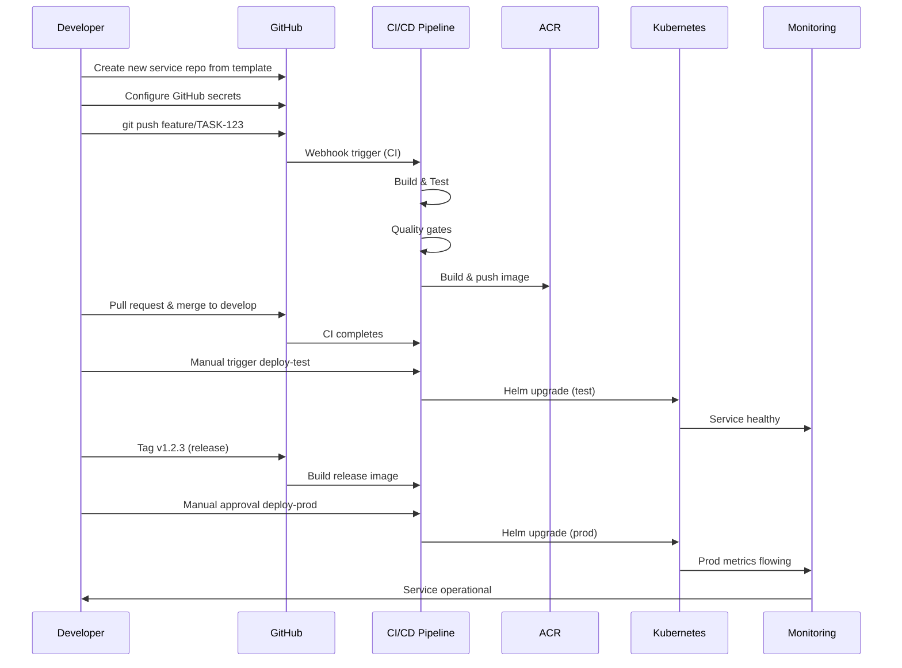

# Common Self Service - Template APIs & Services

**Purpose:** Document template APIs, workflow interfaces, and framework contracts.

**Scope:** Available templates, configurations, and service offerings.

---

## 1. Self-Service API Overview

The Common Self Service framework provides templates and APIs for:
- **Service Onboarding** — Create new microservice from template
- **Deployment Orchestration** — Deploy to dev/test/prod environments
- **Configuration Management** — Manage service configurations
- **Monitoring Setup** — Enable observability out-of-the-box
- **Secrets Management** — Secure credential handling

---

## 2. Template APIs

### 2.1 Service Creation Template API

**Purpose:** Create new ACV microservice from template

**Endpoint (Simulated):**
```
POST /api/v1/services/create
```

**Request:**
```json
{
  "serviceName": "eai-3540813-example-service",
  "serviceType": "spring-boot-service",
  "language": "java",
  "port": 8082,
  "description": "Example microservice for ACV platform",
  "team": "platform-team",
  "hasDatabase": true,
  "databaseType": "postgresql",
  "environmentTargets": ["dev", "test", "prod"]
}
```

**Response (200 OK):**
```json
{
  "status": "SUCCESS",
  "serviceId": "svc-12345",
  "repositoryUrl": "https://github.com/FedEx/eai-3540813-example-service",
  "templateApplied": {
    "workflows": 6,
    "helmCharts": 1,
    "dockerfileIncluded": true,
    "testFramework": "JUnit5"
  },
  "nextSteps": [
    "Configure GitHub Secrets (AZURE_CREDENTIALS, SONAR_TOKEN)",
    "Update application.yml with service-specific config",
    "Customize Helm values in helm-releases/",
    "Push first feature branch"
  ],
  "estimatedSetupTime": "30 minutes"
}
```

---

### 2.2 Deployment Template API

**Purpose:** Deploy service to target environment

**Endpoint (Simulated):**
```
POST /api/v1/services/{serviceId}/deploy
```

**Request:**
```json
{
  "environment": "test",
  "imageTag": "v1.2.3",
  "helmValuesOverride": {
    "replicaCount": 2,
    "resources.limits.memory": "1Gi"
  },
  "approvedBy": "tech-lead@company.com"
}
```

**Response (200 OK):**
```json
{
  "status": "DEPLOYING",
  "deploymentId": "dep-98765",
  "service": "eai-3540813-example-service",
  "environment": "test",
  "imageTag": "v1.2.3",
  "helmRelease": "eai-3540813-example-service",
  "namespace": "test",
  "estimatedDeploymentTime": "5 minutes",
  "rolloutStatus": "IN_PROGRESS",
  "podStatus": [
    {
      "name": "eai-3540813-example-service-7d9f8b2c1",
      "status": "RUNNING",
      "uptime": "2 minutes"
    }
  ],
  "healthCheck": "PASSING",
  "metricsUrl": "https://grafana.company.com/d/test-metrics"
}
```

---

### 2.3 Configuration Update Template API

**Purpose:** Update service configuration without code change

**Endpoint:**
```
PATCH /api/v1/services/{serviceId}/config
```

**Request:**
```json
{
  "environment": "prod",
  "configurationChanges": {
    "LOG_LEVEL": "INFO",
    "CACHE_TTL_MINUTES": "60",
    "MAX_CONNECTIONS": "200"
  },
  "requiresRestart": false
}
```

**Response (200 OK):**
```json
{
  "status": "UPDATED",
  "service": "eai-3540813-example-service",
  "environment": "prod",
  "appliedChanges": 3,
  "requiresRollingRestart": false,
  "configReloadTime": "instantaneous",
  "auditLog": {
    "changedBy": "ops-engineer@company.com",
    "timestamp": "2026-04-02T10:15:00Z",
    "changeId": "cfg-54321"
  }
}
```

---

## 3. Workflow Templates

### 3.1 Available Workflow Templates

| Template | File | Purpose | Trigger |
|----------|------|---------|---------|
| **CI Pipeline** | ci.yml | Build, test, quality gates | Push to main/develop |
| **Build & Push** | build-and-push.yml | Docker build, ACR push | Tag creation (release) |
| **Deploy Dev** | deploy-dev.yml | Deploy to dev cluster | Manual approval |
| **Deploy Test** | deploy-test.yml | Deploy to test cluster | Manual approval |
| **Deploy Prod** | deploy-prod.yml | Deploy to prod cluster | Manual + 2/3 approvals |
| **Security Scan** | security-scan.yml | SAST, dependency scan, image scan | Every push |
| **Rollback** | rollback.yml | Emergency rollback to previous version | Manual trigger |
| **Health Check** | health-check.yml | Automated health verification | Hourly on prod |

### 3.2 Workflow Inputs & Outputs

#### CI Workflow Outputs

```yaml
# GitHub Actions artifacting
outputs:
  test-results-artifact: target/surefire-reports/
  coverage-report: target/site/jacoco/index.html
  docker-image-sha: ${{ steps.build.outputs.digest }}
  sonarqube-project-key: ${{ github.repository }}
```

#### Deploy Workflow Inputs

```yaml
inputs:
  image-tag:
    description: 'Docker image tag to deploy'
    required: true
    type: string
  environment:
    description: 'Target environment (dev/test/prod)'
    required: true
    type: choice
    options: [dev, test, prod]
  dry-run:
    description: 'Execute dry-run without actual deployment'
    required: false
    type: boolean
    default: false
```

---

## 4. Helm Chart Template Specifications

### 4.1 Service Deployment Chart

**Chart Name:** service-template  
**Version:** 1.0.0

**Template Files:**
```
templates/
├── deployment.yaml           # Kubernetes Deployment
├── service.yaml             # Kubernetes Service (ClusterIP)
├── ingress.yaml             # Ingress for external routing
├── configmap.yaml           # Application config
├── secret.yaml              # Secret references
├── hpa.yaml                 # Horizontal Pod Autoscaler
├── pdb.yaml                 # Pod Disruption Budget
├── networkpolicy.yaml       # Network security
└── serviceaccount.yaml      # RBAC setup
```

**Configuration Values (helm/values.yaml):**

```yaml
# Replica configuration
replicaCount: 1

# Container image
image:
  repository: ""              # Must be set per deployment
  pullPolicy: IfNotPresent
  tag: "latest"              # Must be overridden

# Port configuration
service:
  type: ClusterIP
  port: 80
  targetPort: 8080

# Ingress configuration
ingress:
  enabled: true
  className: nginx
  annotations: {}
  hosts:
    - host: ""               # Must be set per service
      paths:
        - path: /
          pathType: Prefix

# Resource limits
resources:
  limits:
    cpu: 500m
    memory: 512Mi
  requests:
    cpu: 250m
    memory: 256Mi

# Autoscaling
autoscaling:
  enabled: true
  minReplicas: 1
  maxReplicas: 3
  targetCPUUtilizationPercentage: 80

# Health checking
healthCheck:
  enabled: true
  livenessPath: /actuator/health/liveness
  readinessPath: /actuator/health/readiness
  initialDelaySeconds: 30
  periodSeconds: 10

# Monitoring
monitoring:
  prometheus:
    enabled: true
    port: 8080
    path: /actuator/prometheus

# Environment variables
environment: dev
logLevel: INFO
```

---

## 5. Docker Template Specification

### 5.1 Base Images by Language

| Runtime | Base Image | Size | Use Case |
|---------|-----------|------|----------|
| **Java 21** | eclipse-temurin:21-jre-alpine | ~180 MB | Spring Boot services |
| **Node 20** | node:20-alpine | ~170 MB | Angular, Express |
| **Python 3.11** | python:3.11-slim | ~150 MB | Python services |
| **Go 1.21** | golang:1.21-alpine | ~370 MB | Go services |

### 5.2 Dockerfile Best Practices Template

```dockerfile
# 1. Use multi-stage builds (builder + runtime)
# 2. Use Alpine Linux for minimal size
# 3. Add health checks
# 4. Use non-root user for security
# 5. Copy only necessary artifacts
# 6. Avoid running as root
# 7. Set working directory explicitly
# 8. Include meaningful labels
# 9. Expose only necessary ports
# 10. Provide clear entry point
```

---

## 6. Configuration Templates

### 6.1 Environment-Specific Values

**nonprod-dev.yaml:**
```yaml
replicaCount: 1
resources:
  limits: {cpu: 500m, memory: 512Mi}
  requests: {cpu: 250m, memory: 256Mi}
logLevel: DEBUG
environment: development
```

**nonprod-test.yaml:**
```yaml
replicaCount: 2
resources:
  limits: {cpu: 1000m, memory: 1Gi}
  requests: {cpu: 500m, memory: 512Mi}
logLevel: INFO
environment: testing
```

**prod.yaml:**
```yaml
replicaCount: 3
resources:
  limits: {cpu: 2000m, memory: 2Gi}
  requests: {cpu: 1000m, memory: 1Gi}
logLevel: WARN
environment: production
autoscaling:
  enabled: true
  minReplicas: 3
  maxReplicas: 10
```

---

## 7. Secrets Management

### 7.1 GitHub Secrets Required

| Secret | Purpose | Rotation |
|--------|---------|----------|
| **AZURE_CLIENT_ID** | Azure authentication (ACR push) | 90 days |
| **AZURE_CLIENT_SECRET** | Azure credential | 90 days |
| **AZURE_TENANT_ID** | Azure tenant identifier | Static |
| **AZURE_DEPLOY_CREDENTIALS** | Kubernetes deployment auth | 90 days |
| **SONAR_TOKEN** | SonarQube access | 180 days |
| **SLACK_WEBHOOK** | Slack notifications | 180 days |
| **AZURE_RG_DEV** | Azure resource group (dev) | Static |
| **AZURE_RG_TEST** | Azure resource group (test) | Static |
| **AZURE_RG_PROD** | Azure resource group (prod) | Static |

### 7.2 Key Vault Integration

```yaml
# In deploy workflow, fetch secrets from Key Vault
- name: Fetch secrets from Key Vault
  run: |
    az keyvault secret show \
      --vault-name "acv-keyvault-prod" \
      --name "db-password" \
      --query value -o tsv > /tmp/db-password
```

---

## 8. Monitoring & Observability Templates

### 8.1 Prometheus Metrics Template

```yaml
# Exposed at /actuator/prometheus (Spring Boot)
metrics:
  - http_requests_total
  - http_request_duration_seconds
  - jvm_memory_used_bytes
  - jvm_threads_live
  - process_cpu_usage
  - database_connections_active
```

### 8.2 Grafana Dashboard Template

```json
{
  "title": "ACV Service Monitoring",
  "panels": [
    {
      "title": "Request Rate (req/s)",
      "targets": [{"expr": "rate(http_requests_total[5m])"}]
    },
    {
      "title": "Error Rate (%)",
      "targets": [{"expr": "rate(http_requests_total{status=~'5..'}[5m]) * 100"}]
    },
    {
      "title": "P95 Latency (ms)",
      "targets": [{"expr": "histogram_quantile(0.95, http_request_duration_seconds)"}]
    },
    {
      "title": "JVM Memory Usage",
      "targets": [{"expr": "jvm_memory_used_bytes"}]
    }
  ]
}
```

---

## 9. Response Code Reference

| Code | Environment | Status | Meaning |
|------|-------------|--------|---------|
| **200** | All | Success | Request completed successfully |
| **202** | All | Accepted | Async operation queued |
| **400** | All | Error | Invalid request parameters |
| **401** | All | Error | Unauthorized (missing/invalid credentials) |
| **403** | All | Error | Forbidden (insufficient permissions) |
| **404** | All | Error | Resource not found |
| **422** | All | Error | Unprocessable (validation failed) |
| **500** | All | Error | Internal server error |
| **503** | All | Error | Service unavailable |

---

## 10. Example: Complete Service Onboarding Flow



---

## Cross-References

- [HLD.md](HLD.md) — Architecture and design
- [LLD.md](LLD.md) — Implementation details
- [code-mapping.md](code-mapping.md) — Repository structure
- [glossary.md](glossary.md) — Terminology
- [onboarding.md](onboarding.md) — Setup guide

---

**Last Updated:** 2026-04-02  
**Version:** 1.0.0  
**Audience:** Service Teams, DevOps Engineers, API Consumers
