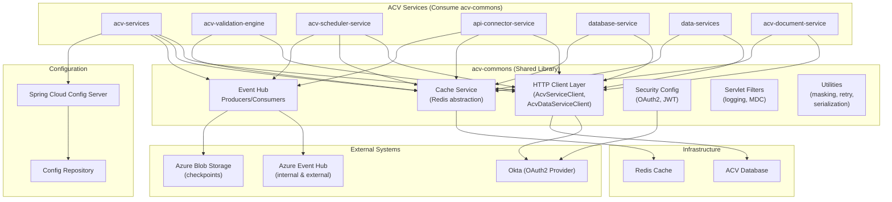
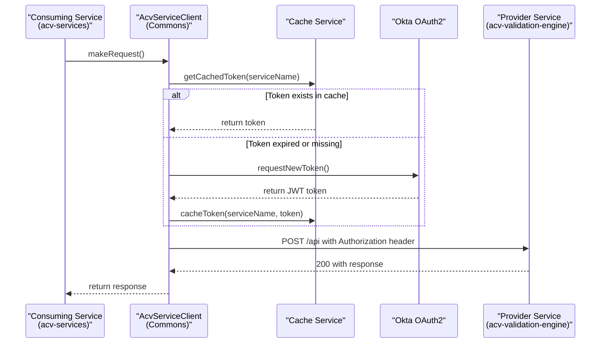
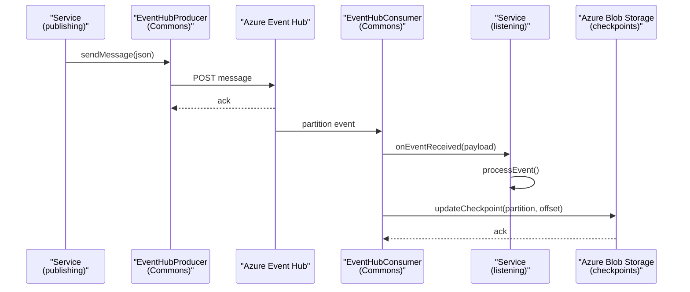
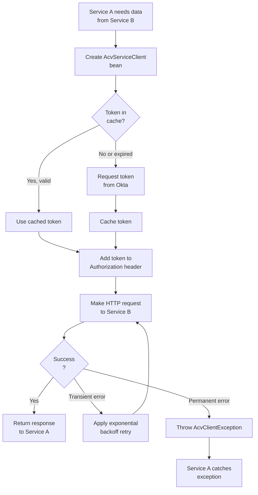
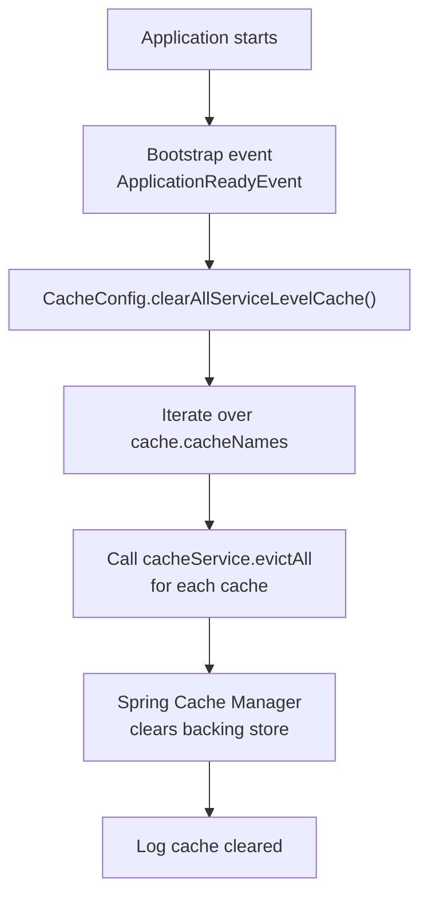
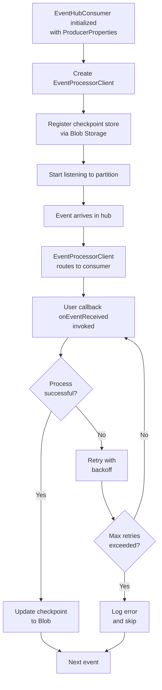

# High-Level Design (HLD) — ACV Commons Library

## Purpose & Scope

**ACV Commons** is a foundational shared library for the Automated Compliance Validation (ACV) platform. It abstracts and centralizes cross-cutting concerns that all ACV microservices need, enabling:

- **Inter-service HTTP communication** with automatic authentication and retry logic
- **Distributed caching** for tokens and frequently accessed data
- **Azure Event Hub integration** for asynchronous messaging
- **Security & authentication** via OAuth2/JWT (Okta integration)
- **Centralized logging** with PII masking and request tracking
- **Common DTOs and utilities** for data transformation and validation

The library is **not a standalone service** — it's a dependency that other ACV services import to leverage standard patterns and reduce code duplication.

---

## Business Context

### Who Uses It?

All ACV microservices depend on acv-commons:
- **eai-3540813-acv-services** — Core business logic (compliance validation workflows)
- **eai-3540813-acv-validation-engine** — Validation rules execution engine
- **eai-3540813-acv-scheduler-service** — Job scheduling and orchestration
- **eai-3540813-api-connector-service** — External third-party API integration
- **eai-3540813-database-service** — Database operations and ORM wrappers
- **eai-3540813-data-services** — Data layer services
- **eai-3540813-acv-document-service** — Document storage and retrieval

### Value Proposition

1. **Reduced Boilerplate** — Services don't reimplement HTTP clients, caching, security
2. **Consistent Patterns** — All services follow the same authentication, logging, retry strategies
3. **Operational Consistency** — Centralized configuration, monitoring, and debugging
4. **Faster Onboarding** — New services inherit battle-tested, audited code patterns
5. **Security Alignment** — Centralized OAuth2/JWT handling, PII masking, audit logging

---

## System Context Diagram



---

## Major Components

### 1. HTTP Client Layer

**Responsibility:** Abstract inter-service communication with automatic authentication, retry, and caching.

**Key Classes:**
- `AbstractHttpClient` — Base class providing token management, request signing, retry coordination
- `AcvServiceClient` — Calls the core ACV Service
- `AcvDataServiceClient` — Calls the Data Service for entity persistence
- `MultiHttpClientProvider` — Factory for creating service-specific clients
- `SimpleServiceClient` — Generic HTTP client for external APIs

**Key Behaviors:**
- Automatic JWT token acquisition from service provider credentials
- Token caching with refresh on expiry
- Request signing with ECDSA (WREG protocol)
- Exponential backoff retry on transient failures
- Propagation of tracing headers (x-transaction-id, x-country-code)

---

### 2. Cache Service

**Responsibility:** Provide distributed cache abstraction for tokens and transient data.

**Key Classes:**
- `CacheService` (interface) — Standard cache operations (get, put, evict, clear)
- `CacheServiceImpl` — Spring Cache Manager backed implementation
- `CacheConfig` — Initialization and eviction policies

**Key Behaviors:**
- Token cache lifecycle management
- Service-level cache segregation (prevents token leakage between services)
- Automatic cache clearing on application startup (configurable)
- Support for multiple cache implementations (Redis, Hazelcast, in-memory)

---

### 3. Event Hub Integration

**Responsibility:** Send and receive messages from Azure Event Hub; track message consumption with durability.

**Key Classes:**
- `EventHubProducer` — Publishes messages to Event Hub (supports internal and external)
- `EventHubConsumer` — Processes messages from Event Hub with checkpoint management
- `EventHubServices` — Persist event tracking records to database
- `EventParser` — Deserialize Event Hub message payloads
- `EventHubTracker` — DTO for event tracking metadata

**Key Behaviors:**
- Support for both internal (connection string) and external (managed identity) Event Hubs
- Durable checkpointing via Azure Blob Storage (exactly-once semantics)
- Configurable consumer groups for parallel message processing
- Automatic retry and error handling for transient network issues

---

### 4. Security & Authentication

**Responsibility:** Centralize OAuth2/JWT configuration, token validation, and RBAC.

**Key Classes:**
- `ApplicationSecurityConfiguration` — Spring Security setup (OAuth2 Resource Server)
- `AuthConfig` — JWT claims extraction and validation
- `ServiceProviderAuthorizationRefresher` — Refresh service-to-service tokens
- `ProviderCredentials` — Credentials for external service providers

**Key Behaviors:**
- OAuth2 Resource Server configuration (validates JWT tokens from Okta)
- Role-based access control (RBAC) via JWT claims
- Per-endpoint authorization rules (allowedUrlPatterns, securedUrlPatterns)
- ECDSA signing for service-to-service authentication (WREG protocol)
- Optional Okta integration (toggled via okta.enabled property)

---

### 5. Logging & Filters

**Responsibility:** Log all HTTP traffic with security guards; track requests across distributed systems.

**Key Classes:**
- `LoggingFilter` — Intercepts all requests/responses, applies masking, propagates MDC
- `LogUtils` — PII masking, JSON path masking, log formatting
- `LoggingConfig` — Logging level and format configuration
- `LogElements` — DTO for structured logging

**Key Behaviors:**
- Request/response body logging with PII redaction
- MDC context propagation (transaction ID, country code)
- Dynamic logging level adjustment via REST endpoint
- Sensitive field masking (e.g., SSN, credit card numbers)
- JSON path-based field masking configuration

---

### 6. Utilities & Helpers

**Responsibility:** Provide common utility functions for serialization, validation, retries, and data processing.

**Key Classes:**
- `ApplicationUtilities` — YAML/JSON parsing, retry template building, document download helper
- `SerializationUtils` — Jackson ObjectMapper wrapper for JSON operations
- `SanityUtils` — Input validation, anomaly detection, sanitization
- `Constants` — Shared constants (service names, status values)
- `ApplicationConstants` — Enum of app-wide constants (data types, regex patterns)

**Key Behaviors:**
- YAML file parsing for configuration
- Retry policy creation with exponential backoff
- HTTP document download with streaming
- Input validation and normalization
- ObjectMapper configuration for consistent JSON handling

---

### 7. REST Controllers (Debug/Admin Endpoints)

**Responsibility:** Expose operational endpoints for debugging, token management, and cache inspection.

**Key Classes:**
- `TokenController` — View and refresh cached tokens (dev/local profiles only)
- `CommonCacheController` — Cache diagnostics and manual clearing
- `CommonEHController` — Event Hub message tracking and diagnostics
- `LoggingController` — Dynamic logging configuration

**Key Behaviors:**
- Available only in non-production profiles (dev, local)
- Protected by security configuration (okta.enabled property)
- Real-time cache and token inspection for troubleshooting

---

## Technology Stack

| Layer | Technology | Version | Purpose |
|-------|-----------|---------|---------|
| **Language** | Java | 21 | Statically typed, high performance |
| **Framework** | Spring Boot | 3.3.4 | Dependency injection, auto-configuration |
| **Config** | Spring Cloud Config | Latest | Centralized external configuration |
| **Security** | Spring Security | 6.x | OAuth2/JWT authentication |
| **HTTP** | RestClient (Spring 6) | Latest | Modern HTTP client with interceptors |
| **HTTP Library** | Apache HttpComponents | 5.x | Underlying HTTP implementation |
| **Retry** | Spring Retry | Latest | Resilience with exponential backoff |
| **Cache** | Spring Cache Abstraction | Latest | Pluggable cache providers |
| **Messaging** | Azure Event Hubs SDK | Latest | Cloud messaging broker |
| **Storage** | Azure Blob Storage SDK | Latest | Checkpoint persistence |
| **Build** | Maven | 3.x | Dependency management and build |
| **Serialization** | Jackson | Latest | JSON processing |
| **JWT** | Nimbus JOSE+JWT | 0.12.6 | JWT creation and validation |
| **Crypto** | Java Cryptography | 21 | ECDSA operations |
| **Logging** | SLF4J + Logback | Latest | Structured logging |
| **Metrics** | Micrometer | Latest | Observability and tracing |
| **Span Propagation** | Micrometer Tracing (Brave) | Latest | Distributed tracing |

---

## Data Flow Diagram

### Inter-Service Request Flow



### Event Hub Producer/Consumer Flow



---

## Primary Business Flows

### 1. Service-to-Service Synchronous Call

**Actors:** Caller service, Provider service, Okta, Cache

**Description:** A service needs to fetch data from another service, requiring authentication and retry on transient failures.



### 2. Cache Eviction & Refresh

**Actors:** CacheConfig, CacheService, Spring Cache Manager

**Description:** On application startup, all configured caches are cleared to ensure data freshness.



### 3. Event Hub Message Consumption

**Actors:** EventHubConsumer, Event Hub, Blob Storage, Event Processing Service

**Description:** A service subscribes to Event Hub messages, processes them, and checkpoints consumption for durability.



---

## Non-Functional Requirements

| Requirement | Target | Mechanism |
|-------------|--------|-----------|
| **Availability** | 99.9% | Retry with exponential backoff on transient failures |
| **Latency** | P99 < 200ms (inter-service calls) | Token caching; HTTP connection pooling |
| **Throughput** | 10,000+ RPS per JVM | Async HTTP client; efficient connection reuse |
| **Security** | OAuth2/JWT + ECDSA | Okta integration; secure token storage |
| **Data Privacy** | PII masking in logs | LogUtils masking; JSON path redaction |
| **Observability** | Full request tracing | Micrometer; MDC context propagation |
| **Scalability** | Horizontal pod scaling | Stateless design; external cache (Redis) |
| **Reliability** | Graceful degradation | Circuit breakers; fallback implementations |

---

## Integration Points

### Upstream Dependencies (What acv-commons calls)

| Endpoint | Protocol | Purpose | Data Format |
|----------|----------|---------|-------------|
| Okta OAuth2 Token Endpoint | HTTPS REST | Request JWT tokens | JSON |
| Provider Services | HTTPS REST | Call other ACV services | JSON (via RestClient) |
| Azure Event Hub | AMQP over TLS | Publish/consume messages | JSON or binary |
| Azure Blob Storage | HTTPS REST | Store event checkpoints | Binary blobs |
| Spring Cloud Config Server | HTTPS REST | Fetch centralized config | YAML/Properties |

### Downstream Consumers (services that import acv-commons)

| Consumer | Integration Mode | Uses |
|----------|------------------|------|
| acv-services | Maven dependency | HTTPClients, Cache, EventHub, Security |
| acv-validation-engine | Maven dependency | HTTPClients, Cache, Security |
| acv-scheduler-service | Maven dependency | HTTPClients, Cache, EventHub, Security |
| api-connector-service | Maven dependency | HTTPClients, Cache, Security, Utilities |
| database-service | Maven dependency | HTTPClients, Cache, DTOs |
| data-services | Maven dependency | HTTPClients, Cache, DTOs |
| acv-document-service | Maven dependency | HTTPClients, Cache, Security, EventHub |

---

## Key Design Decisions

### Decision 1: Shared Library vs. Microservice

**Decision:** Build as a Maven library (not a separate microservice)

**Rationale:**
- Reduces network latency (in-process vs. remote calls)
- Simplifies deployment (single container per service)
- Easier version matching between library and consumers
- OWASP reduces attack surface (fewer network hops)

**Trade-off:** Library updates require service redeployment

---

### Decision 2: RestClient over RestTemplate

**Decision:** Use Spring 6's `RestClient` instead of legacy `RestTemplate`

**Rationale:**
- Modern, fluent API
- Built-in observability (micrometer integration)
- Declarative interceptor support
- Latest Spring best practices

---

### Decision 3: Token Caching Strategy

**Decision:** Cache JWT tokens in-memory (Spring Cache) with optional Redis backend

**Rationale:**
- Reduces authentication latency (token obtained once per expiry window)
- Reduces load on Okta/auth provider
- Cache layer abstraction allows runtime switching

**Design:** Automatic refresh on token expiry; manual refresh via debug endpoint

---

### Decision 4: Exponential Backoff for Transient Failures

**Decision:** Implement configurable exponential backoff retry strategy

**Rationale:**
- Handles transient network blips gracefully
- Avoids thundering herd (staggered retries)
- Configurable per service provider

**Configuration:**
```yaml
retry:
  enabled: true
  maxAttempts: 3
  backoffMultiplier: 2.0
  initialDelayMs: 100
```

---

### Decision 5: ThreadLocal Context (CustomApplicationContext)

**Decision:** Store request context (country code, data type) in ThreadLocal

**Rationale:**
- Pass context through method calls without changing signatures
- Works seamlessly with Spring async operations (InheritableThreadLocal)
- Simplifies MDC propagation in logs

---

### Decision 6: Event Hub Checkpoint Persistence

**Decision:** Use Azure Blob Storage for durable offset tracking

**Rationale:**
- Ensures exactly-once message semantics
- Survives consumer pod crashes
- Decoupled from application state

---

## Assumptions & Constraints

### Assumptions

1. **All services use Java 21+** — Library compiled to Java 21 bytecode
2. **Spring Boot 3.3.4 or compatible** — Library depends on specific Spring versions
3. **OAuth2/Okta available** — Security model assumes Okta integration (can be disabled)
4. **Redis for distributed cache** — On-premises deployments provide Redis instance
5. **Azure Event Hub for messaging** — Cloud-native; no on-prem alternatives
6. **Network latency < 100ms** — Retry backoff and timeouts assume fast networks

### Constraints

1. **Java version locked to 21** — LTS version; upgrades affect all consumers
2. **Maven-only build** — Gradle support not provided
3. **Spring Boot dependency**— Cannot be used outside Spring Boot applications
4. **Single library per project** — Version conflicts if multiple acv-commons versions required within same process
5. **Okta as sole auth provider** — Other OAuth2 providers supported but not pre-tested
6. **Azure-only cloud support** — Event Hub and Blob Storage are Azure-only

---

## Roadmap & Future Enhancements

- [ ] Async HTTP client support (WebClient)
- [ ] gRPC service client utilities
- [ ] GraphQL federation support
- [ ] Additional cache backends (Hazelcast, Infinispan)
- [ ] Circuit breaker patterns (Resilience4J integration)
- [ ] Reactive streams support
- [ ] Service mesh observability (Istio telemetry)

---

**Last Updated:** April 2, 2026  
**Version:** 1.0
