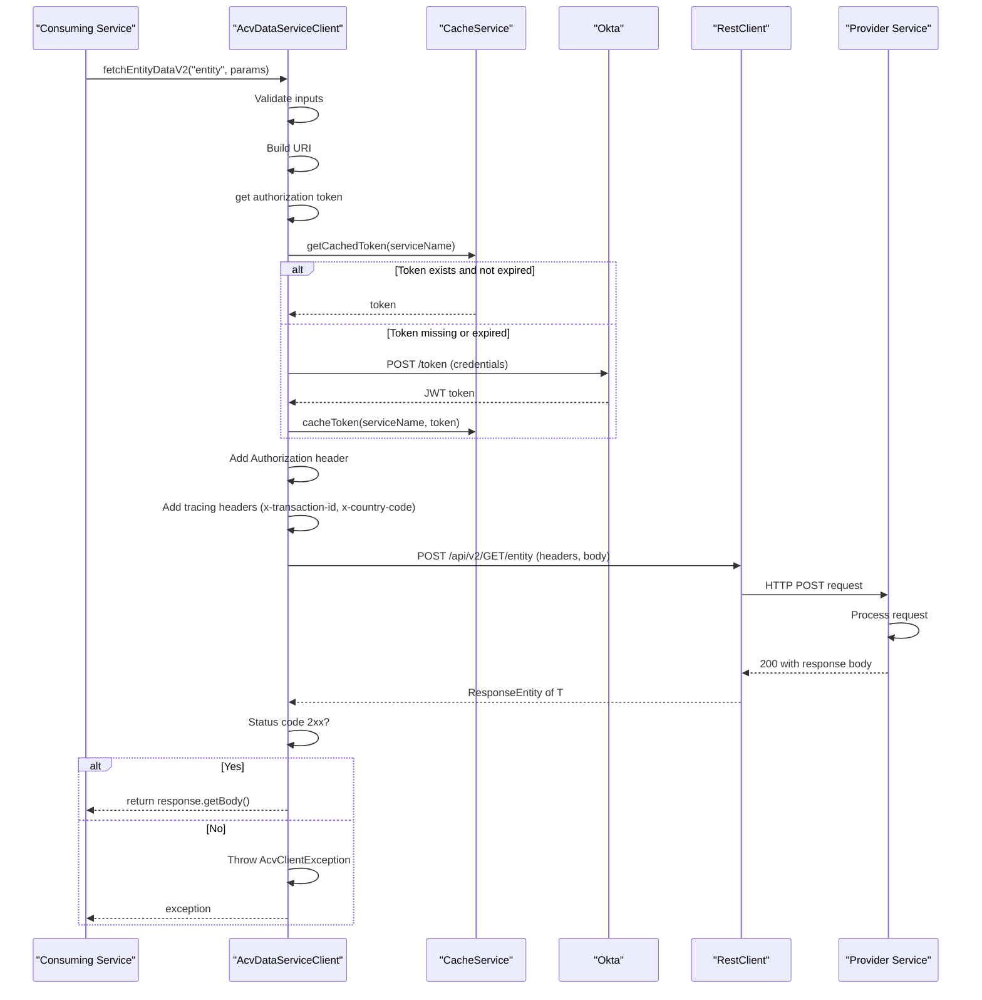
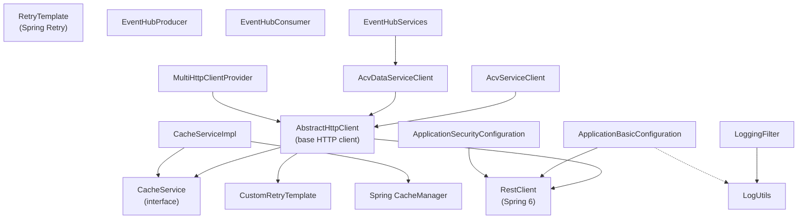

# Low-Level Design (LLD) — ACV Commons Library

## Code Organization

```
src/main/java/com/fedex/acv/commons/
├── cache/                                    # Cache abstraction layer
│   ├── CacheService.java (interface)        # Standard cache operations contract
│   └── CacheServiceImpl.java                  # Spring Cache Manager implementation
├── config/                                   # Spring configuration classes
│   ├── ApplicationBasicConfiguration.java    # RestClient, HTTP connection pooling
│   ├── ApplicationSecurityConfiguration.java # OAuth2/JWT security setup
│   ├── AuthConfig.java                       # JWT claims extraction
│   ├── CacheConfig.java                      # Cache initialization and eviction
│   ├── LoggingConfig.java                    # Logging configuration
│   ├── RequestMaskingConfig.java             # PII masking rules
│   ├── SwaggerConfig.java                    # OpenAPI/Swagger configuration
│   ├── DocumentDownloadConnectionConfig.java # Document download settings
│   ├── DocumentDownloadRequestConfig.java    # Document request configuration
│   └── CustomApplicationContext.java         # ThreadLocal context holder
├── constants/                                # Constants and enums
│   ├── Constants.java                        # Service provider names, status values
│   ├── ApplicationConstants.java             # App-wide constants and regex patterns
│   ├── ErrorCodes.java                       # Error code enum with messages
│   └── EventHubConstants.java                # Event Hub type constants
├── context/                                  # Thread-local context management
│   └── CustomApplicationContext.java         # Stores request context (country, dataType, etc.)
├── controllers/                              # REST endpoints (debug/admin only)
│   ├── TokenController.java                  # Token inspection/refresh (dev profile)
│   ├── CommonCacheController.java            # Cache management endpoints
│   ├── CommonEHController.java               # Event Hub diagnostics
│   └── LoggingController.java                # Dynamic logging configuration
├── dto/                                      # Data Transfer Objects
│   ├── AcvEventMessage.java                  # Event Hub message DTO
│   ├── ProcessCreditDataDto.java             # Credit data processing request
│   ├── ProcessCreditDataResponeDto.java      # Credit data processing response
│   ├── ProcessOcrDataDto.java                # OCR data processing request
│   ├── ProcessOcrDataResponeDto.java         # OCR data processing response
│   └── dataservice/
│       ├── Parameter.java                    # Query parameter record for Data Service
│       ├── DataGetResult.java                # Data Service query response wrapper
│       ├── DataAddResult.java                # Data Service insert response wrapper
│       ├── DataCollectionStatusDto.java      # Data collection status
│       ├── DataCollectionCompletionEvaluator.java # Evaluates data completion
│       └── DataResult.java                   # Generic data result wrapper
├── eventhub/                                 # Azure Event Hub integration
│   ├── services/
│   │   ├── EventHubServices.java             # Service for saving event tracking records
│   │   ├── EventHubProducer.java             # Message producer (publisher)
│   │   ├── EventHubConsumer.java             # Message consumer (subscriber)
│   │   └── EventParser.java                  # Message deserialization
│   └── dto/
│       ├── ProducerProperties.java           # Producer configuration
│       ├── ConsumerProperties.java           # Consumer configuration
│       ├── EventHubProperties.java           # Common EventHub properties
│       ├── EventHubTracker.java              # Event tracking metadata record
│       └── CheckpointStore.java              # Blob storage checkpoint config
├── exceptions/                               # Custom exception classes
│   ├── AcvClientException.java               # HTTP client errors
│   ├── InternalProcessingException.java      # Internal processing errors
│   ├── InvalidRequestException.java          # Request validation errors
│   └── OktaAuthorizationException.java       # OAuth2 authentication errors
├── filters/                                  # Servlet filters
│   └── LoggingFilter.java                    # Request/response logging with masking
├── http/                                     # HTTP client utilities
│   ├── clients/
│   │   ├── AbstractHttpClient.java           # Base class for service clients
│   │   ├── AcvServiceClient.java             # ACV service client
│   │   ├── AcvDataServiceClient.java         # Data service client
│   │   ├── SimpleServiceClient.java          # Generic HTTP client
│   │   └── MultiHttpClientProvider.java      # Factory for multiple clients
│   ├── configurations/
│   │   ├── HttpServiceClientsBeanConfiguration.java # Bean definitions
│   │   ├── ServiceProvidersProperties.java   # Service provider configuration
│   │   ├── ServiceProviderProperties.java    # Individual provider config
│   │   └── ServiceProvidersProperties.java   # Collection of providers
│   ├── properties/
│   │   ├── RetryProperties.java              # Retry policy configuration
│   │   ├── ProviderCredentials.java          # Service credentials (JWT, API key, etc.)
│   │   └── ServiceProviderAuthorizationRefresher.java # Token refresh mechanism
│   └── retry/
│       ├── CommonsRetryConfiguration.java   # Retry bean configuration
│       └── CustomRetryTemplate.java          # Custom Spring Retry template
├── models/                                   # Domain models
│   ├── TokenData.java                        # JWT token data
│   ├── ServiceDetails.java                   # Service metadata
│   ├── LogElements.java                      # Structured logging data
│   └── dataservice/
│       ├── WriteResponse.java                # Database write response
│       └── ColumnMetadata.java               # Database column metadata
├── utils/                                    # Utility functions
│   ├── ApplicationUtilities.java             # YAML parsing, retry building, downloads
│   ├── LogUtils.java                         # PII masking, JSON path redaction
│   ├── SerializationUtils.java               # Jackson ObjectMapper wrapper
│   └── SanityUtils.java                      # Input validation, sanitization
└── [package-info.java]                       # Package documentation
```

---

## Core Classes & Responsibilities

### Caching Layer

#### `CacheService` (Interface)
**File:** `cache/CacheService.java`

**Purpose:** Define the contract for cache operations abstracted from the underlying implementation.

**Key Methods:**
```java
<T> T get(String cacheName, String key, Class<T> clazz)         // Retrieve cached value
void put(String cacheName, String key, Object value)            // Store value in cache
void evict(String cacheName, String key)                        // Remove single entry
void evictAll(String cacheName)                                 // Clear entire cache
void cacheToken(String serviceName, String token)               // Store token
String getCachedToken(String serviceName)                       // Get stored token
void clearCachedToken(String serviceName)                       // Remove token
void clearAllCachedTokens()                                     // Clear all tokens
void clearAll()                                                  // Clear all caches
List<String> getCacheKeys()                                     // List all cache names
```

**Dependency:** None (pure interface)

---

#### `CacheServiceImpl`
**File:** `cache/CacheServiceImpl.java`

**Purpose:** Implement cache operations using Spring Cache Manager (supports Redis, Hazelcast, in-memory).

**Key Fields:**
```java
private final CacheManager cacheManager              // Spring's cache abstraction
private String applicationName                       // Service name for token cache segregation
```

**Key Methods:**
- Delegates all operations to Spring `CacheManager`
- Maintains service-specific token cache with naming pattern: `{serviceName}-security-tokens`
- Includes null-safe checks for cache existence

**Dependency:** `CacheManager` (injected by Spring)

---

### HTTP Client Layer (Inter-Service Communication)

#### `AbstractHttpClient` (Abstract Base Class)
**File:** `http/clients/AbstractHttpClient.java`

**Purpose:** Provide common HTTP operations (GET, POST, DELETE, PUT) with authentication, retry, and caching logic.

**Key Fields:**
```java
private final String serviceName                     // e.g., "acv-service", "data-service"
private final ServiceProviderProperties serviceProvider  // Configuration for this service
private final ServiceProviderProperties mockServiceProvider  // Mock service config
private final CacheService cacheService              // Token caching
private final RestClient restClient                  // Spring 6 HTTP client
private final CustomRetryTemplate defaultRetryTemplate  // Retry policy
private boolean mockEnabled                          // Enable mock mode for testing
```

**Key Methods:**

```java
// GET requests
<T> T get(String endPoint, HttpHeaders headers, 
          ParameterizedTypeReference<T> responseType)

<T> T get(String endPoint, HttpHeaders headers, 
          Map<String, Object> uriVariables, 
          MultiValueMap<String, String> queryParams,
          ParameterizedTypeReference<T> responseType)

// POST requests
<T> T post(String endPoint, HttpHeaders headers, 
           Object request, 
           ParameterizedTypeReference<T> responseType)

<T> T post(String endPoint, HttpHeaders headers,
           Map<String, Object> uriVariables,
           MultiValueMap<String, String> queryParams,
           Object request,
           ParameterizedTypeReference<T> responseType)

// PUT, DELETE, upload, download methods...

// Core execution
private <T> T executeRequest(HttpMethod method, String endPoint, HttpHeaders headers, ...)
private <T> ResponseEntity<T> sendRequest(...)

// Token management
private String getAuthorizationToken()
protected void refreshToken()
private String createWregJwt(...)                    // EC-signed JWT for WREG protocol
```

**Authorization Flow:**
1. Check cache for valid token → if exists, use it
2. If no token or expired → request new token from OAuth2 provider
3. Cache the token with TTL matching JWT expiry
4. Add token to Authorization header: `Authorization: Bearer {token}`

**Request Flow:**
1. Validate inputs
2. Build URI with query parameters
3. Get/refresh authorization token
4. Add standard headers (Content-Type, Accept, tracing headers)
5. Execute request via RestClient
6. Handle response (2xx = success, other = exception)

**Dependency:** `CacheService`, `RestClient`, `CustomRetryTemplate`, `ServiceProviderProperties`

---

#### `AcvServiceClient` (Concrete Implementation)
**File:** `http/clients/AcvServiceClient.java`

**Purpose:** Client for the core ACV Service (`acv-services`).

**Code:**
```java
public class AcvServiceClient extends AbstractHttpClient {
    public AcvServiceClient(ServiceProvidersProperties httpClientsConfiguration,
                           CacheService cacheService,
                           RestClient restClient,
                           RetryTemplate defaultRetryTemplate) {
        super(Constants.ServiceProvider.ACV_SERVICE, 
              httpClientsConfiguration, 
              cacheService, 
              restClient, 
              defaultRetryTemplate);
    }
}
```

**Inherited Methods:** All HTTP verbs from `AbstractHttpClient`

**Dependency:** `AbstractHttpClient`

---

#### `AcvDataServiceClient` (Concrete Implementation)
**File:** `http/clients/AcvDataServiceClient.java`

**Purpose:** Client for the Data Service (`database-service` / `data-services`) with entity CRUD operations.

**Key Methods:**
```java
// V1 API (legacy)
<T> List<T> fetchEntityData(String endpointName, Map<String, Object> queryParams)
WriteResponse saveEntityData(String endpointName, Map<String, Object> queryParams)

// V2 API (preferred)
<T> DataGetResult<T> fetchEntityDataV2(String endpointName, List<Parameter> queryParams)
DataAddResult saveEntityDataV2(String endpointName, List<Parameter> queryParams)
```

**Example Usage:**
```java
List<Parameter> params = Arrays.asList(
    new Parameter("countryCode", "US", Types.VARCHAR),
    new Parameter("status", "ACTIVE", Types.VARCHAR)
);
DataGetResult<?> result = dataServiceClient.fetchEntityDataV2("compliance_records", params);
List<?> records = result.data();
```

**Dependency:** `AbstractHttpClient`

---

#### `MultiHttpClientProvider` (Factory)
**File:** `http/clients/MultiHttpClientProvider.java`

**Purpose:** Factory pattern for instantiating and managing multiple service-specific HTTP clients.

**Key Method:**
```java
Map<String, AbstractHttpClient> getServiceClients()  // Get all registered clients
```

**Dependency:** Spring bean registry

---

### Configuration Classes

#### `ApplicationBasicConfiguration`
**File:** `config/ApplicationBasicConfiguration.java`

**Purpose:** Configure Spring RestClient with request interceptors, tracing headers, and SSL settings.

**Key Beans:**
```java
@Bean
@Profile("!local")
public RestClient restClient(ObservationRegistry observationRegistry)
    // Production: Standard SSL verification
    // Uses AcvRequestInterceptor for tracing headers

@Bean
@Profile("local")
public RestClient localRestClient(ObservationRegistry observationRegistry)
    // Local: No SSL verification (self-signed certs)
    // Allows testing with local services
```

**AcvRequestInterceptor:**
- Injects tracing headers into all REST requests:
  - `x-transaction-id` (extracted from MDC or generated)
  - `x-country-code` (extracted from MDC or context)

---

#### `ApplicationSecurityConfiguration`
**File:** `config/ApplicationSecurityConfiguration.java`

**Purpose:** Configure Spring Security for OAuth2/JWT resource server.

**Key Configuration:**
```java
@Bean
public SecurityFilterChain filterChain(HttpSecurity http)
    // If okta.enabled=true:
    //   - CORS allowed
    //   - OPTIONS requests permitted
    //   - URL patterns in allowed list: permit all
    //   - All other requests: require JWT token
    //   - OAuth2 resource server: JWT validation via Okta
    //
    // If okta.enabled=false:
    //   - CSRF disabled
    //   - All endpoints accessible (for testing)
```

**Configuration Properties:**
```yaml
okta:
  enabled: true                           # Toggle OAuth2
url:
  patterns:
    allowed: "/health,/swagger-ui/**"    # Public endpoints
    secured: "/api/**"                   # Protected endpoints
```

---

#### `CommonsRetryConfiguration`
**File:** `http/configurations/CommonsRetryConfiguration.java`

**Purpose:** Configure Spring Retry with exponential backoff policy.

**Key Bean:**
```java
@Bean
public RetryTemplate retryTemplate()
    // If retry.enabled=true:
    //   - Create new RetryTemplate
    //   - Set SimpleRetryPolicy with maxAttempts
    //   - Set ExponentialBackOffPolicy with multiplier and initial delay
    // Else:
    //   - Return template with maxAttempts=1 (no retry)
    //
    // RetryTemplate calls AbstractHttpClient.sendRequest() multiple times
    // on transient failures (TimeoutException, ConnectException, etc.)
```

---

### Event Hub Integration

#### `EventHubProducer`
**File:** `eventhub/services/EventHubProducer.java`

**Purpose:** Publish messages to Azure Event Hub.

**Constructor:**
```java
public EventHubProducer(ProducerProperties properties)
    // Determine EventHub type: INTERNAL or EXTERNAL
    // INTERNAL: Use connection string
    // EXTERNAL: Use managed identity credential (Azure AD)
    // Build EventHubProducerClient and store
```

**Key Method:**
```java
public void sendMessage(String message)
    // Send message to configured event hub
    // Runs synchronously
    // Throws exception on failure (no automatic retry)
```

**Dependency:** Azure Event Hubs SDK, `ProducerProperties`

---

#### `EventHubConsumer`
**File:** `eventhub/services/EventHubConsumer.java`

**Purpose:** Subscribe to and process messages from Azure Event Hub with durable checkpointing.

**Constructor:**
```java
public EventHubConsumer(ConsumerProperties properties, 
                        Consumer<String> eventConsumer)
    // Initialize blob checkpoint store
    // Determine EventHub type: INTERNAL or EXTERNAL
    // Build EventProcessorClient
    // Register message handler (eventConsumer callback)
    // Start listening to partitions
```

**Message Processing:**
```
EventHub partition event arrives
  ↓
EventProcessorClient routes to partition context
  ↓
User callback: eventConsumer.accept(message string)
  ↓
Process event (business logic)
  ↓
Update checkpoint to Blob Storage
  ↓
Ready for next event
```

**Error Handling:**
- Transient errors: Retry with backoff (configurable via AmqpRetryOptions)
- Permanent errors: Log and skip (message remains processed)

**Dependency:** Azure Event Hubs SDK, Azure Blob Storage SDK, `ConsumerProperties`

---

#### `EventHubServices`
**File:** `eventhub/services/EventHubServices.java`

**Purpose:** Persist event tracking records to the database.

**Key Method:**
```java
public void saveEventTracker(EventHubTracker eventHubTracker)
    // Build Parameter list from tracker fields
    // Call dataServiceClient.saveEntityDataV2("eventHubTracker", params)
    // Log completion
```

**Example:**
```java
EventHubTracker tracker = EventHubTracker.builder()
    .transactionID(UUID.randomUUID())
    .countryCode("US")
    .eventType("COMPLIANCE_CHECK")
    .serviceType("ACV_SERVICE")
    .messageType("EVENT_HUB_MSG")
    .message("Compliance validation started")
    .build();

eventHubServices.saveEventTracker(tracker);
```

**Dependency:** `AcvDataServiceClient`

---

### Logging & Filtering

#### `LoggingFilter`
**File:** `filters/LoggingFilter.java`

**Purpose:** Intercept all HTTP requests/responses; log with masking; propagate request context via MDC.

**Features:**
- Implements `OncePerRequestFilter` (runs once per request)
- Logs request method, URL, headers, body
- Logs response status, headers, body
- Applies PII masking via `LogUtils`
- Propagates transaction ID and country code to MDC
- Supports multipart form uploads (file handling)

**Method:**
```java
protected void doFilterInternal(HttpServletRequest request,
                               HttpServletResponse response,
                               FilterChain filterChain)
    // Generate or extract transaction ID from headers
    // Set MDC with transaction ID and country code
    // Log incoming request (masked)
    // Continue filter chain
    // Log outgoing response (masked)
    // Clear MDC
```

**Configuration:**
```yaml
acv:
  logging:
    txn:
      enable: true  # Enable transaction logging
```

---

#### `LogUtils`
**File:** `utils/LogUtils.java`

**Purpose:** Provide utilities for masking sensitive data in logs.

**Key Methods:**
```java
static String maskStringWithDefaultMaskLength(String original)
    // Mask all but last N characters (N configured via acv.mask.request.attribute.visible.length)

static String maskString(String original, int maskLength)
    // Mask first maskLength characters with '*'

static List<String> getMaskedJsonFields(String json, List<String> fieldsToMask)
    // Parse JSON and mask specific fields by JSON path
    // Example: mask "creditCard.number" → "****1234"
```

**Example:**
```java
String masked = LogUtils.maskStringWithDefaultMaskLength("my-secret-key-12345");
// Result: "****key-12345" (assuming visible.length=6)
```

---

### DTOs (Data Transfer Objects)

#### `Parameter` (Record)
**File:** `dto/dataservice/Parameter.java`

**Purpose:** Encapsulate a named query/procedure parameter with SQL type.

**Definition:**
```java
@Builder
public record Parameter(
    String name,           // Parameter name
    Object value,          // Parameter value
    Integer sqlType        // SQL type (java.sql.Types.*)
) {
    public Parameter(String name, Object value) {
        this(name, value, Types.VARCHAR);  // Default to VARCHAR
    }
}
```

**Usage:**
```java
new Parameter("countryCode", "US", Types.VARCHAR)
new Parameter("status", "ACTIVE")  // Defaults to VARCHAR
new Parameter("recordCount", 10, Types.INTEGER)
```

---

#### `DataGetResult<T>` (Generic Wrapper)
**File:** `dto/dataservice/DataGetResult.java`

**Purpose:** Wrap query results from Data Service.

**Structure:**
```java
public record DataGetResult<T>(
    boolean success,           // Query successful?
    List<T> data,             // Result rows
    String message,           // Status message
    int errorCode             // Error code if failed
) {}
```

---

#### `DataAddResult` (Insert Response)
**File:** `dto/dataservice/DataAddResult.java`

**Purpose:** Wrap insert/update response from Data Service.

**Structure:**
```java
public record DataAddResult(
    boolean success,
    int recordsAffected,
    String message,
    int errorCode
) {}
```

---

#### `EventHubTracker` (Record)
**File:** `eventhub/dto/EventHubTracker.java`

**Purpose:** Encapsulate event tracking data for persistence.

**Structure:**
```java
public record EventHubTracker(
    UUID transactionID,
    String countryCode,
    String eventType,
    String serviceType,
    String messageType,
    String message
) {}
```

---

### Utility Classes

#### `ApplicationUtilities`
**File:** `utils/ApplicationUtilities.java`

**Purpose:** Provide common utility functions.

**Key Methods:**
```java
static <T> T readFromFileToObject(String filePath, Class<T> clazz, boolean isFilePath)
    // Read YAML/JSON file from classpath (config dir)
    // Parse to specified class using Jackson
    // Validate file path (prevent path traversal attacks)

static Map<String, Object> parseJsonStringToObject(String json)
    // Parse JSON string to Map<String, Object>

static RetryTemplate buildRetryTemplate(RetryProperties properties)
    // Create Spring RetryTemplate from configuration
    // Set SimpleRetryPolicy and ExponentialBackOffPolicy

static DocumentDownloadResponseDto downloadDocument(String url, DocumentDownloadConnectionConfig config)
    // Stream document from HTTP URL
    // Save to temporary file
    // Return response with file handle
```

---

#### `SerializationUtils`
**File:** `utils/SerializationUtils.java`

**Purpose:** Wrapper around Jackson ObjectMapper for consistent JSON handling.

**Key Methods:**
```java
static <T> T readValue(String json, Class<T> clazz)
    // Deserialize JSON string to object

static String writeValueAsString(Object value)
    // Serialize object to JSON string
```

---

#### `SanityUtils`
**File:** `utils/SanityUtils.java`

**Purpose:** Input validation and sanitization.

**Key Methods:**
```java
static String sanitize(String input)
    // Remove/escape special characters

static boolean isValidCountryCode(String code)
    // Validate against RegEx pattern

static void validateInput(String input, String pattern)
    // Throw InvalidRequestException if input doesn't match pattern
```

---

### Constants

#### `Constants` (Interface with Inner Interfaces)
**File:** `constants/Constants.java`

**Purpose:** Application-wide constants.

**Definition:**
```java
public interface Constants {
    interface ServiceProvider {
        String MOCK_SERVICE = "mock-service";
        String ACV_SERVICE = "acv-service";
        String API_CONNECTOR = "api-connector";
        String DATA_SERVICE = "data-service";
        String DOCUMENT_SERVICE = "document-service";
        String SCHEDULER_SERVICE = "scheduler-service";
    }

    interface Status {
        String SUCCESS = "success";
        String FAILURE = "failure";
    }
}
```

**Usage:**
```java
Constants.ServiceProvider.ACV_SERVICE  // "acv-service"
Constants.Status.SUCCESS               // "success"
```

---

#### `ApplicationConstants` (Enum)
**File:** `constants/ApplicationConstants.java`

**Purpose:** Configuration constants and RegEx patterns.

**Values:**
```java
AADHAAR_OTP_DATATYPE("AADHAAR-OTP")
COUNTRY_CODE_REGEX("^[A-Z]{2,}$")           // Alpha, 2+ length
RECORD_CODE_REGEX("^[A-Z]*(-[A-Z]{1,})?$")  // Alpha with optional hyphen
WREG("WREG")                                // Service provider type
ACV_SERVICE("ACV_SERVICE")
ACV_API_CONNECTOR_SERVICE("ACV_API_CONNECTOR_SERVICE")
```

---

## Design Patterns Used

### 1. **Factory Pattern** (Service Client Creation)

```
ServiceProvidersProperties
  ↓
HttpServiceClientsBeanConfiguration beans
  ↓
AcvServiceClient, AcvDataServiceClient, etc.
```

**Example:**
```java
@Bean
public AcvDataServiceClient dataServiceClient() {
    return new AcvDataServiceClient(
        httpClientsConfiguration,
        cacheService,
        restClient,
        defaultRetryTemplate
    );
}
```

---

### 2. **Template Method Pattern** (AbstractHttpClient)

`AbstractHttpClient` defines the algorithm for HTTP execution:
1. Validate input
2. Build URI
3. Get authorization token (possibly from cache)
4. Add headers
5. Execute request
6. Handle response

Subclasses (`AcvServiceClient`, `AcvDataServiceClient`) inherit behavior without reimplementation.

---

### 3. **Strategy Pattern** (Retry Policies)

Different services can have different retry strategies:
- Service A: 3 retries with exponential backoff
- Service B: 5 retries with fixed backoff
- Service C: No retry (1 attempt)

Configured via `RetryProperties` per service provider.

---

### 4. **Decorator Pattern** (Servlet Filters)

`LoggingFilter` decorates the incoming HTTP request with logging and MDC context without modifying the request itself.

```
HTTP Request
  ↓
LoggingFilter (logs incoming)
  ↓
LoggingFilter (logs outgoing after filter chain processed)
  ↓
Response
```

---

### 5. **Adapter Pattern** (CacheService Interface)

`CacheService` interface provides a contract; `CacheServiceImpl` adapts Spring `CacheManager` to that contract. Allows swapping cache implementations (Redis, Hazelcast, In-Memory) without changing client code.

---

### 6. **Builder Pattern** (DTOs with Lombok)

```java
@Builder
public record Parameter(String name, Object value, Integer sqlType) {}

// Usage:
Parameter param = Parameter.builder()
    .name("countryCode")
    .value("US")
    .build();
```

---

## Request/Response Lifecycle

### Sequence Diagram: Inter-Service HTTP Call



---

## Configuration Reference

| Property | Type | Default | Purpose | Example |
|----------|------|---------|---------|---------|
| `acv.tracing.header` | String | `x-transaction-id` | Request tracing header name | `x-transaction-id` |
| `acv.country.header` | String | `x-country-code` | Country code header name | `x-country-code` |
| `acv.tracing.pattern.transaction` | String | `transaction.id` | MDC key for transaction ID | `transaction.id` |
| `acv.tracing.pattern.country` | String | `country` | MDC key for country code | `country` |
| `acv.logging.txn.enable` | Boolean | `true` | Enable transaction logging | `true` |
| `acv.mask.request.attribute.visible.length` | Integer | `4` | Last N visible chars when masking | `4` |
| `okta.enabled` | Boolean | `true` | Enable OAuth2/JWT validation | `true` |
| `url.patterns.allowed` | String | (empty) | Public endpoints (no auth required) | `/health,/swagger-ui/**` |
| `url.patterns.secured` | String | (empty) | Protected endpoints | `/api/**` |
| `cache.cacheNames` | String | (empty) | Caches to initialize | `token-cache,user-cache` |
| `mock.flag` | Boolean | `false` | Enable mock service mode | `false` |
| `retry.enabled` | Boolean | `true` | Enable HTTP retries | `true` |
| `retry.maxAttempts` | Integer | `3` | Max retry attempts | `3` |
| `retry.backoffMultiplier` | Double | `2.0` | Backoff multiplier | `2.0` |
| `retry.initialDelayMs` | Integer | `100` | Initial retry delay (ms) | `100` |

---

## Dependency Graph (Class-Level)



---

## Spring Bean Wiring

All beans are configured via `@Configuration` classes:

1. **HttpServiceClientsBeanConfiguration** — Registers service clients
2. **CommonsRetryConfiguration** — Registers retry template
3. **CacheServiceImpl** — Cache abstraction (auto-configured via Spring Boot)
4. **ApplicationBasicConfiguration** — RestClient and request interceptors
5. **ApplicationSecurityConfiguration** — Security filter chain

**Auto-Scan:** All classes in `com.fedex.acv.commons` package scanned for `@Component`, `@Service`, `@Controller` annotations.

---

**Last Updated:** April 2, 2026  
**Version:** 1.0
