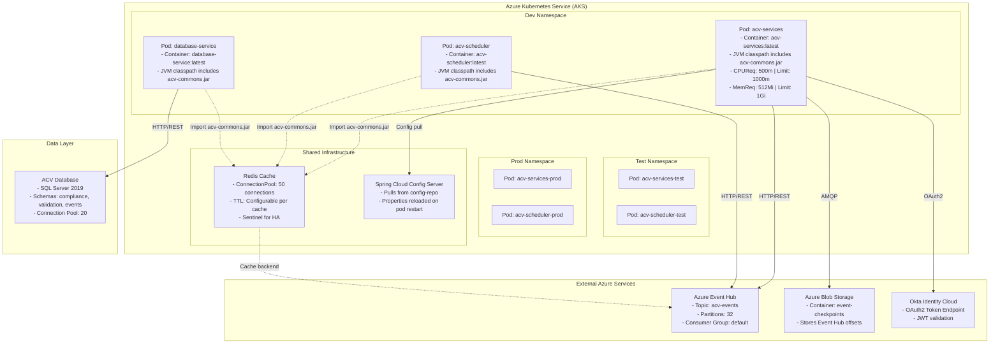
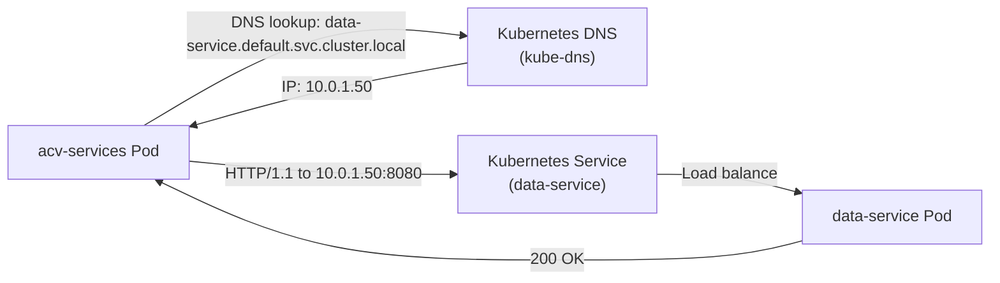
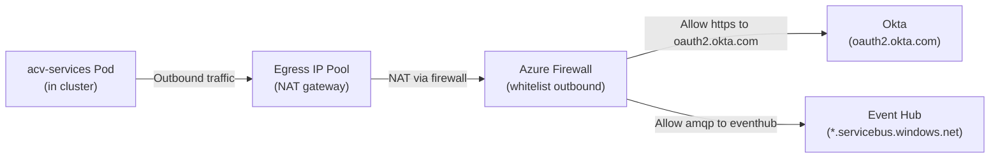
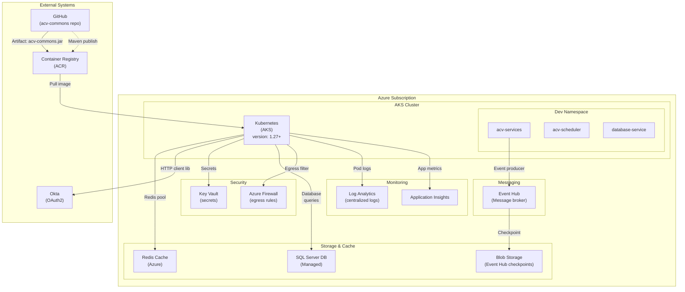

# Architecture & Deployment — ACV Commons Library

## Architecture Style

**ACV Commons** follows the **Shared Library Architecture Pattern**:

- **Not a microservice** — Distributed as a Maven JAR dependency
- **Embedded in consuming services** — Code runs in-process, not as separate service
- **Single deployment unit** — Updated via service rebuild and redeployment
- **Stateless design** — All state externalized to Redis, Blob Storage, or external providers

### Benefits

- **Low latency** — No network hop for library calls
- **Simple deployment** — One container per service
- **Consistent patterns** — All consumers leverage same implementations
- **Easy debugging** — Library code visible in service stack traces

### Trade-offs

- **Library updates require service redeployment** — Cannot patch library independently
- **Version conflicts possible** — If multiple acv-commons versions required (use dependency management)
- **Shared classpath** — No isolation between library and consumer code

---

## Deployment Topology



---

## Kubernetes Configuration

### Helm Chart Structure

```
eai-3540813-acv-commons/
├── helm-releases/
│   ├── nonprod-dev.yaml               # Dev environment values
│   ├── nonprod-test.yaml              # Test environment values (if exists)
│   └── prod.yaml                      # Production values (if exists)
```

### Sample Helm Values (nonprod-dev.yaml)

```yaml
# Note: acv-commons is a library dependency, not deployed separately
# These values apply to consuming services that include acv-commons

replicaCount: 1

image:
  repository: myregistry.azurecr.io/acv/acv-commons
  tag: 1.1.5
  pullPolicy: Always

resources:
  requests:
    cpu: 500m
    memory: 512Mi
  limits:
    cpu: 1000m
    memory: 1Gi

# Spring Boot properties loaded from ConfigServer
springBoot:
  profile: dev
  configServerUri: http://config-server:8888

# acv-commons specific environment variables
env:
  - name: CACHE_TYPE
    value: redis
  - name: OKTA_ENABLED
    value: "true"
  - name: EVENT_HUB_CONNECTION_STRING
    valueFrom:
      secretKeyRef:
        name: acv-secrets
        key: eventhub-connection-string
  - name: BLOB_CONNECTION_STRING
    valueFrom:
      secretKeyRef:
        name: acv-secrets
        key: blob-connection-string
```

---

## Container Strategy

### Dockerfile (for consuming services)

```dockerfile
# Multi-stage build
FROM maven:3.9.0-eclipse-temurin-21 AS builder

WORKDIR /build

# Copy acv-commons POM and build library
COPY eai-3540813-acv-commons/pom.xml acv-commons-pom.xml
RUN mvn -B -f acv-commons-pom.xml dependency:resolve

# Copy consuming service source
COPY eai-3540813-acv-services/pom.xml .
COPY eai-3540813-acv-services/src ./src

# Build (acv-commons pulled from artifact repository)
RUN mvn clean package -DskipTests

# Runtime stage
FROM eclipse-temurin:21-jdk-alpine

WORKDIR /app

# Copy built JAR from builder
COPY --from=builder /build/target/acv-services-*.jar app.jar

# Health check
HEALTHCHECK --interval=30s --timeout=3s --start-period=40s --retries=3 \
    CMD java -jar app.jar --spring.boot.actuator=/actuator/health

# Run
ENTRYPOINT ["java", "-jar", "app.jar"]
```

### Image Details

- **Base Image:** `eclipse-temurin:21-jdk-alpine` (lightweight, official Java)
- **Size:** ~350MB (JDK 21 + acv-commons + consumer service)
- **Layers:** 3 main layers (static dependencies, dynamic dependencies, application)
- **Registry:** Azure Container Registry (ACR)
- **Tagging:** `1.1.5` (matches acv-commons version)

---

## Infrastructure as Code

### Terraform Module Structure

**File:** `eai-3540813-infra/modules/`

```
modules/
├── aks_cluster/                         # AKS cluster provisioning
│   ├── main.tf
│   ├── variables.tf
│   └── outputs.tf
├── redis/                               # Redis cache
│   ├── main.tf
│   ├── variables.tf (cache tier, eviction policy, maxmemory)
│   └── outputs.tf
├── event_hub/                           # Event Hub namespace and topics
│   ├── main.tf
│   ├── variables.tf (partition count, retention)
│   └── outputs.tf
├── blob_storage/                        # Blob containers
│   ├── main.tf
│   ├── variables.tf (access tier, redundancy)
│   └── outputs.tf
└── keyvault/                            # Key Vault for secrets
    ├── main.tf
    ├── variables.tf
    └── outputs.tf
```

### Key Terraform Variables for acv-commons

```hcl
# Redis configuration
redis_sku_name          = "Premium"  # Supports clustering and replication
redis_capacity          = 1          # 1GB, 6GB, 13GB, 26GB, 53GB
redis_family            = "P"        # Premium tier
redis_minimum_tls_version = "1.2"

# Event Hub configuration
eventhub_partition_count       = 32
eventhub_message_retention     = 1   # 1 day
eventhub_capture_enabled       = true
eventhub_capture_destination   = "blob"  # Archive to storage

# Blob storage
blob_access_tier           = "Cool"
blob_https_traffic_only    = true
blob_default_action        = "Deny"  # Restrict IP access
```

---

## Network Architecture

### Service-to-Service Communication



### External Service Communication



### TLS/mTLS Configuration

| Connection | Protocol | Certificate | Verification |
|------------|----------|------------- |--------------|
| Pod to Redis | TLS 1.2 | Self-signed or CA | Verify hostname |
| Pod to Event Hub | TLS 1.2 | Azure managed | Verify hostname |
| Pod to Config Server | TLS 1.2 | Self-signed |  Optional in dev |
| Pod to Okta | TLS 1.2 | Public CA | Mandatory |
| Intra-pod (Java RestClient) | TLS 1.2+ | Configured via AbstractHttpClient | Per service provider |

---

## Scaling Strategy

### Horizontal Pod Autoscaling (HPA)

```yaml
apiVersion: autoscaling/v2
kind: HorizontalPodAutoscaler
metadata:
  name: acv-services-hpa
spec:
  scaleTargetRef:
    apiVersion: apps/v1
    kind: Deployment
    name: acv-services
  minReplicas: 2
  maxReplicas: 10
  metrics:
    - type: Resource
      resource:
        name: cpu
        target:
          type: Utilization
          averageUtilization: 70
    - type: Resource
      resource:
        name: memory
        target:
          type: Utilization
          averageUtilization: 80
  behavior:
    scaleDown:
      stabilizationWindowSeconds: 300
      policies:
        - type: Percent
          value: 50
          periodSeconds: 60
    scaleUp:
      stabilizationWindowSeconds: 0
      policies:
        - type: Percent
          value: 100
          periodSeconds: 15
```

**Scaling Triggers:**
- CPU > 70% → Scale up 100% (add replicas)
- Memory > 80% → Scale up 100%
- CPU < 50% for 5+ min → Scale down 50%

### Resource Budgets

Per service pod (includes acv-commons + service logic):

| Resource | Request | Limit | Rationale |
|----------|---------|-------|-----------|
| CPU | 500m | 1000m | 0.5 cores baseline, up to 1 core burst |
| Memory | 512Mi | 1Gi | 512MB baseline, up to 1GB peak |
| Threads | ~200 | ~500 | JVM thread pool + Netty event loop |
| Connections | 50 (cache) + 20 (DB) + 10 (HTTP) = 80 | 150 | Connection pooling limits |

### Connection Pool Configuration

**HTTP Connection Pool (RestClient via HttpComponents):**
```java
PoolingHttpClientConnectionManager manager = 
    PoolingHttpClientConnectionManagerBuilder.create()
        .setMaxConnPerRoute(10)                    // Per target host
        .setMaxConnTotal(50)                       // Overall pool size
        .setConnectionTimeToLive(Duration.ofMinutes(5))
        .build();
```

**Database Connection Pool:**
```yaml
spring:
  datasource:
    hikari:
      maximum-pool-size: 20                        # Max connections
      minimum-idle: 5                              # Min idle connections
      connection-timeout: 20000                    # 20 seconds
      idle-timeout: 900000                         # 15 minutes
      max-lifetime: 1800000                        # 30 minutes
```

**Redis Connection Pool (Spring Data Redis):**
```yaml
spring:
  redis:
    jedis:
      pool:
        min-idle: 2
        max-idle: 10
        max-active: 20
        max-wait: Duration: -1ms
```

---

## Pod Disruption Budgets (PDB)

Ensures minimum availability during cluster maintenance:

```yaml
apiVersion: policy/v1
kind: PodDisruptionBudget
metadata:
  name: acv-services-pdb
spec:
  minAvailable: 1              # At least 1 pod must remain running
  selector:
    matchLabels:
      app: acv-services
```

---

## Monitoring & Observability

### Metrics Exposed by acv-commons

**Spring Boot Actuator Endpoints:**
```
GET /actuator/health                      # Health check (liveness)
GET /actuator/health/liveness             # Liveness probe
GET /actuator/health/readiness            # Readiness probe
GET /actuator/metrics                     # Prometheus metrics
GET /actuator/metrics/http.client.requests # HTTP client latency
GET /actuator/metrics/cache.gets           # Cache hits/misses
GET /actuator/env                          # Environment properties
```

### Key Metrics

| Metric | Source | Purpose | Threshold |
|--------|--------|---------|-----------|
| `http.client.requests` | Micrometer | REST call latency | P95 < 200ms |
| `cache.gets.hit` | Spring Cache | Cache hit rate | > 80% |
| `cache.gets.miss` | Spring Cache | Cache miss rate | < 20% |
| `jvm.threads.live` | JVM | Active threads | < 300 |
| `process.uptime` | JVM | Pod uptime | Detect crashes |
| `jvm.memory.used` | JVM | Heap usage | < 80% of limit |

### Prometheus Rules

```yaml
groups:
  - name: acv-commons-slow-requests
    rules:
      - alert: SlowHttpRequest
        expr: histogram_quantile(0.95, http_client_requests_seconds_bucket) > 0.2
        for: 5m
        annotations:
          summary: "Slow HTTP requests detected (>200ms)"
          
  - alert: LowCacheHitRate
    expr: cache_gets_hit_ratio < 0.70
    for: 10m
    annotations:
      summary: "Cache hit rate below 70%"
```

---

## Configuration Management

### Properties Loading Order (Spring Boot)

1. **application.yml** (classpath, default)
2. **application-{profile}.yml** (dev, test, prod)
3. **Config Server** (fetched at startup)
4. **Environment Variables** (override all)
5. **Command-line arguments** (highest priority)

### Config Server Bootstrap

**bootstrap.yml** (in consuming service):
```yaml
spring:
  application:
    name: acv-services
  cloud:
    config:
      uri: http://config-server:8888
      fail-fast: true
      retry:
        initial-interval: 1000
        max-interval: 2000
        max-attempts: 6
```

**Config Server fetches from:**
```
http://config-server/acv-services/dev
→ Loads from config-repo/acv-services/acv-services-dev.yml
```

### Secrets Management

Secrets stored in Azure Key Vault, injected via:

1. **Kubernetes Secret** (referenced in deployment)
2. **Environment Variable** (read by Spring Boot)
3. **Spring Configuration** (resolved via `${ENV_VAR}`)

**Example:**
```yaml
# Deployment
env:
  - name: EVENTHUB_CONNECTION_STRING
    valueFrom:
      secretKeyRef:
        name: acv-secrets
        key: eventhub-connection-string

# application.yml
eventhub:
  producer:
    connectionString: ${EVENTHUB_CONNECTION_STRING}
```

---

## Disaster Recovery

### RTO & RPO Targets

| Component | RTO (Recovery Time Objective) | RPO (Recovery Point Objective) |
|-----------|-------------------------------|-------------------------------|
| AKS Cluster | 15 minutes (automated failover) | < 5 minutes |
| Redis Cache | 1 minute (replica takeover) | < 1 minute |
| Event Hub | Automatic (Azure SLA: 99.9%) | < 1 message |
| Blob Storage | Automatic (geo-redundant) | < 1 hour |

### Backup Strategy

**Redis Backups:**
- Automatic Azure-managed backups hourly
- Manual export to Blob Storage daily

**Event Hub Checkpoints:**
- Durable storage in Blob Storage (each message offset)
- Reprocess from checkpoint on pod restart

**Database Backups:**
- Automated daily snapshots (SQL Server)
- Point-in-time recovery enabled (7-day retention)

---

## Cost Optimization

### Managed Services Used

| Service | SKU | Estimated Cost (monthly) |
|---------|-----|-------------------------|
| AKS Cluster (3 nodes, D2s v3) | Standard | $400 |
| Redis Cache (1GB, Premium) | Premium | $150 |
| Event Hub (32 partitions) | Standard | $200 |
| Blob Storage (100GB, Cool tier) | Cool | $5 |
| Key Vault | Standard | $1 |
| **Total** | | ~**$756** |

### Optimization Opportunities

- **HPA:** Scale to 0 replicas in non-prod during off-hours
- **Redis Eviction:** Configure maxmemory-policy to evict stale tokens
- **Event Hub:** Reduce partition count if throughput < 1MB/s
- **Storage:** Use Blob lifecycle policies to archive logs after 90 days

---

## Infrastructure Diagram



---

**Last Updated:** April 2, 2026  
**Version:** 1.0
