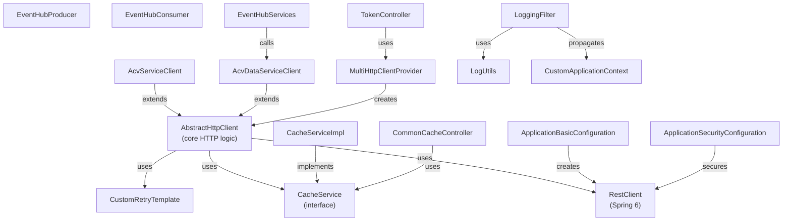

# Code Mapping Reference — ACV Commons Library

## Package-to-Responsibility Map

| Package | Responsibility | Key Classes |
|---------|---|---|
| `com.fedex.acv.commons.cache` | Cache operations (get, put, evict, token caching) | `CacheService`, `CacheServiceImpl`, `CacheConfig` |
| `com.fedex.acv.commons.config` | Spring Boot auto-configuration | `ApplicationBasicConfiguration`, `ApplicationSecurityConfiguration`, `AuthConfig`, `CacheConfig`, `LoggingConfig` |
| `com.fedex.acv.commons.constants` | Application-wide constants and enums | `Constants`, `ApplicationConstants`, `ErrorCodes`, `EventHubConstants` |
| `com.fedex.acv.commons.context` | ThreadLocal request context | `CustomApplicationContext` |
| `com.fedex.acv.commons.controllers` | REST endpoints (debug profiles only) | `TokenController`, `CommonCacheController`, `CommonEHController`, `LoggingController` |
| `com.fedex.acv.commons.dto` | High-level DTOs (ORC, credit data) | `AcvEventMessage`, `ProcessCreditDataDto`, `ProcessOcrDataDto` |
| `com.fedex.acv.commons.dto.dataservice` | Data Service DTOs | `Parameter`, `DataGetResult<T>`, `DataAddResult`, `DataCollectionStatusDto` |
| `com.fedex.acv.commons.eventhub.services` | Event Hub production and consumption | `EventHubProducer`, `EventHubConsumer`, `EventHubServices`, `EventParser` |
| `com.fedex.acv.commons.eventhub.dto` | Event Hub configuration and tracking | `ProducerProperties`, `ConsumerProperties`, `EventHubTracker`, `CheckpointStore` |
| `com.fedex.acv.commons.exceptions` | Custom exception classes | `AcvClientException`, `InternalProcessingException`, `InvalidRequestException`, `OktaAuthorizationException` |
| `com.fedex.acv.commons.filters` | Servlet filters (logging, MDC) | `LoggingFilter` |
| `com.fedex.acv.commons.http.clients` | HTTP service clients | `AbstractHttpClient`, `AcvServiceClient`, `AcvDataServiceClient`, `SimpleServiceClient`, `MultiHttpClientProvider` |
| `com.fedex.acv.commons.http.configurations` | HTTP client bean definitions | `HttpServiceClientsBeanConfiguration`, `ServiceProvidersProperties`, `ServiceProviderProperties` |
| `com.fedex.acv.commons.http.properties` | Configuration properties for HTTP | `RetryProperties`, `ProviderCredentials`, `ServiceProviderAuthorizationRefresher` |
| `com.fedex.acv.commons.http.retry` | Retry template and policies | `CommonsRetryConfiguration`, `CustomRetryTemplate` |
| `com.fedex.acv.commons.models` | Domain models | `TokenData`, `ServiceDetails`, `LogElements` |
| `com.fedex.acv.commons.models.dataservice` | Database models | `WriteResponse`, `ColumnMetadata` |
| `com.fedex.acv.commons.utils` | Utility functions | `ApplicationUtilities`, `LogUtils`, `SerializationUtils`, `SanityUtils` |

---

## Class Inventory (Complete Listing)

### Cache Package

| Class | File Path | Layer | Brief Description |
|-------|-----------|-------|-------------------|
| `CacheService` | `cache/CacheService.java` | Interface | Contract for cache operations |
| `CacheServiceImpl` | `cache/CacheServiceImpl.java` | Service | Spring Cache Manager implementation |

### Configuration Package

| Class | File Path | Layer | Brief Description |
|-------|-----------|-------|-------------------|
| `ApplicationBasicConfiguration` | `config/ApplicationBasicConfiguration.java` | Config | RestClient setup, request interceptors |
| `ApplicationSecurityConfiguration` | `config/ApplicationSecurityConfiguration.java` | Config | OAuth2/JWT security |
| `AuthConfig` | `config/AuthConfig.java` | Config | JWT claims extraction |
| `CacheConfig` | `config/CacheConfig.java` | Config | Cache initialization and eviction |
| `LoggingConfig` | `config/LoggingConfig.java` | Config | Logging level and format |
| `RequestMaskingConfig` | `config/RequestMaskingConfig.java` | Config | PII masking rules |
| `SwaggerConfig` | `config/SwaggerConfig.java` | Config | OpenAPI/Swagger documentation |
| `DocumentDownloadConnectionConfig` | `config/DocumentDownloadConnectionConfig.java` | Config | Document download connection settings |
| `DocumentDownloadRequestConfig` | `config/DocumentDownloadRequestConfig.java` | Config | Document download request settings |

### Constants Package

| Class | File Path | Layer | Brief Description |
|-------|-----------|-------|-------------------|
| `Constants` | `constants/Constants.java` | Constants | Service provider names, status values |
| `ApplicationConstants` | `constants/ApplicationConstants.java` | Constants | App-wide enums (data types, regex patterns) |
| `ErrorCodes` | `constants/ErrorCodes.java` | Constants | Error code enum with messages |
| `EventHubConstants` | `constants/EventHubConstants.java` | Constants | Event Hub type constants |

### Controllers Package

| Class | File Path | Layer | Brief Description |
|-------|-----------|-------|-------------------|
| `TokenController` | `controllers/TokenController.java` | Controller | Token inspection/refresh (dev) |
| `CommonCacheController` | `controllers/CommonCacheController.java` | Controller | Cache management REST endpoints |
| `CommonEHController` | `controllers/CommonEHController.java` | Controller | Event Hub diagnostics |
| `LoggingController` | `controllers/LoggingController.java` | Controller | Dynamic logging configuration |

### DTO Package (High-Level)

| Class | File Path | Layer | Brief Description |
|-------|-----------|-------|-------------------|
| `AcvEventMessage` | `dto/AcvEventMessage.java` | DTO | Event Hub message structure |
| `ProcessCreditDataDto` | `dto/ProcessCreditDataDto.java` | DTO | Credit data processing request |
| `ProcessCreditDataResponeDto` | `dto/ProcessCreditDataResponeDto.java` | DTO | Credit data processing response |
| `ProcessOcrDataDto` | `dto/ProcessOcrDataDto.java` | DTO | OCR data processing request |
| `ProcessOcrDataResponeDto` | `dto/ProcessOcrDataResponeDto.java` | DTO | OCR data processing response |

### DTO Package (Data Service)

| Class | File Path | Layer | Brief Description |
|-------|-----------|-------|-------------------|
| `Parameter` | `dto/dataservice/Parameter.java` | DTO | Query/procedure parameter (record) |
| `DataGetResult<T>` | `dto/dataservice/DataGetResult.java` | DTO | Query response wrapper (generic) |
| `DataAddResult` | `dto/dataservice/DataAddResult.java` | DTO | Insert response wrapper |
| `DataCollectionStatusDto` | `dto/dataservice/DataCollectionStatusDto.java` | DTO | Data collection status |
| `DataCollectionCompletionEvaluator` | `dto/dataservice/DataCollectionCompletionEvaluator.java` | Utility | Evaluates data collection completion |
| `DataResult` | `dto/dataservice/DataResult.java` | DTO | Generic data result wrapper |

### Exception Package

| Class | File Path | Layer | Brief Description |
|-------|-----------|-------|-------------------|
| `AcvClientException` | `exceptions/AcvClientException.java` | Exception | HTTP client errors (non-2xx)  |
| `InternalProcessingException` | `exceptions/InternalProcessingException.java` | Exception | Internal processing errors |
| `InvalidRequestException` | `exceptions/InvalidRequestException.java` | Exception | Request validation errors |
| `OktaAuthorizationException` | `exceptions/OktaAuthorizationException.java` | Exception | OAuth2 authentication errors |

### Filters Package

| Class | File Path | Layer | Brief Description |
|-------|-----------|-------|-------------------|
| `LoggingFilter` | `filters/LoggingFilter.java` | Filter | Request/response logging with masking |

### HTTP Clients Package

| Class | File Path | Layer | Brief Description |
|-------|-----------|-------|-------------------|
| `AbstractHttpClient` | `http/clients/AbstractHttpClient.java` | Client | Base class with auth, retry, caching |
| `AcvServiceClient` | `http/clients/AcvServiceClient.java` | Client | Concrete client for core ACV service |
| `AcvDataServiceClient` | `http/clients/AcvDataServiceClient.java` | Client | Concrete client for Data Service |
| `SimpleServiceClient` | `http/clients/SimpleServiceClient.java` | Client | Generic HTTP client (external APIs) |
| `MultiHttpClientProvider` | `http/clients/MultiHttpClientProvider.java` | Factory | Factory for multiple service clients |

### HTTP Configurations Package

| Class | File Path | Layer | Brief Description |
|-------|-----------|-------|-------------------|
| `HttpServiceClientsBeanConfiguration` | `http/configurations/HttpServiceClientsBeanConfiguration.java` | Config | Bean definitions for service clients |
| `ServiceProvidersProperties` | `http/configurations/ServiceProvidersProperties.java` | Config | Collection of all service provider configs |
| `ServiceProviderProperties` | `http/configurations/ServiceProviderProperties.java` | Config | Individual service provider configuration |

### HTTP Properties Package

| Class | File Path | Layer | Brief Description |
|-------|-----------|-------|-------------------|
| `RetryProperties` | `http/properties/RetryProperties.java` | Property | Retry policy configuration |
| `ProviderCredentials` | `http/properties/ProviderCredentials.java` | Property | Service credentials (JWT, API key) |
| `ServiceProviderAuthorizationRefresher` | `http/properties/ServiceProviderAuthorizationRefresher.java` | Property | Token refresh mechanism |

### HTTP Retry Package

| Class | File Path | Layer | Brief Description |
|-------|-----------|-------|-------------------|
| `CommonsRetryConfiguration` | `http/retry/CommonsRetryConfiguration.java` | Config | Retry bean configuration |
| `CustomRetryTemplate` | `http/retry/CustomRetryTemplate.java` | Retry | Custom Spring Retry template |

### Models Package

| Class | File Path | Layer | Brief Description |
|-------|-----------|-------|-------------------|
| `TokenData` | `models/TokenData.java` | Model | JWT token data |
| `ServiceDetails` | `models/ServiceDetails.java` | Model | Service metadata |
| `LogElements` | `models/LogElements.java` | Model | Structured logging data |

### Models Data Service Package

| Class | File Path | Layer | Brief Description |
|-------|-----------|-------|-------------------|
| `WriteResponse` | `models/dataservice/WriteResponse.java` | Model | Database write response |
| `ColumnMetadata` | `models/dataservice/ColumnMetadata.java` | Model | Database column metadata |

### Event Hub Services Package

| Class | File Path | Layer | Brief Description |
|-------|-----------|-------|-------------------|
| `EventHubProducer` | `eventhub/services/EventHubProducer.java` | Service | Message producer (publisher) |
| `EventHubConsumer` | `eventhub/services/EventHubConsumer.java` | Service | Message consumer (subscriber) |
| `EventHubServices` | `eventhub/services/EventHubServices.java` | Service | Event tracking persistence |
| `EventParser` | `eventhub/services/EventParser.java` | Service | Message deserialization |

### Event Hub DTO Package

| Class | File Path | Layer | Brief Description |
|-------|-----------|-------|-------------------|
| `ProducerProperties` | `eventhub/dto/ProducerProperties.java` | Property | Producer configuration |
| `ConsumerProperties` | `eventhub/dto/ConsumerProperties.java` | Property | Consumer configuration |
| `EventHubProperties` | `eventhub/dto/EventHubProperties.java` | Property | Common EventHub properties |
| `EventHubTracker` | `eventhub/dto/EventHubTracker.java` | DTO | Event tracking record |
| `CheckpointStore` | `eventhub/dto/CheckpointStore.java` | Property | Blob storage checkpoint config |

### Utilities Package

| Class | File Path | Layer | Brief Description |
|-------|-----------|-------|-------------------|
| `ApplicationUtilities` | `utils/ApplicationUtilities.java` | Utility | YAML parsing, retry building, downloads |
| `LogUtils` | `utils/LogUtils.java` | Utility | PII masking, JSON path redaction |
| `SerializationUtils` | `utils/SerializationUtils.java` | Utility | Jackson ObjectMapper wrapper |
| `SanityUtils` | `utils/SanityUtils.java` | Utility | Input validation, sanitization |

### Context Package

| Class | File Path | Layer | Brief Description |
|-------|-----------|-------|-------------------|
| `CustomApplicationContext` | `context/CustomApplicationContext.java` | Context | ThreadLocal request context holder |

---

## Class Dependency Graph

---

## Spring Bean Wiring Summary

| Bean | Defined In | Type | Depends On |
|------|-----------|------|-----------|
| `restClient` | `ApplicationBasicConfiguration` | RestClient | `ObservationRegistry` (Spring) |
| `retryTemplate` | `CommonsRetryConfiguration` | RetryTemplate | `RetryProperties` |
| `cacheService` | `CacheServiceImpl` | CacheService | `CacheManager` (Spring) |
| `acvServiceClient` | `HttpServiceClientsBeanConfiguration` | AcvServiceClient | `ServiceProvidersProperties`, `CacheService`, `RestClient`, `RetryTemplate` |
| `acvDataServiceClient` | `HttpServiceClientsBeanConfiguration` | AcvDataServiceClient | `ServiceProvidersProperties`, `CacheService`, `RestClient`, `RetryTemplate` |
| `eventHubServices` | (auto-scanned) | EventHubServices | `AcvDataServiceClient` |
| `loggingFilter` | (auto-scanned) | LoggingFilter | (none, @Component) |

---

## Cross-Cutting Concerns

### AOP Aspects

Currently **no explicit AOP aspects** defined, but filtering and interceptor logic embedded in:
- `LoggingFilter` — Intercepts all HTTP requests
- `AcvRequestInterceptor` — Adds tracing headers to RestClient requests
- `AbstractHttpClient` — Centralizes HTTP execution logic

### Interceptors

| Interceptor | Location | Purpose |
|------------|----------|---------|
| `AcvRequestInterceptor` | `config/ApplicationBasicConfiguration.java` | Add tracing headers (x-transaction-id, x-country-code) |
| `LoggingFilter` | `filters/LoggingFilter.java` | Log requests/responses, propagate MDC |

---

## Test Coverage Map

| Source Class | Test Class | Test Type | Coverage |
|--------------|-----------|-----------|----------|
| `AbstractHttpClient` | `AbstractHttpClientTest.java` | Unit | GET, POST, retry logic |
| `CacheServiceImpl` | `CacheServiceImplTest.java` | Unit | get, put, evict, token cache |
| `EventHubProducer` | `EventHubProducerTest.java` | Integration | Message publishing |
| `EventHubConsumer` | `EventHubConsumerTest.java` | Integration | Message consumption, checkpointing |
| `LoggingFilter` | `LoggingFilterTest.java` | Unit | Request/response logging, masking |
| `ApplicationUtilities` | `ApplicationUtilitiesTest.java` | Unit | YAML parsing, retry building |

---

## External Dependencies (Key Third-Party Libraries)

| Library | Version | Purpose | Used By |
|---------|---------|---------|---------|
| Spring Boot | 3.3.4 | Framework | All |
| Spring Cloud Config | Latest | Configuration | Config loading |
| Spring Security | 6.x | OAuth2/JWT | Security configuration |
| Apache HttpComponents | 5.x | HTTP client | RestClient backing |
| Azure Event Hubs SDK | Latest | Event messaging | EventHubProducer, EventHubConsumer |
| Azure Blob Storage SDK | Latest | Checkpoint storage | EventHubConsumer |
| Nimbus JOSE+JWT | 0.12.6 | JWT operations | Token creation |
| Jackson | Latest | JSON serialization | Serialization utilities |
| Lombok | Latest | Boilerplate reduction | All @Data, @Builder, @Slf4j |
| Micrometer | Latest | Metrics/tracing | Observability |
| Logstash Logback | 5.2 | Structured logging | Log formatting |

---

**Last Updated:** April 2, 2026  
**Version:** 1.0
