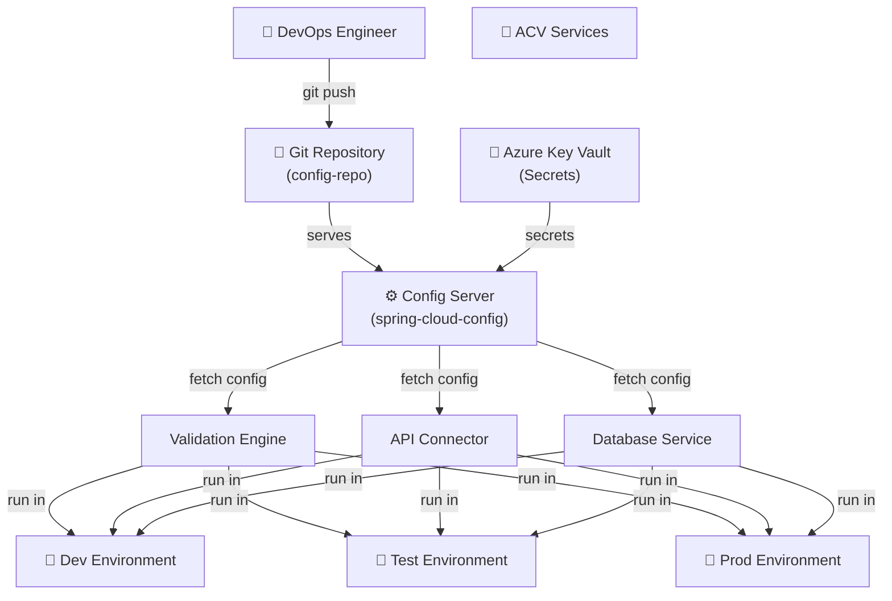
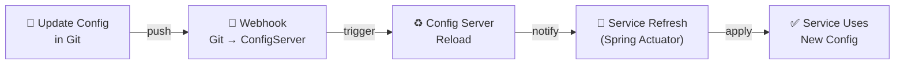
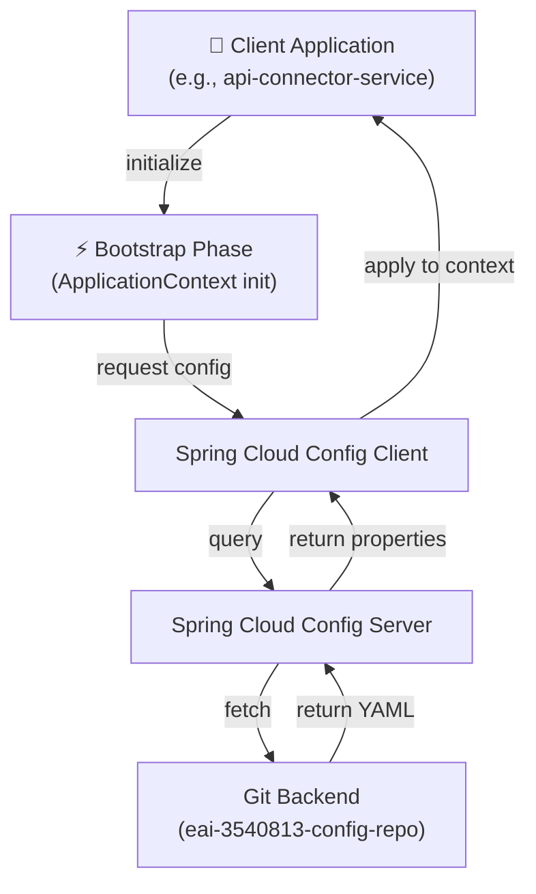
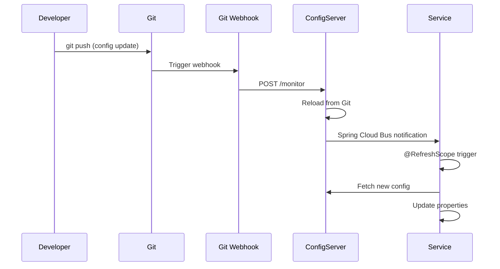
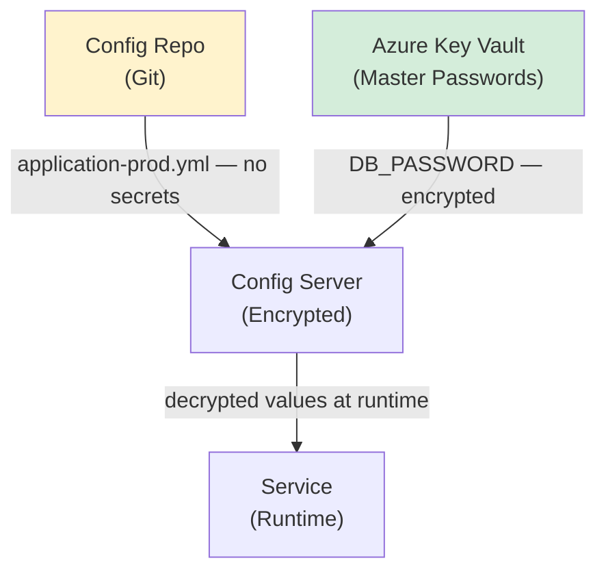
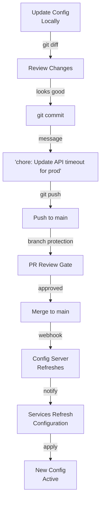

# ACV Configuration Repository - High-Level Design & Architecture

**Purpose:** Describe configuration management architecture, patterns, and design decisions.

**Scope:** Configuration storage patterns, refresh mechanisms, security, and integration.

---

## 1. Configuration Management Architecture

### 1.1 System Context



### 1.2 Configuration Flow Diagram



---

## 2. Spring Cloud Config Architecture

### 2.1 Components



### 2.2 Configuration Resolution Hierarchy

```
When service starts:

1. Service queries Config Server
   ↓
2. Config Server matches service name & active profile
   ↓
3. Git repository searched for matching file
   ↓
4. Found: application-{profile}.yml
   ↓
5. Properties loaded into ApplicationContext
   ↓
6. Environment variables override config file
   ↓
7. Service ready with merged configuration

Example: api-connector-service with profile=dev
→ Config Server searches for: api-connector-service-dev.yml
→ Found in: api-connector-service/api-connector-service-dev.yml
→ Properties loaded and applied
```

---

## 3. File Organization Patterns

### 3.1 Service Configuration Structure

```
eai-3540813-config-repo/
├── {service-name}/
│   ├── {service-name}-local.yml     # Developer machine (optional)
│   ├── {service-name}-dev.yml       # Development cluster
│   ├── {service-name}-test.yml      # Test cluster
│   └── {service-name}-prod.yml      # Production cluster
```

### 3.2 Configuration File Naming Convention

**Rules:**
- File name MUST match Spring Boot `spring.application.name`
- Environment suffix MUST match active Spring profile
- All properties in YAML format

**Examples:**

| Service | Application Name | Files |
|---------|------------------|-------|
| Validation Services | account-creation-validation-services | acv-validation-services-dev.yml |
| API Connector | api-connector-service | api-connector-service-dev.yml |
| Database Service | database-service | database-service-dev.yml |
| Config Server | config-server | config-server-dev.yml |

---

## 4. Configuration Content Patterns

### 4.1 Standard Configuration Sections

```yaml
# 1. Spring Framework Configuration
spring:
  application:
    name: service-name
  profiles:
    active: dev,discovery
  datasource:
    url: jdbc:oracle:thin:@host:1521:ORCL
    username: ${DB_USERNAME}      # From environment
    password: ${DB_PASSWORD}      # From Key Vault
  cloud:
    config:
      server:
        git:
          uri: https://github.com/FedEx/eai-3540813-config-repo

# 2. Service-Specific Configuration
acv:
  validation:
    fuzzyMatchThreshold: 0.85
    cacheEnabled: true
  api:
    connector:
      url: https://api-connector:8082
      timeout: 30

# 3. Monitoring & Health
management:
  endpoints:
    web:
      exposure:
        include: health,metrics
  metrics:
    export:
      prometheus:
        enabled: true

# 4. Security
security:
  oauth2:
    enabled: true
    tokenEndpoint: https://okta.company.com/oauth2/v1/token
```

### 4.2 Environment-Specific Overrides

```
Configuration Inheritance:

Base Config (application-{profile}.yml)
        ↓
    Environment Variable
        ↓
  Command-Line Argument
        ↓
  Final Effective Configuration

Example:
1. Config file: db.url=localhost:5432
2. Env var: DB_URL=prod.db.company.com
3. Effective: db.url=prod.db.company.com (env var wins)
```

---

## 5. Configuration Management Patterns

### 5.1 Local Development Pattern

```yaml
# acv-validation-services-local.yml
spring:
  datasource:
    url: jdbc:h2:mem:testdb          # In-memory H2 DB
    driverClassName: org.h2.Driver
  h2:
    console:
      enabled: true                  # H2 console for debugging
      path: /h2-console

acv:
  api:
    connector:
      url: http://localhost:7008    # Local services

management:
  security.enabled: false            # Disabled for local dev
```

### 5.2 Development Environment Pattern

```yaml
# acv-validation-services-dev.yml
spring:
  datasource:
    url: jdbc:h2:mem:testdb          # Shared dev DB
    hikari:
      maximum-pool-size: 20
      minimum-idle: 5

acv:
  api:
    connector:
      url: http://api-connector-dev:8082

logging:
  level:
    root: INFO
    com.fedex.acv: DEBUG             # Debug for dev
```

### 5.3 Production Environment Pattern

```yaml
# acv-validation-services-prod.yml
spring:
  datasource:
    url: jdbc:postgresql://prod-db.company.com/acv
    username: ${DB_USER}             # From Key Vault
    password: ${DB_PASSWORD}         # From Key Vault
    hikari:
      maximum-pool-size: 100         # Higher for prod
      minimum-idle: 20

acv:
  api:
    connector:
      url: https://api-connector-prod:8082
      timeout: 60

logging:
  level:
    root: WARN                        # Only warnings in prod
    com.fedex.acv: INFO
```

---

## 6. Configuration Refresh Mechanisms

### 6.1 Automatic Refresh Flow



### 6.2 Manual Refresh Trigger

```bash
# Manually refresh service configuration
curl -X POST http://service:8080/actuator/refresh

# Response:
# [
#   "acv.api.connector.url",
#   "acv.validation.fuzzyMatchThreshold"
# ]
```

### 6.3 Refresh Scope Annotation

```java
// Properties marked with @RefreshScope are reloadable
@Component
@RefreshScope
public class ApiConnectorProperties {
    
    @Value("${acv.api.connector.url}")
    private String url;
    
    @Value("${acv.api.connector.timeout:30}")
    private int timeout;
    
    // No service restart needed to pick up url/timeout changes
}
```

---

## 7. Security Architecture

### 7.1 Secret Management



### 7.2 Credential Management Pattern

```yaml
# In Config Repo (acv-validation-services-prod.yml)
# ❌ NEVER put actual passwords here

# Instead, use placeholder + Key Vault
spring:
  datasource:
    username: ${DB_USER}           # Placeholder
    password: ${DB_PASSWORD}       # Key Vault secret

# OR use Spring Cloud Config encryption
spring:
  datasource:
    password: "{cipher}AQACSS5+4p+Y1kK1Z2kJsX..."  # Encrypted
```

### 7.3 Access Control

| Aspect | Control |
|--------|---------|
| **Config Repo Access** | GitHub RBAC (branch protection) |
| **Config Server Access** | Basic Auth / OAuth2 (K8s credentials) |
| **Secrets Vault** | Azure RBAC (who can read Key Vault) |
| **Audit Trail** | Git commit history + Config Server logs |

---

## 8. Environment Topology

### 8.1 Multi-Environment Configuration

```
┌─────────────────────────────────────────────────────────┐
│                   Git Repository                         │
│  (Single source of truth for all configuration)          │
├─────────────────────────────────────────────────────────┤
│                                                          │
│  Config Files:                                           │
│  • service-local.yml      (for developers)              │
│  • service-dev.yml        (for dev cluster)             │
│  • service-test.yml       (for test cluster)            │
│  • service-prod.yml       (for prod cluster)            │
│                                                          │
└─────────────────────────────────────────────────────────┘
         │              │              │
         ↓              ↓              ↓
    ┌────────┐    ┌────────┐    ┌────────┐
    │  Dev   │    │ Test   │    │  Prod  │
    │Config  │    │Config  │    │Config  │
    │Server  │    │Server  │    │Server  │
    └────────┘    └────────┘    └────────┘
         │              │              │
         ↓              ↓              ↓
    ACV Services execute with environment-specific configuration
```

---

## 9. Configuration as Code Best Practices

### 9.1 Design Principles

✅ **Single Source of Truth** — All config in Git  
✅ **Environment Parity** — Consistent structure across environments  
✅ **Secret Separation** — Secrets in Key Vault, not in Git  
✅ **Profile-Based Separation** — Different Spring profiles per environment  
✅ **Audit Trail** — Git history tracks every change  
✅ **Versioning** — Git tags mark configuration versions  

### 9.2 Do's and Don'ts

| Do ✅ | Don't ❌ |
|-----|-------|
| Store in version control | Store passwords in Git |
| Use environment variables | Commit secrets directly |
| Profile-based separation | Duplicate config across files |
| Use meaningful property names | Store PII or sensitive data |
| Document config changes | Commit without messages |
| Test config before deploying | Config changes in production |

---

## 10. Configuration Updates Workflow



---

## 11. Non-Functional Requirements

### Performance

| Metric | Target |
|--------|--------|
| **Config Fetch Time** | <100ms (cached) |
| **Refresh Propagation** | <5 seconds |
| **Repository Size** | <10 MB |
| **Config Server Startup** | <30 seconds |

### Reliability

| Aspect | Target | Measure |
|--------|--------|---------|
| **Config Server Availability** | >99.9% | SLA via AKS |
| **Git Repository Uptime** | Managed by GitHub | SLA via GitHub Enterprise |
| **Configuration Accuracy** | 100% | No config errors in YAML validation |

### Security

| Control | Implementation |
|---------|---|
| **Encryption in Transit** | HTTPS-only (TLS 1.2+) |
| **Encryption at Rest** | Spring Cloud Config encryption |
| **Access Control** | GitHub RBAC + Kubernetes RBAC |
| **Audit Logging** | Git commit history + Config Server logs |

---

## 12. Design Decisions

### Decision 1: Spring Cloud Config Over Alternatives

**Decision:** Use Spring Cloud Config (not Consul, etcd, or custom system)  
**Rationale:**
- Native Spring Framework integration
- Simple Git backend (no separate infrastructure)
- YAML format (matches Spring Boot)
- RefreshScope for dynamic updates

**Alternative Considered:** Consul, etcd, Kubernetes ConfigMap  
**Trade-off:** Requires Config Server deployment, but simpler than alternative systems

---

### Decision 2: Git as Backend Storage

**Decision:** Use Git repository (not database)  
**Rationale:**
- Version control built-in
- Audit trail natural (commit history)
- Easy rollback (git revert)
- No separate database infrastructure

**Alternative Considered:** Database (MongoDB, PostgreSQL)  
**Trade-off:** Git workflow learning curve, but offset by simplicity

---

### Decision 3: File-Per-Service Organization

**Decision:** Separate configuration files per service per environment  
**Rationale:**
- Clear separation of concerns
- Easy to find service-specific config
- Parallel development (no merge conflicts)
- Partial deployments (update one service without affecting others)

**Alternative Considered:** Single config file for all services  
**Trade-off:** More files to manage, but far cleaner organization

---

## 13. Assumptions & Constraints

### Assumptions

✓ Spring Boot 3.3+  (framework requirement)  
✓ Git repository accessible from all services  
✓ Network connectivity to Config Server  
✓ Key Vault accessible for secrets  

### Constraints

✗ Requires network call to fetch config (latency)  
✗ Git push doesn't guarantee immediate service refresh  
✗ No GUI for configuration management (Git/CLI only)  

---

## 14. Future Enhancements

| Enhancement | Timeline | Benefit |
|---|---|---|
| **Kubernetes ConfigMap Sync** | Q3 2026 | Native K8s integration |
| **Configuration Dashboard** | Q4 2026 | Visual config management |
| **Compliance Auditing** | Q2 2027 | Enhanced audit trail |
| **Multi-Region Sync** | Q3 2027 | Global configuration |

---

## Cross-References

- [LLD.md](LLD.md) — Implementation details and YAML structure
- [services.md](services.md) — Configuration API reference
- [code-mapping.md](code-mapping.md) — File organization
- [glossary.md](glossary.md) — Terminology
- [onboarding.md](onboarding.md) — Setup guide

---

**Last Updated:** 2026-04-02  
**Version:** 1.0.0  
**Audience:** Architects, DevOps Engineers, Platform Team
