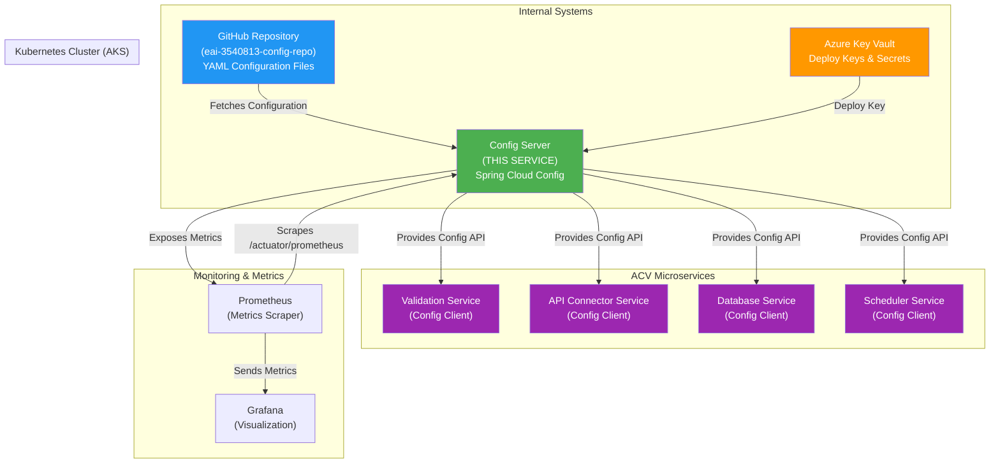
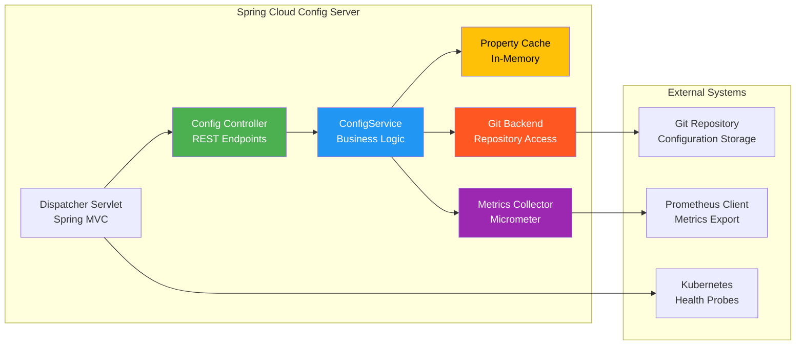
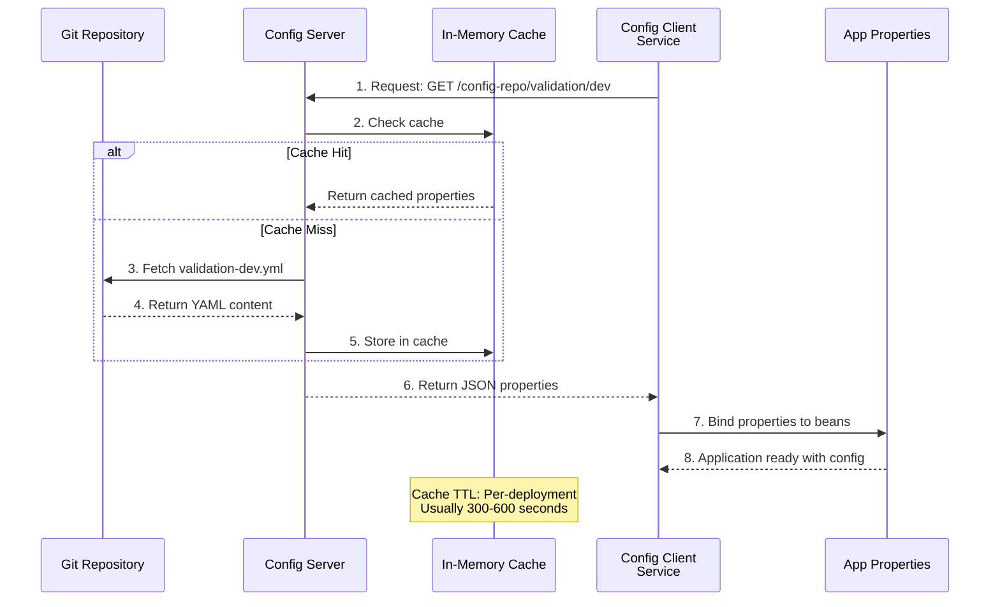

# ACV Configuration Server - High-Level Design & Architecture

**Purpose:** Document system-level architecture, design patterns, and operational flows.

**Scope:** System context, architecture diagrams, design decisions, integration patterns.

---

## 1. System Context & Purpose

### 1.1 Business Context

The **Configuration Server** solves the problem of **configuration management at scale**:

**Problem:** When you have 5+ microservices with 3 environments (dev, test, prod), managing configuration becomes complex:
- Configuration scattered across services (no central source of truth)
- Difficult to update configuration without redeploying
- Secrets hardcoded in code or configuration files
- No audit trail for configuration changes
- Environment-specific configurations mixed together

**Solution:** Configuration Server centralizes all configuration:

```
BEFORE (Configuration Scattered):
┌──────────────────────┐
│ Validation Service   │
│ - application.yml    │ (dev)
│ - application-prod.yml (prod)
│ - Secrets hardcoded  │
└──────────────────────┘

┌──────────────────────┐
│ API Connector Service│
│ - application.yml    │ (dev)
│ - application-prod.yml (prod)
│ - Secrets embedded   │
└──────────────────────┘
           (Same configs duplicated in different services!)

AFTER (Configuration Centralized):
┌────────────────────────────────────────────────────┐
│ Git Repository (eai-3540813-config-repo)          │
│                                                    │
│ ├── acv-validation-services-dev.yml               │
│ ├── acv-validation-services-prod.yml              │
│ ├── api-connector-service-dev.yml                 │
│ └── api-connector-service-prod.yml                │
└────────────────────────────────────────────────────┘
                      ↓ (pulled by)
              ┌──────────────────────┐
              │ Config Server        │ ← Serves configuration
              │ Spring Cloud Config  │
              └──────────────────────┘
                      ↓ (serves configuration to)
         ┌──────────────┬──────────────┬──────────────┐
         │              │              │              │
    ┌────↓────┐  ┌─────↓─────┐  ┌────↓────┐  ┌─────↓────┐
    │Validation│  │   API     │  │Database │  │Scheduler │
    │Service   │  │ Connector │  │ Service  │  │ Service  │
    └──────────┘  │ Service   │  └──────────┘  └──────────┘
                  └───────────┘
```

### 1.2 Stakeholders & Value

| Stakeholder | Value Proposition |
|-------------|-------------------|
| **Developers** | Update configuration without code change or redeploy |
| **DevOps Engineers** | Single source of truth for all configurations; audit trail |
| **Operations** | Quick configuration rollbacks via Git; rapid troubleshooting |
| **Security Team** | Centralized secret management; no secrets in code |

---

## 2. System Context Diagram (Mermaid C4 Style)



---

## 3. Architecture Diagram (Component View)



---

## 4. Configuration Flow Diagram



---

## 5. Request/Response Lifecycle

### 5.1 Configuration Request Flow

```
1. CONFIG CLIENT STARTUP
   ├─ Reads bootstrap.yml
   ├─ Extracts: Config Server URL, service name, active profile
   └─ Examples:
       · spring.cloud.config.uri = https://config-server:8888
       · spring.application.name = acv-validation-services
       · spring.profiles.active = dev

2. CONNECT TO CONFIG SERVER
   ├─ Client submits: GET /config-repo/{service}/{profile}
   ├─ Example: GET /config-repo/acv-validation-services/dev
   ├─ Auth: Basic Auth (production) or no auth (dev)
   └─ Response format: JSON with property sources

3. SERVER REQUEST HANDLING
   ├─ Receives: acv-validation-services, dev profile
   ├─ Resolves to: acv-validation-services-dev.yml
   ├─ Checks Git cache
   ├─ If not cached:
   │  ├─ Git pull from main branch
   │  ├─ Parse YAML to properties
   │  └─ Cache for 5-10 minutes
   └─ Returns: JSON { propertySources: [...], version: commit_sha }

4. CLIENT BINDS PROPERTIES
   ├─ Spring binds returned properties to beans
   ├─ @ConfigurationProperties annotations trigger binding
   ├─ @Value fields populated with values
   └─ Application starts with external configuration

5. DYNAMIC REFRESH (OPTIONAL)
   ├─ Client calls: POST /actuator/refresh
   ├─ Skips @RefreshScope annotated beans reconstruction
   └─ Application updates properties without restart
```

### 5.2 Example Request & Response

**Request:**
```
GET /config-repo/acv-validation-services/dev
Authorization: Basic (if required)
Accept: application/json
```

**Response (200 OK):**
```json
{
  "name": "acv-validation-services",
  "profiles": ["dev"],
  "label": "main",
  "version": "abc123def456",
  "propertySources": [
    {
      "name": "file:///git/repo/acv-validation-services/acv-validation-services-dev.yml",
      "source": {
        "spring.datasource.url": "jdbc:h2:mem:testdb",
        "spring.datasource.username": "sa",
        "acv.validation.fuzzyMatchThreshold": 0.85,
        "logging.level.root": "INFO"
      }
    }
  ]
}
```

---

## 6. Core Design Patterns

### 6.1 Git Backend Pattern

**Pattern:** Configuration stored as Git YAML files instead of database.

**Benefits:**
- Version control (history, branches, tags)
- Rollback capability via `git revert`
- Code review workflow (pull requests)
- Audit trail (commit authors, messages)

**Flow:**
```
Developer edits YAML → Git commit → Git push → 
Config Server fetches → Clients refresh → Config applied
```

### 6.2 Property Source Pattern

**Pattern:** Multiple configuration sources merged with defined precedence.

**Precedence Order:**
1. System Properties (`-Dkey=value`)
2. Environment Variables
3. Config Server Git YAML
4. application.yml (bundled)
5. application-{profile}.yml (bundled)

### 6.3 Cache Pattern

**Pattern:** Configuration cached in memory to reduce Git access.

**Benefits:**
- Reduced latency (in-memory vs Git pull)
- Reduced Git load
- Faster config distribution to clients

**Invalidation:** Cache expires on TTL (configurable) or manual refresh event

### 6.4 Separation of Concerns Pattern

**Pattern:** Management/monitoring port (8081) separate from application port (8080).

**Benefits:**
- Isolate operational concerns from business logic
- Different access controls for actuator endpoints
- Monitor health without impacting application traffic

### 6.5 12-Factor App: Configuration

**Pattern:** Config Server implements 12-factor principle: "Store config in environment."

**Application:** 
- Config values come from Git YAML files (treated as environment)
- No configuration hardcoded in application code
- Same JAR deployed to all environments with different configurations
- Secrets stored securely (Key Vault), not in Git

---

## 7. Key Technologies

### 7.1 Spring Cloud Config Server

**What it is:**
- Spring Boot starter providing configuration/property management
- Endpoint-based architecture (REST endpoints for config distribution)
- Git backend support (reads YAML from Git repository)
- Client-side refresh support (ConfigClient can update properties)

**Use in ACV:**
```java
@EnableConfigServer
@SpringBootApplication
public class AcvConfigServerApplication {
    public static void main(String[] args) {
        SpringApplication.run(AcvConfigServerApplication.class, args);
    }
}
// Annotation enables Config Server functionality
```

### 7.2 Git Backend

**What it is:**
- Strategy for storing configuration files in Git repository
- Config Server clones repo locally and reads files on demand

**Configuration:**
```yaml
spring.cloud.config.server.git:
  uri: git@github.com:FedEx/eai-3540813-config-repo.git
  defaultLabel: main                    # Branch
  privateKey: ${DEPLOY_KEY}            # SSH authentication
  searchPaths: '*'                      # Search all directories
  cloneOnStart: false                   # Lazy clone on first request
```

### 7.3 Actuator Endpoints

**What it is:**
- Spring Boot endpoints for monitoring and operations
- Health checks, metrics, shutdown, etc.

**Configured in ACV:**
```yaml
management:
  server.port: 8081                     # Separate port
  endpoints.web.exposure.include: '*'   # All endpoints except shutdown
  metrics.export.prometheus.enabled: true  # Prometheus metrics
```

---

## 8. Deployment Architecture

### 8.1 Kubernetes Deployment Model

```
┌─────────────────────────────────────────────┐
│         Kubernetes Cluster (AKS)            │
│                                             │
│  ┌──────────────────────────────────────┐  │
│  │   Namespace: config-server           │  │
│  │                                      │  │
│  │  ┌──────────────────────────────┐   │  │
│  │  │  Pod (config-server-*)       │   │  │
│  │  │                              │   │  │
│  │  │  ┌────────────────────────┐  │   │  │
│  │  │  │ Container              │  │   │  │
│  │  │  │ - Spring Boot App       │  │   │  │
│  │  │  │ - Port 8080 (app)      │  │   │  │
│  │  │  │ - Port 8081 (mgmt)     │  │   │  │
│  │  │  │ - Git private key      │  │   │  │
│  │  │  │ - CPU: 0.5-1           │  │   │  │
│  │  │  │ - Memory: 2-4Gi        │  │   │  │
│  │  │  └────────────────────────┘  │   │  │
│  │  │                              │   │  │
│  │  │  Liveness Probe: :8081/health   │  │
│  │  │  Readiness Probe: :8081/health  │  │
│  │  └──────────────────────────────┘  │  │
│  │                                      │  │
│  │  ┌───────────────────────────────┐  │  │
│  │  │  Service                      │  │  │
│  │  │  - ClusterIP                  │  │  │
│  │  │  - Port 80 → Container 8080   │  │  │
│  │  │  - Port 8081 → Management     │  │  │
│  │  └───────────────────────────────┘  │  │
│  │                                      │  │
│  │  ┌───────────────────────────────┐  │  │
│  │  │  Ingress (Internal)           │  │  │
│  │  │  - Host: acv-config-server... │  │  │
│  │  │  - Path: /acv/config          │  │  │
│  │  │  - TLS/HTTPS                  │  │  │
│  │  └───────────────────────────────┘  │  │
│  └──────────────────────────────────────┘  │
│                                             │
│  External Systems Integration:             │
│  ├─ Git (SSH pull)                         │
│  ├─ Prometheus (metrics scrape)            │
│  ├─ Dynatrace (monitoring injection)       │
│  └─ Azure Key Vault (deploy key)           │
└─────────────────────────────────────────────┘
```

### 8.2 Helm Chart Deployment

**Chart Values Organization:**

| Aspect | Development | Production |
|--------|-------------|------------|
| **Replicas** | 1 | 1 |
| **CPU Request** | 0.5 | 0.5 |
| **Memory Request** | 2Gi | 2Gi |
| **CPU Limit** | 1 | 1 |
| **Memory Limit** | 4Gi | 4Gi |
| **Actuator Access** | All endpoints | Health, metrics only |
| **Authentication** | Open | Basic Auth |
| **Monitoring** | Manual | Prometheus ServiceMonitor |
| **Ingress** | Internal | Internal with TLS |

---

## 9. Non-Functional Requirements

| Requirement | Target | Rationale |
|-------------|--------|-----------|
| **Availability** | 99.9% SLA | Critical infrastructure for all services |
| **Latency (p50)** | <100ms | Fast configuration delivery on startup |
| **Latency (p99)** | <500ms | Acceptable for startup; doesn't impact runtime |
| **Throughput** | 1000 req/sec | Multiple clients requesting simultaneously |
| **Cache Hit Rate** | >95% | Most requests hit in-memory cache |
| **Git Connectivity** | 99.99% | Pull-only; offline would degrade only to cache |
| **Startup Time** | <30 seconds | Kubernetes readiness expectations |

---

## 10. Security Architecture

### 10.1 Authentication & Authorization

```
Development Environment:
─────────────────────
Config Server (port 8080): Open (no authentication)
Management (port 8081):    Open (no authentication)
Use case: Local testing, CI/CD pipelines

Production Environment:
──────────────────────
Config Server (port 8080): Basic Auth required
  - Username: configuser
  - Password: Stored in Azure Key Vault
Management (port 8081):    Basic Auth required
Only clients with credentials access configuration
```

### 10.2 Secret Management Flow

```
┌──────────────────────┐
│ Azure Key Vault      │
│                      │
│ ├─ DEPLOY_KEY       │
│ │  └─ SSH private key│
│ │     for Git access │
│ │                    │
│ └─ CONFIG_PASSWORD   │
│    └─ Basic Auth pwd │
└───────────┬──────────┘
            │
   ┌────────↓────────┐
   │ Kubernetes      │
   │ Secret/mounted  │
   │ as env var      │
   └────────┬────────┘
            │
   ┌────────↓────────────────┐
   │ Config Server Container │
   │                         │
   │ DEPLOY_KEY env var ──┐  │
   │                      │  │
   │ Initializes Git      │  │
   │ SSH connection ←─────┘  │
   └─────────────────────────┘
```

---

## 11. Monitoring & Observability

### 11.1 Metrics Collected

```
Config Server Metrics (Prometheus format):
└─ http.server.requests          # HTTP endpoint metrics
   ├─ request count
   ├─ response times (p50, p95, p99)
   └─ error rates by endpoint
   
└─ jvm.memory.*                  # JVM memory metrics
   ├─ heap usage
   ├─ non-heap usage
   └─ garbage collection
   
└─ spring.config.service.*       # Config Server specific
   ├─ requests count
   ├─ cache hit ratio
   └─ git fetch duration
   
└─ process.cpu.usage             # System metrics
   ├─ CPU percentage
   ├─ process uptime
   └─ thread count
```

### 11.2 Health Checks

```
Liveness Probe (Kubernetes):
  Endpoint: http://localhost:8081/actuator/health/liveness
  Interval: 10 seconds
  Timeout: 2 seconds
  Failure threshold: 3
  Action: Restart pod if failed

Readiness Probe (Kubernetes):
  Endpoint: http://localhost:8081/actuator/health/readiness
  Interval: 5 seconds
  Timeout: 2 seconds
  Failure threshold: 3
  Action: Remove from load balancer if failed

Health Indicators:
  ├─ livenessState: UP if process running
  ├─ readinessState: UP if ready for traffic
  ├─ db: UP if Git accessible (if applicable)
  └─ diskSpace: UP if sufficient disk for logs
```

---

## 12. Design Decisions & Rationale

| Decision | Choice | Rationale |
|----------|--------|-----------|
| **Config Location** | Git Repository | Version control, audit trail, rollback capability |
| **Server Type** | Spring Cloud Config | Native Spring Boot integration; multi-environment support |
| **Git Backend** | SSH authentication | Secure; keys managed in Key Vault |
| **Caching** | In-memory | Fast retrieval; reduced Git load |
| **Port Separation** | 8080 app, 8081 mgmt | Security isolation; independent scaling |
| **Deployment Model** | Kubernetes/Helm | Standard for cluster deployment; declarative config |
| **Monitoring** | Prometheus | Industry standard; integrates with Grafana |

---

## Cross-References

- [Configuration Repository](../acv-config-repo/HLD.md) — Files served by this server
- [LLD.md](LLD.md) — Code implementation details
- [services.md](services.md) — API endpoints and contracts

---

**Last Updated:** 2026-04-02  
**Version:** 1.0.0  
**Audience:** Architects, Senior Developers, DevOps Engineers
