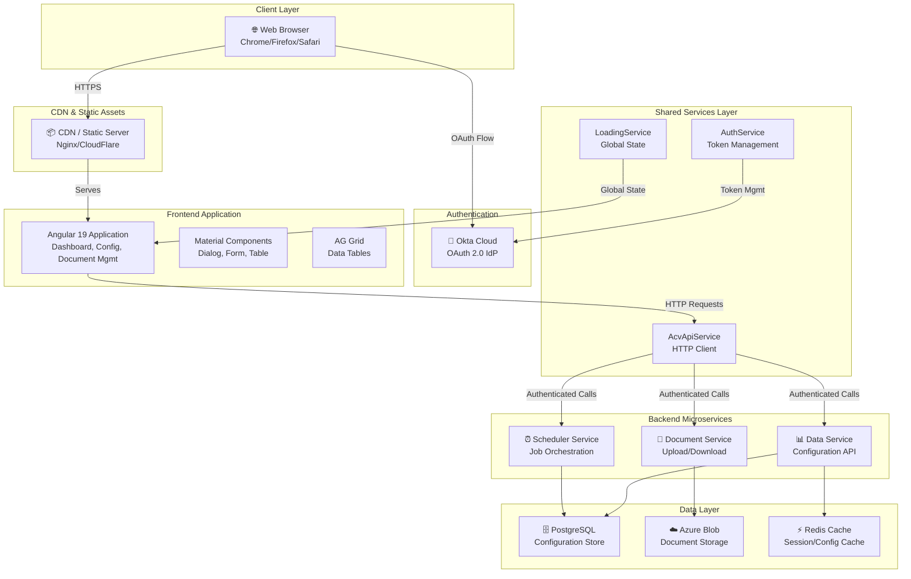
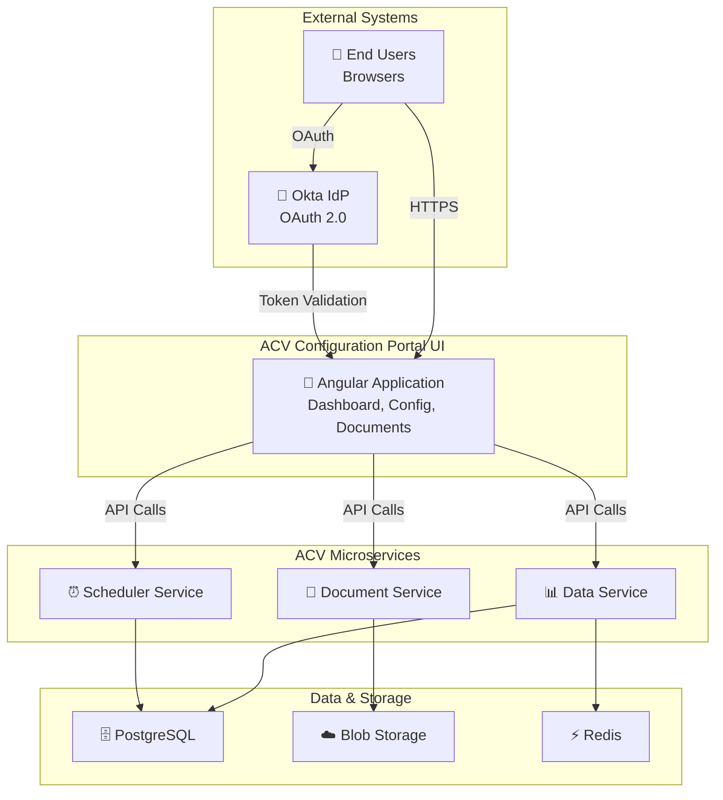
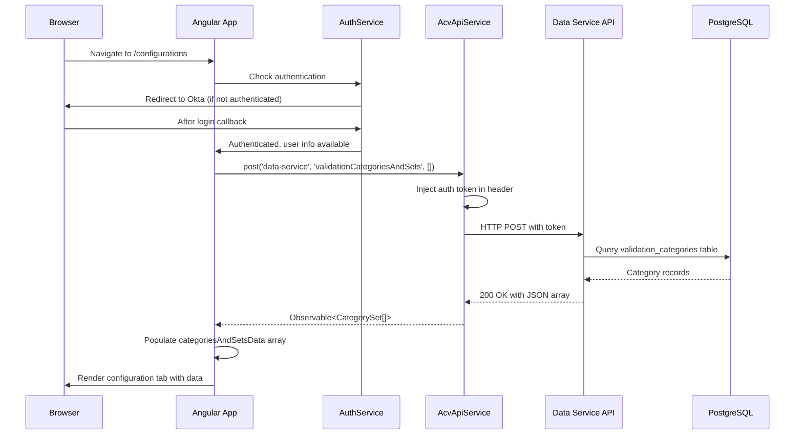
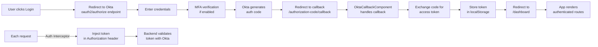
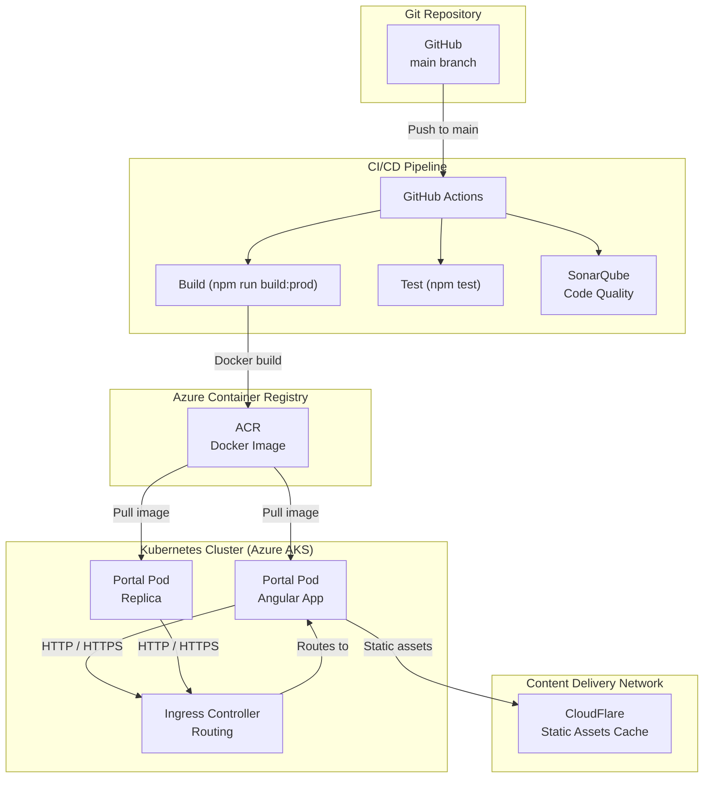

# ACV Configuration Portal UI - High-Level Design (HLD)

**Last Updated:** April 3, 2026  
**Scope:** System design, architecture patterns, non-functional requirements, and design decisions

---

## Purpose & Scope

The **Configuration Portal UI** provides a browser-based administrative interface for managing ACV platform configurations. This HLD document describes:

- Overall system architecture and technology choices
- Major components and their responsibilities
- System context and external integrations
- Non-functional requirements (performance, scalability, security)
- Design patterns and architectural decisions

---

## Business Context

### Problem Statement

The ACV platform requires a centralized administrative interface to:
- Manage validation rules and configurations across multiple countries
- Generate and manage compliance documents with locale-specific variations
- Monitor system health and compliance metrics in real-time
- Provide role-based access to configuration capabilities

### Stakeholders

| Stakeholder | Interest |
|-------------|----------|
| **Compliance Officers** | Configure validation rules, manage documents |
| **System Administrators** | Manage users, system settings, perform maintenance |
| **Operations Teams** | Monitor system status, troubleshoot issues |
| **Business Analysts** | Analyze compliance metrics, generate reports |

### Success Criteria

✅ **Functional:**
- Multi-country configuration support (EN, NL, FR locales)
- Real-time dashboard with compliance metrics
- Document generation with locale customization
- Role-based access control

✅ **Non-Functional:**
- Sub-second dashboard load time
- Support 500+ concurrent users
- 99.9% uptime SLA
- GDPR/SOC 2 compliant

---

## System Architecture Overview



---

## Technology Stack Decisions

### Frontend Framework: Angular 19

**Decision:** Use Angular 19 (latest LTS) instead of React or Vue

**Rationale:**
- ✅ Strong enterprise support and long-term stability
- ✅ Built-in dependency injection and RxJS integration
- ✅ Comprehensive routing and module system
- ✅ Strong TypeScript integration
- ✅ Large ecosystem and community support

### UI Component Library: Angular Material + AG Grid

**Decision:** Combine Material Design components with AG Grid for advanced data tables

**Rationale:**
- ✅ Material provides consistent, accessible UI components
- ✅ AG Grid provides enterprise data grid features (sorting, filtering, pagination, aggregation)
- ✅ Both support TypeScript and have strong Angular integration

### Authentication: Okta OAuth 2.0

**Decision:** Use Okta cloud-based identity provider instead of custom auth

**Rationale:**
- ✅ Centralized user management across ACV platform
- ✅ No password management burden
- ✅ Support for multi-factor authentication (MFA)
- ✅ Compliance with SOC 2 and GDPR requirements
- ✅ Professional-grade security

### API Communication: Centralized Service Pattern

**Pattern:** Single `AcvApiService` all backend HTTP calls instead of multiple services

**Benefits:**
- Centralized error handling and token injection
- Consistent API versioning strategy
- Easier to implement rate limiting, request logging, retry logic

### State Management: RxJS Observables

**Decision:** Use RxJS Observables (from HttpClient) instead of NgRx store

**Rationale:**
- ✅ Application state is primarily server-state (from backend APIs)
- ✅ Client-side state is minimal (loading spinner, current tab)
- ✅ Reduces complexity for CRUD-heavy administrative interfaces
- ✅ Observable-based architecture is idiomatic Angular

---

## Major Components & Responsibilities

### 1️⃣ **Dashboard Module**

**Purpose:** Real-time analytics, compliance metrics, system health monitoring

**Responsibilities:**
- Fetch compliance metrics from data service
- Display key performance indicators (KPIs)
- Show validation job status and history
- Provide links to other portal sections

**Data Sources:**
- Data Service API endpoints
- Real-time or cache-refreshed metrics

**Users:** Operations, compliance officers, system admins

---

### 2️⃣ **Configuration Management Module**

**Purpose:** Centralized management of validation rules and system settings

**Sub-Components:**

**Categories & Sets Tab**
- Browse validation categories
- Manage categorical groupings
- Create/edit/delete categories
- API Endpoint: `validationCategoriesAndSets`

**Validation Types Tab**
- Define validation rules and formulas
- Manage validation logic
- Configure rule priority and dependencies
- API Endpoint: `countryDocumentValidationList`

**Document Mapping Tab**
- Link documents to validation rules
- Country/locale-specific mappings
- Configure document requirements by country
- API Endpoint: `countryDocumentList`

**Validation Config Mapping Tab**
- Country-specific validation settings
- Locale configurations
- Business rule overrides
- API Endpoint: `countryValidationConfiguration`

---

### 3️⃣ **Document Management Module**

**Purpose:** Create, upload, manage, and generate compliance documents

**Responsibilities:**
- Display document list with country/locale filters
- Upload new documents
- Generate documents from templates
- Download documents in multiple formats
- Track document versions

**Data Sources:**
- Document Service (upload, download, list)
- Object storage (Blob storage for binary data)
- PostgreSQL (document metadata)

---

### 4️⃣ **Templates Module**

**Purpose:** Manage reusable validation templates and document schemas

**Responsibilities:**
- Create/edit/delete templates
- Template versioning
- Template preview
- Template reusability across configurations

---

### 5️⃣ **Shared Services**

**AcvApiService** (`acv-api.service.ts`)
- Centralized HTTP client for all backend communication
- Manages base URL configuration per environment
- Error handling and retry logic
- File upload/download handling (blob support)

**AuthService** (`authService.ts`)
- Okta token lifecycle management
- User information retrieval
- Logout handling
- Token refresh on expiry

**LoadingService** (`loading.service.ts`)
- Global loading spinner state
- Observable-based loading indicator

**TranslateLoaderFactory** (`translate-loader.factory.ts`)
- Loads translation files from `/assets/i18n/`
- Supports EN, NL, FR languages
- Fallback to default language on missing translations

---

### 6️⃣ **Layout Components**

**LayoutComponent** (`layout.component.ts`)
- Main application shell/wrapper
- Contains header, navbar, router outlet, footer
- Applies global theming

**HeaderComponent** (`header/`)
- Application title and branding
- User profile dropdown
- Language switcher
- Logout button

**NavbarComponent** (`navbar/`)
- Vertical navigation sidebar
- Menu items from `app-config.ts`
- Active route highlighting
- Responsive collapse on mobile

**FooterComponent** (`footer/`)
- Copyright and version information
- Links to help and support
- System status indicator

---

## System Context Diagram



---

## Request/Response Lifecycle

### Configuration Load Flow



---

## Authentication Flow (Detailed)



---

## API Integration Pattern

All backend communication follows a standardized pattern:

```typescript
// 1. Centralized service
this.acvApiService.post<CategorySet[]>(
  'data-service',
  'validationCategoriesAndSets',
  []
);

// 2. Request lifecycle
//    a. Prepare request body
//    b. Inject auth token via interceptor
//    c. Send HTTP POST
//    d. Receive response
//    e. Map response to TypeScript model
//    f. Return Observable<T>

// 3. Consumer subscription
.subscribe(
  (result) => { /* Handle success */ },
  (error) => { /* Handle error */ }
);
```

---

## Non-Functional Requirements

### Performance

| Requirement | Target | Metric |
|-------------|--------|--------|
| Page Load Time (Dashboard) | < 2 seconds | First Contentful Paint (FCP) |
| API Response Time | < 500 ms | p95 latency |
| Configuration Load (forkJoin 5 APIs) | < 3 seconds | Total time to interactive (TTI) |
| Data Grid Render (10,000 rows) | < 2 seconds | AG Grid render time |

**Optimization Strategies:**
- Lazy-load child modules
- Implement request caching with shareReplay()
- Use OnPush change detection
- Virtual scrolling in large tables
- Compress assets, use output-hashing for cache busting

### Scalability

| Dimension | Target |
|-----------|--------|
| Concurrent Users | 500+ simultaneous connections |
| Configuration Records | 100,000+ validation categories |
| Document Versions | Unlimited (storage-bound) |
| Countries/Locales | Up to 50 countries, 3+ languages per country |
| API Request Rate | 1,000+ requests/minute across all users |

**Scaling Strategy:**
- Horizontal scaling via Kubernetes (multiple Pod replicas)
- CDN for static asset distribution
- Backend service auto-scaling based on API latency

### Availability & Reliability

| Requirement | Target |
|-------------|--------|
| Uptime SLA | 99.9% (8.76 hours/month max downtime) |
| Recovery Time Objective (RTO) | < 15 minutes |
| Recovery Point Objective (RPO) | < 1 hour |
| Graceful Degradation | Form submission works even if analytics fail |

### Security

| Control | Implementation |
|---------|---|
| Authentication | Okta OAuth 2.0 with MFA |
| Authorization | RBAC via Okta groups |
| Data in Transit | HTTPS/TLS 1.3+ |
| API Token Management | JWT with automatic refresh |
| Session Timeout | 1 hour inactivity timeout |
| CSRF Protection | SameSite cookie attribute |
| Input Validation | Client-side + server-side validation |

### Maintainability

| Practice | Implementation |
|----------|---|
| Code Organization | Feature-based modular structure |
| Testing | Unit (Jasmine/Karma) + E2E (Cypress) |
| Documentation | README, HLD, LLD, API specs |
| Version Control | Git with semantic versioning |
| CI/CD | GitHub Actions auto-deploy to dev/prod |

---

## Design Patterns

### 1⃣ Module Pattern

**Pattern:** Feature-based lazy-loaded modules

Each feature (Dashboard, Configuration, Document, Templates) is a separate NgModule with:
- Dedicated routing
- Private components and services
- Separate from other features

**Benefits:** Reduced bundle size, independent development

### 2⃣ Service-Based Architecture

**Pattern:** Centralized services for business logic

All HTTP calls go through `AcvApiService`  
All authentication through `AuthService`  
Global state via `LoadingService`

**Benefits:** Centralized control, easier to test, consistent error handling

### 3⃣ Interceptor Pattern

**Pattern:** HTTP interceptors for cross-cutting concerns

- `AuthInterceptor`: Injects JWT token in every request
- Future: LoggingInterceptor, ErrorHandlerInterceptor

### 4⃣ Observable-Based Reactivity

**Pattern:** RxJS Observables for all async operations

- HTTP calls return Observables
- Components subscribe in template with async pipe
- Automatic unsubscription on component destroy

### 5⃣ Dependency Injection

**Pattern:** Angular's built-in DI container (constructor injection)

All services are provided at root level with `providedIn: 'root'`

---

## Deployment Architecture



---

## Key Architectural Decisions (ADRs)

### ADR-1: Single Page Application (SPA) over SSR

**Decision:** Build as SPA with client-side routing over Server-Side Rendering (SSR)

**Pros:**
- Faster perceived performance after initial load
- Reduced server load
- Support for offline capabilities
- Better user experience for navigation

**Cons:**
- Larger initial JavaScript bundle
- SEO challenges (not critical for admin portal)

**Decision:** SPA (Express server included but optional for basic HTTP serving)

---

### ADR-2: Centralized HTTP Client vs Individual Services

**Decision:** Single `AcvApiService` for all HTTP calls instead of service-per-feature

**Pros:**
- Single point of control for error handling
- Consistent API versioning
- Easier to implement cross-cutting concerns (logging, rate limiting)
- Token injection in one place

**Cons:**
- Slightly less modular than service-per-feature

**Decision:** Centralized `AcvApiService`

---

### ADR-3: RxJS Observables vs NgRx State Management

**Decision:** Use RxJS Observables instead of NgRx state management library

**Pros:**
- Simpler architecture for CRUD-heavy admin UI
- No boilerplate reducers/actions/selectors
- Idiomatic Angular
- Sufficient for form and table data

**Cons:**
- Doesn't scale well for complex state interactions

**Decision:** RxJS Observables (can migrate to NgRx if state complexity increases)

---

## High-Level Deployment Steps

1. **Code Commit** → Push to GitHub main branch
2. **GitHub Actions** → Run CI pipeline (build, test, lint, SonarQube)
3. **Docker Build** → Package Angular app in Docker container
4. **Push to ACR** → Push image to Azure Container Registry
5. **Kubernetes Deploy** → Helm deploy to AKS with ConfigMaps/Secrets
6. **Health Check** → Smoke test deployed service
7. **Traffic** → Ingress routes traffic to new pods

---

## Future Enhancements

- 🚀 **Implement role-based access control (RBAC)** — Different UIs for different user roles
- 📊 **Add real-time WebSocket updates** — Live dashboard updates without polling
- 📱 **Mobile-responsive design** — Support tablet and mobile devices
- 🔄 **Offline-first architecture** — Sync when connection restored
- 🎯 **Advanced filtering & export** — Download configuration data as CSV/Excel
- 🔔 **Notification system** — User alerts for configuration changes
- 📈 **Advanced analytics** — Compliance trend analysis and forecasting

---

## References

- [Low-Level Design (LLD)](LLD.md)
- [Services/APIs Reference](services.md)
- [Code Mapping](code-mapping.md)
- [Onboarding Guide](onboarding.md)
- [Glossary](glossary.md)
- Angular Documentation: https://angular.io/docs
- Okta Documentation: https://developer.okta.com/docs/

---

**Document Version:** 1.0  
**Last Updated:** April 3, 2026
