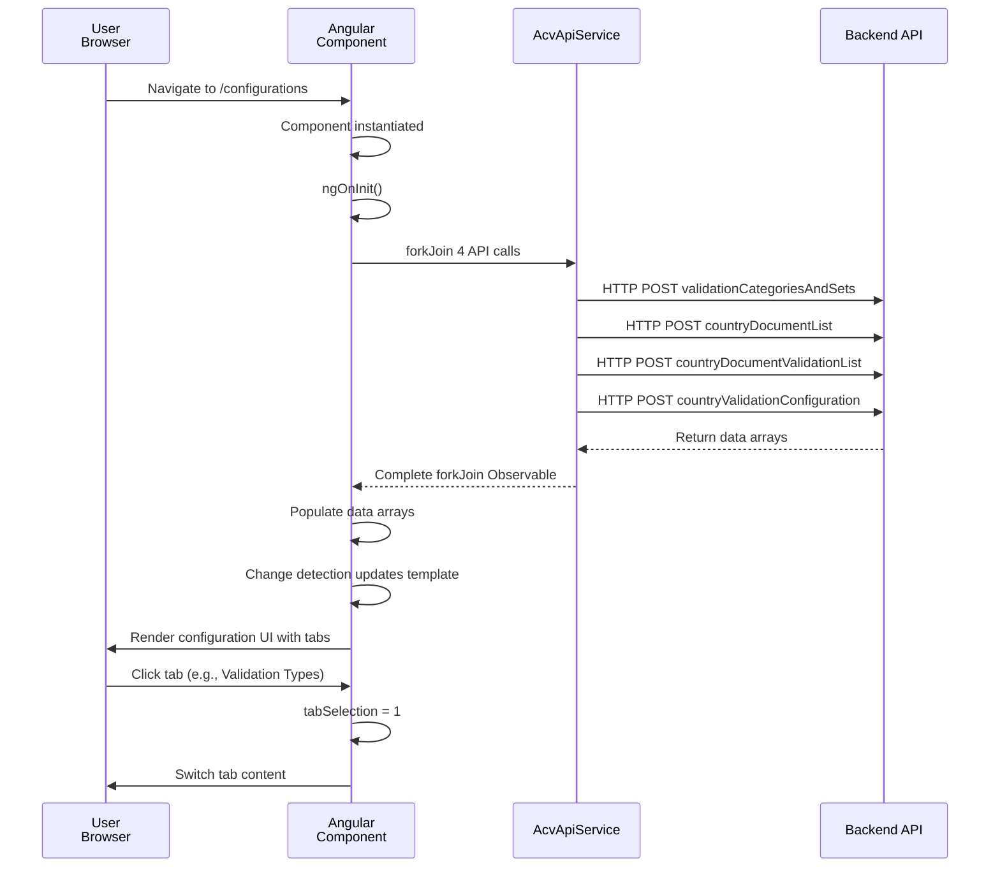
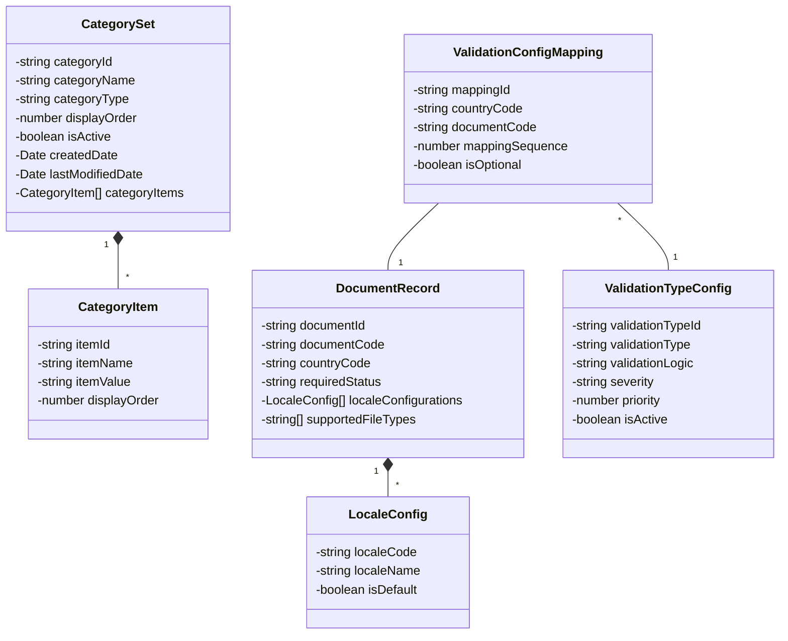

# ACV Configuration Portal UI - Low-Level Design (LLD)

**Last Updated:** April 3, 2026  
**Scope:** Code organization, component structure, services, data models, and implementation details

---

## Code Organization

### Directory Structure by Layer

```
src/
├── app/
│   ├── core/                          ← Feature modules (lazy-loaded)
│   │   ├── dashboard/                 ← Dashboard feature module
│   │   │   ├── dashboard.component.ts
│   │   │   ├── dashboard.component.html
│   │   │   ├── dashboard.component.css
│   │   │   ├── dashboard.component.spec.ts
│   │   │   ├── dashboard.module.ts
│   │   │   └── [child components]
│   │   ├── configuration/             ← Configuration feature module
│   │   │   ├── configuration.component.ts
│   │   │   ├── configuration.module.ts
│   │   │   ├── categories-sets/
│   │   │   ├── validation-type/
│   │   │   ├── validation-config-map/
│   │   │   ├── document-list/
│   │   │   └── [sub-components]
│   │   ├── document/                  ← Document management feature module
│   │   │   ├── document-generate.component.ts
│   │   │   ├── document.module.ts
│   │   │   └── [child components]
│   │   ├── templates/                 ← Templates feature module
│   │   │   ├── templates.component.ts
│   │   │   ├── templates.module.ts
│   │   │   └── [child components]
│   │   └── model/                     ← Domain models (shared DTOs)
│   │       ├── categorySet.ts
│   │       ├── documentRecord.ts
│   │       ├── validationTypeConfig.ts
│   │       └── validationConfigMapping.ts
│   ├── layout/                        ← Layout shell components
│   │   ├── layout.component.ts
│   │   ├── layout.module.ts
│   │   ├── header/
│   │   ├── navbar/
│   │   └── footer/
│   ├── shared/                        ← Shared across features
│   │   ├── services/
│   │   │   ├── acv-api.service.ts
│   │   │   ├── authService.ts
│   │   │   ├── loading.service.ts
│   │   │   └── translate-loader.factory.ts
│   │   ├── interceptors/
│   │   │   └── auth.interceptor.ts
│   │   ├── components/                ← Reusable UI components
│   │   │   ├── footer/
│   │   │   ├── header/
│   │   │   └── navbar/
│   │   ├── shared.module.ts
│   │   └── material.module.ts
│   ├── app.component.ts               ← Root component
│   ├── app.module.ts                  ← Root module
│   ├── app-routing.module.ts          ← Application routes
│   └── app-config.ts                  ← Configuration constants
├── assets/
│   ├── i18n/                          ← Translation files
│   │   ├── en.json
│   │   ├── nl.json
│   │   └── fr.json
│   └── images/
├── environments/
│   ├── environment.ts                 ← Local env
│   ├── environment.development.ts     ← Dev env
│   └── environment.prod.ts            ← Production env
└── styles.css                         ← Global styles
```

---

## Core Components & Classes

### 📋 **Root Component - AppComponent**

**File:** `src/app/app.component.ts`

```typescript
@Component({
  selector: 'app-root',
  templateUrl: './app.component.html',
  standalone: false,
  styleUrl: './app.component.css'
})
export class AppComponent implements OnInit {
  userInfo: any;
  isAuthenticated$: Observable<boolean>;
  isAuthenticated: boolean = false;
  loading$: Observable<boolean>;

  constructor(
    private authService: AuthService,
    private translate: TranslateService,
    private oktaStateService: OktaAuthStateService,
    private oktaAuth: OktaAuthModule
  ) { }

  // Lifecycle: Configuration, language setup, authentication
  ngOnInit(): void { }
  initialiseData(): Promise<void> { }
}
```

**Responsibilities:**
- Bootstrap Angular application
- Initialize Okta OAuth flow
- Set default and browser language
- Load user information on successful authentication
- Display global loading spinner

---

### 🎯 **Configuration Component - ConfigurationComponent**

**File:** `src/app/core/configuration/configuration.component.ts`

```typescript
@Component({
  selector: 'app-configuration',
  standalone: false,
  templateUrl: './configuration.component.html',
  styleUrl: './configuration.component.css'
})
export class ConfigurationComponent implements OnInit {
  // Tabs state
  tabSelection: number = 0;  // 0=Categories, 1=Validation Types, 2=Mappings, 3=Config
  isDataLoaded: boolean = false;

  // Configuration data from backend
  categoriesAndSetsData: CategorySet[] = [];
  documentListData: DocumentRecord[] = [];
  validationConfigMappingData: ValidationConfigMapping[] = [];
  validationTypeConfigData: ValidationTypeConfig[] = [];

  constructor(private acvApiService: AcvApiService) { }

  ngOnInit(): void {
    this.loadAllConfigurationData();
  }

  loadAllConfigurationData(): void {
    forkJoin({
      categoriesAndSets: this.acvApiService.post<CategorySet[]>(
        AppConfig.acvServiceList.data,
        'validationCategoriesAndSets',
        []
      ),
      documentList: this.acvApiService.post<DocumentRecord[]>(
        AppConfig.acvServiceList.data,
        'countryDocumentList',
        []
      ),
      documentValidationList: this.acvApiService.post<ValidationTypeConfig[]>(
        AppConfig.acvServiceList.data,
        'countryDocumentValidationList',
        []
      ),
      validationConfig: this.acvApiService.post<ValidationConfigMapping[]>(
        AppConfig.acvServiceList.data,
        'countryValidationConfiguration',
        []
      )
    }).subscribe(
      (result) => {
        this.categoriesAndSetsData = result.categoriesAndSets;
        this.documentListData = result.documentList;
        this.validationConfigMappingData = result.validationConfig;
        this.validationTypeConfigData = result.documentValidationList;
        this.isDataLoaded = true;
      },
      (error) => {
        console.error('Error loading configuration:', error);
        this.isDataLoaded = true;  // Show error UI
      }
    );
  }

  changeSelection(index: number): void {
    this.tabSelection = index;
  }
}
```

**Responsibilities:**
- Orchestrate loading of all configuration data via `forkJoin`
- Manage tab selection state
- Pass data to child components
- Handle loading and error states

---

### 🏗️ **Layout Component - LayoutComponent**

**File:** `src/app/layout/layout.component.ts`

```typescript
@Component({
  selector: 'app-layout',
  standalone: false,
  templateUrl: './layout.component.html',
  styleUrl: './layout.component.css'
})
export class LayoutComponent {
  // Layout shell for all pages

  constructor() { }
}
```

**Template Structure:**
```html
<div class="app-container">
  <app-header></app-header>       <!-- Top bar -->
  <div class="main-content">
    <app-navbar></app-navbar>     <!-- Left sidebar -->
    <router-outlet></router-outlet>  <!-- Page content -->
  </div>
  <app-footer></app-footer>       <!-- Bottom bar -->
</div>
```

---

### 💻 **Dashboard Component - DashboardComponent**

**File:** `src/app/core/dashboard/dashboard.component.ts`

```typescript
@Component({
  selector: 'app-dashboard',
  standalone: false,
  templateUrl: './dashboard.component.html',
  styleUrl: './dashboard.component.css'
})
export class DashboardComponent implements OnInit {
  metrics: DashboardMetrics;
  validationData: ValidationRecord[] = [];
  isLoading: boolean = true;

  constructor(private acvApiService: AcvApiService) { }

  ngOnInit(): void {
    this.loadDashboardData();
  }

  loadDashboardData(): void {
    this.acvApiService.post<DashboardMetrics>(
      AppConfig.acvServiceList.data,
      'dashboardMetrics',
      { timeRange: 'last30days' }
    ).subscribe(
      (metrics) => {
        this.metrics = metrics;
        this.isLoading = false;
      },
      (error) => {
        console.error('Error loading dashboard:', error);
        this.isLoading = false;
      }
    );
  }
}
```

---

## Shared Services

### 🌐 **AcvApiService**

**File:** `src/app/shared/services/acv-api.service.ts`

```typescript
@Injectable({
  providedIn: 'root'
})
export class AcvApiService {
  private baseUrl = environment.baseUrl;  // e.g., 'http://localhost:8080/api'

  constructor(private http: HttpClient) { }

  /**
   * Generic GET request
   * @param service - Microservice name (e.g., 'data-service')
   * @param endpoint - API endpoint path
   * @param params - Optional query parameters
   * @param body - Optional request body (unusual for GET)
   * @returns Observable<T>
   */
  get<T>(service: string, endpoint: string, params?: any, body?: any): Observable<T> {
    return this.http.request<T>(
      'GET',
      `${this.baseUrl}/${service}/${endpoint}`,
      { params, body }
    ).pipe(catchError(this.handleError));
  }

  /**
   * Generic POST request
   * @param service - Microservice name
   * @param endpoint - API endpoint path
   * @param body - Request payload
   * @returns Observable<T>
   */
  post<T>(service: string, endpoint: string, body: any): Observable<T> {
    return this.http.post<T>(
      `${this.baseUrl}/${service}/${endpoint}`,
      body
    ).pipe(catchError(this.handleError));
  }

  /**
   * POST request with blob response (for file downloads)
   * @param service - Microservice name
   * @param endpoint - API endpoint path
   * @param body - Request payload
   * @param options - Additional HTTP options
   * @returns Observable<HttpResponse<Blob>>
   */
  blobPost<T>(
    service: string,
    endpoint: string,
    body: any,
    options: any = {}
  ): Observable<any> {
    return this.http.post(
      `${this.baseUrl}/${service}/${endpoint}`,
      body,
      {
        ...options,
        observe: 'response',
        responseType: 'blob'
      }
    );
  }

  /**
   * Generic PUT request (update resource)
   * @param service - Microservice name
   * @param endpoint - API endpoint path
   * @param body - Request payload
   * @returns Observable<T>
   */
  put<T>(service: string, endpoint: string, body: any): Observable<T> {
    return this.http.put<T>(
      `${this.baseUrl}/${service}/${endpoint}`,
      body
    ).pipe(catchError(this.handleError));
  }

  /**
   * Generic DELETE request
   * @param service - Microservice name
   * @param endpoint - API endpoint path
   * @returns Observable<T>
   */
  delete<T>(service: string, endpoint: string): Observable<T> {
    return this.http.delete<T>(
      `${this.baseUrl}/${service}/${endpoint}`
    ).pipe(catchError(this.handleError));
  }

  /**
   * Error handling for all API calls
   * @param error - HTTP error response
   * @returns Observ able that throws error
   */
  private handleError(error: HttpErrorResponse): Observable<never> {
    console.error('API error occurred:', error);
    return throwError(() => error);
  }
}
```

**Usage Examples:**
```typescript
// GET request
this.acvApiService.get('data-service', 'validationCategories')
  .subscribe(data => console.log(data));

// POST request
this.acvApiService.post('data-service', 'validationCategoriesAndSets', [])
  .subscribe(data => console.log(data));

// File download (blob)
this.acvApiService.blobPost(
  'document-service',
  'generateDocument',
  { documentId: '123' }
)
  .subscribe((response) => {
    const blob = response.body;
    downloadFile(blob, 'document.pdf');
  });

// PUT request
this.acvApiService.put('data-service', 'categories/123', updatedData)
  .subscribe(result => console.log(result));

// DELETE request
this.acvApiService.delete('data-service', 'categories/123')
  .subscribe(() => console.log('Deleted'));
```

---

### 🔐 **AuthService**

**File:** `src/app/shared/services/authService.ts`

```typescript
@Injectable({
  providedIn: 'root'
})
export class AuthService {
  private userInfo: any;

  constructor(
    private oktaAuth: OktaAuth,
    private oktaAuthStateService: OktaAuthStateService
  ) { }

  /**
   * Get current authenticated user information
   * @returns Promise<any> - User profile from Okta
   */
  async getUserInfo(): Promise<any> {
    return this.userInfo || (this.userInfo = await this.oktaAuth.getUser());
  }

  /**
   * Update cached user information
   * @param userInfo - User profile data
   */
  updateUserInfo(userInfo: any): void {
    this.userInfo = userInfo;
  }

  /**
   * Logout current user and redirect to login
   * @returns void
   */
  logout(): void {
    this.oktaAuth.signOut({
      postLogoutRedirectUri: window.location.origin
    });
  }

  /**
   * Get authentication state
   * @returns Observable<AuthState>
   */
  getAuthState$(): Observable<AuthState> {
    return this.oktaAuthStateService.authState$;
  }
}
```

---

### ⏳ **LoadingService**

**File:** `src/app/shared/services/loading.service.ts`

```typescript
@Injectable({
  providedIn: 'root'
})
export class LoadingService {
  private loadingSubject = new BehaviorSubject<boolean>(false);
  public loading$ = this.loadingSubject.asObservable();

  /**
   * Show global loading spinner
   */
  show(): void {
    this.loadingSubject.next(true);
  }

  /**
   * Hide global loading spinner
   */
  hide(): void {
    this.loadingSubject.next(false);
  }

  /**
   * Get current loading state
   * @returns boolean
   */
  isLoading(): boolean {
    return this.loadingSubject.value;
  }
}
```

**Usage:**
```typescript
constructor(private loadingService: LoadingService) { }

ngOnInit(): void {
  this.loadingService.show();
  this.acvApiService.post(...).subscribe(
    () => this.loadingService.hide()
  );
}
```

Template:
```html
<div *ngIf="loadingService.loading$ | async" class="loading-spinner">
  <mat-spinner></mat-spinner>
</div>
```

---

### 🌍 **TranslateLoaderFactory**

**File:** `src/app/shared/services/translate-loader.factory.ts`

```typescript
export function HttpLoaderFactory(http: HttpClient): TranslateHttpLoader {
  return new TranslateHttpLoader(
    http,
    './assets/i18n/',  // translation files location
    '.json'             // file extension
  );
}
```

---

## Data Models / DTOs

### **CategorySet Model**

**File:** `src/app/core/model/categorySet.ts`

```typescript
export interface CategorySet {
  categoryId: string;           // UUID
  categoryName: string;         // e.g., "Document Type"
  description: string;         // Category description
  categoryType: string;         // PRIMARY, SECONDARY, TERTIARY
  displayOrder: number;        // Sort order
  isActive: boolean;           // Soft delete flag
  createdDate: Date;          // ISO 8601 timestamp
  lastModifiedDate: Date;     // ISO 8601 timestamp
  categoryItems?: CategoryItem[];  // Child items
}

export interface CategoryItem {
  itemId: string;
  itemName: string;
  itemValue: string;
  displayOrder: number;
  isActive: boolean;
}
```

---

### **DocumentRecord Model**

**File:** `src/app/core/model/documentRecord.ts`

```typescript
export interface DocumentRecord {
  documentId: string;              // UUID
  documentCode: string;            // e.g., "CUST_PROFILE_SHEET"
  documentName: string;            // Localized name
  countryCode: string;             // ISO 3166-1 alpha-2 (e.g., "IN")
  countryName: string;             // Full country name
  documentDescription: string;     // Rich text description
  requiredStatus: string;          // MANDATORY, OPTIONAL, CONDITIONAL
  localeConfigurations: LocaleConfig[];
  supportedFileTypes: string[];    // e.g., ["PDF", "DOCX"]
  createdDate: Date;
  lastModifiedDate: Date;
}

export interface LocaleConfig {
  localeCode: string;      // e.g., "en_US"
  localeName: string;      // e.g., "English (US)"
  isDefault: boolean;
  translationKey: string;  // i18n key
}
```

---

### **ValidationTypeConfig Model**

**File:** `src/app/core/model/validationTypeConfig.ts`

```typescript
export interface ValidationTypeConfig {
  validationTypeId: string;
  validationType: string;          // e.g., "DATA_FORMAT_VALIDATION"
  validationName: string;
  validationDescription: string;
  validationLogic: string;         // Formula or rule expression
  severity: 'ERROR' | 'WARNING' | 'INFO';
  priority: number;                // 1=highest, 10=lowest
  appliesToDocuments: string[];    // Document types
  isActive: boolean;
  createdDate: Date;
  lastModifiedDate: Date;
}
```

---

### **ValidationConfigMapping Model**

**File:** `src/app/core/model/validationConfigMapping.ts`

```typescript
export interface ValidationConfigMapping {
  mappingId: string;
  countryCode: string;
  documentCode: string;
  validationTypeId: string;
  mappingSequence: number;         // Order of validation execution
  isOptional: boolean;
  errorMessage: string;            // Localized error text
  warningMessage: string;
  createdDate: Date;
  lastModifiedDate: Date;
}
```

---

## HTTP Interceptors

### 🔒 **AuthInterceptor**

**File:** `src/app/shared/interceptors/auth.interceptor.ts`

```typescript
@Injectable()
export class AuthInterceptor implements HttpInterceptor {
  constructor(private oktaAuth: OktaAuth) { }

  /**
   * Intercept HTTP requests and inject authentication token
   * @param request - HTTP request
   * @param next - HTTP handler
   * @returns Observable<HttpEvent<any>>
   */
  intercept(
    request: HttpRequest<any>,
    next: HttpHandler
  ): Observable<HttpEvent<any>> {
    // Skip non-API requests
    if (!request.url.includes('/api/')) {
      return next.handle(request);
    }

    // Get current access token
    const token = this.oktaAuth.getAccessToken();
    if (token) {
      // Clone request and add Authorization header
      request = request.clone({
        setHeaders: {
          Authorization: `Bearer ${token}`
        }
      });
    }

    return next.handle(request);
  }
}
```

**Registration in AppModule:**
```typescript
// In app.module.ts providers
{
  provide: HTTP_INTERCEPTORS,
  useClass: AuthInterceptor,
  multi: true
}
```

---

## Module Structure

### **AppModule (Root Module)**

**File:** `src/app/app.module.ts`

```typescript
@NgModule({
  declarations: [AppComponent],
  imports: [
    BrowserModule,
    AppRoutingModule,
    CommonCoreModule,
    LayoutModule,
    OktaAuthModule,
    MatDialogModule,
    TranslateModule.forRoot({
      loader: {
        provide: TranslateLoader,
        useFactory: HttpLoaderFactory,
        deps: [HttpClient]
      }
    }),
  ],
  providers: [
    AcvApiService,
    provideClientHydration(withEventReplay()),
    provideHttpClient(withInterceptorsFromDi()),
    { provide: OKTA_CONFIG, useValue: { oktaAuth } },
    { provide: HTTP_INTERCEPTORS, useClass: AuthInterceptor, multi: true },
  ],
  bootstrap: [AppComponent]
})
export class AppModule { }
```

---

### **ConfigurationModule (Feature Module)**

```typescript
@NgModule({
  declarations: [
    ConfigurationComponent,
    CategoriesSetsComponent,
    ValidationTypeComponent,
    ValidationConfigMapComponent,
    DocumentListComponent
  ],
  imports: [
    CommonModule,
    ConfigurationRoutingModule,
    SharedModule,      // Shared components & services
    NgxTranslateModule // Translation support
  ]
})
export class ConfigurationModule { }
```

---

### **SharedModule**

**File:** `src/app/shared/shared.module.ts`

```typescript
@NgModule({
  declarations: [
    HeaderComponent,
    NavbarComponent,
    FooterComponent
  ],
  imports: [
    CommonModule,
    MaterialModule,
    TranslateModule
  ],
  exports: [
    CommonModule,
    MaterialModule,
    TranslateModule,
    HeaderComponent,
    NavbarComponent,
    FooterComponent
  ]
})
export class SharedModule { }
```

---

### **MaterialModule**

**File:** `src/app/shared/material.module.ts`

```typescript
@NgModule({
  exports: [
    MatButtonModule,
    MatDialogModule,
    MatFormFieldModule,
    MatInputModule,
    MatTableModule,
    MatPaginatorModule,
    MatSortModule,
    MatTabsModule,
    MatToolbarModule,
    MatSidenavModule,
    MatIconModule,
    MatSelectModule,
    MatDatepickerModule,
    MatNativeDateModule,
    MatProgressSpinnerModule
  ]
})
export class MaterialModule { }
```

---

## Routing Configuration

### **App Routes**

**File:** `src/app/app-routing.module.ts`

```typescript
const routes: Routes = [
  { path: 'authorization-code/callback', component: OktaCallbackComponent },
  { path: '', redirectTo: '/dashboard', pathMatch: 'full' },
  {
    path: 'dashboard',
    component: DashboardComponent,
    canActivate: [OktaAuthGuard],
    children: [{
      path: '',
      loadChildren: () => import('./core/dashboard/dashboard.module')
        .then(m => m.DashboardModule)
    }]
  },
  {
    path: 'configurations',
    component: ConfigurationComponent,
    canActivate: [OktaAuthGuard],
    children: [{
      path: '',
      loadChildren: () => import('./core/configuration/configuration.module')
        .then(m => m.ConfigurationModule)
    }]
  },
  {
    path: 'document-generate',
    component: DocumentGenerateComponent,
    canActivate: [OktaAuthGuard],
    children: [{
      path: '',
      loadChildren: () => import('./core/document/document.module')
        .then(m => m.DocumentModule)
    }]
  },
  { path: '**', redirectTo: '/dashboard', pathMatch: 'full' }
];

@NgModule({
  imports: [RouterModule.forRoot(routes)],
  exports: [RouterModule]
})
export class AppRoutingModule { }
```

**Key Features:**
- ✅ Lazy-loaded feature modules (reduce initial bundle)
- ✅ `OktaAuthGuard` protects routes
- ✅ Wildcard route fallback to dashboard

---

## Component Lifecycle Example



---

## Error Handling Strategy

### Global Error Handler

All API errors flow through `AcvApiService.handleError()`:

```typescript
private handleError(error: HttpErrorResponse): Observable<never> {
  // Log to console (development)
  console.error('API error occurred:', error);
  
  // Log to backend logging service (production)
  // this.loggingService.error(error);
  
  // Return error Observable to propagate to consumer
  return throwError(() => error);
}
```

### Component-Level Error Handling

```typescript
this.acvApiService.post(...).subscribe(
  (result) => {
    // Handle success
    this.data = result;
  },
  (error: HttpErrorResponse) => {
    // Handle error
    if (error.status === 401) {
      // Unauthorized - redirect to login (handled by auth guard)
    } else if (error.status === 404) {
      // Not found
      this.errorMessage = 'Configuration not found';
    } else if (error.status === 500) {
      // Server error
      this.errorMessage = 'Server error. Please try again later.';
    }
  }
);
```

---

## Class Diagram (Domain Models)



---

## Component Communication Patterns

### Parent-to-Child (Input)

```typescript
// Parent component
<app-categories-sets [data]="categoriesAndSetsData"></app-categories-sets>

// Child component
@Component({...})
export class CategoriesSetsComponent implements OnInit {
  @Input() data: CategorySet[] = [];
}
```

### Child-to-Parent (Output)

```typescript
// Child component emits event
@Output() categorySelected = new EventEmitter<CategorySet>();
onCategoryClick(category: CategorySet): void {
  this.categorySelected.emit(category);
}

// Parent component listens
<app-categories-sets 
  [data]="categoriesAndSetsData"
  (categorySelected)="onCategorySelected($event)">
</app-categories-sets>
```

---

## Testing Structure

### Unit Test Example

**File:** `src/app/shared/services/acv-api.service.spec.ts`

```typescript
describe('AcvApiService', () => {
  let service: AcvApiService;
  let httpMock: HttpTestingController;

  beforeEach(() => {
    TestBed.configureTestingModule({
      imports: [HttpClientTestingModule],
      providers: [AcvApiService]
    });
    service = TestBed.inject(AcvApiService);
    httpMock = TestBed.inject(HttpTestingController);
  });

  afterEach(() => {
    httpMock.verify();  // Ensure no outstanding requests
  });

  it('should GET data', () => {
    const mockData = [{ id: 1, name: 'Category' }];
    service.get('data-service', 'categories').subscribe(data => {
      expect(data).toEqual(mockData);
    });

    const req = httpMock.expectOne('http://api/data-service/categories');
    expect(req.request.method).toBe('GET');
    req.flush(mockData);
  });

  it('should POST data with request body', () => {
    const mockData = { categoryId: '123' };
    service.post('data-service', 'categories', mockData).subscribe(result => {
      expect(result).toEqual(mockData);
    });

    const req = httpMock.expectOne('http://api/data-service/categories');
    expect(req.request.method).toBe('POST');
    expect(req.request.body).toEqual(mockData);
    req.flush(mockData);
  });
});
```

---

## Build & Bundle Configuration

### **angular.json** Relevant Sections

```json
{
  "projects": {
    "configuration-portal": {
      "architect": {
        "build": {
          "options": {
            "outputPath": "dist/configuration-portal/",
            "aot": true,
            "outputHashing": "all",  // Cache busting
            "optimization": true,
            "buildOptimizer": true,
            "sourceMap": false
          }
        }
      }
    }
  }
}
```

---

## References

- [High-Level Design (HLD)](HLD.md)
- [Services/APIs Reference](services.md)
- [Onboarding Guide](onboarding.md)
- [Glossary](glossary.md)
- Angular Documentation: https://angular.io/docs
- RxJS Documentation: https://rxjs.dev/

---

**Document Version:** 1.0  
**Last Updated:** April 3, 2026
