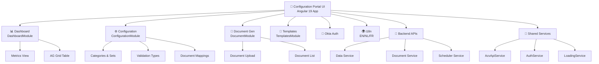

# ACV Configuration Portal UI - README

**Last Updated:** April 3, 2026

## Purpose & Overview

The **ACV Configuration Portal UI** is a comprehensive web-based administrative dashboard and management interface for the Automated Compliance Validation (ACV) platform. Built with modern Angular 19 technology, the portal enables administrators, compliance officers, and configuration managers to manage validation rules, document templates, category mappings, and system configurations across multiple countries and locales.

### Key Responsibilities

- **Dashboard & Monitoring** — Visual analytics, compliance metrics, real-time status monitoring
- **Configuration Management** — Manage validation categories, document types, validation rule mappings, and locale-specific configurations
- **Document Management** — Upload, manage, and generate compliance documents with country/locale-specific variations
- **Template Management** — Create and maintain reusable validation templates and document schemas
- **User Management** — Okta-based authentication with role-based access control (RBAC)
- **Multi-locale Support** — Support for English, Dutch, and French interfaces with i18n

---

## Tech Stack Summary

| Category | Technology | Version | Purpose |
|----------|-----------|---------|---------|
| **Framework** | Angular CLI | 19.2.15 | Web framework and development tooling |
| **Language** | TypeScript | Latest | Type-safe development |
| **UI Library** | Angular Material | 19.2.19 | Component library (dialogs, forms, tables) |
| **Data Grid** | AG Grid | 31.3.4 | Enterprise data tables with pagination, filtering, sorting |
| **Authentication** | Okta | 6.5.1 / 7.14.0 | OAuth2-based identity management |
| **HTTP Client** | @angular/common/http | 19.2.0 | API communication with interceptors |
| **Internationalization** | ngx-translate | 17.0.0 | Multi-language support (EN/NL/FR) |
| **Common UI** | @fedex/common-core | 7.3.6 | FedEx shared component library |
| **Server** | Express.js | 4.18.2 | Node.js server for SSR (Server-Side Rendering) |
| **Build Tool** | Webpack (via Angular) | Latest | Module bundling and optimization |
| **Testing** | Karma/Jasmine | 6.4.0 / 5.6.0 | Unit testing framework |
| **Node Version** | Node.js | 18+ LTS | JavaScript runtime |
| **Package Manager** | npm | 10+ | Dependency management |

---

## Repository Structure

```
eai-3540813-configuration-portal-ui/
├── src/
│   ├── app/
│   │   ├── app.component.ts             ← Root component
│   │   ├── app-routing.module.ts        ← Route definitions
│   │   ├── app.module.ts                ← Main application module
│   │   ├── app-config.ts                ← Application configuration
│   │   ├── core/
│   │   │   ├── dashboard/               ← Dashboard views & analytics
│   │   │   ├── configuration/           ← Configuration management
│   │   │   ├── document/                ← Document generation & listing
│   │   │   ├── templates/               ← Template management
│   │   │   └── model/                   ← Domain models (entities, DTOs)
│   │   ├── layout/
│   │   │   ├── layout.component.ts      ← Main layout wrapper
│   │   │   ├── header/                  ← Header/topbar component
│   │   │   ├── navbar/                  ← Navigation sidebar
│   │   │   └── footer/                  ← Footer component
│   │   ├── shared/
│   │   │   ├── services/
│   │   │   │   ├── acv-api.service.ts   ← Backend API client
│   │   │   │   ├── authService.ts       ← Okta authentication
│   │   │   │   ├── loading.service.ts   ← Global loading state
│   │   │   │   └── translate-loader.factory.ts ← i18n loader
│   │   │   ├── interceptors/
│   │   │   │   └── auth.interceptor.ts  ← HTTP auth interceptor
│   │   │   ├── components/              ← Reusable UI components
│   │   │   ├── shared.module.ts         ← Shared imports module
│   │   │   └── material.module.ts       ← Material imports module
│   │   └── okta.config.ts               ← Okta SDK configuration
│   ├── assets/
│   │   ├── i18n/                        ← Translation files (EN/NL/FR)
│   │   └── images/                      ← Static assets
│   ├── environments/
│   │   ├── environment.ts               ← Local development config
│   │   ├── environment.development.ts   ← Dev environment config
│   │   └── environment.prod.ts          ← Production config
│   ├── styles.css                       ← Global styles
│   ├── index.html                       ← HTML entry point
│   └── main.ts                          ← Application bootstrap
├── configs/                             ← Build & environment configs
├── scripts/                             ← Build and deployment scripts
├── helm-release/                        ← Kubernetes deployment configs
├── public/                              ← Static assets served directly
├── .github/                             ← GitHub Actions workflows
├── angular.json                         ← Angular CLI configuration
├── tsconfig.json                        ← TypeScript configuration
├── package.json                         ← npm dependencies
└── README.md                            ← Angular CLI generated README
```

---

## Quick Start Guide

### Prerequisites

- **Node.js** 18+ LTS (download from https://nodejs.org/)
- **npm** 10+ (included with Node.js)
- **Angular CLI** 19.2.15 (`npm install -g @angular/cli@19.2.15`)
- **Git** for version control

### Local Development Setup

1. **Clone the repository:**
   ```bash
   cd c:\Users\6687869\Code\ACV\eai-3540813-configuration-portal-ui
   ```

2. **Install dependencies:**
   ```bash
   npm install
   ```

3. **Configure Okta integration** (if needed):
   - Edit `src/okta.config.ts`
   - Update client ID, issuer URL, redirect URI

4. **Start development server:**
   ```bash
   npm start
   # or: ng serve --configuration=local
   ```
   - Server runs at: `http://localhost:4200/`
   - Application auto-reloads on file changes

### Build for Deployment

```bash
# Development build
npm run build:dev

# Test/Staging build
npm run build:test

# Production build
npm run build:prod
```

Build artifacts are output to the `dist/` directory.

### Run Tests

```bash
# Unit tests
npm test
# or: ng test

# Run tests in headless mode
ng test --watch=false --code-coverage
```

### Linting

```bash
npm run lint
```

---

## Feature Overview

### 📊 Dashboard Module
- Real-time compliance metrics and KPIs
- Validation job status tracking
- Document generation history
- System health monitoring
- Data visualization with AG Grid

**Entry Point:** `/dashboard`  
**Component:** `DashboardComponent`  
**Module:** `DashboardModule`

### 📋 Configuration Management
Centralized management of ACV system configurations:

**Sub-features:**
- **Categories & Sets** — Define validation categories and categorical groupings
- **Validation Types** — Configure validation rules, formulas, and conditions
- **Document Validation Mapping** — Map documents to validation rules by country/locale
- **Validation Config Mapping** — Configure country-specific validation settings

**Entry Point:** `/configurations`  
**Component:** `ConfigurationComponent`  
**Module:** `ConfigurationModule`
**Managed Data Endpoints:**
- `validationCategoriesAndSets`
- `countryDocumentList`
- `countryDocumentValidationList`
- `countryValidationConfiguration`

### 📄 Document Management
Create, manage, and generate compliance documents with locale-specific variations.

**Supported Locales:**
- India (IN) — English (US)
- Additional countries configurable in `app-config.ts`

**Document Types (examples):**
- Customer Profiling Sheet (CUST_PROFILE_SHEET)

**Entry Point:** `/document-generate`  
**Component:** `DocumentGenerateComponent`  
**Module:** `DocumentModule`

### 📑 Templates Module
Manage reusable validation templates and document schemas.

**Entry Point:** `/templates`  
**Component:** `TemplatesComponent`  
**Module:** `TemplatesModule`

---

## Authentication & Authorization

### Okta Integration

The application uses **Okta OAuth 2.0** for secure authentication:

```
User Browser → Okta Login → Callback → Access Token → Protected Routes
```

- **Auth Guard:** `OktaAuthGuard` protects all application routes
- **Token Storage:** Secure localStorage (managed by Okta SDK)
- **Token Refresh:** Automatic token refresh via Okta SDK
- **Callback Route:** `/authorization-code/callback`

### Configuration

File: `src/okta.config.ts`

```typescript
export const oktaAuth = new OktaAuth({
  issuer: 'https://your-okta-domain.okta.com/oauth2/default',
  clientId: 'your-client-id',
  redirectUri: window.location.origin + '/authorization-code/callback',
  scopes: ['openid', 'profile', 'email']
});
```

### Role-Based Access Control (RBAC)

Currently all authenticated users have full access. Future enhancement: Implement role-based route guards.

---

## API Integration

### Base URL Configuration

File: `src/environments/environment.ts`

```typescript
export const environment = {
  production: false,
  baseUrl: 'http://localhost:8080/api'  // Backend API gateway
};
```

### Backend Services Accessed

| Service | Port | Purpose |
|---------|------|---------|
| **Data Service** | 8095 | Data persistence, document list, validation configuration |
| **Document Service** | 8096 | Document upload/download, generation |
| **Scheduler Service** | 8097 | Job scheduling, batch operations |

### AcvApiService

Central HTTP client for all backend communication.

**Methods:**
- `get<T>(service, endpoint, params?, body?): Observable<T>`
- `post<T>(service, endpoint, body): Observable<T>`
- `put<T>(service, endpoint, body): Observable<T>`
- `delete<T>(service, endpoint): Observable<T>`
- `blobPost<T>(service, endpoint, body, options?): Observable<any>` — File downloads

**Usage Example:**
```typescript
this.acvApiService.post('data-service', 'validationCategoriesAndSets', [])
  .subscribe(result => {
    console.log('Categories:', result);
  });
```

---

## Internationalization (i18n)

### Supported Languages

| Language | Code | Default |
|----------|------|---------|
| English | EN | ✅ Yes |
| Dutch | NL | No |
| French | FR | No |

### Translation Files Location

`src/assets/i18n/[LANGCODE].json`

Example: `src/assets/i18n/en.json`

### Usage in Components

```typescript
constructor(private translate: TranslateService) {
  this.translate.use('EN');  // Switch language
}
```

In templates:
```html
<h1>{{ 'HEADER.APPLICATION_TITLE' | translate }}</h1>
```

---

## Deployment

### Kubernetes Deployment

Helm charts located in: `helm-release/`

**Deploy to dev environment:**
```bash
helm install acv-portal helm-release/ -f helm-release/dev-values.yaml
```

### Environment-Specific Builds

- **Local:** `npm start` (configuration: local)
- **Development:** `npm run build:dev` (configuration: development)
- **Test:** `npm run build:test` (configuration: release)
- **Production:** `npm run build:prod` (configuration: prod)

### Build Output

- Location: `dist/configuration-portal/`
- Artifacts: Static HTML, CSS, JavaScript files (optimized, minified output-hashing)

---

## Project Structure Diagram



---

## Key Contact Points

| Role | Responsibility |
|------|-----------------|
| **Frontend Developer** | Component development, UI/UX implementation, testing |
| **Full-Stack Developer** | API integration, authentication, backend coordination |
| **DevOps Engineer** | Kubernetes deployment, CI/CD pipeline, environment config |
| **QA Engineer** | Testing, bug verification, compliance validation |

---

## Related Documentation

- [High-Level Design (HLD)](HLD.md) — Architecture decisions, system design patterns
- [Low-Level Design (LLD)](LLD.md) — Component structure, services, data models
- [Services/APIs Reference](services.md) — API endpoints, HTTP contracts
- [Code Mapping](code-mapping.md) — Source code navigation guide
- [Developer Onboarding](onboarding.md) — Setup and development workflow
- [Glossary](glossary.md) — Business and technical terminology

---

## Known Issues & Troubleshooting

### Issue: Okta authentication fails

**Solution:** Verify Okta configuration in `src/okta.config.ts` matches your organization settings.

### Issue: Backend API returns 401 Unauthorized

**Solution:** Check that Auth Interceptor is properly injecting token in HTTP headers.

### Issue: Translations not loading

**Solution:** Verify translation files exist in `src/assets/i18n/` and are referenced in `app.module.ts`.

### Issue: AG Grid not rendering

**Solution:** Verify AG Grid license key in environment config (if required).

---

## Performance Considerations

- **Lazy Loading:** Child routes use lazy-loaded modules to reduce initial bundle size
- **Change Detection:** OnPush strategy recommended for high-frequency updates
- **HTTP Caching:** RxJS operators (shareReplay) prevent duplicate API calls
- **Bundle Size:** Production builds use output-hashing for cache busting

---

## Security Best Practices

✅ **Implemented:**
- Okta OAuth 2.0 authentication
- HTTP interceptor for token injection
- Environment-specific API endpoints
- No secrets in version control

⚠️ **Recommended:**
- Implement Content Security Policy (CSP) headers
- Use HTTPS only in production
- Regular npm audit for vulnerability scanning
- Implement API rate limiting

---

## Continuous Integration / Continuous Deployment

- **CI/CD Provider:** GitHub Actions
- **Workflow Files:** `.github/workflows/`
- **Build Trigger:** Push to main branch
- **Deploy Target:** Kubernetes (AKS) via Helm

---

**Document Version:** 1.0  
**Angular CLI Version:** 19.2.15  
**Last Updated:** April 3, 2026
