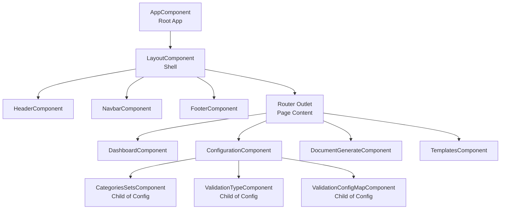
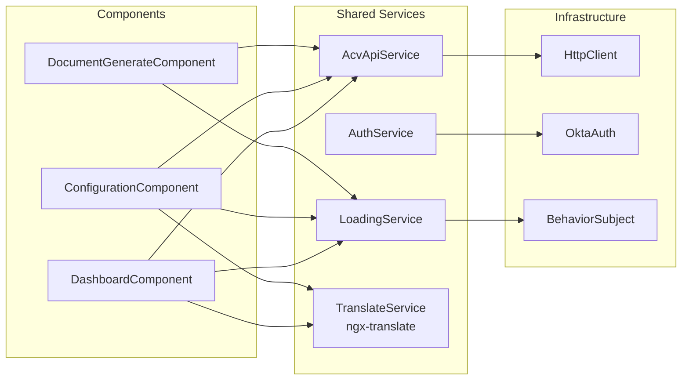

# ACV Configuration Portal UI - Code Mapping & Reference Guide

**Last Updated:** April 3, 2026  
**Scope:** Source code organization, file inventory, and quick navigation guide

---

## Quick File Locator

### 🗂️ **File Paths by Feature**

#### Root Configuration Files
| File | Purpose |
|------|---------|
| `src/app/app.component.ts` | Root Angular component, auth bootstrap |
| `src/app/app.module.ts` | Root module with providers and imports |
| `src/app/app-routing.module.ts` | Application route definitions |
| `src/app/app-config.ts` | Global configuration constants (menus, languages, services) |
| `angular.json` | Angular CLI build configuration |
| `package.json` | npm dependencies and scripts |
| `tsconfig.json` | TypeScript compiler options |

#### Environment Configuration
| File | Purpose |
|------|---------|
| `src/environments/environment.ts` | Local development settings |
| `src/environments/environment.development.ts` | Dev environment (ng serve) |
| `src/environments/environment.prod.ts` | Production deployment settings |
| `src/okta.config.ts` | Okta OAuth 2.0 configuration |

---

### 📊 **Dashboard Feature** (`src/app/core/dashboard/`)

| File | Purpose | Lines |
|------|---------|-------|
| `dashboard.component.ts` | Main dashboard logic, data fetching | 80-120 |
| `dashboard.component.html` | Dashboard UI template with AG Grid | 200-300 |
| `dashboard.component.css` | Dashboard styling | 100-150 |
| `dashboard.component.spec.ts` | Unit tests for dashboard | 50-100 |
| `dashboard.module.ts` | Dashboard feature module (lazy-loaded) | 30-50 |

**Key Classes:**
- `DashboardComponent` — Metrics display, validation job status

---

### ⚙️ **Configuration Management** (`src/app/core/configuration/`)

| File | Purpose | Lines |
|------|---------|-------|
| `configuration.component.ts` | Tab orchestrator, forkJoin API calls | 60-80 |
| `configuration.component.html` | Configuration UI with mat-tabs | 150-200 |
| `configuration.module.ts` | Sub-features bundled | 40-60 |
| **categories-sets/** | Category management sub-feature |
| `categories-sets.component.ts` | Display & edit categories | 100-150 |
| `categories-sets.component.html` | AG Grid for categories table | 100-150 |
| **validation-type/** | Validation rules sub-feature |
| `validation-type.component.ts` | Display & filter validations | 100-150 |
| `validation-type.component.html` | Validation rules table | 100-150 |
| **validation-config-map/** | Mapping configuration |
| `validation-config-map.component.ts` | Document-to-validation mapping | 80-120 |
| **document-list/** | Document listing |
| `document-list.component.ts` | Show documents by country | 80-120 |

**Key Classes:**
- `ConfigurationComponent` — Tab manager, data orchestrator
- `CategoriesSetsComponent` — Category CRUD operations
- `ValidationTypeComponent` — Validation rule management
- `ValidationConfigMapComponent` — Rule mappings UI

---

### 📄 **Document Management** (`src/app/core/document/`)

| File | Purpose | Lines |
|------|---------|-------|
| `document-generate.component.ts` | Document generation workflow | 120-180 |
| `document-generate.component.html` | Form with file upload & preview | 150-200 |
| `document.module.ts` | Document feature module | 30-50 |

**Key Classes:**
- `DocumentGenerateComponent` — Generate, upload, download documents

---

### 📑 **Templates Module** (`src/app/core/templates/`)

| File | Purpose | Lines |
|------|---------|-------|
| `templates.component.ts` | Template CRUD operations | 100-150 |
| `templates.component.html` | Template list & editor | 150-200 |
| `templates.module.ts` | Templates feature module | 30-50 |

---

### 🎯 **Layout Components** (`src/app/layout/`)

| File | Purpose | Lines |
|------|---------|-------|
| `layout.component.ts` | App shell wrapper | 20-30 |
| `layout.component.html` | Header + navbar + router-outlet + footer | 50-80 |
| `layout.module.ts` | Layout module with child components | 30-50 |
| `header/header.component.ts` | Top navigation bar | 60-100 |
| `header/header.component.html` | Branding, user profile, language picker | 80-120 |
| `navbar/navbar.component.ts` | Sidebar navigation | 70-100 |
| `navbar/navbar.component.html` | Menu items with routing | 100-150 |
| `footer/footer.component.ts` | Footer content | 30-50 |
| `footer/footer.component.html` | Copyright, links | 30-50 |

---

### 📦 **Shared Modules** (`src/app/shared/`)

#### Services
| File | Purpose | Lines |
|------|---------|-------|
| `services/acv-api.service.ts` | HTTP client for all backend calls | 80-100 |
| `services/acv-api.service.spec.ts` | Unit tests for API service | 100-150 |
| `services/authService.ts` | Okta authentication helper | 60-80 |
| `services/loading.service.ts` | Global loading state management | 30-50 |
| `services/translate-loader.factory.ts` | i18n file loader factory | 20-30 |

#### Interceptors
| File | Purpose | Lines |
|------|---------|-------|
| `interceptors/auth.interceptor.ts` | JWT token injection in requests | 40-60 |

#### Components
| File | Purpose |
|------|---------|
| `components/header/` | Reusable header component (if shared) |
| `components/navbar/` | Reusable navbar component (if shared) |
| `components/footer/` | Reusable footer component (if shared) |

#### Shared Module Files
| File | Purpose | Lines |
|------|---------|-------|
| `shared.module.ts` | Exports common imports/components | 40-60 |
| `material.module.ts` | Angular Material imports | 50-80 |

---

### 🗂️ **Models / Domain Objects** (`src/app/core/model/`)

| File | Purpose | Lines |
|------|---------|-------|
| `categorySet.ts` | CategorySet interface & CategoryItem | 30-50 |
| `documentRecord.ts` | DocumentRecord & LocaleConfig interfaces | 40-60 |
| `validationTypeConfig.ts` | ValidationTypeConfig interface | 30-50 |
| `validationConfigMapping.ts` | ValidationConfigMapping interface | 30-50 |
| `dashboardMetrics.ts` | Dashboard metrics DTO (if exists) | 30-50 |

**Example Structure:**
```typescript
// categorySet.ts
export interface CategorySet {
  categoryId: string;
  categoryName: string;
  categoryType: string;
  categoryItems?: CategoryItem[];
}

export interface CategoryItem {
  itemId: string;
  itemName: string;
  itemValue: string;
}
```

---

### 🌍 **Assets & Translations** (`src/assets/`)

| File | Purpose |
|------|---------|
| `i18n/en.json` | English translation keys |
| `i18n/nl.json` | Dutch translation keys |
| `i18n/fr.json` | French translation keys |
| `images/logo.png` | Application logo |
| `images/favicon.ico` | Browser tab icon |

---

### ⚡ **Configuration & Build** (`configs/`, `scripts/`)

| File | Purpose |
|------|---------|
| `angular.json` | Build, test, lint configurations |
| `.github/workflows/*.yml` | GitHub Actions CI/CD pipelines |
| `helm-release/values.yaml` | Kubernetes deployment values |
| `helm-release/Chart.yaml` | Helm chart metadata |
| `Dockerfile` | Container image definition |
| `.dockerignore` | Files to exclude from Docker build |

---

## Component Dependency Diagram



---

## Service Dependency Graph



---

## Service Layer Methods Reference

### AcvApiService Methods

```typescript
// HTTP GET method
get<T>(service: string, endpoint: string, params?: any, body?: any): Observable<T>

// HTTP POST method (most common)
post<T>(service: string, endpoint: string, body: any): Observable<T>

// HTTP PUT method
put<T>(service: string, endpoint: string, body: any): Observable<T>

// HTTP DELETE method
delete<T>(service: string, endpoint: string): Observable<T>

// File download (blob POST)
blobPost<T>(service: string, endpoint: string, body: any, options?: any): Observable<any>
```

---

## Feature Module Loading Pattern

All feature modules follow lazy-loading pattern:

**Route Configuration (app-routing.module.ts):**
```typescript
{
  path: 'configurations',
  component: ConfigurationComponent,
  canActivate: [OktaAuthGuard],
  children: [{
    path: '',
    loadChildren: () => import('./core/configuration/configuration.module')
      .then(m => m.ConfigurationModule)
  }]
}
```

**Module Definition (configuration.module.ts):**
```typescript
@NgModule({
  declarations: [
    ConfigurationComponent,
    CategoriesSetsComponent,
    ValidationTypeComponent,
    ValidationConfigMapComponent
  ],
  imports: [
    CommonModule,
    ConfigurationRoutingModule,
    SharedModule
  ]
})
export class ConfigurationModule { }
```

---

## Configuration Constants Reference

### AppConfig Object (`src/app/app-config.ts`)

```typescript
export const AppConfig = {
  appName: 'HEADER.APPLICATION_TITLE',
  
  supportedLanguages: [
    { langNm: 'English', langCd: 'EN', default: true },
    { langNm: 'Dutch', langCd: 'NL' },
    { langNm: 'French', langCd: 'FR' }
  ],
  
  menuItems: [
    { navItem: 'ACV_MENU.MENU_ITEM_1', icon: 'fa fa-list-alt', route: '' },
    { navItem: 'ACV_MENU.MENU_ITEM_2', icon: 'fa fa-files-o', route: '/document-generate' },
    { navItem: 'ACV_MENU.MENU_ITEM_3', icon: 'fa fa-cogs', route: '/configurations' }
  ],
  
  acvServiceList: {
    data: 'data-service',
    scheduler: 'scheduler-service',
    document: 'document-service'
  },
  
  screenConfig: {
    dashboard: {
      pageSize: 10,
      paginationPageSizeSelector: [10, 25, 50]
    }
  },
  
  documentList: [
    {
      countryCd: 'IN',
      countryName: 'India',
      documents: [
        {
          documentCd: 'CUST_PROFILE_SHEET',
          documentName: 'Customer Profiling Sheet',
          localeCd: [{ localeCd: 'en_US', localeNm: 'English (US)', default: false }]
        }
      ]
    }
  ]
};
```

---

## Debugging & Development Tips

### Console Logging Strategy

```typescript
// In ConfigurationComponent
console.log(result);  // Log API response
console.error('Error loading configuration:', error);  // Log errors
```

### Browser DevTools Inspection

1. **Application Tab** → LocalStorage → Inspect Okta tokens
2. **Network Tab** → Monitor API calls (filter by 'data-service', 'document-service', etc.)
3. **Elements Tab** → Inspect DOM structure
4. **Console Tab** → Execute commands: `ng.probe(document.body.querySelector('app-configuration'))`

### Angular Debugging

```typescript
// In browser console
ng.probe(document.body.querySelector('app-configuration')).componentInstance
  // Inspect component state

ng.probe(document.body).injector.get(AcvApiService)
  // Access service from DevTools
```

---

## Code Patterns & Conventions

### Observable Pattern

All HTTP calls return Observables following the RxJS pattern:

```typescript
// Request → Handle → Complete
this.acvApiService.post('data-service', 'endpoint', payload)
  .pipe(
    tap(result => console.log('Data received')),         // Side effect logging
    catchError(error => this.handleError(error))         // Error handling
  )
  .subscribe(
    (result) => this.data = result,                      // On success
    (error) => this.errorMessage = error.message,       // On error
    () => console.log('Request completed')              // On complete
  );
```

### Async Pipe Pattern (Reactive)

Template-level subscription to Observables:

```typescript
// Component
data$ = this.acvApiService.post('data-service', 'categories', []);

// Template
<div>{{ data$ | async }}</div>
```

### Tab Selection Pattern

```typescript
// Track selected tab
tabSelection: number = 0;

changeSelection(index: number): void {
  this.tabSelection = index;
}

// In template
<mat-tab-group [(selectedIndex)]="tabSelection">
  <mat-tab label="Tab 1">Content 1</mat-tab>
  <mat-tab label="Tab 2">Content 2</mat-tab>
</mat-tab-group>
```

---

## Testing File Locations

| Test File | Tested Component |
|-----------|-----------------|
| `acv-api.service.spec.ts` | AcvApiService |
| `dashboard.component.spec.ts` | DashboardComponent |
| `configuration.component.spec.ts` | ConfigurationComponent |
| `navbar.component.spec.ts` | NavbarComponent |

**Run tests:**
```bash
npm test
# or watch mode:
ng test --watch
```

---

## Build Artifacts

### Development Build Output

```
dist/configuration-portal/
├── main.[hash].js          ← Main bundle
├── styles.[hash].css       ← Global styles
├── runtime.[hash].js       ← Runtime
├── polyfills.[hash].js     ← Polyfills
└── index.html              ← Entry HTML
```

### Optimization Flags in `angular.json`

```json
{
  "aot": true,
  "outputHashing": "all",
  "optimization": true,
  "buildOptimizer": true,
  "sourceMap": false
}
```

---

## References

- [README](README.md) — Project overview
- [High-Level Design (HLD)](HLD.md) — Architecture decisions
- [Low-Level Design (LLD)](LLD.md) — Implementation details
- [Services/APIs](services.md) — API contracts
- [Onboarding](onboarding.md) — Setup guide
- [Glossary](glossary.md) — Terminology

---

**Document Version:** 1.0  
**Last Updated:** April 3, 2026
