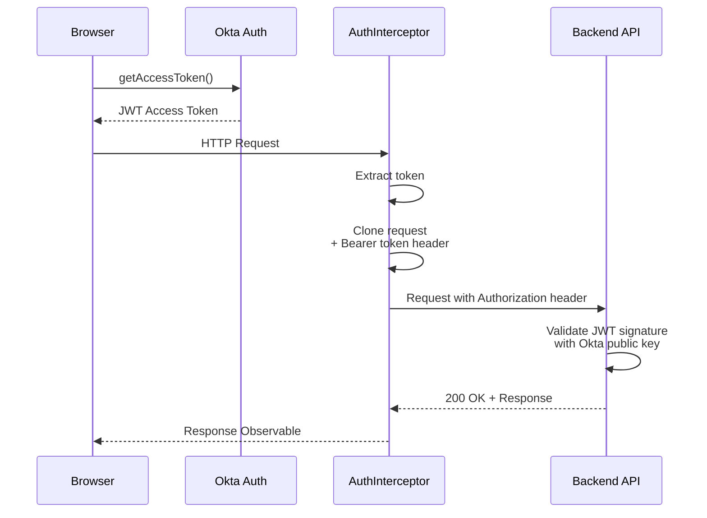

# ACV Configuration Portal UI - Services & APIs Reference

**Last Updated:** April 3, 2026  
**Scope:** API endpoints, HTTP contracts, request/response schemas, authentication flows

---

## API Communication Overview

The Configuration Portal UI communicates exclusively with ACV backend microservices through a centralized `AcvApiService` HTTP client.

### Base URL Configuration

```typescript
// src/environments/environment.ts (Local)
export const environment = {
  production: false,
  baseUrl: 'http://localhost:8080/api'
};

// src/environments/environment.prod.ts (Production)
export const environment = {
  production: true,
  baseUrl: 'https://api.acv-platform.com/api'
};
```

### Request Header Template

All HTTP requests automatically include:
```
Authorization: Bearer <JWT_ACCESS_TOKEN>
Content-Type: application/json
```

The `Bearer` token is injected by `AuthInterceptor` from Okta.

---

## API Endpoints by Service

### 📊 **Data Service** (Port 8095)

Base URL: `{baseUrl}/data-service/`

#### 1. Get Validation Categories & Sets

**Endpoint:** `POST /validationCategoriesAndSets`

**Purpose:** Retrieve all validation category definitions and their groupings

**Request:**
```json
{
  "countryCode": "IN",  // Optional: filter by country
  "isActive": true      // Optional: filter by status
}
```

**Response (200 OK):**
```json
[
  {
    "categoryId": "cat-001-uuid",
    "categoryName": "Document Type",
    "description": "Primary document classification categories",
    "categoryType": "PRIMARY",
    "displayOrder": 1,
    "isActive": true,
    "createdDate": "2026-01-15T10:30:00Z",
    "lastModifiedDate": "2026-03-20T15:45:00Z",
    "categoryItems": [
      {
        "itemId": "item-001",
        "itemName": "Customer Profile",
        "itemValue": "CUST_PROFILE",
        "displayOrder": 1,
        "isActive": true
      },
      {
        "itemId": "item-002",
        "itemName": "Compliance Certificate",
        "itemValue": "COMPLIANCE_CERT",
        "displayOrder": 2,
        "isActive": true
      }
    ]
  },
  {
    "categoryId": "cat-002-uuid",
    "categoryName": "Validation Type",
    "description": "Validation rule classifications",
    "categoryType": "SECONDARY",
    "displayOrder": 2,
    "isActive": true,
    "categoryItems": [...]
  }
]
```

**Error Response (400 Bad Request):**
```json
{
  "statusCode": 400,
  "message": "Invalid country code format",
  "errorCode": "INVALID_COUNTRY_CODE",
  "timestamp": "2026-04-03T10:20:00Z"
}
```

**Usage in Component:**
```typescript
this.acvApiService.post<CategorySet[]>(
  'data-service',
  'validationCategoriesAndSets',
  { countryCode: 'IN' }
).subscribe(
  (categories) => {
    this.categoriesAndSetsData = categories;
  },
  (error) => {
    console.error('Failed to load categories:', error);
  }
);
```

---

#### 2. Get Country Document List

**Endpoint:** `POST /countryDocumentList`

**Purpose:** Retrieve documents applicable to specific countries with locale variations

**Request:**
```json
{
  "countryCodes": ["IN", "US"],  // Array of country codes
  "includeInactive": false       // Include inactive documents
}
```

**Response (200 OK):**
```json
[
  {
    "documentId": "doc-001-uuid",
    "documentCode": "CUST_PROFILE_SHEET",
    "documentName": "Customer Profiling Sheet",
    "countryCode": "IN",
    "countryName": "India",
    "documentDescription": "Comprehensive customer information and KYC verification document",
    "requiredStatus": "MANDATORY",
    "localeConfigurations": [
      {
        "localeCode": "en_US",
        "localeName": "English (US)",
        "isDefault": true,
        "translationKey": "doc.customer_profile.en"
      },
      {
        "localeCode": "hi_IN",
        "localeName": "हिन्दी (भारत)",
        "isDefault": false,
        "translationKey": "doc.customer_profile.hi"
      }
    ],
    "supportedFileTypes": ["PDF", "DOCX"],
    "createdDate": "2025-06-01T08:00:00Z",
    "lastModifiedDate": "2026-03-15T12:30:00Z"
  },
  {
    "documentId": "doc-002-uuid",
    "documentCode": "COMPLIANCE_REPORT",
    "documentName": "Annual Compliance Report",
    "countryCode": "IN",
    "countryName": "India",
    "documentDescription": "Year-end compliance audit and certification report",
    "requiredStatus": "MANDATORY",
    "localeConfigurations": [...],
    "supportedFileTypes": ["PDF"],
    "createdDate": "2025-01-01T00:00:00Z",
    "lastModifiedDate": "2026-02-28T10:00:00Z"
  }
]
```

**Error Response (404 Not Found):**
```json
{
  "statusCode": 404,
  "message": "No documents found for country codes: XY",
  "errorCode": "DOCUMENTS_NOT_FOUND",
  "timestamp": "2026-04-03T10:20:00Z"
}
```

**Usage in Component:**
```typescript
this.acvApiService.post<DocumentRecord[]>(
  'data-service',
  'countryDocumentList',
  { countryCodes: ['IN', 'US'] }
).subscribe(
  (documents) => {
    this.documentListData = documents;
  }
);
```

---

#### 3. Get Country Document Validation List

**Endpoint:** `POST /countryDocumentValidationList`

**Purpose:** Retrieve validation rules and types applicable to documents by country

**Request:**
```json
{
  "countryCode": "IN",                      // Required
  "documentCode": "CUST_PROFILE_SHEET",    // Optional: filter by document type
  "validationSeverity": ["ERROR", "WARNING"]  // Optional: filter by severity
}
```

**Response (200 OK):**
```json
[
  {
    "validationTypeId": "val-001-uuid",
    "validationType": "DATA_FORMAT_VALIDATION",
    "validationName": "Customer ID Format Validation",
    "validationDescription": "Validates customer ID follows CustXXXXXX pattern",
    "validationLogic": "REGEX_MATCH: ^Cust[0-9]{6}$",
    "severity": "ERROR",
    "priority": 1,
    "appliesToDocuments": ["CUST_PROFILE_SHEET", "CUST_UPDATE"],
    "isActive": true,
    "createdDate": "2025-06-01T08:00:00Z",
    "lastModifiedDate": "2026-03-15T12:30:00Z"
  },
  {
    "validationTypeId": "val-002-uuid",
    "validationType": "MANDATORY_FIELD_CHECK",
    "validationName": "Address Field Mandatory",
    "validationDescription": "Address field must not be empty for compliance",
    "validationLogic": "NOT_NULL && LENGTH > 10",
    "severity": "ERROR",
    "priority": 2,
    "appliesToDocuments": ["CUST_PROFILE_SHEET"],
    "isActive": true,
    "createdDate": "2025-08-10T10:00:00Z",
    "lastModifiedDate": "2026-02-20T14:15:00Z"
  },
  {
    "validationTypeId": "val-003-uuid",
    "validationType": "DATA_QUALITY_WARNING",
    "validationName": "Phone Number Format Warning",
    "validationDescription": "Phone number should follow standard 10-digit format",
    "validationLogic": "REGEX_MATCH: ^[0-9]{10}$",
    "severity": "WARNING",
    "priority": 5,
    "appliesToDocuments": ["CUST_PROFILE_SHEET"],
    "isActive": true,
    "createdDate": "2025-09-01T09:00:00Z",
    "lastModifiedDate": "2026-01-30T11:20:00Z"
  }
]
```

**Error Response (400 Bad Request):**
```json
{
  "statusCode": 400,
  "message": "Country code is required",
  "errorCode": "MISSING_REQUIRED_FIELD",
  "details": {
    "missingFields": ["countryCode"]
  },
  "timestamp": "2026-04-03T10:20:00Z"
}
```

**Usage in Component:**
```typescript
this.acvApiService.post<ValidationTypeConfig[]>(
  'data-service',
  'countryDocumentValidationList',
  { countryCode: 'IN', validationSeverity: ['ERROR'] }
).subscribe(
  (validations) => {
    this.validationTypeConfigData = validations;
  }
);
```

---

#### 4. Get Country Validation Configuration

**Endpoint:** `POST /countryValidationConfiguration`

**Purpose:** Retrieve mappings between documents and validation rules per country

**Request:**
```json
{
  "countryCode": "IN",              // Required
  "documentCode": "CUST_PROFILE_SHEET"  // Optional: filter by document
}
```

**Response (200 OK):**
```json
[
  {
    "mappingId": "map-001-uuid",
    "countryCode": "IN",
    "documentCode": "CUST_PROFILE_SHEET",
    "validationTypeId": "val-001-uuid",
    "mappingSequence": 1,
    "isOptional": false,
    "errorMessage": "Customer ID format is invalid. Expected format: CustXXXXXX",
    "warningMessage": null,
    "createdDate": "2025-06-01T08:00:00Z",
    "lastModifiedDate": "2026-03-10T09:30:00Z"
  },
  {
    "mappingId": "map-002-uuid",
    "countryCode": "IN",
    "documentCode": "CUST_PROFILE_SHEET",
    "validationTypeId": "val-002-uuid",
    "mappingSequence": 2,
    "isOptional": false,
    "errorMessage": "Address cannot be empty for compliance verification",
    "warningMessage": null,
    "createdDate": "2025-06-01T08:00:00Z",
    "lastModifiedDate": "2026-03-10T09:30:00Z"
  },
  {
    "mappingId": "map-003-uuid",
    "countryCode": "IN",
    "documentCode": "CUST_PROFILE_SHEET",
    "validationTypeId": "val-003-uuid",
    "mappingSequence": 3,
    "isOptional": true,
    "errorMessage": null,
    "warningMessage": "Phone number should follow standard 10-digit format",
    "createdDate": "2025-09-01T09:00:00Z",
    "lastModifiedDate": "2026-03-10T09:30:00Z"
  }
]
```

**Usage in Component:**
```typescript
this.acvApiService.post<ValidationConfigMapping[]>(
  'data-service',
  'countryValidationConfiguration',
  { countryCode: 'IN' }
).subscribe(
  (mappings) => {
    this.validationConfigMappingData = mappings;
  }
);
```

---

### 📄 **Document Service** (Port 8096)

Base URL: `{baseUrl}/document-service/`

#### 1. Generate Document

**Endpoint:** `POST /generateDocument`

**Purpose:** Generate a document based on template and configuration

**Request:**
```json
{
  "documentCode": "CUST_PROFILE_SHEET",
  "countryCode": "IN",
  "localeCode": "en_US",
  "templateId": "tpl-001",
  "documentData": {
    "customerId": "Cust123456",
    "customerName": "John Doe",
    "address": "123 Main Street, Mumbai, 400001",
    "phoneNumber": "9876543210",
    "email": "john.doe@example.com"
  },
  "outputFormat": "PDF"  // PDF or DOCX
}
```

**Response (200 OK - Binary File):**
```
[Binary PDF/DOCX file data]

Response Headers:
Content-Type: application/pdf
Content-Disposition: attachment; filename="CUST_PROFILE_SHEET_IN_2026-04-03.pdf"
Content-Length: 245892
```

**Error Response (400 Bad Request):**
```json
{
  "statusCode": 400,
  "message": "Missing required field: documentData",
  "errorCode": "VALIDATION_FAILED",
  "timestamp": "2026-04-03T10:25:00Z"
}
```

**Usage in Component:**
```typescript
this.acvApiService.blobPost(
  'document-service',
  'generateDocument',
  { documentCode: 'CUST_PROFILE_SHEET', countryCode: 'IN', ... }
).subscribe(
  (response) => {
    const blob = response.body;
    const filename = 'CUST_PROFILE_SHEET.pdf';
    saveAs(blob, filename);
  },
  (error) => {
    console.error('Document generation failed:', error);
  }
);
```

---

#### 2. Upload Document

**Endpoint:** `POST /uploadDocument`

**Purpose:** Upload a document file to the system

**Request:**
```
Content-Type: multipart/form-data

Form Data:
- file: [Binary file data]
- documentCode: "CUST_PROFILE_SHEET"
- countryCode: "IN"
- localeCode: "en_US"
- description: "Customer profile for verification"
```

**Response (201 Created):**
```json
{
  "documentId": "doc-upload-001-uuid",
  "documentCode": "CUST_PROFILE_SHEET",
  "fileName": "CUST_PROFILE_SHEET_IN_2026-04-03.pdf",
  "fileSize": 245892,
  "uploadedDate": "2026-04-03T10:30:00Z",
  "uploadedBy": "user@example.com",
  "downloadUrl": "https://api.acv-platform.com/document-service/download/doc-upload-001-uuid"
}
```

**Error Response (413 Payload Too Large):**
```json
{
  "statusCode": 413,
  "message": "File size exceeds maximum allowed size of 50MB",
  "errorCode": "FILE_TOO_LARGE",
  "timestamp": "2026-04-03T10:30:00Z"
}
```

---

#### 3. Download Document

**Endpoint:** `GET /download/:documentId`

**Purpose:** Download a previously uploaded document

**Query Parameters:**
```
GET /download/doc-upload-001-uuid?format=pdf
```

**Response (200 OK - Binary File):**
```
[Binary PDF file data]

Response Headers:
Content-Type: application/pdf
Content-Disposition: attachment; filename="CUST_PROFILE_SHEET_IN_2026-04-03.pdf"
```

**Error Response (404 Not Found):**
```json
{
  "statusCode": 404,
  "message": "Document not found: doc-upload-001-uuid",
  "errorCode": "DOCUMENT_NOT_FOUND",
  "timestamp": "2026-04-03T10:35:00Z"
}
```

---

### ⏰ **Scheduler Service** (Port 8097)

Base URL: `{baseUrl}/scheduler-service/`

#### 1. Schedule Batch Validation Job

**Endpoint:** `POST /scheduleValidationJob`

**Purpose:** Schedule a batch validation job for multiple documents

**Request:**
```json
{
  "jobName": "Q1_2026_Compliance_Validation",
  "countryCode": "IN",
  "documentCodes": ["CUST_PROFILE_SHEET", "COMPLIANCE_REPORT"],
  "executionType": "IMMEDIATE",  // IMMEDIATE, SCHEDULED, RECURRING
  "scheduleExpression": null,    // For SCHEDULED/RECURRING: cron expression
  "priority": "HIGH",            // LOW, MEDIUM, HIGH
  "notificationEmail": "compliance@example.com"
}
```

**Response (202 Accepted - Async Job):**
```json
{
  "jobId": "job-001-uuid",
  "jobName": "Q1_2026_Compliance_Validation",
  "jobStatus": "QUEUED",
  "createdDate": "2026-04-03T10:40:00Z",
  "estimatedExecutionTime": "2026-04-03T10:50:00Z",
  "pollingUrl": "https://api.acv-platform.com/scheduler-service/jobs/job-001-uuid"
}
```

**Usage in Component:**
```typescript
this.acvApiService.post(
  'scheduler-service',
  'scheduleValidationJob',
  { jobName: 'Q1 Validation', countryCode: 'IN', executionType: 'IMMEDIATE' }
).subscribe(
  (response) => {
    console.log('Job scheduled:', response.jobId);
    this.pollJobStatus(response.jobId);
  }
);
```

---

#### 2. Get Job Status

**Endpoint:** `GET /jobs/:jobId`

**Purpose:** Poll the status of a background job

**Response (200 OK):**
```json
{
  "jobId": "job-001-uuid",
  "jobName": "Q1_2026_Compliance_Validation",
  "jobStatus": "IN_PROGRESS",  // QUEUED, IN_PROGRESS, COMPLETED, FAILED
  "progress": 65,  // Percentage
  "createdDate": "2026-04-03T10:40:00Z",
  "startedDate": "2026-04-03T10:41:00Z",
  "completedDate": null,
  "resultSummary": {
    "totalDocuments": 1000,
    "successCount": 650,
    "errorCount": 0,
    "warningCount": 350
  }
}
```

**Usage in Component:**
```typescript
pollJobStatus(jobId: string): void {
  const poll$ = interval(2000).pipe(
    switchMap(() => this.acvApiService.get('scheduler-service', `jobs/${jobId}`)),
    takeWhile((job) => job.jobStatus !== 'COMPLETED' && job.jobStatus !== 'FAILED'),
    finalize(() => console.log('Job polling complete'))
  );
  
  poll$.subscribe((job) => {
    console.log(`Job progress: ${job.progress}%`);
  });
}
```

---

## HTTP Status Codes

| Status Code | Meaning | Example |
|------------|---------|---------|
| **200** | OK | Configuration data retrieved successfully |
| **201** | Created | Document uploaded successfully |
| **202** | Accepted | Async job queued for background processing |
| **400** | Bad Request | Invalid request payload or parameters |
| **401** | Unauthorized | Missing or invalid JWT token |
| **403** | Forbidden | User lacks permission for resource |
| **404** | Not Found | Configuration or document does not exist |
| **409** | Conflict | Resource already exists or state conflict |
| **413** | Payload Too Large | Uploaded file exceeds size limit |
| **500** | Internal Server Error | Unexpected backend error |
| **503** | Service Unavailable | Backend service is down or unreachable |

---

## Authentication & Authorization

### JWT Token Flow



### Scopes & Permissions

**Okta Application Scopes:**
- `openid` — User identity
- `profile` — User profile information
- `email` — User email address

**Future RBAC Levels (planned):**
- `admin` — Full system access
- `compliance_officer` — Configuration management
- `operator` — View-only access

---

## Error Response Format

All API errors follow a standard format:

```json
{
  "statusCode": 400,
  "message": "Human-readable error message",
  "errorCode": "MACHINE_READABLE_ERROR_CODE",
  "details": {
    "field": "additionalContextData"
  },
  "timestamp": "2026-04-03T10:40:00Z"
}
```

**Example Client Handler:**
```typescript
private handleApiError(error: HttpErrorResponse): void {
  const errorResponse = error.error;
  
  switch (errorResponse.errorCode) {
    case 'INVALID_COUNTRY_CODE':
      this.showErrorMessage('Please select a valid country');
      break;
    case 'DOCUMENTS_NOT_FOUND':
      this.showErrorMessage('No documents found for selected country');
      break;
    case 'VALIDATION_FAILED':
      this.showErrorMessage('Please fill all required fields');
      break;
    default:
      this.showErrorMessage('An unexpected error occurred. Please try again later.');
  }
}
```

---

## Request/Response Timing

### Typical Response Times (p95)

| Endpoint | Response Time |
|----------|---|
| GET validationCategoriesAndSets | 250 ms |
| POST countryDocumentList (filter 50 docs) | 300 ms |
| POST countryDocumentValidationList | 200 ms |
| POST countryValidationConfiguration | 150 ms |
| POST generateDocument | 3-5 seconds |
| POST uploadDocument | 1-2 seconds |
| GET jobs/:jobId | 100 ms |

---

## Rate Limiting

All API endpoints are subject to rate limiting:

**Rate Limits:**
- **Per User:** 100 requests/minute
- **Per IP:** 1000 requests/minute
- **Global:** 100,000 requests/minute

**Rate Limit Headers:**
```
X-RateLimit-Limit: 100
X-RateLimit-Remaining: 87
X-RateLimit-Reset: 1680537600
```

**Exceeded Response (429 Too Many Requests):**
```json
{
  "statusCode": 429,
  "message": "Rate limit exceeded. Please retry after 60 seconds.",
  "errorCode": "RATE_LIMIT_EXCEEDED",
  "retryAfter": 60,
  "timestamp": "2026-04-03T10:40:00Z"
}
```

---

## Backward Compatibility

### API Versioning Strategy

All endpoints are versioned in the future (not currently version-prefixed):

```
/api/v1/data-service/validationCategoriesAndSets
/api/v1/document-service/generateDocument
```

**Deprecation Policy:**
- Major version changes are backward-incompatible
- Deprecated endpoints supported for minimum 12 months
- Clients receive 6-month deprecation notice
- x-deprecation-date header signals upcoming removal

---

## Integration Testing Examples

### Using curl

```bash
# 1. Get categories
curl -X POST http://localhost:8080/api/data-service/validationCategoriesAndSets \
  -H "Authorization: Bearer <JWT_TOKEN>" \
  -H "Content-Type: application/json" \
  -d '{"countryCode": "IN"}'

# 2. Get documents
curl -X POST http://localhost:8080/api/data-service/countryDocumentList \
  -H "Authorization: Bearer <JWT_TOKEN>" \
  -H "Content-Type: application/json" \
  -d '{"countryCodes": ["IN"]}'

# 3. Get validations
curl -X POST http://localhost:8080/api/data-service/countryDocumentValidationList \
  -H "Authorization: Bearer <JWT_TOKEN>" \
  -H "Content-Type: application/json" \
  -d '{"countryCode": "IN"}'
```

### Using Postman

[Postman Collection File: `acv-portal-apis.postman_collection.json`]

---

## References

- [High-Level Design (HLD)](HLD.md)
- [Low-Level Design (LLD)](LLD.md)
- [Code Mapping](code-mapping.md)
- [Onboarding Guide](onboarding.md)
- Data Service API Spec: See `eai-3540813-data-services` documentation
- Document Service API Spec: See `eai-3540813-document-service` documentation
- Scheduler Service API Spec: See `eai-3540813-scheduler-service` documentation

---

**Document Version:** 1.0  
**Last Updated:** April 3, 2026
