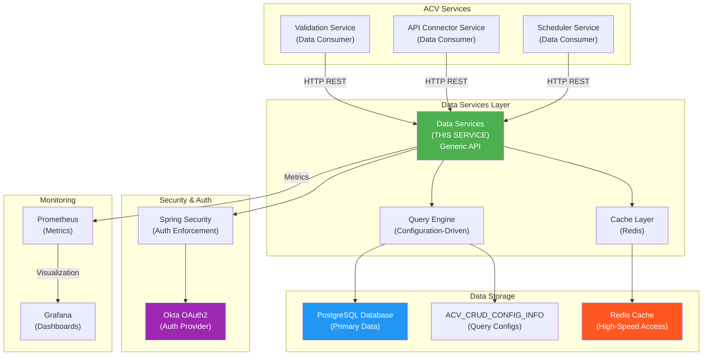
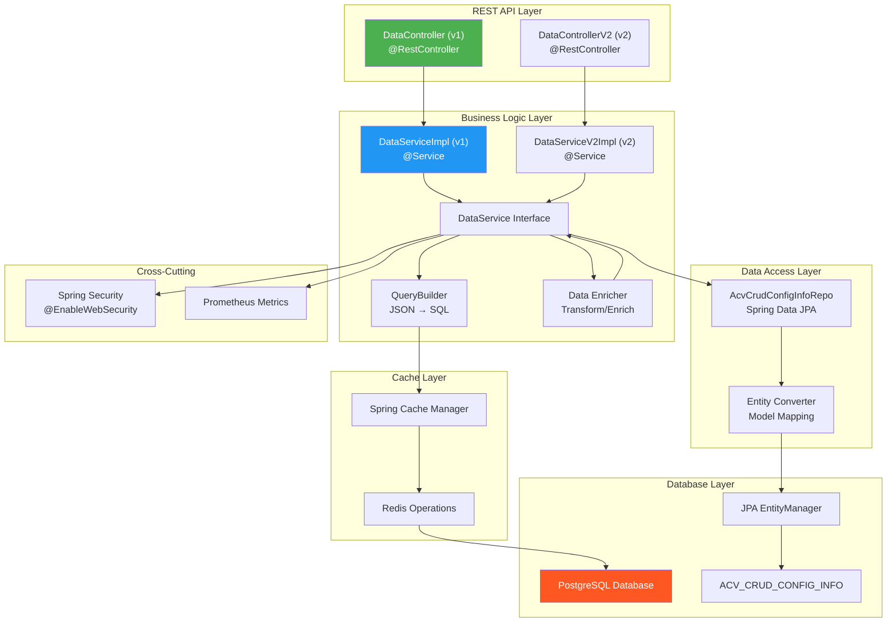
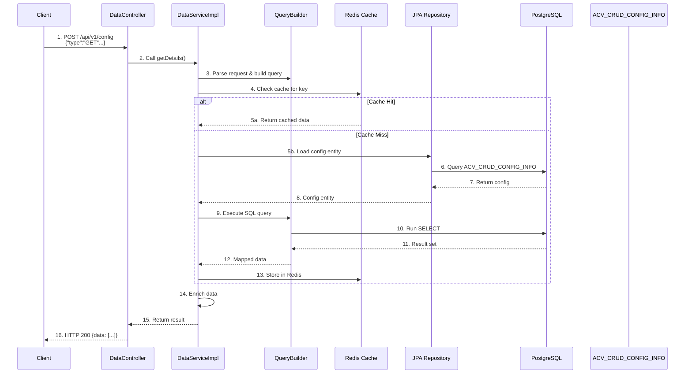
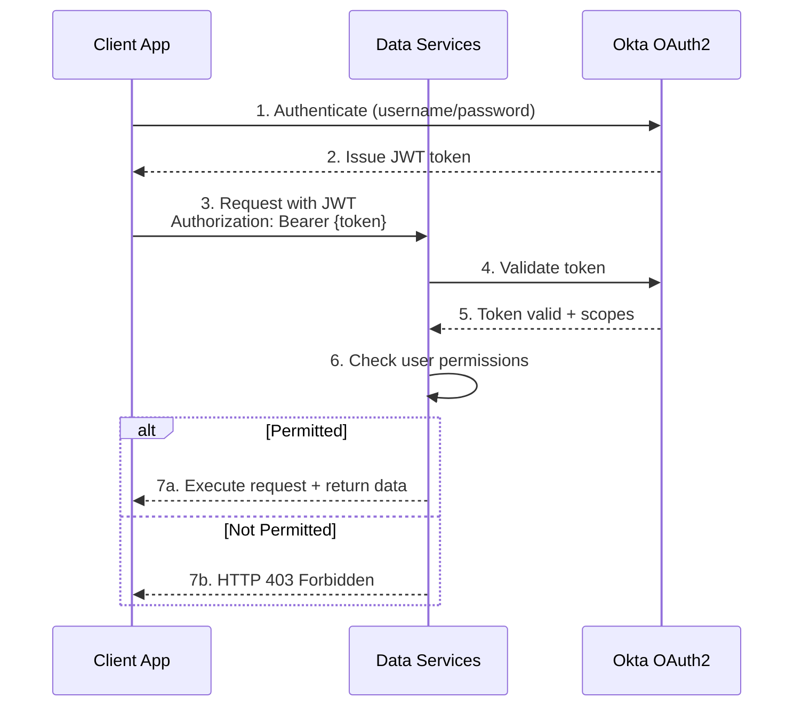

# ACV Data Services - High-Level Design & Architecture

**Purpose:** Document system-level architecture, design patterns, and operational flows.

**Scope:** System context, architecture diagrams, design decisions, integration patterns.

---

## 1. System Context & Purpose

### 1.1 Business Context

The **Data Services** solves the challenge of **generic, scalable data access**:

**Problem:**
- Microservices need database access (validation, connectors, reports)
- Adding new entity types requires code changes and redeployment
- Database queries locked in code; business logic dispersed
- Difficult to scale queries independently
- No central place to manage multi-tenant (country-specific) variants

**Solution:** Data Services provides:

```
BEFORE (Query Logic Scattered):
┌──────────────────────────┐
│ Validation Service       │
│ - Queries hardcoded      │
│ - SQL in code            │
│ - Country logic mixed in │
└──────────────────────────┘

┌──────────────────────────┐
│ API Connector Service    │
│ - Queries hardcoded      │
│ - SQL in code            │
│ - Country logic mixed in │
└──────────────────────────┘

         (Problem: Duplication, no flexibility)

AFTER (Query Logic Centralized):
      ┌─────────────────────────────────────────────┐
      │ Data Services (Generic Data Access)         │
      │ - Configuration-driven queries              │
      │ - Stored in ACV_CRUD_CONFIG_INFO            │
      │ - One endpoint handles all entities         │
      │ - Multi-tenant (country) support built-in   │
      │ - Redis caching for performance             │
      └─────────────────────────────────────────────┘
                      ↓ (Provides data to)
       ┌──────────────┬──────────────┬──────────────┐
       │              │              │              │
   ┌───↓────┐  ┌─────↓─────┐  ┌────↓────┐  ┌─────↓────┐
   │Validat │  │   API     │  │Report   │  │  Other   │
   │Service │  │ Connector │  │ Service  │  │ Services │
   └────────┘  │ Service   │  └──────────┘  └──────────┘
               └───────────┘
```

### 1.2 Stakeholders & Value

| Stakeholder | Value Proposition |
|-------------|-------------------|
| **Developers** | Add new entities without code changes; reuse generic endpoints |
| **Business Analysts** | Configure queries via database; no code expertise needed |
| **DBAs** | Centralize query management; performance tuning in one place |
| **Operations** | Scalable multi-tenant support; geographic differentiation |
| **Platform Team** | Standardized data access layer; consistent patterns |

---

## 2. System Context Diagram (Mermaid C4 Style)



---

## 3. Architecture Diagram (Internal Components)



---

## 4. Request/Response Lifecycle

### 4.1 Generic Data Access Request Flow

```
1. CLIENT REQUEST
   └─ POST /api/v1/config
   └─ Headers: Authorization: Bearer {JWT}
   └─ Body: {"type":"GET", "entity":"config", "filters":{...}}

2. SECURITY VALIDATION
   ├─ Spring Security intercepts request
   ├─ Validates JWT token via Okta
   ├─ Checks user permissions
   └─ Pass to controller if authenticated

3. CONTROLLER HANDLING
   ├─ DataController receives request
   ├─ Parses JSON body
   ├─ Extracts: type (GET/ADD/ALL), entity, filters
   └─ Calls DataService

4. QUERY BUILDING
   ├─ DataService loads AcvCrudConfigInfo
   ├─ Gets SQL configuration for entity + operation
   ├─ Builds parameterized query
   └─ Applies country-code filtering if multi-tenant

5. CACHE CHECK
   ├─ CacheManager checks Redis for key
   ├─ If hit (cached): Return cached data (fast path)
   ├─ If miss (not cached): 
   │  └─ Execute database query

6. DATABASE QUERY EXECUTION
   ├─ JPA EntityManager executes SQL
   ├─ Retrieves result set from PostgreSQL
   ├─ Maps rows to entities
   └─ Stores results in cache (for future requests)

7. DATA ENRICHMENT
   ├─ Enrichers transform/enhance data
   ├─ Apply converters (entity → DTO)
   ├─ Add derived fields
   └─ Prepare response format

8. RESPONSE DELIVERY
   ├─ Convert to JSON
   ├─ Set HTTP 200 OK
   ├─ Return to client
   └─ Client receives results
```

### 4.2 Data Flow Diagram



---

## 5. Core Design Patterns

### 5.1 Generic/Polymorphic Endpoint Pattern

**Pattern:** Single endpoint handles multiple entity types dynamically

**Implementation:**
```
POST /api/v1/{entity}  ← entity = "config", "user", "report", etc.
```

**Benefits:**
- One codebase serves all entities
- New entities supported without code changes
- Consistent interface for all consumers

### 5.2 Configuration-Driven Query Pattern

**Pattern:** SQL stored in database, not hardcoded in code

**Benefits:**
- Business users can update queries (with DBA approval)
- No redeployment for query changes
- Audit trail of query modifications
- A/B testing different query strategies

### 5.3 Cache-Aside Pattern

**Pattern:** Check cache first; load from DB if miss; populate cache

**Flow:**
```
1. Try get from cache
2. If cache miss:
   - Query database
   - Store in cache
   - Return result
3. If cache hit:
   - Return immediately (fast)
```

**TTL-Based Expiration:**
- Configurable per entity
- Automatic cleanup of stale data

### 5.4 Multi-Tenancy Pattern

**Pattern:** Country code differentiates data and queries

**Implementation:**
```
/api/v1/{entity}/{ctryCd}  ← ctryCd = "US", "CA", "MX"
```

**Query Parameterization:**
```sql
SELECT * FROM config WHERE ctry_cd = ? AND id = ?
```

### 5.5 Async/Parallel Processing Pattern

**Pattern:** Use CompletableFuture for concurrent operations

**Benefits:**
- Process multiple requests in parallel
- Better throughput
- Non-blocking I/O

---

## 6. Technology Stack Deep Dive

### 6.1 Spring Web & REST

- **Spring Boot 3.3.1** — Latest Spring Boot version
- **Spring Web** — REST endpoint handling
- **REST Principles** — Stateless, client-server architecture
- **JSON** — Request/response format

### 6.2 Spring Data JPA & Hibernate

- **JPA** — Java Persistence API specification
- **Hibernate** — ORM implementation
- **Entity Manager** — Manages entity lifecycle
- **Named Queries** — Reusable, type-safe queries

### 6.3 Spring Security & Okta

- **Spring Security** — Authentication/authorization framework
- **OAuth2** — Token-based authentication
- **Okta** — Identity provider
- **JWT** — Token format for stateless auth

### 6.4 Redis Caching

- **Spring Cache** — Abstraction over cache implementations
- **Redis** — Distributed cache store
- **Cache Keys** — Entity + filters + country code
- **TTL Eviction** — Automatic cache expiration

### 6.5 Micrometer & Prometheus

- **Micrometer** — Metrics abstraction
- **Prometheus** — Metrics database
- **Grafana** — Metrics visualization
- **Distributed Tracing** — Request correlation across services

---

## 7. Deployment Architecture

### 7.1 Kubernetes Deployment Model

```
┌─────────────────────────────────────────────┐
│         Kubernetes Cluster (AKS)            │
│                                             │
│  ┌──────────────────────────────────────┐  │
│  │   Namespace: data-services           │  │
│  │                                      │  │
│  │  ┌──────────────────────────────┐   │  │
│  │  │  Pod-1 (data-services-*)     │   │  │
│  │  │  Pod-2 (data-services-*)     │   │  │
│  │  │  Pod-3 (data-services-*)     │   │  │
│  │  │  Pod-4 (data-services-*)     │   │  │
│  │  └──────────────────────────────┘   │  │
│  │                                      │  │
│  │  ┌───────────────────────────────┐  │  │
│  │  │  Service (data-services)      │  │  │
│  │  │  - ClusterIP                  │  │  │
│  │  │  - Load balanced              │  │  │
│  │  └───────────────────────────────┘  │  │
│  └──────────────────────────────────────┘  │
│                                             │
│  External Connections:                     │
│  ├─ PostgreSQL (managed service)           │
│  ├─ Redis (cluster/managed)                │
│  └─ Okta (external IdP)                    │
└─────────────────────────────────────────────┘
```

### 7.2 Pod Configuration (Production)

| Aspect | Setting |
|--------|---------|
| **Replicas** | 4 |
| **CPU Request** | 1 core |
| **Memory Request** | 4 Gi |
| **CPU Limit** | 2 cores |
| **Memory Limit** | 8 Gi |
| **Ports** | 8080 (app), 8081 (mgmt) |
| **Monitoring** | Dynatrace injection enabled |
| **Health Check** | Kubernetes probes (liveness, readiness) |

---

## 8. Non-Functional Requirements

| Requirement | Target | Rationale |
|-------------|--------|-----------|
| **Availability** | 99.95% | Critical data path; 4 replicas |
| **Response Latency** | p99 < 200ms | User-perceived performance |
| **Cache Hit Rate** | 80%+ | Reduce database load |
| **Query Throughput** | 1000+ req/s | Handle peak load |
| **Multi-Tenancy** | 50+ countries | Regional support |
| **Data Consistency** | Strong | No stale data acceptable |

---

## 9. Security Architecture

### 9.1 Authentication Flow



### 9.2 Authorization Model

- **Role-Based Access Control (RBAC)** — Users assigned roles
- **Scope-Based** — OAuth2 scopes define permissions
- **Entity-Level** — Can restrict access per entity type
- **Country-Level** — Restrict access to specific countries

---

## 10. Monitoring & Observability

### 10.1 Metrics Collected

```
Application Metrics:
├─ http.server.requests (count, latency)
├─ spring.cache.gets (hits, misses)
├─ jpa.sessions.open
├─ db.connection.pool.size
└─ process.cpu.usage

Cache Metrics:
├─ redis.commands (latency)
├─ redis.connected.clients
└─ redis.memory.used

Database Metrics:
├─ connection.pool.active
├─ connection.pool.idle
└─ sql.execution.time
```

### 10.2 Health Checks

```
/actuator/health
├─ db: Database connection health
├─ redis: Cache availability
├─ oauth2: Auth provider status
└─ disk: Disk space availability
```

---

## 11. Design Decisions & Rationale

| Decision | Choice | Rationale |
|----------|--------|-----------|
| **Endpoint Pattern** | Generic polymorphic | Single endpoint, many entities; flexible |
| **Query Storage** | Database (config table) | No redeployment for query changes |
| **Cache** | Redis | Distributed, supports multi-instance |
| **Auth** | Okta OAuth2 | Enterprise-grade, centralized identity |
| **API Versions** | v1 & v2 | Backward compatibility, gradual migration |
| **Multi-Tenancy** | Country-code param | Support regional/compliance requirements |

---

## Cross-References

- [LLD.md](LLD.md) — Code implementation details
- [services.md](services.md) — REST API contracts
- [Database Service](../acv-database-service/HLD.md) — Data persistence layer

---

**Last Updated:** 2026-04-02  
**Version:** 1.0.0  
**Audience:** Architects, Senior Developers, DevOps Engineers, DBAs, Solutions Architects
