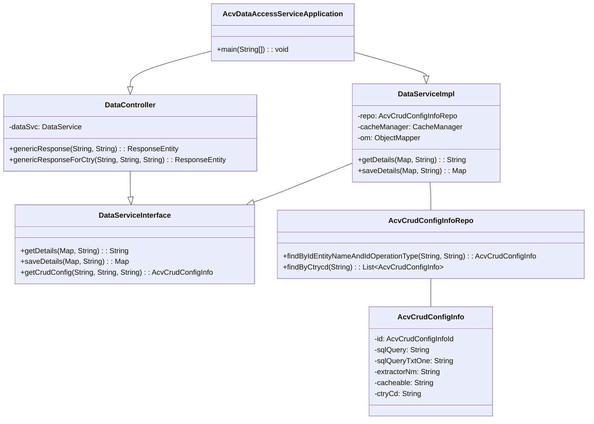

# ACV Data Services - Low-Level Design & Implementation

**Purpose:** Document code structure, implementation details, and component interactions.

**Scope:** Class inventory, method details, configuration properties, and execution flows.

---

## 1. Code Organization & Package Structure

### 1.1 Directory Tree

```
src/main/
├── java/com/fedex/acv/data/
│   ├── AcvDataAccessServiceApplication.java     (Main entry point)
│   │
│   ├── controller/
│   │   ├── DataController.java                   (v1 REST API controller)
│   │   └── DataControllerV2.java                 (v2 REST API controller)
│   │
│   ├── services/
│   │   ├── DataService.java                      (Service interface)
│   │   ├── DataServiceV2.java                    (v2 Service interface)
│   │   └── impl/
│   │       ├── DataServiceImpl.java               (v1 Implementation)
│   │       └── DataServiceV2Impl.java            (v2 Implementation)
│   │
│   ├── repository/
│   │   └── AcvCrudConfigInfoRepo.java            (JPA repository)
│   │
│   ├── entity/
│   │   ├── AcvCrudConfigInfo.java                (JPA entity - config storage)
│   │   └── AcvCrudConfigInfoId.java              (Composite primary key)
│   │
│   ├── dao/                                      (Data Access Objects)
│   ├── converters/                               (Entity ↔ DTO converters)
│   ├── enrichers/                                (Data transformations)
│   ├── exception/                                (Custom exceptions)
│   ├── constant/                                 (Application constants)
│   └── utils/                                    (Utility classes)
│
└── resources/
    ├── application-local.yml                     (Local development config)
    ├── logback-spring.xml                        (Logging configuration)
    └── banner.txt                                (Spring Boot banner)
```

### 1.2 Package Responsibility Map

| Package | Responsibility |
|---------|-----------------|
| `com.fedex.acv.data` | Application entry point and initialization |
| `com.fedex.acv.data.controller` | REST API endpoints (v1, v2) |
| `com.fedex.acv.data.services` | Business logic and orchestration |
| `com.fedex.acv.data.services.impl` | Service implementations |
| `com.fedex.acv.data.repository` | JPA data access |
| `com.fedex.acv.data.entity` | JPA entities (domain models) |
| `com.fedex.acv.data.dao` | Low-level data access |
| `com.fedex.acv.data.converters` | Entity transformation |
| `com.fedex.acv.data.enrichers` | Data enrichment/transformation |
| `com.fedex.acv.data.exception` | Custom exception definitions |
| `com.fedex.acv.data.constant` | Constants and enumerations |
| `com.fedex.acv.data.utils` | Utility functions (JSON, parsing) |

---

## 2. Core Classes & Implementation Details

### 2.1 AcvDataAccessServiceApplication.java

**File Path:** `src/main/java/com/fedex/acv/data/AcvDataAccessServiceApplication.java`

**Purpose:** Spring Boot application entry point

**Code:**
```java
@OpenAPIDefinition(
    info = @Info(
        title = "ACV Data Service",
        version = "1.0"
    )
)
@SpringBootApplication
@EnableCaching
@EnableRedisRepositories
@EnableConfigurationProperties(AuthConfig.class)
@ComponentScan(basePackages = {"com.fedex.acv.data.*", "com.fedex.acv.commons.*"})
public class AcvDataAccessServiceApplication {

    public static void main(String[] args) {
        SpringApplication.run(AcvDataAccessServiceApplication.class, args);
    }
}
```

**Key Annotations:**
- `@SpringBootApplication` — Enable Spring Boot auto-configuration
- `@EnableCaching` — Enable Spring Cache manager (Redis backend)
- `@EnableRedisRepositories` — Enable Spring Data Redis repositories
- `@OpenAPIDefinition` — Swagger/OpenAPI documentation
- `@ComponentScan` — Scan for components in data and commons packages

**Startup Responsibilities:**
```
1. Load application-{profile}.yml configuration
2. Initialize Spring context
3. Scan @Configuration, @Service, @Repository, @Controller
4. Initialize beans:
   - DataSource (PostgreSQL)
   - CacheManager (Redis)
   - SecurityFilterChain (Okta OAuth2)
5. Start Tomcat server (port 8080)
6. Ready for HTTP requests
```

---

### 2.2 DataController.java (v1 API)

**File Path:** `src/main/java/com/fedex/acv/data/controller/DataController.java`

**Purpose:** REST API endpoint handler for v1 endpoints

**Key Methods:**

#### genericResponse(String entity, String requestBody)
```java
@PostMapping(value = "/{entity}", produces = MediaType.APPLICATION_JSON_VALUE)
public ResponseEntity<?> genericResponse(@PathVariable("entity") String entity, 
                                         @RequestBody String requestBody)
    throws AcvDataException, ParseException
```

**Responsibilities:**
1. Receive HTTP POST request to `/api/v1/{entity}`
2. Parse JSON request body
3. Extract operation type (ADD, GET, ALL)
4. Route to appropriate DataService method
5. Return JSON response

**Request Format:**
```json
{
  "type": "ADD",              // Operation: ADD, GET, or ALL
  "entity": "config",         // Entity type
  "data": { ... },            // Payload for ADD
  "filters": { ... }          // Query filters for GET
}
```

**Response Format:**
```json
{
  "status": "success",
  "data": [ ... ],            // Result data
  "count": 42
}
```

**Operation Routing:**
```
type = "ADD"  → dataSvc.saveDetails()
type = "GET"  → dataSvc.getDetails()
type = "ALL"  → dataSvc.getService()
default       → throw AcvDataException
```

#### genericResponseForCtry(String entity, String ctryCd, String requestBody)
```java
@PostMapping(value = "/{entity}/{ctryCd}", produces = MediaType.APPLICATION_JSON_VALUE)
public ResponseEntity<?> genericResponseForCtry(@PathVariable("entity") String entity,
                                                @PathVariable("ctryCd") String ctryCd,
                                                @RequestBody String requestBody)
```

**Purpose:** Country-specific variant of genericResponse

**Behavior:**
- Same as genericResponse, but:
  - Adds country code (ctryCd) to all queries
  - Filters data by country
  - Cache keys include country code
  - Multi-tenant isolation enforced

---

### 2.3 DataService.java (Interface)

**File Path:** `src/main/java/com/fedex/acv/data/services/DataService.java`

**Purpose:** Service interface defining data access contract

**Key Methods:**

```java
public interface DataService {

    // GET single entity
    String getDetails(Map<String, Object> sqlMapper, String entity) 
        throws AcvDataException;

    // GET single entity for specific country
    String getDetails(Map<String, Object> sqlMapper, String entity, String ctryCd)
        throws AcvDataException;

    // GET with transformation
    Object getTransformedDetails(String parameters, String entity) 
        throws AcvDataException;

    // SAVE/INSERT entity
    Map<String, Object> saveDetails(Map<String, Object> sqlMapper, String entity)
        throws AcvDataException;

    // Get CRUD configuration for entity
    AcvCrudConfigInfo getCrudConfig(String entity, String type, String endPoint);

    // Generic find with custom mapper
    <T> T findOne(Map<String, Object> qryParams, String entity, String mapperBeanName) 
        throws AcvDataException;

    // GET all entities
    String getDetails(Map<String, Object> request) 
        throws AcvDataException;
}
```

**Implementation:** DataServiceImpl

---

### 2.4 DataServiceImpl.java (v1 Implementation)

**File Path:** `src/main/java/com/fedex/acv/data/services/impl/DataServiceImpl.java`

**Purpose:** Implements DataService interface with actual business logic

**Key Implementation Details:**

#### Caching Strategy
```java
@Cacheable(value = "configCache", key = "#entity + '-' + #sqlMapper.get('id')")
public String getDetails(Map<String, Object> sqlMapper, String entity) {
    // 1. Try get from cache
    // 2. If miss: Query database
    // 3. Store in Redis cache
    // 4. Return result
}
```

**Cache Configuration:**
```properties
spring.cache.type=redis
spring.cache.redis.time-to-live=600000  # 10 minutes TTL
```

#### Query Execution
```java
public String getDetails(Map<String, Object> sqlMapper, String entity) {
    // 1. Load AcvCrudConfigInfo (via repository)
    AcvCrudConfigInfo config = getCrudConfig(entity, "GET", null);
    
    // 2. Extract SQL from config
    String sqlQuery = config.getSqlQuery();
    
    // 3. Build parameterized query
    String finalQuery = buildQuery(sqlQuery, sqlMapper);
    
    // 4. Execute via JPA
    List<Object[]> results = entityManager.createNativeQuery(finalQuery).getResultList();
    
    // 5. Convert results to JSON
    return convertToJson(results);
}
```

#### Data Saving
```java
public Map<String, Object> saveDetails(Map<String, Object> sqlMapper, String entity) {
    // 1. Load entity configuration
    AcvCrudConfigInfo config = getCrudConfig(entity, "ADD", null);
    
    // 2. Create JPA entity from request
    Object entity = createEntity(sqlMapper);
    
    // 3. Persist to database
    entityManager.persist(entity);
    entityManager.flush();
    
    // 4. Invalidate cache
    cacheManager.getCache("configCache").clear();
    
    // 5. Return saved entity with ID
    return convertToMap(entity);
}
```

---

### 2.5 AcvCrudConfigInfo.java (Entity)

**File Path:** `src/main/java/com/fedex/acv/data/entity/AcvCrudConfigInfo.java`

**Purpose:** JPA entity storing SQL configurations per entity and operation

**Key Fields:**
```java
@Entity
@Table(name = "ACV_CRUD_CONFIG_INFO")
public class AcvCrudConfigInfo implements Serializable {

    @EmbeddedId
    private AcvCrudConfigInfoId id;              // Composite key: entity + type

    @Column(name = "SQL_CNFG_TXT")
    private String sqlQuery;                     // Primary SQL

    @Column(name = "SQL_CNFG_TXT_1" to "_6")
    private String sqlQueryTxtOne/Two/Three...;  // Alternative queries (6 variants)

    @Column(name = "JSON_VLDT_TXT")
    private String extractorNm;                  // Data mapper/transformer name

    @Column(name = "IS_CACHEABLE")
    private String cacheable;                    // Cache Y/N flag

    @Column(name = "CTRY_CD")
    private String ctryCd;                       // Country code (multi-tenant)
}
```

**Composite Key:**
```java
@Embeddable
public class AcvCrudConfigInfoId implements Serializable {
    @Column(name = "ENTITY_NM")
    private String entityName;      // e.g., "config", "user"
    
    @Column(name = "OPRN_TYP_CD")
    private String operationType;   // e.g., "GET", "ADD", "ALL"
}
```

**Purpose of Multiple SQL Variants:**
- `sqlQuery` — Primary/default query
- `sqlQueryTxtOne` through `sqlQueryTxtSix` — Alternative queries
- Allows A/B testing, query optimization, or conditional execution

---

### 2.6 AcvCrudConfigInfoRepo.java (Repository)

**File Path:** `src/main/java/com/fedex/acv/data/repository/AcvCrudConfigInfoRepo.java`

**Purpose:** Spring Data JPA repository for config entity

```java
public interface AcvCrudConfigInfoRepo 
    extends JpaRepository<AcvCrudConfigInfo, AcvCrudConfigInfoId> {

    // Find by entity name and operation type
    AcvCrudConfigInfo findByIdEntityNameAndIdOperationType(
        String entityName, 
        String operationType);

    // Find all by country code
    List<AcvCrudConfigInfo> findByCtrycd(String ctryCd);

    // Custom query
    @Query("SELECT a FROM AcvCrudConfigInfo a WHERE a.cacheable = 'Y'")
    List<AcvCrudConfigInfo> findAllCacheable();
}
```

---

## 3. Configuration Properties Reference

### 3.1 application-local.yml (Development)

```yaml
spring:
  application:
    name: eai-3540813-data-services
    
  # Disable Spring Cloud Config for local dev
  cloud:
    config:
      enabled: false
      
  # PostgreSQL (local instance)
  datasource:
    url: jdbc:postgresql://localhost:5432/acvdb
    username: postgres
    password: password
    driver-class-name: org.postgresql.Driver
    hikari:
      maximum-pool-size: 10
      minimum-idle: 2
      
  # Redis (local instance)
  redis:
    host: localhost
    port: 6379
    password: null
    
  # Spring Data JPA
  jpa:
    database-platform: org.hibernate.dialect.PostgreSQLDialect
    hibernate:
      ddl-auto: validate
    show-sql: false
    
  # Spring Cache (Redis backend)
  cache:
    type: redis
    redis:
      time-to-live: 600000  # 10 minutes
      
  # Security (Okta OAuth2) - disabled for local testing
  security:
    oauth2:
      resourceserver:
        jwt:
          enabled: false
          
# Logging
logging:
  level:
    root: INFO
    com.fedex.acv.data: DEBUG
    org.springframework.security: DEBUG
    
# Server
server:
  port: 8080
  servlet:
    context-path: /
    
# Actuator (monitoring)
management:
  endpoints:
    web:
      exposure:
        include: health,metrics,prometheus,info
  server:
    port: 8081
```

### 3.2 Production Configuration (Spring Cloud Config)

Configuration loaded from remote config server:

```yaml
spring:
  cloud:
    config:
      enabled: true
      name: eai-3540813-data-services
      import: configserver:https://config-server.prod/acv/config
      
  datasource:
    url: jdbc:postgresql://${POSTGRES_HOST}:${POSTGRES_PORT}/${POSTGRES_DB_NAME}
    username: ${POSTGRES_USER}
    password: ${POSTGRES_DB_PASSWORD}
    hikari:
      maximum-pool-size: 30    # Higher pool size for prod
      connection-timeout: 30000
      
  redis:
    host: ${REDIS_HOST}
    port: ${REDIS_PORT}
    password: ${REDIS_PASSWORD}
    
  cache:
    redis:
      time-to-live: 300000     # 5 minute TTL
  
  security:
    oauth2:
      resourceserver:
        jwt:
          enabled: true
          issuer-uri: https://okta.fedex.com/oauth2/v1
          
server:
  port: 8080
  compression:
    enabled: true
    
management:
  server:
    port: 8081
```

---

## 4. Request Processing Workflow

```
1. HTTP REQUEST
   └─ POST /api/v1/config
   └─ Body: {"type":"GET", "entity":"config", "filters":{"id":1}}

2. SECURITY FILTER
   └─ Spring Security intercepts
   └─ Validates Okta JWT

3. CONTROLLER DISPATCH
   └─ DataController routes to getDetails()

4. SERVICE LAYER
   ├─ Check @Cacheable decorator
   ├─ If cached: Return (fast path ✓)
   └─ If not cached:
      ├─ Load AcvCrudConfigInfo from repo
      ├─ Extract SQL query
      ├─ Build final SQL with parameters
      ├─ Execute via EntityManager
      ├─ Cache result
      └─ Return

5. RESPONSE FORMATTING
   ├─ Convert to JSON
   ├─ Enrich data (if needed)
   └─ Return HTTP 200

6. CLIENT RECEIVES
   └─ JSON response with data
```

---

## 5. Class Diagram



---

## 6. Async Processing with CompletableFuture

```java
public class DataController {
    
    @PostMapping("/{entity}/batch")
    public CompletableFuture<ResponseEntity<?>> batchProcess(
        @PathVariable String entity,
        @RequestBody List<Map<String, Object>> requests) {
        
        // Process multiple requests in parallel
        return CompletableFuture.supplyAsync(() -> {
            List<CompletableFuture<Map<String, Object>>> futures = 
                requests.stream()
                    .map(req -> CompletableFuture.supplyAsync(
                        () -> dataSvc.saveDetails(req, entity)))
                    .collect(Collectors.toList());
                    
            // Wait for all to complete
            CompletableFuture.allOf(futures.toArray(new CompletableFuture[0]))
                .join();
                
            // Collect results
            List<Map<String, Object>> results = 
                futures.stream()
                    .map(CompletableFuture::join)
                    .collect(Collectors.toList());
                    
            return new ResponseEntity<>(results, HttpStatus.OK);
        });
    }
}
```

---

## 7. Exception Handling

```java
public class AcvDataException extends Exception {
    private String errorCode;
    private String errorMessage;
    
    public AcvDataException(String errorCode, String message, Throwable cause) {
        super(message, cause);
        this.errorCode = errorCode;
        this.errorMessage = message;
    }
}

@RestControllerAdvice
public class GlobalExceptionHandler {
    
    @ExceptionHandler(AcvDataException.class)
    public ResponseEntity<?> handleDataException(AcvDataException ex) {
        HttpStatus status = ex.getErrorCode().startsWith("4") 
            ? HttpStatus.BAD_REQUEST 
            : HttpStatus.INTERNAL_SERVER_ERROR;
        
        return ResponseEntity.status(status).body(new ErrorResponse(
            ex.getErrorCode(),
            ex.getMessage(),
            LocalDateTime.now()
        ));
    }
}
```

---

## Cross-References

- [README.md](README.md) — Project overview
- [HLD.md](HLD.md) — Architecture & design patterns
- [services.md](services.md) — API endpoint specifications
- [code-mapping.md](code-mapping.md) — File navigation

---

**Last Updated:** 2026-04-02  
**Version:** 1.0.0  
**Audience:** Developers, Code Reviewers, Technical Leads, Senior Architects
