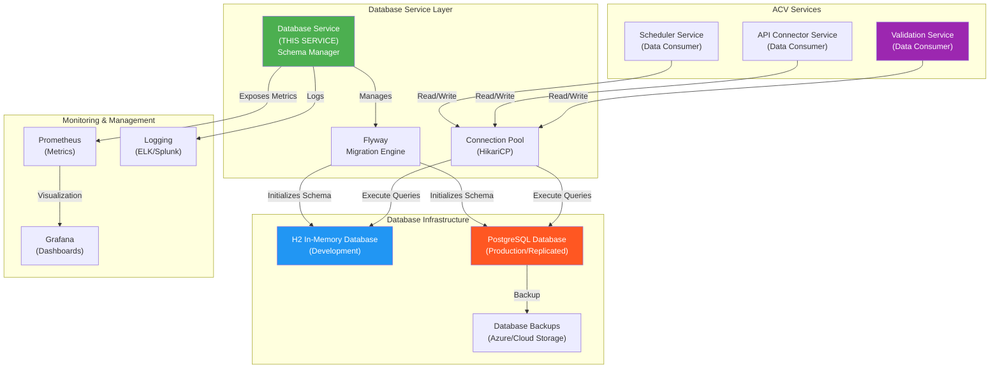
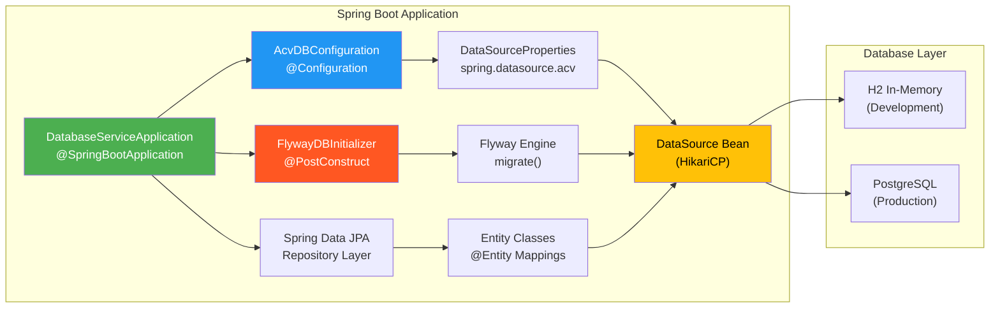
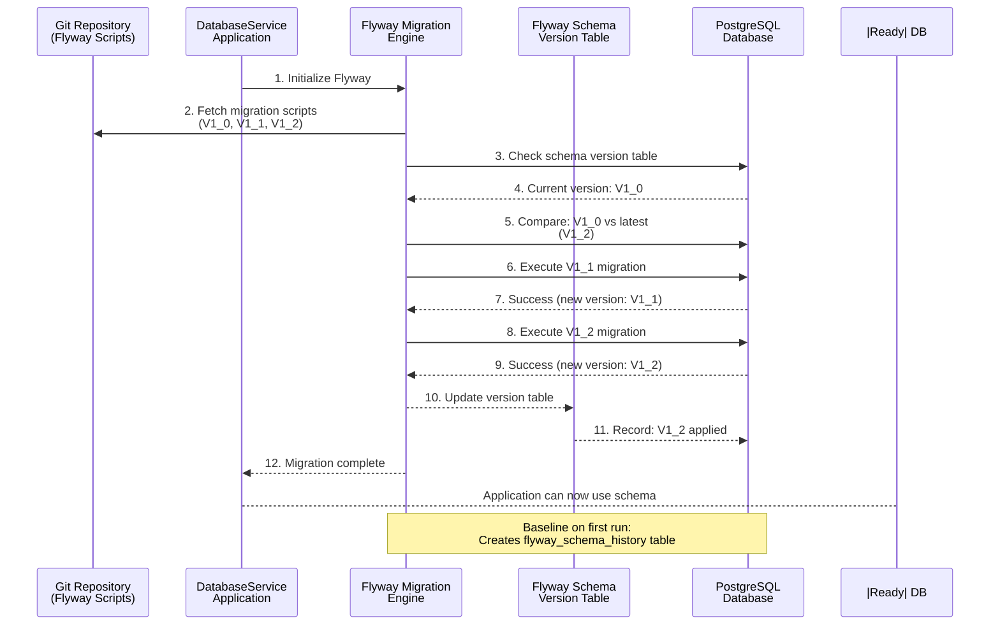

# ACV Database Service - High-Level Design & Architecture

**Purpose:** Document system-level architecture, design patterns, and operational flows.

**Scope:** System context, architecture diagrams, design decisions, integration patterns.

---

## 1. System Context & Purpose

### 1.1 Business Context

The **Database Service** solves the challenge of **centralized database lifecycle management**:

**Problem:**
- Multiple ACV microservices need database access (validation, API connector, scheduler)
- Database schema evolves; must manage migrations without downtime
- Different environments (local/dev/test/prod) need different databases
- Manual database management error-prone and hard to version

**Solution:** Database Service provides:

```
BEFORE (Schema Scattered):
┌──────────────────────┐
│ Validation Service   │
│ - Tables created     │ (Manually by DBA)
│ - Migrations manual  │
│ - No version control │
└──────────────────────┘

┌──────────────────────┐
│ API Connector Service│
│ - Tables created     │ (Manually by DBA)
│ - Migrations manual  │
│ - Schema conflicts   │
└──────────────────────┘

         (Problem: No coordination, manual error-prone)

AFTER (Schema Centralized):
      ┌─────────────────────────────────────────────┐
      │ Database Service                            │
      │ - Flyway migrations (V1_0, V1_1, etc.)   │
      │ - Versioned schema changes                 │
      │ - Auto-applied on startup                  │
      │ - Full version history in Git              │
      └─────────────────────────────────────────────┘
                      ↓ (Provides schema to)
       ┌──────────────┬──────────────┬──────────────┐
       │              │              │              │
   ┌───↓────┐  ┌─────↓─────┐  ┌────↓────┐  ┌─────↓────┐
   │Validat │  │   API     │  │Scheduler│  │  Other   │
   │Service │  │ Connector │  │ Service  │  │ Services │
   └────────┘  │ Service   │  └──────────┘  └──────────┘
               └───────────┘
```

### 1.2 Stakeholders & Value

| Stakeholder | Value Proposition |
|-------------|-------------------|
| **Developers** | Automatic schema migration; no manual DB setup |
| **DevOps/DBAs** | Version-controlled schema; audit trail; easy rollback |
| **Operations** | Zero-downtime deployment with schema updates |
| **Platform Team** | Consistent database patterns across all services |

---

## 2. System Context Diagram (Mermaid C4 Style)



---

## 3. Architecture Diagram (Internal Components)



---

## 4. Database Migration Flow Diagram



---

## 5. Request/Response Lifecycle

### 5.1 Database Connection Lifecycle

```
1. APPLICATION STARTUP
   ├─ Spring Boot loads application-local.properties
   ├─ Reads spring.datasource.acv.* properties
   └─ Creates AcvDBConfiguration @Bean

2. DATA SOURCE CONFIGURATION
   ├─ AcvDBConfiguration.acvDataSourceProperties()
   │  └─ Binds "spring.datasource.acv.*" to DataSourceProperties
   │
   ├─ AcvDBConfiguration.acvConfigDataSource()
   │  ├─ Calls initializeDataSourceBuilder()
   │  └─ Returns DataSource bean (HikariCP pool)
   │
   └─ HikariCP initializes:
      ├─ Creates connection pool
      ├─ Establishes initial connections (minimumIdle = N)
      └─ Validates connections to database

3. FLYWAY MIGRATION
   ├─ FlywayDBInitializer @PostConstruct
   ├─ Reads spring.datasource.acv.flyway.scripts location
   ├─ Finds migration files (V1_0__*.sql, V1_1__*.sql)
   ├─ Connects to database
   └─ Executes migrations in order:
      ├─ V1_0__ACV_CONFIG_CREATE_TABLE.sql
      ├─ V1_1__Add_new_column.sql (if not yet applied)
      └─ Creates flyway_schema_history table (tracks versions)

4. SPRING DATA JPA
   ├─ Scans for @Entity classes
   ├─ Registers repositories
   └─ Ready for data access operations

5. SERVICE READY
   ├─ DataSource ready for JDBC operations
   ├─ JPA repositories ready for entity operations
   ├─ Connection pool warmed with idle connections
   └─ Application accepts requests
```

### 5.2 CRUD Operation Flow

```
Client Request
    ↓
REST Controller (if exposed)
    ↓
Spring Data JPA Repository
    ↓
(Builds SQL or uses HQL/JPQL)
    ↓
Hibernate (ORM)
    ↓
JdbcTemplate / JDBC
    ↓
HikariCP Connection Pool
    ├─ Reuse idle connection OR
    ├─ Create new connection (if available)
    ├─ Wait if pool exhausted (timeout)
    └─ Return connection to requestor
    ↓
PostgreSQL Database
    ├─ Execute SQL query
    ├─ Return result set
    └─ Connection returned to pool
    ↓
ResultSet → Entity Mapping (Hibernate)
    ↓
JSON Response to Client
```

---

## 6. Core Design Patterns

### 6.1 Multi-Datasource Pattern

**Pattern:** Multiple data sources for different databases (H2 dev, PostgreSQL prod)

**Implementation:**
```java
@Bean(name="acvDataSourceProperties")
@ConfigurationProperties("spring.datasource.acv")
public DataSourceProperties acvDataSourceProperties() {
    return new DataSourceProperties();
}

// spring.datasource.acv.url = jdbc:h2:mem:acv-db (dev)
//                            = jdbc:postgresql://... (prod)
```

**Benefits:**
- Same code runs with different databases
- Environment switching via properties only
- No code changes needed for local→dev→prod

### 6.2 Flyway Database Versioning Pattern

**Pattern:** SQL scripts versioned (V1_0, V1_1, V1_2) and auto-executed

**Benefits:**
- Schema changes tracked in Git
- Automatic migration on deployment
- Rollback via version control
- Audit trail of all schema changes

**Naming Convention:**
```
V{version}__{description}.sql

V1_0__ACV_CONFIG_CREATE_TABLE.sql  (First migration)
V1_1__Add_user_roles_table.sql     (Second migration)
V1_2__Add_index_on_id.sql          (Third migration)

Flyway processes in order:V1_0 → V1_1 → V1_2
```

### 6.3 Connection Pool Pattern

**Pattern:** HikariCP maintains pool of database connections for reuse

**Benefits:**
- Avoid TCP connection overhead per query
- Configurable pool sizing
- Automatic connection validation/cleanup
- Better throughput and resource utilization

### 6.4 Environment-Specific Scripts Location Pattern

**Pattern:** Flyway scripts organized by environment in Git

**Organization:**
```
acv-configuration/
├── local/
│   └── V1_0__*.sql  (Local H2 migrations)
├── dev/
│   └── V1_0__*.sql  (Dev PostgreSQL migrations)
├── test/
│   └── V1_0__*.sql  (Test PostgreSQL migrations)
└── prod/
    └── V1_0__*.sql  (Production PostgreSQL migrations)
```

**Configured per environment:**
```properties
# local
spring.datasource.acv.flyway.scripts=acv-configuration/local

# prod
spring.datasource.acv.flyway.scripts=acv-configuration/prod
```

---

## 7. Key Technologies

### 7.1 Spring Data JPA

**What it is:**
- ORM framework providing data access abstraction
- Maps Java entities to database tables
- Provides automatic CRUD repositories

**Use in ACV:**
- Entity definitions for domain models
- Repository interfaces for data access
- Automatic transaction management

### 7.2 Flyway

**What it is:**
- Database migration tool with versioned SQL scripts
- Auto-applies migrations on application startup
- Maintains schema version history

**Features:**
- Version-based migration naming (V1_0, V1_1)
- Baseline support for manual schema
- Validation of migration integrity
- Rollback support (Undo migrations)

### 7.3 HikariCP Connection Pool

**What it is:**
- High-performance JDBC connection pool
- Manages pool of database connections
- Default pool in Spring Boot 2.0+

**Configuration:**
```properties
spring.datasource.acv.hikari.maximum-pool-size=20     # Max connections
spring.datasource.acv.hikari.minimum-idle=5           # Min idle ready
spring.datasource.acv.hikari.connection-timeout=30000 # Wait 30s for connection
spring.datasource.acv.hikari.idle-timeout=600000     # Recycle after 10min idle
```

---

## 8. Deployment Architecture

### 8.1 Kubernetes Deployment Model

```
┌─────────────────────────────────────────────┐
│         Kubernetes Cluster (AKS)            │
│                                             │
│  ┌──────────────────────────────────────┐  │
│  │   Namespace: database-service        │  │
│  │                                      │  │
│  │  ┌──────────────────────────────┐   │  │
│  │  │  Pod (database-service-*)    │   │  │
│  │  │                              │   │  │
│  │  │  ┌────────────────────────┐  │   │  │
│  │  │  │ Container              │  │   │  │
│  │  │  │ - Spring Boot App       │  │   │  │
│  │  │  │ - Port 8080 (app)      │  │   │  │
│  │  │  │ - Port 8081 (mgmt)     │  │   │  │
│  │  │  │ - Flyway initialized   │  │   │  │
│  │  │  │ - CPU: 0.5-1           │  │   │  │
│  │  │  │ - Memory: 512Mi-1Gi    │  │   │  │
│  │  │  └────────────────────────┘  │   │  │
│  │  │                              │   │  │
│  │  │  Liveness Probe: :8081/health   │  │
│  │  │  Readiness Probe: :8081/health  │  │
│  │  └──────────────────────────────┘  │  │
│  │                                      │  │
│  │  ┌───────────────────────────────┐  │  │
│  │  │  Service (database-service)   │  │  │
│  │  │  - ClusterIP                  │  │  │
│  │  │  - Port 8080 → Container      │  │  │
│  │  └───────────────────────────────┘  │  │
│  └──────────────────────────────────────┘  │
│                                             │
│  External Database Connection:              │
│  ├─ PostgreSQL (managed service)            │
│  ├─ Connection string from secrets          │
│  └─ HikariCP pool connects                  │
└─────────────────────────────────────────────┘
```

### 8.2 Helm Chart Deployment

| Aspect | Development | Production |
|--------|-------------|------------|
| **Replicas** | 1 | 1 |
| **CPU Request** | 0.25 | 0.5 |
| **Memory Request** | 256Mi | 512Mi |
| **CPU Limit** | 0.5 | 1 |
| **Memory Limit** | 512Mi | 1Gi |
| **Database** | H2 or test PostgreSQL | Production PostgreSQL |
| **Flyway Enabled** | true/false | true |
| **Monitoring** | Manual | Prometheus + Dynatrace |

---

## 9. Non-Functional Requirements

| Requirement | Target | Rationale |
|-------------|--------|-----------|
| **Availability** | 99.99% | Database critical path; SLA high |
| **Migration Time** | <5 minutes | Startup shouldn't be slow |
| **Connection Latency** | <1ms | Pool reuse; minimal overhead |
| **Pool Utilization** | 80% | Efficient resource usage |
| **Query Latency (p99)** | <100ms | Application responsiveness |
| **Schema Consistency** | 100% | All migrations tracked, versioned |

---

## 10. Security Architecture

### 10.1 Database Credentials Management

```
Development (Local):
  Username: sa (default H2)
  Password: password (default H2)
  No authentication needed

Production:
  Username: ${POSTGRES_USER} (from Kubernetes secret)
  Password: ${POSTGRES_PASS} (from Kubernetes secret)
  SSL/TLS required
```

### 10.2 Connection Security

```
Local Development:
  URL: jdbc:h2:mem:acv-db    (in-memory, no network)
  No encryption needed

Production:
  URL: jdbc:postgresql://host:5432/db
  - SSL/TLS: Encrypted in transit
  - Credentials: From Kubernetes secrets
  - Network: Private VPC connection only
```

---

## 11. Monitoring & Observability

### 11.1 Health Checks

```
/actuator/health              (Overall health)
├─ Database connection pool health
├─ Disk space availability
└─ JVM memory status

/actuator/health/liveness     (Process alive)
/actuator/health/readiness    (Ready for traffic)
```

### 11.2 Metrics Collected

```
Database Metrics:
├─ hikaricp.connections.active
├─ hikaricp.connections.idle
├─ hikaricp.connections.pending
└─ hikaricp.connections.creation.seconds

Application Metrics:
├─ http.server.requests
├─ jvm.memory.used
├─ process.cpu.usage
└─ spring.data.jpa.operations
```

---

## 12. Design Decisions & Rationale

| Decision | Choice | Rationale |
|----------|--------|-----------|
| **ORM Choice** | Spring Data JPA | Native Spring integration; entity mapping |
| **Migration Tool** | Flyway | Easy versioning; auto-execution on startup |
| **Dev Database** | H2 | Lightweight, no external setup; perfect for local |
| **Prod Database** | PostgreSQL | Proven, scalable, managed-service available (Azure) |
| **Connection Pool** | HikariCP | Default in Spring; high performance; configurable |
| **Config Separation** | Env-specific properties | Profiles allow same code, different configs |

---

## Cross-References

- [LLD.md](LLD.md) — Code implementation
- [services.md](services.md) — API contracts
- [Configuration Repository](../acv-config-repo/HLD.md) — Configuration management

---

**Last Updated:** 2026-04-02  
**Version:** 1.0.0  
**Audience:** Architects, Senior Developers, DevOps Engineers, DBAs
