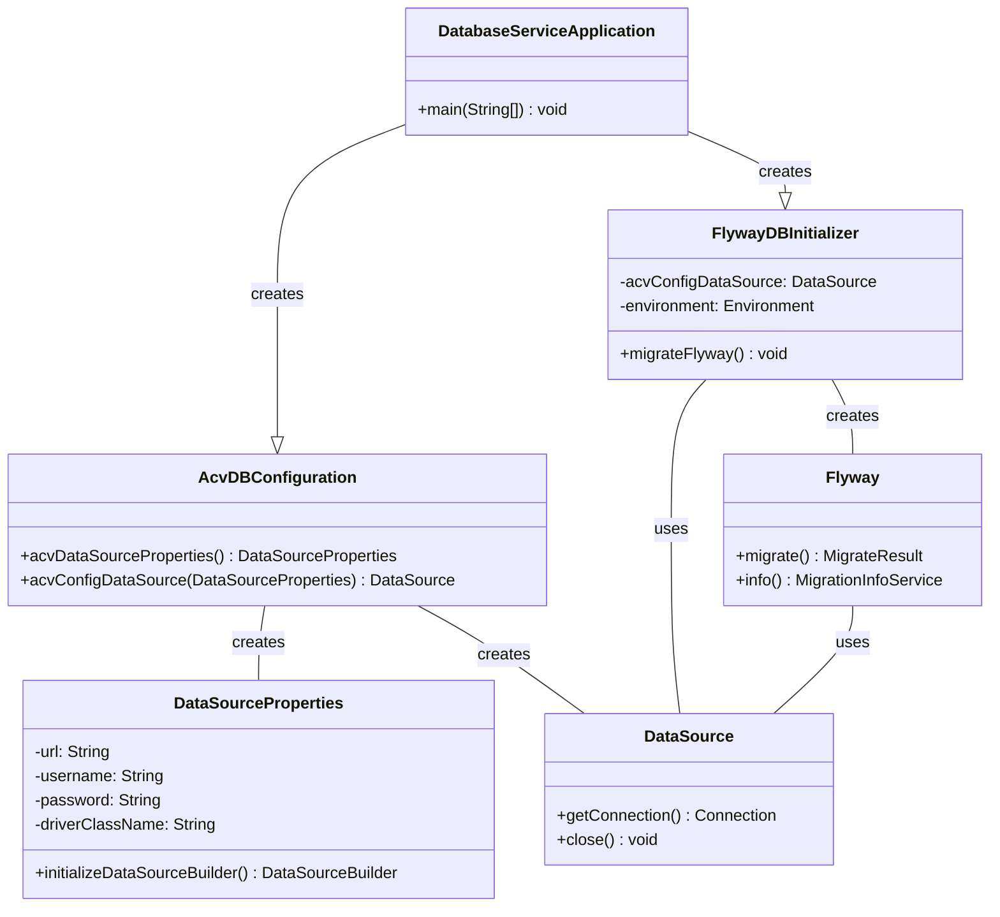
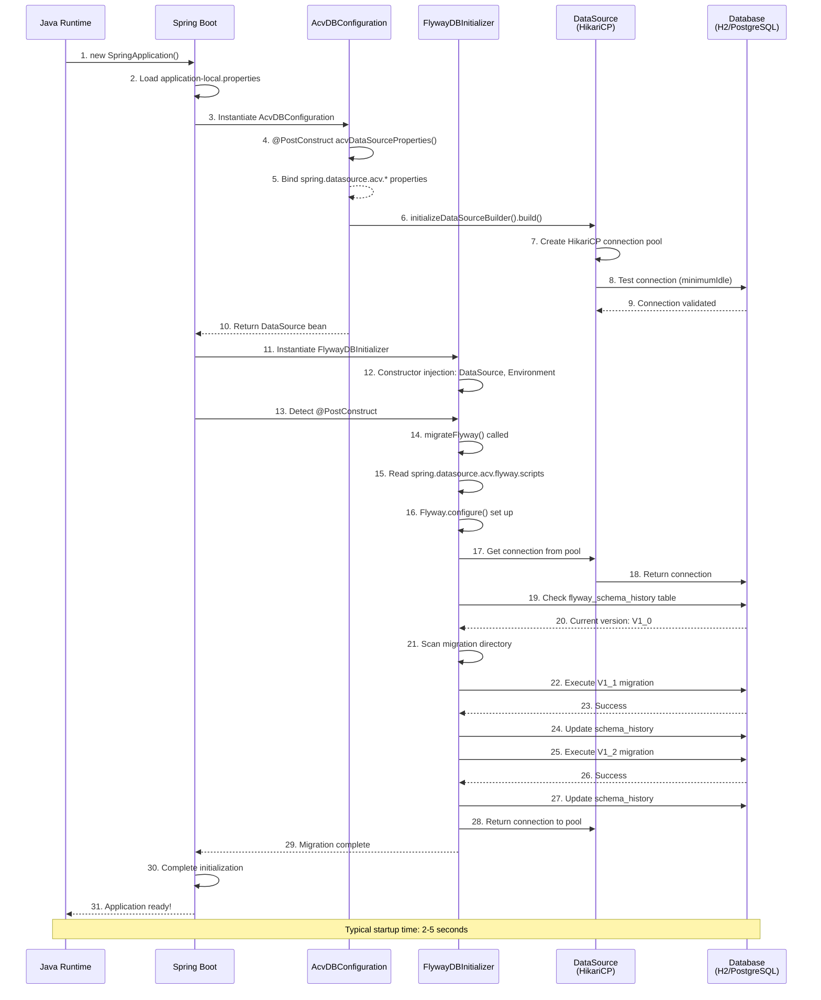
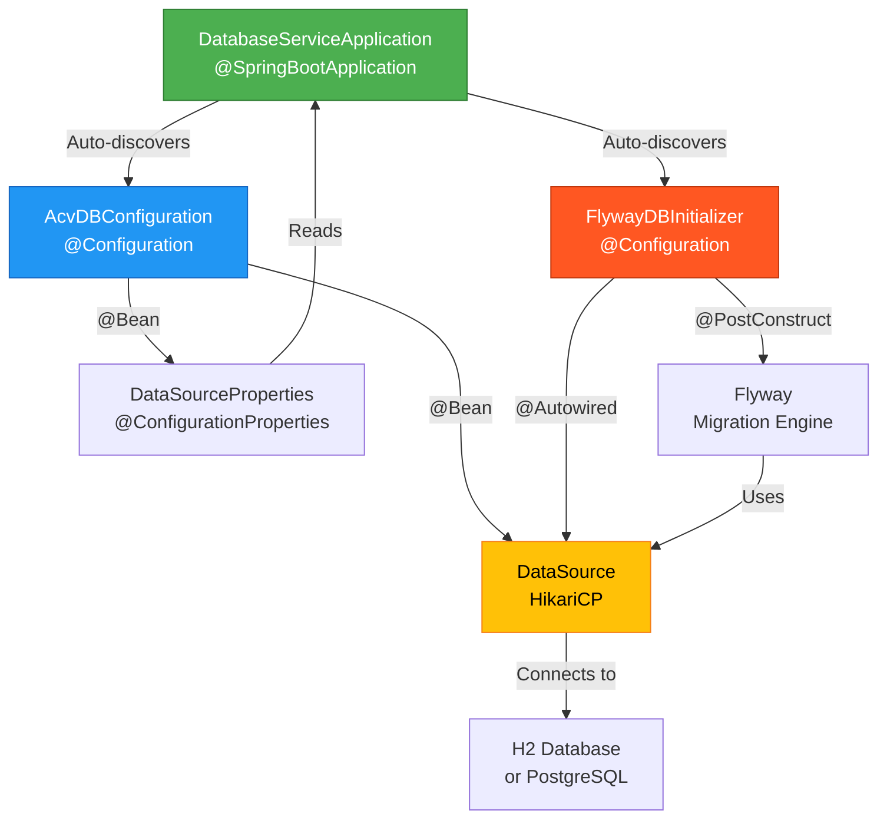

# ACV Database Service - Low-Level Design & Implementation

**Purpose:** Document code structure, implementation details, and component interactions.

**Scope:** Class inventory, method details, configuration properties, and execution flows.

---

## 1. Code Organization & Package Structure

### 1.1 Directory Tree

```
src/main/
├── java/com/fedex/acv/database/
│   ├── DatabaseServiceApplication.java          (Main entry point)
│   ├── AcvDBConfiguration.java                   (Data source configuration)
│   └── FlywayDBInitializer.java                  (Database migration init)
│
└── resources/
    ├── application.yml                           (Base configuration)
    ├── application-local.properties              (Local development)
    ├── application-prod.properties               (Production)
    ├── application-test.properties               (Test environment)
    │
    └── acv-configuration/
        ├── local/
        │   └── V1_0__ACV_CONFIG_CREATE_TABLE.sql
        ├── dev/
        │   └── V1_0__ACV_CONFIG_CREATE_TABLE.sql
        ├── test/
        │   └── V1_0__ACV_CONFIG_CREATE_TABLE.sql
        └── prod/
            └── V1_0__ACV_CONFIG_CREATE_TABLE.sql
```

### 1.2 Package Responsibility Map

| Package | Responsibility |
|---------|-----------------|
| `com.fedex.acv.database` | Main application entry point and configuration |
| `acv-configuration/` | Flyway migration SQL scripts (versioned by environment) |

---

## 2. Core Classes & Implementation Details

### 2.1 DatabaseServiceApplication.java

**File Path:** `src/main/java/com/fedex/acv/database/DatabaseServiceApplication.java`

**Purpose:** Spring Boot application entry point

**Code Snippet:**
```java
@SpringBootApplication
public class DatabaseServiceApplication {

    public static void main(String[] args) {
        SpringApplication.run(DatabaseServiceApplication.class, args);
    }
}
```

**Responsibility:**
- Initialize Spring Boot application context
- Trigger component scanning (auto-discovery of @Configuration, @Component, etc.)
- Bootstrap application startup

**Key Annotations:**
- `@SpringBootApplication` — Enables:
  - `@Configuration` — This class provides Spring configuration
  - `@ComponentScan` — Scans for @Component, @Service, @Repository, @Configuration
  - `@EnableAutoConfiguration` — Enables Spring Boot auto-configuration

**Startup Flow:**
```
1. Java runtime calls main()
2. SpringApplication.run() loads application context
3. Spring discovers:
   - AcvDBConfiguration (@Configuration)
   - FlywayDBInitializer (@Configuration)
4. Creates @Bean instances:
   - acvDataSourceProperties()
   - acvConfigDataSource()
5. Spring calls @PostConstruct methods:
   - FlywayDBInitializer.migrateFlyway()
6. Application ready on :8080
```

---

### 2.2 AcvDBConfiguration.java

**File Path:** `src/main/java/com/fedex/acv/database/AcvDBConfiguration.java`

**Purpose:** Create and configure the DataSource bean for database connections

**Code Snippet:**
```java
@Configuration
public class AcvDBConfiguration {

    @Bean
    @ConfigurationProperties("spring.datasource.acv")
    public DataSourceProperties acvDataSourceProperties() {
        return new DataSourceProperties();
    }

    @Bean
    public DataSource acvConfigDataSource(DataSourceProperties acvDataSourceProperties) {
        return acvDataSourceProperties
            .initializeDataSourceBuilder()
            .build();
    }
}
```

**Class Responsibility:**
- **Configuration Bean:** `@Configuration` makes this a Spring configuration source
- **DataSource Creation:** Instantiates HikariCP connection pool
- **Properties Binding:** Reads `spring.datasource.acv.*` properties from configuration files

**Methods:**

#### acvDataSourceProperties()
```java
@Bean
@ConfigurationProperties("spring.datasource.acv")
public DataSourceProperties acvDataSourceProperties() {
    return new DataSourceProperties();
}
```

**What it does:**
- Creates `DataSourceProperties` bean
- `@ConfigurationProperties("spring.datasource.acv")` binds properties to bean fields:
  ```properties
  spring.datasource.acv.url = jdbc:h2:mem:acv-db
  spring.datasource.acv.username = sa
  spring.datasource.acv.password = password
  spring.datasource.acv.driver-class-name = org.h2.Driver
  ```

**Supported Properties:**
```java
public class DataSourceProperties {
    private String url;                    // JDBC connection string
    private String username;               // Database username
    private String password;               // Database password
    private String driverClassName;        // JDBC driver class
    private String name;                   // DataSource name (optional)
    private Map<String, String> hikari;    // HikariCP properties
}
```

#### acvConfigDataSource()
```java
@Bean
public DataSource acvConfigDataSource(DataSourceProperties acvDataSourceProperties) {
    return acvDataSourceProperties
        .initializeDataSourceBuilder()
        .build();
}
```

**What it does:**
- Creates the actual DataSource bean (HikariCP connection pool)
- Constructor injection: Receives `acvDataSourceProperties` bean
- `initializeDataSourceBuilder()` → Creates DataSourceBuilder
- `.build()` → Returns configured DataSource

**Execution Order:**
```
1. Spring detects @Bean acvDataSourceProperties()
   ↓ Creates DataSourceProperties bean
   ↓ Binds spring.datasource.acv.* properties

2. Spring detects @Bean acvConfigDataSource(...)
   ↓ Constructor injection: DataSourceProperties bean provided
   ↓ Builder pattern: Constructs DataSource
   ↓ Returns HikariCP pool instance
```

**Connection Pool Configuration (from application properties):**
```properties
spring.datasource.acv.hikari.maximum-pool-size=20
spring.datasource.acv.hikari.minimum-idle=5
spring.datasource.acv.hikari.connection-timeout=30000
spring.datasource.acv.hikari.idle-timeout=600000
spring.datasource.acv.hikari.max-lifetime=1800000
spring.datasource.acv.hikari.auto-commit=true
```

---

### 2.3 FlywayDBInitializer.java

**File Path:** `src/main/java/com/fedex/acv/database/FlywayDBInitializer.java`

**Purpose:** Initialize database schema via Flyway migrations on application startup

**Code Snippet:**
```java
@Configuration
@Order(Ordered.LOWEST_PRECEDENCE)
public class FlywayDBInitializer {

    @Autowired
    private DataSource acvConfigDataSource;

    @Autowired
    private Environment environment;

    @PostConstruct
    public void migrateFlyway() {
        try {
            String flywaySqlScriptLocation = 
                environment.getProperty("spring.datasource.acv.flyway.scripts");
            
            if (flywaySqlScriptLocation != null) {
                Flyway flyway = Flyway.configure()
                    .dataSource(acvConfigDataSource)
                    .locations(flywaySqlScriptLocation)
                    .baselineOnMigrate(true)
                    .table("flyway_schema_history")
                    .target(MigrationVersion.LATEST)
                    .load();
                
                flyway.migrate();
                
                logger.info("Flyway migration completed successfully. " +
                    "Applied {} migrations.", flyway.info().applied().length);
            }
        } catch (Exception e) {
            logger.error("Flyway migration failed", e);
            throw new RuntimeException("Database migration failed", e);
        }
    }
}
```

**Class Responsibility:**
- **Configuration Bean:** `@Configuration` marks this as a configuration source
- **Startup Initialization:** `@PostConstruct` runs after bean construction
- **Migration Orchestration:** Initializes Flyway and triggers migrations

**Key Annotations Explained:**

| Annotation | Purpose |
|-----------|---------|
| `@Configuration` | Spring configuration bean (provides @Beans) |
| `@Order(Ordered.LOWEST_PRECEDENCE)` | Run FlywayDBInitializer LAST (after other configurations) |
| `@PostConstruct` | Runs after constructor and autowiring complete |
| `@Autowired` | Constructor injection of dependencies |

**Constructor Injection:**

```java
@Autowired
private DataSource acvConfigDataSource;

@Autowired
private Environment environment;
```

- `acvConfigDataSource` — DataSource bean from AcvDBConfiguration
- `environment` — Spring Environment (access to properties)

**Method: migrateFlyway()**

```
EXECUTION FLOW:

1. READ CONFIGURATION
   ├─ environment.getProperty("spring.datasource.acv.flyway.scripts")
   └─ Returns: acv-configuration/local (or dev, test, prod)

2. CONFIGURE FLYWAY
   ├─ Flyway.configure()
   ├─ .dataSource(acvConfigDataSource) — Use this connection pool
   ├─ .locations(flywaySqlScriptLocation) — Where migration scripts are
   ├─ .baselineOnMigrate(true) — Create schema_history table if missing
   ├─ .table("flyway_schema_history") — Version history table name
   ├─ .target(MigrationVersion.LATEST) — Apply all migrations
   └─ .load() — Returns Flyway instance

3. EXECUTE MIGRATIONS
   ├─ flyway.migrate() — Run migrations
   ├─ Scans for V1_0__*.sql, V1_1__*.sql, etc.
   ├─ Checks flyway_schema_history table
   ├─ Applies only unaccounted migrations
   └─ Updates schema version history

4. LOG & REPORT
   ├─ Get applied migrations: flyway.info().applied()
   ├─ Log count: "Applied 3 migrations"
   └─ Success or throw RuntimeException if failed

5. APPLICATION CONTINUES
   └─ DataSource ready for data access
```

**Error Handling:**

```java
try {
    // ... Flyway migration logic
} catch (Exception e) {
    logger.error("Flyway migration failed", e);
    throw new RuntimeException("Database migration failed", e);
}
```

- Catches any migration exception
- Logs error details
- Throws RuntimeException (prevents application startup on migration failure)
- **Behavior:** Fail-fast — if migrations fail, application doesn't start

---

## 3. Configuration Properties Reference

### 3.1 application-local.properties (Development)

**File:** `src/main/resources/application-local.properties`

```properties
# Application Name
spring.application.name=eai-3540813-database-service

# ============== H2 In-Memory Database (Development) ==============
# JDBC Connection String
spring.datasource.acv.url=jdbc:h2:mem:acv-db

# Database Credentials (H2 default)
spring.datasource.acv.username=sa
spring.datasource.acv.password=password

# JDBC Driver
spring.datasource.acv.driver-class-name=org.h2.Driver

# ============== H2 Console (Development Only) ==============
# Enable H2 console at http://localhost:8080/h2-console
spring.h2.console.enabled=true
spring.h2.console.path=/h2-console

# Database name in console dropdown
spring.h2.console.settings.web-allow-others=false

# ============== Flyway Database Migrations ==============
# Global Flyway disable (managed by FlywayDBInitializer)
spring.flyway.enabled=false

# Local migration scripts location
spring.datasource.acv.flyway.scripts=acv-configuration/local

# ============== Spring Data JPA ==============
# SQL output to console (development)
spring.jpa.show-sql=false
spring.jpa.hibernate.ddl-auto=validate

# ============== Server ==============
server.port=8080
management.endpoints.web.exposure.include=health,info,metrics
```

**Key Properties Explained:**

| Property | Value | Purpose |
|----------|-------|---------|
| `spring.datasource.acv.url` | `jdbc:h2:mem:acv-db` | In-memory database named "acv-db" |
| `spring.datasource.acv.username` | `sa` | Default H2 user |
| `spring.datasource.acv.password` | `password` | Default H2 password |
| `spring.h2.console.enabled` | `true` | Enable Web console for browsing DB |
| `spring.datasource.acv.flyway.scripts` | `acv-configuration/local` | Flyway scripts location |
| `spring.jpa.hibernate.ddl-auto` | `validate` | Only validate schema; don't create |

### 3.2 application-prod.properties (Production)

**File:** `src/main/resources/application-prod.properties`

```properties
# Application Name
spring.application.name=eai-3540813-database-service

# ============== PostgreSQL Database (Production) ==============
# JDBC Connection String (from Kubernetes secret)
spring.datasource.acv.url=${POSTGRES_URL}

# Database Credentials (from Kubernetes secrets)
spring.datasource.acv.username=${POSTGRES_USER}
spring.datasource.acv.password=${POSTGRES_PASS}

# JDBC Driver
spring.datasource.acv.driver-class-name=org.postgresql.Driver

# SSL/TLS for secure database connections
spring.datasource.acv.hikari.data-source-properties.ssl=true
spring.datasource.acv.hikari.data-source-properties.sslmode=require

# ============== Connection Pool Configuration ==============
# HikariCP pool sizing
spring.datasource.acv.hikari.maximum-pool-size=20
spring.datasource.acv.hikari.minimum-idle=5
spring.datasource.acv.hikari.connection-timeout=30000
spring.datasource.acv.hikari.idle-timeout=600000
spring.datasource.acv.hikari.max-lifetime=1800000
spring.datasource.acv.hikari.auto-commit=true

# ============== Flyway Database Migrations ==============
# Global Flyway disable (managed by FlywayDBInitializer)
spring.flyway.enabled=false

# Production migration scripts location
spring.datasource.acv.flyway.scripts=acv-configuration/prod

# Flyway configuration
spring.datasource.acv.flyway.baseline-on-migrate=true

# ============== Spring Data JPA ==============
# No SQL output in production
spring.jpa.show-sql=false
spring.jpa.hibernate.ddl-auto=validate

# ============== Server ==============
# Production ports
server.port=8080
management.server.port=8081

# Endpoint exposure (limited in production)
management.endpoints.web.exposure.include=health,metrics

# ============== Monitoring & Observability ==============
# Micrometer Tracing
management.tracing.sampling.probability=0.1
```

**Key Differences from Local:**

| Aspect | Local | Production |
|--------|-------|------------|
| Database | H2 in-memory | PostgreSQL managed |
| Credentials | Default (sa/password) | From Kubernetes secrets |
| SSL/TLS | None (local) | Required |
| Pool Size | Small (default) | Large (20 connections) |
| Scripts Location | acv-configuration/local | acv-configuration/prod |
| SQL Logging | Optional | Disabled |
| Management Port | 8080 | 8081 (separate) |

---

## 4. Database Migration Scripts

### 4.1 Migration Script Structure

**Naming Convention:** `V{version}__{description}.sql`

```
V1_0__ACV_CONFIG_CREATE_TABLE.sql       (Initial schema)
V1_1__Add_user_roles_table.sql          (Add entity)
V1_2__Add_audit_logging_table.sql       (Add feature)
V1_3__Create_index_on_user_id.sql       (Optimize)
```

**Version Format:**
- `V1_0` — First version (V1 = version 1, 0 = sub-version)
- `V1_1` — Second version with changes
- `V1_2` — Third version with more changes
- Underscore separator: `__` (double underscore)
- `.sql` extension: Required for SQL migrations

### 4.2 Example Migration: V1_0__ACV_CONFIG_CREATE_TABLE.sql

**File:** `src/main/resources/acv-configuration/local/V1_0__ACV_CONFIG_CREATE_TABLE.sql`

```sql
-- Initial ACV Configuration Schema
-- This migration creates the base tables for ACV platform

-- ACV Configuration Table
CREATE TABLE acv_config (
    id BIGINT PRIMARY KEY AUTO_INCREMENT,
    
    -- Entity metadata
    config_key VARCHAR(255) NOT NULL UNIQUE,
    config_value TEXT NOT NULL,
    config_type VARCHAR(50),                    -- String, Integer, Boolean
    description VARCHAR(500),
    
    -- Status tracking
    is_active BOOLEAN DEFAULT TRUE,
    is_encrypted BOOLEAN DEFAULT FALSE,
    
    -- Audit fields
    created_by VARCHAR(100),
    created_at TIMESTAMP DEFAULT CURRENT_TIMESTAMP,
    updated_by VARCHAR(100),
    updated_at TIMESTAMP DEFAULT CURRENT_TIMESTAMP,
    
    -- Optimization
    INDEX idx_config_key (config_key),
    INDEX idx_created_at (created_at)
);

-- Audit log table
CREATE TABLE acv_audit_log (
    id BIGINT PRIMARY KEY AUTO_INCREMENT,
    
    entity_type VARCHAR(100) NOT NULL,         -- Table modified
    entity_id BIGINT NOT NULL,
    operation VARCHAR(20) NOT NULL,            -- INSERT, UPDATE, DELETE
    
    old_values TEXT,                           -- JSON
    new_values TEXT,                           -- JSON
    
    changed_by VARCHAR(100),
    changed_at TIMESTAMP DEFAULT CURRENT_TIMESTAMP,
    
    INDEX idx_entity_type (entity_type),
    INDEX idx_entity_id (entity_id),
    INDEX idx_changed_at (changed_at)
);

-- Insert default configuration values
INSERT INTO acv_config (config_key, config_value, config_type, description, is_active)
VALUES
    ('VALIDATION.MAX_ATTEMPTS', '3', 'Integer', 'Maximum validation attempts', TRUE),
    ('VALIDATION.TIMEOUT_SECONDS', '300', 'Integer', 'Validation timeout in seconds', TRUE),
    ('CACHE.TTL_MINUTES', '60', 'Integer', 'Cache time-to-live in minutes', TRUE);
```

### 4.3 Flyway Execution Flow for Migrations

```
APPLICATION STARTUP
    ↓
FlywayDBInitializer.migrateFlyway() called
    ↓
1. Connect to database via DataSource
    ↓
2. Check if flyway_schema_history table exists
    ├─ If NO: Create table (baseline)
    ├─ If YES: Continue to next step
    ↓
3. Read current schema version from table
    └─ Current version: V1_0 (or 0 if first run)
    ↓
4. Scan migration directory (acv-configuration/local)
    └─ Found: V1_0, V1_1, V1_2__Add_tables.sql
    ↓
5. Compare: Current (V1_0) vs Latest (V1_2)
    ├─ V1_0: Already applied (skip)
    ├─ V1_1: Not applied (EXECUTE)
    ├─ V1_2: Not applied (EXECUTE)
    ↓
6. Execute V1_1 migration
    ├─ Run SQL statements
    ├─ Update schema version table
    └─ Log: "Flyway migration V1_1 executed successfully"
    ↓
7. Execute V1_2 migration
    ├─ Run SQL statements
    ├─ Update schema version table
    └─ Log: "Flyway migration V1_2 executed successfully"
    ↓
8. Close database connection
    ↓
9. Application continues
    └─ Schema now at V1_2
```

---

## 5. Class Diagram (Domain Models & Dependencies)



---

## 6. Startup Sequence Diagram



---

## 7. Dependency Graph



---

## 8. Error Handling & Exception Flow

### 8.1 Migration Failure Scenario

```
When Flyway.migrate() encounters an error:

1. SQL Execution Error
   ├─ Invalid SQL syntax in migration file
   ├─ Table already exists
   ├─ Permission denied
   └─ Connection timeout

2. FlywayDBInitializer catches exception:
   ├─ Logger.error("Flyway migration failed", e)
   ├─ Prints full stack trace
   └─ throw new RuntimeException("Database migration failed", e)

3. Spring Boot catches RuntimeException:
   ├─ Logs: "Application initialization failed"
   ├─ Stops application startup
   └─ Exit code: 1 (failure)

4. Result:
   ├─ Application NEVER starts
   ├─ Database LEFT IN PARTIAL STATE
   └─ Manual intervention required

PREVENTION: Test migrations in dev/test before prod!
```

### 8.2 Connection Pool Exhaustion

```
When all HikariCP connections are in use:

1. Request arrives
   └─ Need database connection

2. HikariCP pool check:
   ├─ All N connections in use
   ├─ No idle connections available
   └─ Queue request (wait for return)

3. Wait up to connection-timeout (30 seconds)
   ├─ If connection returns: Reuse it
   ├─ If timeout reached: Throw exception
   └─ Application receives timeout error

CONFIGURATION TO PREVENT:
├─ Increase maximum-pool-size (if resources available)
├─ Reduce connection timeouts
└─ Lower idle-timeout to recycle stale connections
```

---

## 9. Testing Patterns

### 9.1 Unit Test for AcvDBConfiguration

```java
@SpringBootTest
public class AcvDBConfigurationTest {

    @Autowired
    private DataSource dataSource;

    @Test
    public void testDataSourceBeanCreated() {
        assertNotNull(dataSource);
        assertTrue(dataSource instanceof HikariDataSource);
    }

    @Test
    public void testConnectionObtainedSuccessfully() throws SQLException {
        try (Connection conn = dataSource.getConnection()) {
            assertNotNull(conn);
            assertFalse(conn.isClosed());
        }
    }
}
```

### 9.2 Integration Test for Flyway Migrations

```java
@SpringBootTest
@ActiveProfiles("test")
public class FlywayDBInitializerTest {

    @Autowired
    private DataSource dataSource;

    @Test
    public void testMigrationsExecuted() throws SQLException {
        try (Connection conn = dataSource.getConnection();
             Statement stmt = conn.createStatement();
             ResultSet rs = stmt.executeQuery(
                 "SELECT * FROM flyway_schema_history")) {
            
            assertTrue(rs.next());
            assertEquals("1_0", rs.getString("version"));
        }
    }

    @Test
    public void testConfigTableCreated() throws SQLException {
        try (Connection conn = dataSource.getConnection();
             Statement stmt = conn.createStatement();
             ResultSet rs = stmt.executeQuery(
                 "SELECT COUNT(*) FROM acv_config")) {
            
            assertTrue(rs.next());
            assertTrue(rs.getInt(1) >= 3); // At least 3 default configs
        }
    }
}
```

---

## Cross-References

- [README.md](README.md) — Project overview
- [HLD.md](HLD.md) — Architecture & design patterns
- [services.md](services.md) — API and data service contracts
- [code-mapping.md](code-mapping.md) — File and class navigation

---

**Last Updated:** 2026-04-02  
**Version:** 1.0.0  
**Audience:** Developers, Code Reviewers, Technical Leads
