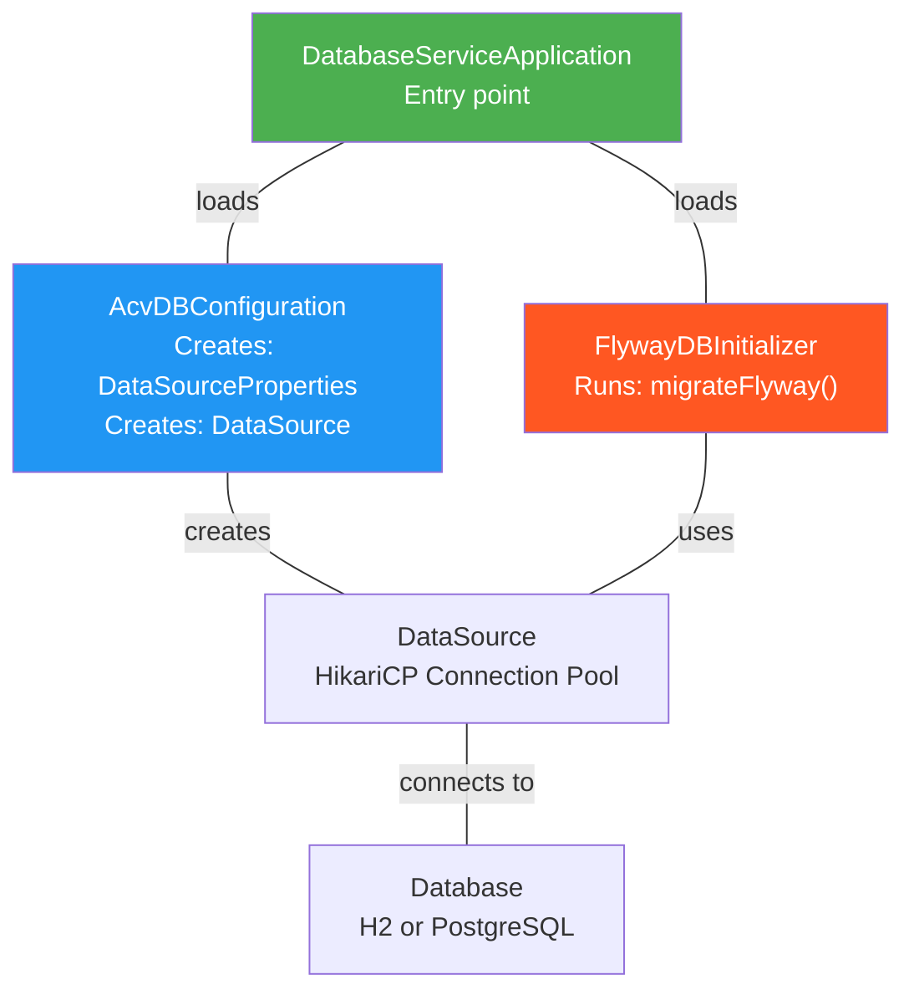

# ACV Database Service - Code Navigation & File Mapping

**Purpose:** Provide rapid navigation and reference for source code and configuration files.

**Scope:** File inventory, class locations, configuration structure, quick lookup.

---

## 1. Source Code File Mapping

### 1.1 Java Classes - Complete Inventory

| Class Name | File Path | Lines | Purpose | Layer |
|-----------|-----------|-------|---------|-------|
| `DatabaseServiceApplication` | `src/main/java/com/fedex/acv/database/DatabaseServiceApplication.java` | 14 | Spring Boot entry point | Main |
| `AcvDBConfiguration` | `src/main/java/com/fedex/acv/database/AcvDBConfiguration.java` | 22 | DataSource bean configuration | Configuration |
| `FlywayDBInitializer` | `src/main/java/com/fedex/acv/database/FlywayDBInitializer.java` | 30+ | Database migration initialization | Configuration |

**Total Java Code:** ~66 lines

### 1.2 Java Class Quick Reference

#### DatabaseServiceApplication.java
Located: [src/main/java/com/fedex/acv/database/DatabaseServiceApplication.java](src/main/java/com/fedex/acv/database/DatabaseServiceApplication.java)

```java
@SpringBootApplication
public class DatabaseServiceApplication {
    public static void main(String[] args) {
        SpringApplication.run(DatabaseServiceApplication.class, args);
    }
}
```

**Key Methods:**
- `main(String[])` — Application entry point

**Key Annotations:**
- `@SpringBootApplication` — Enable Spring Boot auto-configuration

---

#### AcvDBConfiguration.java
Located: [src/main/java/com/fedex/acv/database/AcvDBConfiguration.java](src/main/java/com/fedex/acv/database/AcvDBConfiguration.java)

```java
@Configuration
public class AcvDBConfiguration {
    @Bean
    @ConfigurationProperties("spring.datasource.acv")
    public DataSourceProperties acvDataSourceProperties() { ... }
    
    @Bean
    public DataSource acvConfigDataSource(DataSourceProperties props) { ... }
}
```

**Key Methods:**
- `acvDataSourceProperties()` — Create DataSourceProperties bean (binds configuration)
- `acvConfigDataSource()` — Create DataSource bean (HikariCP pool)

**Key Annotations:**
- `@Configuration` — Provides Spring beans
- `@ConfigurationProperties` — Bind properties to bean
- `@Bean` — Register bean in Spring context

---

#### FlywayDBInitializer.java
Located: [src/main/java/com/fedex/acv/database/FlywayDBInitializer.java](src/main/java/com/fedex/acv/database/FlywayDBInitializer.java)

```java
@Configuration
@Order(Ordered.LOWEST_PRECEDENCE)
public class FlywayDBInitializer {
    @Autowired
    private DataSource acvConfigDataSource;
    
    @Autowired
    private Environment environment;
    
    @PostConstruct
    public void migrateFlyway() { ... }
}
```

**Key Methods:**
- `migrateFlyway()` — Initialize Flyway and execute migrations

**Key Annotations:**
- `@Configuration` — Configuration bean
- `@Order` — Run last in initialization order
- `@PostConstruct` — Run after bean construction (on startup)
- `@Autowired` — Inject dependencies

---

## 2. Configuration File Mapping

### 2.1 Properties Files

| File | Location | Environment | Purpose |
|------|----------|-------------|---------|
| `application-local.properties` | `src/main/resources/` | Development (Local) | H2 in-memory, Flyway migrations disabled |
| `application-prod.properties` | `src/main/resources/` | Production (Cloud) | PostgreSQL, full Flyway enabled |
| `application-test.properties` | `src/main/resources/` | Test (CI/CD) | Test PostgreSQL/H2, Flyway enabled |

### 2.2 Quick Property Lookup

**To find specific configuration:**

```
Spring Application Main Properties:
├─ spring.application.name            (in any profile)
├─ server.port                         (in any profile)
└─ management.* properties              (in any profile)

Database Connection Properties:
├─ spring.datasource.acv.url           (DB connection string)
├─ spring.datasource.acv.username      (DB user)
├─ spring.datasource.acv.password      (DB password)
└─ spring.datasource.acv.driver-class-name

Connection Pool Properties:
├─ spring.datasource.acv.hikari.maximum-pool-size
├─ spring.datasource.acv.hikari.minimum-idle
├─ spring.datasource.acv.hikari.connection-timeout
└─ spring.datasource.acv.hikari.idle-timeout

Flyway Migration Properties:
├─ spring.datasource.acv.flyway.scripts        (Scripts location)
├─ spring.datasource.acv.flyway.baseline-on-migrate
└─ spring.flyway.enabled                        (Global Flyway flag)
```

### 2.3 Finding Configuration by Use Case

**"I want to change connection pool size"**
→ Edit: `application-prod.properties`
→ Property: `spring.datasource.acv.hikari.maximum-pool-size`
→ Doc: [services.md](services.md#21-configuration-properties-interface)

**"I want to add a database migration"**
→ Create: `src/main/resources/acv-configuration/{env}/V{version}__description.sql`
→ Doc: [LLD.md](LLD.md#42-example-migration-v10_acv_config_create_tablesql)

**"I want to switch between H2 and PostgreSQL"**
→ Edit: `pom.xml` (depend on desired driver) OR
→ Edit: `application-local.properties` (for local dev: H2)
→ Doc: [HLD.md](HLD.md#42-flyway-database-versioning-pattern)

---

## 3. Migration Scripts Directory Structure

### 3.1 Migration Files Inventory

```
src/main/resources/acv-configuration/

├── local/
│   ├── V1_0__ACV_CONFIG_CREATE_TABLE.sql
│   └── (Local environment migrations)
│
├── dev/
│   ├── V1_0__ACV_CONFIG_CREATE_TABLE.sql
│   └── (Development environment migrations)
│
├── test/
│   ├── V1_0__ACV_CONFIG_CREATE_TABLE.sql
│   └── (Test environment migrations)
│
└── prod/
    ├── V1_0__ACV_CONFIG_CREATE_TABLE.sql
    └── (Production environment migrations)
```

### 3.2 Migration Script Lookup

**To add a new migration:**

1. Determine version number:
   - Last migration: V1_0
   - Next migration: V1_1
   
2. Create file in correct environment:
   ```
   src/main/resources/acv-configuration/{env}/V1_1__{description}.sql
   ```
   
3. Example:
   ```
   src/main/resources/acv-configuration/prod/V1_1__Add_audit_table.sql
   ```

4. Write SQL with:
   - Clear description
   - Comments explaining changes
   - Error handling (transactions, checks)

---

## 4. Dependency Mapping

### 4.1 Build Dependencies (Maven pom.xml)

```
pom.xml Structure:
├── <parent>
│   └─ spring-boot-starter-parent:3.3.3
├── <dependencies>
│   ├── spring-boot-starter-web
│   ├── spring-boot-starter-data-jpa
│   ├── spring-boot-starter-jdbc
│   ├── flyway-core:10.18.0
│   ├── postgresql (runtime)
│   ├── h2 (runtime)
│   └── ... more dependencies
└── <properties>
    └─ java.version=21
```

### 4.2 Runtime Dependency Injection Flow

```
Spring Container Initialization:
├─ Load bean definitions
│  ├─ AcvDBConfiguration
│  ├─ FlywayDBInitializer
│  └─ (Other @Configuration classes)
│
├─ Create bean instances
│  ├─ acvDataSourceProperties @Bean
│  ├─ acvConfigDataSource @Bean (depends on above)
│  ├─ FlywayDBInitializer @Bean (depends on DataSource)
│  └─ (Other beans)
│
├─ Inject dependencies
│  ├─ FlywayDBInitializer.dataSource = acvConfigDataSource
│  ├─ FlywayDBInitializer.environment = Environment
│  └─ (Other injections)
│
├─ Call @PostConstruct methods
│  └─ FlywayDBInitializer.migrateFlyway() ← Runs migrations
│
└─ Application ready
```

---

## 5. Class Diagram - Reference Lookup



---

## 6. File Quick Search Guide

### "I need to find ..."

| Looking For | File Location | Line Hint |
|-------------|---------------|-----------|
| **Application main class** | `DatabaseServiceApplication.java` | Contains `public static void main()` |
| **DataSource bean definition** | `AcvDBConfiguration.java` | Method `acvConfigDataSource()` |
| **Flyway initialization** | `FlywayDBInitializer.java` | Method `migrateFlyway()` with `@PostConstruct` |
| **Local dev config** | `application-local.properties` | Contains `jdbc:h2:mem` URL |
| **Prod config** | `application-prod.properties` | Contains `${POSTGRES_USER}` variable |
| **Migration scripts** | `acv-configuration/{env}/` | V1_0, V1_1, V1_2, etc. |
| **Connection pool settings** | Properties files | `spring.datasource.acv.hikari.*` |
| **Flyway settings** | Properties files | `spring.datasource.acv.flyway.*` |

---

## 7. Code Walkthrough Path

**New Developer Learning Path:**

1. **Start Here:** [DatabaseServiceApplication.java](src/main/java/com/fedex/acv/database/DatabaseServiceApplication.java)
   - Understand: Spring Boot entry point
   - Concept: Main method, application startup

2. **Next:** [AcvDBConfiguration.java](src/main/java/com/fedex/acv/database/AcvDBConfiguration.java)
   - Understand: Data source bean creation
   - Concept: Spring @Bean, @ConfigurationProperties, dependency injection

3. **Then:** [application-local.properties](src/main/resources/application-local.properties)
   - Understand: Configuration values
   - Concept: Spring profiles, environment-specific properties

4. **Then:** [FlywayDBInitializer.java](src/main/java/com/fedex/acv/database/FlywayDBInitializer.java)
   - Understand: Database migration initialization
   - Concept: @PostConstruct, Flyway usage

5. **Finally:** [acv-configuration/local/V1_0__*.sql](src/main/resources/acv-configuration/local/)
   - Understand: Database schema
   - Concept: SQL migrations, versioning

---

## 8. Configuration Matrix - Reference Table

### Scenarios by Environment

| Aspect | Local Development | Production |
|--------|------------------|------------|
| **Config File** | `application-local.properties` | `application-prod.properties` |
| **Database** | H2 in-memory | PostgreSQL |
| **Connection URL** | `jdbc:h2:mem:acv-db` | `${POSTGRES_URL}` (from secret) |
| **Username** | `sa` (default) | `${POSTGRES_USER}` (from secret) |
| **Pool Max Size** | 5 | 20 |
| **Flyway Location** | `acv-configuration/local` | `acv-configuration/prod` |
| **H2 Console** | Enabled at /h2-console | Disabled |
| **Performance** | Development speed | Production stability |

---

## 9. Extension Points - Adding to Codebase

### "I want to add a new feature..."

**Add a new DataSource:**
```
1. Create new @Bean method in AcvDBConfiguration.java
2. Name: newFeatureDataSource()
3. Bind to: spring.datasource.new-feature.*
4. Add properties in application-{env}.properties
```

**Add a new migration:**
```
1. Create file: acv-configuration/{env}/V1_N__{description}.sql
2. Version number: Increment from latest
3. Write SQL: Include comments and error handling
4. Test locally in dev environment first
```

**Add new Maven dependency:**
```
1. Edit: pom.xml <dependencies> section
2. Add: <dependency> with groupId, artifactId, version
3. Rebuild: mvn clean install
4. Test: mvn test
```

---

## 10. Key Metrics & Observability Lookups

### Where to find monitoring data:

| Metric | Endpoint | Description |
|--------|----------|-------------|
| **Overall Health** | `http://localhost:8081/actuator/health` | Database, disk, memory status |
| **Connection Pool Stats** | `http://localhost:8081/actuator/metrics` | Active, idle, pending connections |
| **Logs** | Console or log aggregator | FlywayDBInitializer messages |
| **Spring Boot Metrics** | `http://localhost:8081/actuator/metrics` | JVM, HTTP, database metrics |

---

## Cross-References

- [README.md](README.md) — Project overview
- [HLD.md](HLD.md) — Architecture
- [LLD.md](LLD.md) — Implementation details
- [services.md](services.md) — Configuration properties reference

---

**Last Updated:** 2026-04-02  
**Version:** 1.0.0  
**Audience:** Developers, Code Reviewers, New Team Members
