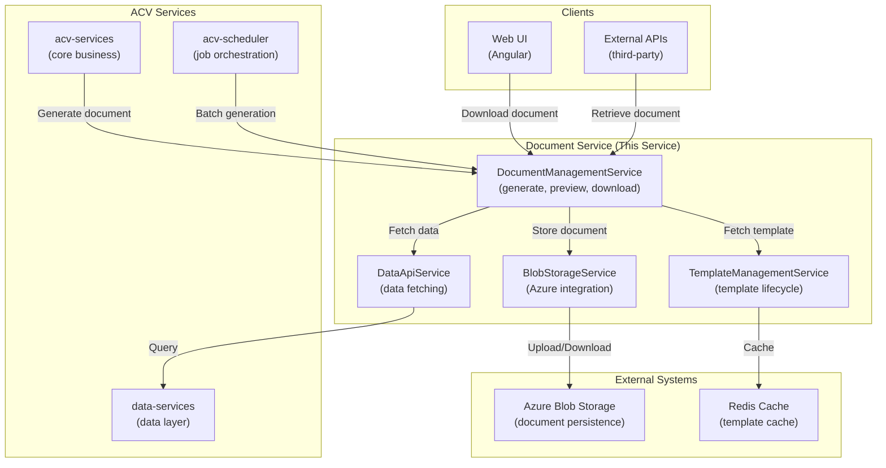
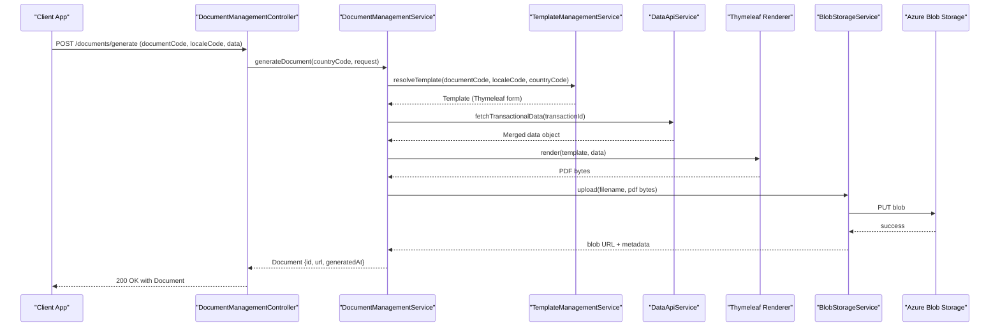
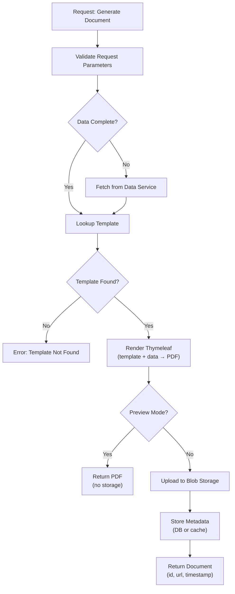

# High-Level Design (HLD) — ACV Document Service

## Purpose & Scope

**ACV Document Service** is a Spring Boot microservice that handles **dynamic document generation, template management, and cloud storage** for the ACV platform. It provides:

1. **Document Generation** — Create documents from templates with dynamic data binding
2. **Template Management** — Create, manage, and version document templates
3. **Storage & Retrieval** — Persist documents to Azure Blob Storage with metadata
4. **Multi-Language Support** — Generate locale-specific documents (en_US, de_DE, etc.)
5. **Multi-Country Rules** — Apply country-specific document formatting and validation

---

## System Context Diagram



---

## Major Components

### 1. Document Management Layer

**Responsibility:** Generate, preview, download documents with version tracking

**Key Classes:**
- `DocumentManagementController` — REST endpoints for document operations
- `DocumentManagementService` — Business logic for document lifecycle
- `Document` (domain) — Document metadata and content

**Key Behaviors:**
- Template resolution based on documentCode, countryCode, localeCode
- Dynamic data binding from request payload
- Two-phase generation: Preview (validate) → Generate (persist)
- Document versioning with transaction ID
- Streaming download support

---

### 2. Template Management Layer

**Responsibility:** Create, update, and manage document templates with sections

**Key Classes:**
- `TemplateManagementController` — REST endpoints for template operations
- `TemplateManagementService` — Template lifecycle management
- `SectionConfig`, `CreateTemplateMapping` — Template composition

**Key Behaviors:**
- Section-based template composition (header, body, footer, etc.)
- Locale-aware template overrides
- Template search with pagination
- Template versioning and rollback
- Thymeleaf template compilation and caching

---

### 3. Blob Storage Layer

**Responsibility:** Persist, retrieve, and manage documents in cloud storage

**Key Classes:**
- `BlobStorageController` — REST endpoints for storage operations
- `BlobStorageService` — Azure Blob Storage integration
- `BlobStorageConfiguration` — Azure SDK configuration

**Key Behaviors:**
- Multipart file upload to containerized storage
- Streaming download with metadata
- Soft delete with archival support
- Connection string management from Key Vault
- Blob tagging for expiration policies

---

### 4. Data Integration Layer

**Responsibility:** Fetch transactional data from Data Service for document generation

**Key Classes:**
- `DataApiService` — Interface to other ACV services
- `DataApiServiceImpl` — Implementation using acv-commons HTTP client

**Key Behaviors:**
- Call Data Service to fetch entity data by transaction ID
- Cache transactional data temporarily during generation
- Handle data transformation for template binding
- Retry on transient failures

---

## Request/Response Lifecycle



---

## Document Generation Flow



---

## Multi-Language Support

Document Service supports locale-specific templates:

**Template Resolution Order (Priority):**
1. Template for `(documentCode, countryCode, localeCode)` — Most specific
2. Template for `(documentCode, countryCode, en_US)` — Fallback to English
3. Template for `(documentCode, *, localeCode)` — Country-agnostic
4. Template for `(documentCode, *, en_US)` — Default fallback

**Example:**
```
Request: documentCode=REPORT, countryCode=DE, localeCode=de_DE
  ↓
Try: report_de_DE.html (German, Germany)
  ↓ (if not found)
Try: report_de.html (German, any region)
  ↓ (if not found)
Try: report_en_US.html (English, USA - fallback)
```

---

## Non-Functional Requirements

| Requirement | Target | Mechanism |
|--|--|--|
| **Document Generation Latency** | P95 < 500ms | Template caching, Redis TTL |
| **Upload Throughput** | 10 MB/s | Azure Blob SDK optimization |
| **Availability** | 99.9% | Azure SLA + request retry |
| **Storage Durability** | 99.99999999% | Geo-redundant Azure Storage |
| **Document Retention** | 90 days (configurable) | Blob lifecycle policies |
| **Multi-language Support** | 5+ locales | Template set per locale |
| **Concurrent Requests** | 100+ RPS | Connection pooling, HPA |

---

## Technology Stack

| Layer | Technology | Version | Purpose |
|-------|-----------|---------|---------|
| **Language** | Java | 21 | Language runtime |
| **Framework** | Spring Boot | 3.3.5 | Application framework |
| **Templating** | Thymeleaf | Latest | HTML/PDF generation |
| **Cloud Storage** | Azure Blob Storage SDK | Latest | Document persistence |
| **Azure Integration** | Spring Cloud Azure | 5.18.0 | Azure integrations |
| **PDF Generation** | openpdf or iText | Latest | HTML to PDF conversion |
| **Caching** | Redis | Latest | Template caching |
| **Logging** | SLF4J + Logback | Latest | Structured logging |
| **Metrics** | Micrometer | Latest | Observability |

---

## Design Decisions

### Decision 1: Thymeleaf for Templating
- **Why:** Java-native, Spring-integrated, supports complex logic and dynamic data binding
- **Alternative Considered:** FreeMarker (but less Spring-friendly)

### Decision 2: Section-Based Template Composition
- **Why:** Enables template reuse (header/footer in multiple documents); easier A/B testing
- **Trade-off:** More database lookups, but mitigated by caching

### Decision 3: Separate Preview & Generate Endpoints
- **Why:** Validate template rendering before storage; allows user review before commit
- **Trade-off:** Two requests instead of one, but better UX

### Decision 4: Azure Blob Storage Not Database
- **Why:** Cheaper for large files; built-in versioning; complies with document archival requirements
- **Trade-off:** Can't query document content; use metadata DB for search

---

## Integration Points

| System | Direction | Data Format | Purpose |
|--------|-----------|-------------|---------|
| **acv-commons** | Dependency | Library | HTTP clients, caching, security |
| **data-services** | Outbound HTTP | JSON | Fetch transactional data |
| **acv-services** | Inbound HTTP | JSON | Document generation requests |
| **acv-scheduler** | Inbound HTTP | JSON | Batch document generation |
| **Azure Blob Storage** | Outbound HTTPS | Binary | Document storage/retrieval |
| **Redis** | Outbound TCP | Binary | Template caching |

---

**Last Updated:** April 2, 2026  
**Version:** 1.0
