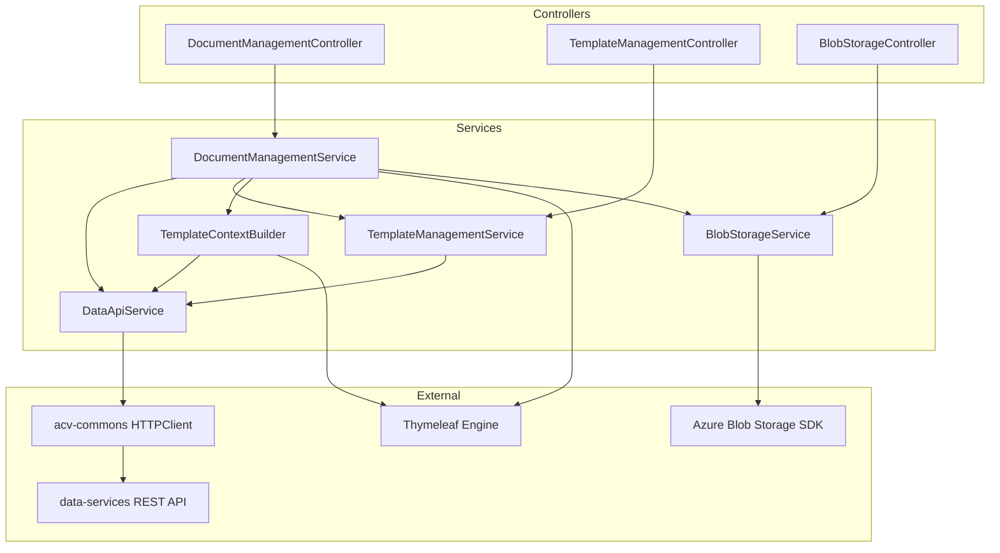
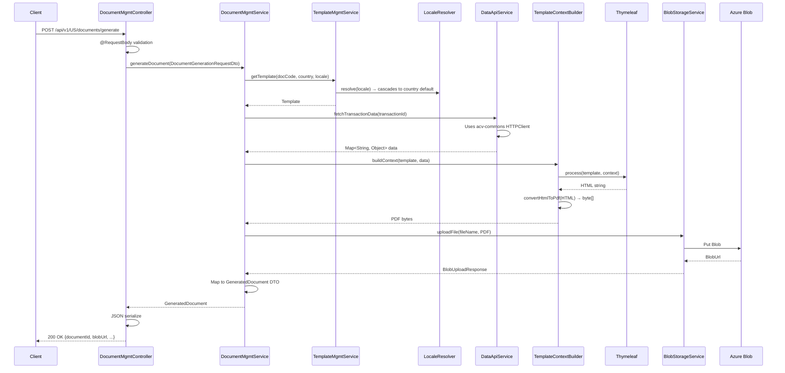

# Code-Level Reference — ACV Document Service

## Package-to-Responsibility Mapping

| Package | Responsibility |
|---------|---|
| `com.acv.document.controller` | HTTP endpoint handlers (REST API entry points) |
| `com.acv.document.service` | Business logic for document generation, templating |
| `com.acv.document.repository` | Database access layer (if applicable) |
| `com.acv.document.model` | Domain entities (Document, Template, Section) |
| `com.acv.document.dto` | Data Transfer Objects for request/response |
| `com.acv.document.config` | Spring configuration, beans, property binding |
| `com.acv.document.exception` | Custom exceptions and error handling |
| `com.acv.document.util` | Utility classes (converters, helpers, formatters) |

---

## Class Inventory

### Controllers (`com.acv.document.controller`)

| Class | File | Purpose |
|-------|------|---------|
| `DocumentManagementController` | `controller/DocumentManagementController.java` | Handles document generation, preview, download endpoints |
| `TemplateManagementController` | `controller/TemplateManagementController.java` | Manages template CRUD and section operations |
| `BlobStorageController` | `controller/BlobStorageController.java` | Manages file upload/download to Azure Blob Storage |

### Services (`com.acv.document.service`)

| Class | File | Purpose |
|-------|------|---------|
| `DocumentManagementService` | `service/DocumentManagementService.java` | Orchestrates document generation lifecycle |
| `TemplateManagementService` | `service/TemplateManagementService.java` | Template versioning, locale resolution, section mapping |
| `BlobStorageService` | `service/BlobStorageService.java` | Wraps Azure Blob Storage SDK operations |
| `DataApiService` | `service/DataApiService.java` | Fetches business data from data-services (calls acv-commons HTTP client) |
| `TemplateContextBuilder` | `service/TemplateContextBuilder.java` | Builds Thymeleaf context from transaction data |

### Models (`com.acv.document.model`)

| Class | File | Purpose |
|-------|------|---------|
| `Document` | `model/Document.java` | Document entity (maps to DB or cached) |
| `Template` | `model/Template.java` | Template entity with locale, version info |
| `Section` | `model/Section.java` | Template section (header, body, footer) |
| `DocumentRequest` | `model/DocumentRequest.java` | Internal request object for generation |
| `GeneratedDocument` | `model/GeneratedDocument.java` | Result of generation (file path, ID, blob URL) |

### DTOs (`com.acv.document.dto`)

| Class | File | Purpose |
|-------|------|---------|
| `DocumentGenerationRequestDto` | `dto/DocumentGenerationRequestDto.java` | HTTP request payload for document generation |
| `DocumentResponseDto` | `dto/DocumentResponseDto.java` | HTTP response with document metadata |
| `TemplateRequestDto` | `dto/TemplateRequestDto.java` | HTTP request for template creation |
| `TemplateResponseDto` | `dto/TemplateResponseDto.java` | HTTP response with template details |
| `SectionDto` | `dto/SectionDto.java` | Section DTO for template composition |

### Configuration (`com.acv.document.config`)

| Class | File | Purpose |
|-------|------|---------|
| `DocumentApplicationProperties` | `config/DocumentApplicationProperties.java` | `@ConfigurationProperties` binding for application.yml |
| `AzureStorageConfig` | `config/AzureStorageConfig.java` | Azure Blob Storage client bean configuration |
| `ThymeleafConfig` | `config/ThymeleafConfig.java` | Thymeleaf template resolver, dialect setup |
| `RestClientConfig` | `config/RestClientConfig.java` | HTTP client beans for data-services calls |

### Exception Handling (`com.acv.document.exception`)

| Class | File | Purpose |
|-------|------|---------|
| `DocumentGenerationException` | `exception/DocumentGenerationException.java` | Raised when template rendering fails |
| `TemplateNotFoundException` | `exception/TemplateNotFoundException.java` | Raised when template not found |
| `BlobOperationException` | `exception/BlobOperationException.java` | Raised on Azure Blob Storage errors |
| `GlobalExceptionHandler` | `exception/GlobalExceptionHandler.java` | `@RestControllerAdvice` for centralized error handling |

### Utilities (`com.acv.document.util`)

| Class | File | Purpose |
|-------|------|---------|
| `LocaleResolver` | `util/LocaleResolver.java` | Resolves locale with fallback cascade (requested → country default → en_US) |
| `FileNameGenerator` | `util/FileNameGenerator.java` | Creates unique file names with timestamp + transaction ID |
| `PdfConverter` | `util/PdfConverter.java` | Converts HTML → PDF using iText or similar |
| `DocumentPathBuilder` | `util/DocumentPathBuilder.java` | Constructs blob storage paths: `/documents/{year}/{month}/{day}/` |

---

## Dependency Graph



---

## Key Method Signatures

### DocumentManagementService

```java
public GeneratedDocument generateDocument(DocumentGenerationRequestDto request)
    throws DocumentGenerationException, TemplateNotFoundException;

public byte[] previewDocument(DocumentGenerationRequestDto request)
    throws DocumentGenerationException;

public GeneratedDocument downloadDocument(String documentId)
    throws DocumentNotFoundException;
```

### TemplateManagementService

```java
public Template getTemplate(String documentCode, String countryCode, String localeCode)
    throws TemplateNotFoundException;

public Template createTemplate(TemplateRequestDto request)
    throws TemplateValidationException;

public List<Section> getSections(String sectionName, String localeCode, Pageable page);
```

### BlobStorageService

```java
public BlobUploadResponse uploadFile(String fileName, InputStream fileContent)
    throws BlobOperationException;

public InputStream downloadFile(String fileName)
    throws BlobOperationException;

public void deleteFile(String fileName)
    throws BlobOperationException;
```

### DataApiService

```java
public Map<String, Object> fetchTransactionData(String transactionId)
    throws DataServiceException;

public Map<String, Object> fetchApplicantData(String applicantId)
    throws DataServiceException;
```

---

## Spring Bean Wiring

**Automatic (`@Autowired`):**
- `DocumentManagementService` → `TemplateManagementService`, `BlobStorageService`, `DataApiService`
- `TemplateManagementService` → `DataApiService`, `LocaleResolver`
- `BlobStorageService` → `BlobContainerClient` (from `AzureStorageConfig`)
- Controllers → their respective `*Service` beans

**Configured in `AzureStorageConfig`:**
```java
@Bean
public BlobClient blobClient(DocumentApplicationProperties props) {
    return new BlobContainerClientBuilder()
        .connectionString(props.getAzureStorage().getConnectionString())
        .containerName(props.getAzureStorage().getContainerName())
        .buildClient()
        .getBlobClient(...);
}
```

**Configured in `RestClientConfig`:**
```java
@Bean
public AbstractHttpClient dataServiceClient(ApplicationContext context) {
    // Injected from acv-commons
    return context.getBean(AbstractHttpClient.class);
}
```

---

## Cross-Cutting Concerns

### Logging

**Filter/AOP:** `LoggingFilter` (from acv-commons) intercepts:
- Request URL, method, headers (PII-masked)
- Response status, latency
- Request/response body (masked for sensitive fields)

### Security

**Authentication:** Spring Security + Okta OAuth2 (configured in acv-commons)
- All `/api/v1` endpoints protected with `@EnableOAuth2Sso` or `@EnableWebSecurity`
- Token validated via authorization header

**Authorization:** Role-based. Check scopes:
- `document:generate` → Document generation endpoints
- `template:manage` → Template CRUD endpoints
- `blob:upload` → File upload endpoints

### Error Handling

**Centralized:** `GlobalExceptionHandler`
```java
@RestControllerAdvice
public class GlobalExceptionHandler {
    @ExceptionHandler(TemplateNotFoundException.class)
    public ResponseEntity<ErrorResponse> handleNotFound(...) {
        // Return 404 with standardized error JSON
    }
}
```

---

## Request/Response Lifecycle (Code Level)



---

## Test File Mapping

| Test Class | Source Class | Location |
|---|---|---|
| `DocumentManagementServiceTest` | `DocumentManagementService` | `src/test/java/.../service/DocumentManagementServiceTest.java` |
| `TemplateManagementServiceTest` | `TemplateManagementService` | `src/test/java/.../service/TemplateManagementServiceTest.java` |
| `BlobStorageServiceTest` | `BlobStorageService` | `src/test/java/.../service/BlobStorageServiceTest.java` |
| `DocumentManagementControllerTest` | `DocumentManagementController` | `src/test/java/.../controller/DocumentManagementControllerTest.java` |

---

**Last Updated:** April 2, 2026  
**Version:** 1.0
